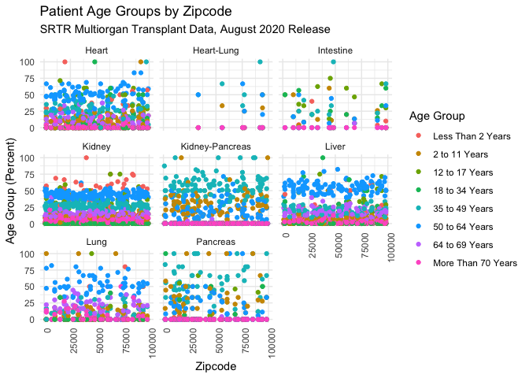
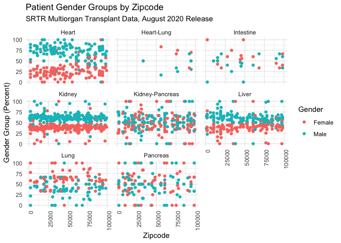
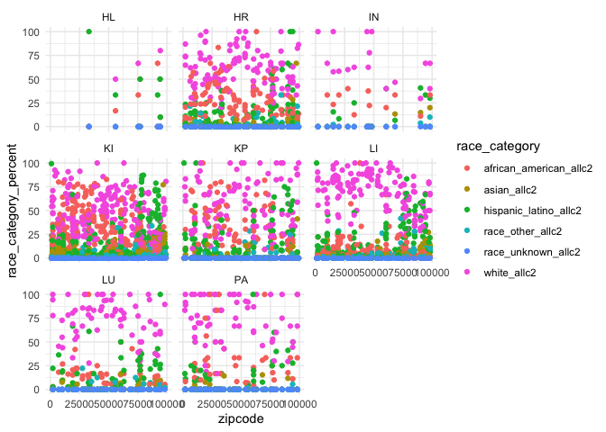

SummaryPlotsMS
================
Matthew Spotnitz
11/26/2021

``` r
library(tidyverse)
```

    ## ── Attaching packages ─────────────────────────────────────── tidyverse 1.3.1 ──

    ## ✓ ggplot2 3.3.5     ✓ purrr   0.3.4
    ## ✓ tibble  3.1.5     ✓ dplyr   1.0.7
    ## ✓ tidyr   1.1.3     ✓ stringr 1.4.0
    ## ✓ readr   2.0.1     ✓ forcats 0.5.1

    ## ── Conflicts ────────────────────────────────────────── tidyverse_conflicts() ──
    ## x dplyr::filter() masks stats::filter()
    ## x dplyr::lag()    masks stats::lag()

``` r
library(readxl)
library(haven)
library(ggplot2)
library(zipcodeR)
library(ggmap)
```

    ## Google's Terms of Service: https://cloud.google.com/maps-platform/terms/.

    ## Please cite ggmap if you use it! See citation("ggmap") for details.

``` r
library(leaflet)
library(kableExtra)
```

    ## 
    ## Attaching package: 'kableExtra'

    ## The following object is masked from 'package:dplyr':
    ## 
    ##     group_rows

I will define the age dataframes

``` r
phrase = "SRTR Multiorgan Transplant Data, August 2020 Release"
df_one_age = read.csv("./data/csrs_final_tables_2006_HL_age.csv") 
df_two_age = read.csv("./data/csrs_final_tables_2006_HR_age.csv") 
df_three_age = read.csv("./data/csrs_final_tables_2006_IN_age.csv")
df_four_age = read.csv("./data/csrs_final_tables_2006_KI_age.csv")
df_five_age = read.csv("./data/csrs_final_tables_2006_KP_age.csv")
df_six_age = read.csv("./data/csrs_final_tables_2006_LI_age.csv")
df_seven_age = read.csv("./data/csrs_final_tables_2006_LU_age.csv")
df_eight_age = read.csv("./data/csrs_final_tables_2006_PA_age.csv")
df_all_age = rbind(df_one_age, df_two_age, df_three_age, df_four_age, df_five_age, df_six_age, df_seven_age, df_eight_age)
view(df_all_age)
```

I will plot the age dataframes

``` r
plot = df_all_age %>% ggplot(aes(x=zipcode, y =age_category_percent, color = age_category)) + geom_point() + 
  labs(
    title = "Patient Age Groups by Zipcode", subtitle = phrase,
    x = "Zipcode",
    y = "Age Group (Percent)",color = "Age Group"
  ) + theme_minimal()  + theme(axis.text.x=element_text(angle=90,hjust=1)) + scale_color_hue(labels = c("Less Than 2 Years", "2 to 11 Years", "12 to 17 Years", "18 to 34 Years", "35 to 49 Years", "50 to 64 Years", "64 to 69 Years", "More Than 70 Years")) + facet_wrap(~org)
print(plot)
```

<!-- --> I
will repeat for gender

``` r
df_one_gender = read.csv("./data/csrs_final_tables_2006_HL_gender.csv") 
df_two_gender = read.csv("./data/csrs_final_tables_2006_HR_gender.csv") 
df_three_gender = read.csv("./data/csrs_final_tables_2006_IN_gender.csv")
df_four_gender = read.csv("./data/csrs_final_tables_2006_KI_gender.csv")
df_five_gender = read.csv("./data/csrs_final_tables_2006_KP_gender.csv")
df_six_gender = read.csv("./data/csrs_final_tables_2006_LI_gender.csv")
df_seven_gender = read.csv("./data/csrs_final_tables_2006_LU_gender.csv")
df_eight_gender = read.csv("./data/csrs_final_tables_2006_PA_gender.csv")
df_all_gender = rbind(df_one_gender, df_two_gender, df_three_gender, df_four_gender, df_five_gender, df_six_gender, df_seven_gender, df_eight_gender)
#view(df_all_gender)
```

I will plot the gender dataframes

``` r
plot = df_all_gender %>% ggplot(aes(x=zipcode, y =gender_category_percent, color = gender_category)) + geom_point()+ 
  labs(
    title = "Patient Gender Groups by Zipcode", subtitle = phrase,
    x = "Zipcode",
    y = "Gender Group (Percent)", color = "Gender"
  ) + theme_minimal() + theme(axis.text.x=element_text(angle=90,hjust=1)) + scale_color_hue(labels = c("Female", "Male")) + facet_wrap(~org)
print(plot)
```

    ## Warning: Removed 42 rows containing missing values (geom_point).

<!-- -->

I will repeat for demographics

``` r
df_one_demographics = read.csv("./data/csrs_final_tables_2006_HL_demographics.csv") 
df_two_demographics = read.csv("./data/csrs_final_tables_2006_HR_demographics.csv") 
df_three_demographics = read.csv("./data/csrs_final_tables_2006_IN_demographics.csv")
df_four_demographics = read.csv("./data/csrs_final_tables_2006_KI_demographics.csv")
df_five_demographics = read.csv("./data/csrs_final_tables_2006_KP_demographics.csv")
df_six_demographics = read.csv("./data/csrs_final_tables_2006_LI_demographics.csv")
df_seven_demographics = read.csv("./data/csrs_final_tables_2006_LU_demographics.csv")
df_eight_demographics = read.csv("./data/csrs_final_tables_2006_PA_demographics.csv")
df_all_demographics = rbind(df_one_demographics, df_two_demographics, df_three_demographics, df_four_demographics, df_five_demographics, df_six_demographics, df_seven_demographics, df_eight_demographics)
```

I will plot the demographics dataframes

``` r
plot = df_all_demographics %>% ggplot(aes(x=zipcode, y =race_category_percent, color = race_category)) + geom_point() + theme_minimal() + 
  labs(
    title = "Patient Demographics by Zipcode", subtitle = phrase,
    x = "Zipcode",
    y = "Race (Percent)", 
    color = "Race") + scale_color_hue(labels = c("African American", "Asian", "Hispanic or Latino", "Other", "Unknown", "White")) + theme(axis.text.x=element_text(angle=90,hjust=1)) + facet_wrap(~org)
print(plot)
```

    ## Warning: Removed 126 rows containing missing values (geom_point).

<!-- -->
