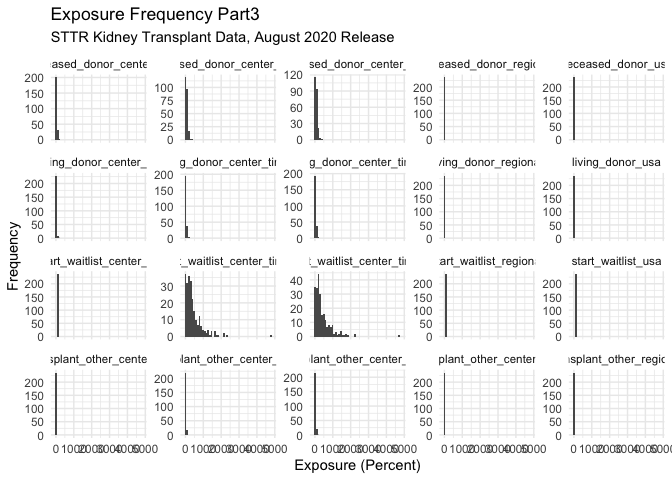

IterationMS
================
Matthew Spotnitz
11/24/2021

``` r
library(tidyverse)
```

    ## ── Attaching packages ─────────────────────────────────────── tidyverse 1.3.1 ──

    ## ✓ ggplot2 3.3.5     ✓ purrr   0.3.4
    ## ✓ tibble  3.1.5     ✓ dplyr   1.0.7
    ## ✓ tidyr   1.1.3     ✓ stringr 1.4.0
    ## ✓ readr   2.0.1     ✓ forcats 0.5.1

    ## ── Conflicts ────────────────────────────────────────── tidyverse_conflicts() ──
    ## x dplyr::filter() masks stats::filter()
    ## x dplyr::lag()    masks stats::lag()

``` r
library(readxl)
library(haven)
library(ggplot2)
library(zipcodeR)
library(ggmap)
```

    ## Google's Terms of Service: https://cloud.google.com/maps-platform/terms/.

    ## Please cite ggmap if you use it! See citation("ggmap") for details.

``` r
library(leaflet)
library(kableExtra)
```

    ## 
    ## Attaching package: 'kableExtra'

    ## The following object is masked from 'package:dplyr':
    ## 
    ##     group_rows

I will define the iterators

``` r
path = "../data/csrs_final_tables_2006_KI.xls"
phrase = "STTR Kidney Transplant Data, August 2020 Release"
```

Function to read csv file

``` r
read_file = function(x){
  x = read_excel(path, sheet = "Table B1")
x = janitor::clean_names(x)
str(x)
return(x) 
}
```

Function to clean dataframe

``` r
clean_data_frame = function(x){
  x = x %>% rename(newlistings_center_time1 = wla_addcen_nc1, newlistings_center_time2 = wla_addcen_nc2, newlistings_center_all = wla_addcen_pcz,newlistings_regional = wla_addcen_prz, newlistings_usa = wla_addcen_puz)  %>% rename( endlistings_center_time1 = wla_end_nc1, endlistings_center_time2 = wla_end_nc2, endlistings_center_all = wla_end_pcz, endlistings_regional = wla_end_prz, endlistings_usa = wla_end_puz) %>% rename(deteriorated_center_time1 = wla_remdet_nc1, deteriorated_center_time2 = wla_remdet_nc2, deteriorated_center_all = wla_remdet_pcz, deteriorated_regional = wla_remdet_prz, deteriorated_usa = wla_remdet_puz) %>% rename( died_center_time1 = wla_remdied_nc1, died_center_time2 = wla_remdied_nc2, died_center_all = wla_remdied_pcz, died_regional = wla_remdied_prz, died_usa = wla_remdied_puz) %>% rename(other_center_time1 = wla_remoth_nc1, other_center_time2 = wla_remoth_nc2, other_center_all = wla_remoth_pcz, other_regional = wla_remoth_prz, other_usa = wla_remoth_puz) %>% rename( recovered_center_time1 = wla_remrec_nc1, recovered_center_time2 = wla_remrec_nc2, recovered_center_all = wla_remrec_pcz, recovered_regional = wla_remrec_prz, recovered_usa = wla_remrec_puz) %>% rename(transfer_center_time1 = wla_remtfer_nc1, transfer_center_time2 = wla_remtfer_nc2, transfer_center_all = wla_remtfer_pcz, transfer_regional = wla_remtfer_prz, transfer_usa = wla_remtfer_puz) %>% rename(deceased_donor_center_time1 = wla_remtxc_nc1, deceased_donor_center_time2 = wla_remtxc_nc2, deceased_donor_center_all = wla_remtxc_pcz, deceased_donor_regional = wla_remtxc_prz, deceased_donor_usa = wla_remtxc_puz) %>% rename(living_donor_center_time1 = wla_remtxl_nc1, living_donor_center_time2 = wla_remtxl_nc2, living_donor_center_all = wla_remtxl_pcz, living_donor_regional = wla_remtxl_prz, living_donor_usa = wla_remtxl_puz) %>% rename(transplant_other_center_time1 = wla_remtxoc_nc1, transplant_other_center_time2 = wla_remtxoc_nc2, transplant_other_center_all = wla_remtxoc_pcz, transplant_other_regional = wla_remtxoc_prz, transplant_other_center_usa = wla_remtxoc_puz) %>% rename(start_waitlist_center_time1 = wla_st_nc1, start_waitlist_center_time2 = wla_st_nc2, start_waitlist_center_all = wla_st_pcz, start_waitlist_regional = wla_st_prz, start_waitlist_usa = wla_st_puz)
  
x = x [-c(1), ]
x[, c(4,6:60)] <- sapply(x[, c(4,6:60)], as.numeric)
x = drop_na(x)
str(x)
return (x)
}
```

Outcomes and zipcodes

``` r
outcomes_and_zipcodes = function(x){
  x = x %>% mutate(newlistings_percent_mortality = 100*died_center_all/newlistings_center_all, newlistings_percent_deteriorated = 100*deteriorated_center_all/newlistings_center_all, newlistings_percent_transfer = 100* transfer_center_all/newlistings_center_all, newlistings_percent_living_donor = 100* living_donor_center_all/newlistings_center_all, newlistings_percent_deceased_donor = 100*deceased_donor_center_all/newlistings_center_all, newlistings_percent_recovered = 100* recovered_center_all/newlistings_center_all, living_deceased_graft_ratio = living_donor_center_all/deceased_donor_center_all)
  
df_zipcodes = read_excel("../data/zipcodes.xlsx")
df_zipcodes = df_zipcodes[-c(1), ]
df_zipcodes[, c(2)] = sapply(df_zipcodes[, c(2)], as.numeric)
df_zipcodes = janitor::clean_names(df_zipcodes)

for (zipcode in df_zipcodes["zipcode"]){
    df_zip_geo = tibble(geocode_zip(zipcode))
}
df_geo_merge = merge(df_zipcodes, df_zip_geo, all = TRUE)
x = merge(x, df_geo_merge, all = TRUE)
return(x)
}
```

Exposures

``` r
plot_exposures = function(x){
  x1 = x[, c(6:20)]
  x2 = x[, c(21:40)]
  x3 = x[, c(41:60)]
ggplot(gather(x1), aes(value)) + geom_histogram(bins = 50) + facet_wrap(~key, scales = "free_y") + labs(title = "Exposure Frequency Part1", subtitle = phrase, x = "Exposure (Percent)", y = "Frequency") + theme_minimal()
ggplot(gather(x2), aes(value)) + geom_histogram(bins = 50) + facet_wrap(~key, scales = "free_y") + labs(title = "Exposure Frequency Part2", subtitle = phrase, x = "Exposure (Percent)", y = "Frequency") + theme_minimal()
ggplot(gather(x3), aes(value)) + geom_histogram(bins = 50) + facet_wrap(~key, scales = "free_y")  + labs(title = "Exposure Frequency Part3", subtitle = phrase, x = "Exposure (Percent)", y = "Frequency") + theme_minimal()
}
```

Outcomes and zipcodes

``` r
plot_outcomes = function(x){
  x = x[, c(61:66)] %>% filter(newlistings_percent_transfer <= 100)
ggplot(gather(x), aes(value)) + geom_histogram(bins = 30) + facet_wrap(~key, scales = "free_y") + coord_cartesian(xlim = c(0, 100)) + labs(title = "Outcome Frequency", subtitle = phrase, x = "Outcome (Percent)", y = "Frequency") + theme_minimal()
}
```

Zipcode Histogram and Leaflet

``` r
zipcode_histogram = function(x){
z = x %>% ggplot(aes(zipcode)) + geom_histogram(bins = 50) + 
  labs(
    title = "Transplant Center Frequency by Zipcode", subtitle = phrase,
    x = "Zipcode",
    y = "Transplant Center Count"
  ) + theme_minimal()
z
}
```

Leaflet

``` r
leaflet = function(x){
library(leaflet)
leaflet(options = leafletOptions(minZoom = 0, maxZoom = 18))
m = x %>% leaflet() %>% addTiles() %>% addCircleMarkers(lat = ~lat, lng = ~lng)
m

}
```

Master function

``` r
automate_eda = function(x){
df_one = read_file(x)
df_one = clean_data_frame(df_one)
###make a function to plot all exposure variables
df_one = outcomes_and_zipcodes(df_one)
plot_outcomes(df_one)
zipcode_histogram(df_one)
#leaflet(df_one)
}
```

Test the functions

``` r
df_one = read_file(path)
```

    ## tibble [240 × 60] (S3: tbl_df/tbl/data.frame)
    ##  $ entire_name    : chr [1:240] "Center Name" "Children's of Alabama (ALCH)" "University of Alabama Hospital (ALUA)" "Birmingham VA Medical Center (ALVA)" ...
    ##  $ ctr_cd         : chr [1:240] "Center Code" "ALCH" "ALUA" "ALVA" ...
    ##  $ ctr_ty         : chr [1:240] "Center Type" "TX1" "TX1" "TX1" ...
    ##  $ release_date   : chr [1:240] "Release Date" "44046.791666666664" "44046.791666666664" "44046.791666666664" ...
    ##  $ org            : chr [1:240] "Organ" "KI" "KI" "KI" ...
    ##  $ wla_addcen_nc1 : chr [1:240] "New Listings" "13" "426" "36" ...
    ##  $ wla_addcen_nc2 : chr [1:240] "New Listings" "7" "447" "35" ...
    ##  $ wla_addcen_pcz : chr [1:240] "New Listings" "35" "26.766467066" "52.23880597" ...
    ##  $ wla_addcen_prz : chr [1:240] "New Listings" "41.814623235" "41.814623235" "41.814623235" ...
    ##  $ wla_addcen_puz : chr [1:240] "New Listings" "42.165757431999999" "42.165757431999999" "42.165757431999999" ...
    ##  $ wla_end_nc1    : chr [1:240] "On waitlist at end" "20" "1670" "67" ...
    ##  $ wla_end_nc2    : chr [1:240] "On waitlist at end" "12" "1166" "81" ...
    ##  $ wla_end_pcz    : chr [1:240] "On waitlist at end" "60" "69.820359281" "120.89552239" ...
    ##  $ wla_end_prz    : chr [1:240] "On waitlist at end" "95.994687544" "95.994687544" "95.994687544" ...
    ##  $ wla_end_puz    : chr [1:240] "On waitlist at end" "100.24608634000001" "100.24608634000001" "100.24608634000001" ...
    ##  $ wla_remdet_nc1 : chr [1:240] "Deteriorated" "0" "42" "3" ...
    ##  $ wla_remdet_nc2 : chr [1:240] "Deteriorated" "0" "50" "2" ...
    ##  $ wla_remdet_pcz : chr [1:240] "Deteriorated" "0" "2.994011976" "2.9850746269" ...
    ##  $ wla_remdet_prz : chr [1:240] "Deteriorated" "4.0682231232" "4.0682231232" "4.0682231232" ...
    ##  $ wla_remdet_puz : chr [1:240] "Deteriorated" "4.1735847565000004" "4.1735847565000004" "4.1735847565000004" ...
    ##  $ wla_remdied_nc1: chr [1:240] "Died" "2" "162" "3" ...
    ##  $ wla_remdied_nc2: chr [1:240] "Died" "0" "63" "3" ...
    ##  $ wla_remdied_pcz: chr [1:240] "Died" "0" "3.7724550898" "4.4776119403" ...
    ##  $ wla_remdied_prz: chr [1:240] "Died" "3.8235705298" "3.8235705298" "3.8235705298" ...
    ##  $ wla_remdied_puz: chr [1:240] "Died" "3.8316334597999999" "3.8316334597999999" "3.8316334597999999" ...
    ##  $ wla_remoth_nc1 : chr [1:240] "Other Reasons" "0" "379" "1" ...
    ##  $ wla_remoth_nc2 : chr [1:240] "Other Reasons" "2" "491" "0" ...
    ##  $ wla_remoth_pcz : chr [1:240] "Other Reasons" "10" "29.401197605" "0" ...
    ##  $ wla_remoth_prz : chr [1:240] "Other Reasons" "9.5344610653" "9.5344610653" "9.5344610653" ...
    ##  $ wla_remoth_puz : chr [1:240] "Other Reasons" "5.3723908918000003" "5.3723908918000003" "5.3723908918000003" ...
    ##  $ wla_remrec_nc1 : chr [1:240] "Recovered" "0" "0" "0" ...
    ##  $ wla_remrec_nc2 : chr [1:240] "Recovered" "0" "6" "0" ...
    ##  $ wla_remrec_pcz : chr [1:240] "Recovered" "0" "0.3592814371" "0" ...
    ##  $ wla_remrec_prz : chr [1:240] "Recovered" "0.1188312596" "0.1188312596" "0.1188312596" ...
    ##  $ wla_remrec_puz : chr [1:240] "Recovered" "0.19963630609999999" "0.19963630609999999" "0.19963630609999999" ...
    ##  $ wla_remtfer_nc1: chr [1:240] "Transferred to another center" "1" "3" "1" ...
    ##  $ wla_remtfer_nc2: chr [1:240] "Transferred to another center" "2" "1" "0" ...
    ##  $ wla_remtfer_pcz: chr [1:240] "Transferred to another center" "10" "0.0598802395" "0" ...
    ##  $ wla_remtfer_prz: chr [1:240] "Transferred to another center" "0.6221165944" "0.6221165944" "0.6221165944" ...
    ##  $ wla_remtfer_puz: chr [1:240] "Transferred to another center" "1.4409392789" "1.4409392789" "1.4409392789" ...
    ##  $ wla_remtxc_nc1 : chr [1:240] "Received deceased donor tx" "11" "170" "5" ...
    ##  $ wla_remtxc_nc2 : chr [1:240] "Received deceased donor tx" "7" "203" "7" ...
    ##  $ wla_remtxc_pcz : chr [1:240] "Received deceased donor tx" "35" "12.155688623" "10.447761194" ...
    ##  $ wla_remtxc_prz : chr [1:240] "Received deceased donor tx" "17.398294422" "17.398294422" "17.398294422" ...
    ##  $ wla_remtxc_puz : chr [1:240] "Received deceased donor tx" "16.302972801999999" "16.302972801999999" "16.302972801999999" ...
    ##  $ wla_remtxl_nc1 : chr [1:240] "Received living donor tx" "3" "84" "0" ...
    ##  $ wla_remtxl_nc2 : chr [1:240] "Received living donor tx" "4" "75" "0" ...
    ##  $ wla_remtxl_pcz : chr [1:240] "Received living donor tx" "20" "4.4910179641" "0" ...
    ##  $ wla_remtxl_prz : chr [1:240] "Received living donor tx" "5.5431287572" "5.5431287572" "5.5431287572" ...
    ##  $ wla_remtxl_puz : chr [1:240] "Received living donor tx" "6.7273481973000004" "6.7273481973000004" "6.7273481973000004" ...
    ##  $ wla_remtxoc_nc1: chr [1:240] "Transplanted at another center" "0" "68" "6" ...
    ##  $ wla_remtxoc_nc2: chr [1:240] "Transplanted at another center" "0" "62" "9" ...
    ##  $ wla_remtxoc_pcz: chr [1:240] "Transplanted at another center" "0" "3.7125748503" "13.432835821" ...
    ##  $ wla_remtxoc_prz: chr [1:240] "Transplanted at another center" "4.7113099399" "4.7113099399" "4.7113099399" ...
    ##  $ wla_remtxoc_puz: chr [1:240] "Transplanted at another center" "3.8711654015999999" "3.8711654015999999" "3.8711654015999999" ...
    ##  $ wla_st_nc1     : chr [1:240] "On waitlist at start" "24" "2152" "50" ...
    ##  $ wla_st_nc2     : chr [1:240] "On waitlist at start" "20" "1670" "67" ...
    ##  $ wla_st_pcz     : chr [1:240] "On waitlist at start" "100" "100" "100" ...
    ##  $ wla_st_prz     : chr [1:240] "On waitlist at start" "100" "100" "100" ...
    ##  $ wla_st_puz     : chr [1:240] "On waitlist at start" "100" "100" "100" ...

``` r
df_one = clean_data_frame(df_one)
```

    ## Warning in lapply(X = X, FUN = FUN, ...): NAs introduced by coercion

    ## Warning in lapply(X = X, FUN = FUN, ...): NAs introduced by coercion

    ## Warning in lapply(X = X, FUN = FUN, ...): NAs introduced by coercion

    ## Warning in lapply(X = X, FUN = FUN, ...): NAs introduced by coercion

    ## Warning in lapply(X = X, FUN = FUN, ...): NAs introduced by coercion

    ## Warning in lapply(X = X, FUN = FUN, ...): NAs introduced by coercion

    ## Warning in lapply(X = X, FUN = FUN, ...): NAs introduced by coercion

    ## Warning in lapply(X = X, FUN = FUN, ...): NAs introduced by coercion

    ## Warning in lapply(X = X, FUN = FUN, ...): NAs introduced by coercion

    ## Warning in lapply(X = X, FUN = FUN, ...): NAs introduced by coercion

    ## Warning in lapply(X = X, FUN = FUN, ...): NAs introduced by coercion

    ## tibble [236 × 60] (S3: tbl_df/tbl/data.frame)
    ##  $ entire_name                  : chr [1:236] "Children's of Alabama (ALCH)" "University of Alabama Hospital (ALUA)" "Birmingham VA Medical Center (ALVA)" "Arkansas Children's Hospital (ARCH)" ...
    ##  $ ctr_cd                       : chr [1:236] "ALCH" "ALUA" "ALVA" "ARCH" ...
    ##  $ ctr_ty                       : chr [1:236] "TX1" "TX1" "TX1" "TX1" ...
    ##  $ release_date                 : num [1:236] 44047 44047 44047 44047 44047 ...
    ##  $ org                          : chr [1:236] "KI" "KI" "KI" "KI" ...
    ##  $ newlistings_center_time1     : num [1:236] 13 426 36 14 145 19 193 478 76 116 ...
    ##  $ newlistings_center_time2     : num [1:236] 7 447 35 5 188 27 124 486 56 126 ...
    ##  $ newlistings_center_all       : num [1:236] 35 26.8 52.2 125 93.5 ...
    ##  $ newlistings_regional         : num [1:236] 41.8 41.8 41.8 41.8 41.8 ...
    ##  $ newlistings_usa              : num [1:236] 42.2 42.2 42.2 42.2 42.2 ...
    ##  $ endlistings_center_time1     : num [1:236] 20 1670 67 4 201 19 705 910 108 129 ...
    ##  $ endlistings_center_time2     : num [1:236] 12 1166 81 4 176 ...
    ##  $ endlistings_center_all       : num [1:236] 60 69.8 120.9 100 87.6 ...
    ##  $ endlistings_regional         : num [1:236] 96 96 96 96 96 ...
    ##  $ endlistings_usa              : num [1:236] 100 100 100 100 100 ...
    ##  $ deteriorated_center_time1    : num [1:236] 0 42 3 0 15 0 19 23 4 3 ...
    ##  $ deteriorated_center_time2    : num [1:236] 0 50 2 0 21 0 90 11 3 5 ...
    ##  $ deteriorated_center_all      : num [1:236] 0 2.99 2.99 0 10.45 ...
    ##  $ deteriorated_regional        : num [1:236] 4.07 4.07 4.07 4.07 4.07 ...
    ##  $ deteriorated_usa             : num [1:236] 4.17 4.17 4.17 4.17 4.17 ...
    ##  $ died_center_time1            : num [1:236] 2 162 3 0 4 1 45 29 3 3 ...
    ##  $ died_center_time2            : num [1:236] 0 63 3 0 8 0 22 44 6 4 ...
    ##  $ died_center_all              : num [1:236] 0 3.77 4.48 0 3.98 ...
    ##  $ died_regional                : num [1:236] 3.82 3.82 3.82 3.82 3.82 ...
    ##  $ died_usa                     : num [1:236] 3.83 3.83 3.83 3.83 3.83 ...
    ##  $ other_center_time1           : num [1:236] 0 379 1 1 10 1 7 44 3 6 ...
    ##  $ other_center_time2           : num [1:236] 2 491 0 0 8 0 50 66 2 11 ...
    ##  $ other_center_all             : num [1:236] 10 29.4 0 0 3.98 ...
    ##  $ other_regional               : num [1:236] 9.53 9.53 9.53 9.53 9.53 ...
    ##  $ other_usa                    : num [1:236] 5.37 5.37 5.37 5.37 5.37 ...
    ##  $ recovered_center_time1       : num [1:236] 0 0 0 0 0 0 0 4 0 0 ...
    ##  $ recovered_center_time2       : num [1:236] 0 6 0 0 0 0 7 1 1 2 ...
    ##  $ recovered_center_all         : num [1:236] 0 0.359 0 0 0 ...
    ##  $ recovered_regional           : num [1:236] 0.119 0.119 0.119 0.119 0.119 ...
    ##  $ recovered_usa                : num [1:236] 0.2 0.2 0.2 0.2 0.2 ...
    ##  $ transfer_center_time1        : num [1:236] 1 3 1 1 1 1 8 7 0 1 ...
    ##  $ transfer_center_time2        : num [1:236] 2 1 0 0 1 1 4 3 3 3 ...
    ##  $ transfer_center_all          : num [1:236] 10 0.0599 0 0 0.4975 ...
    ##  $ transfer_regional            : num [1:236] 0.622 0.622 0.622 0.622 0.622 ...
    ##  $ transfer_usa                 : num [1:236] 1.44 1.44 1.44 1.44 1.44 ...
    ##  $ deceased_donor_center_time1  : num [1:236] 11 170 5 12 102 11 131 258 14 78 ...
    ##  $ deceased_donor_center_time2  : num [1:236] 7 203 7 5 160 18 106 344 20 95 ...
    ##  $ deceased_donor_center_all    : num [1:236] 35 12.2 10.4 125 79.6 ...
    ##  $ deceased_donor_regional      : num [1:236] 17.4 17.4 17.4 17.4 17.4 ...
    ##  $ deceased_donor_usa           : num [1:236] 16.3 16.3 16.3 16.3 16.3 ...
    ##  $ living_donor_center_time1    : num [1:236] 3 84 0 1 7 0 38 82 12 11 ...
    ##  $ living_donor_center_time2    : num [1:236] 4 75 0 0 7 12 45 70 6 10 ...
    ##  $ living_donor_center_all      : num [1:236] 20 4.49 0 0 3.48 ...
    ##  $ living_donor_regional        : num [1:236] 5.54 5.54 5.54 5.54 5.54 ...
    ##  $ living_donor_usa             : num [1:236] 6.73 6.73 6.73 6.73 6.73 ...
    ##  $ transplant_other_center_time1: num [1:236] 0 68 6 0 5 1 8 36 1 3 ...
    ##  $ transplant_other_center_time2: num [1:236] 0 62 9 0 8 0 5 36 3 2 ...
    ##  $ transplant_other_center_all  : num [1:236] 0 3.71 13.43 0 3.98 ...
    ##  $ transplant_other_regional    : num [1:236] 4.71 4.71 4.71 4.71 4.71 ...
    ##  $ transplant_other_center_usa  : num [1:236] 3.87 3.87 3.87 3.87 3.87 ...
    ##  $ start_waitlist_center_time1  : num [1:236] 24 2152 50 5 200 ...
    ##  $ start_waitlist_center_time2  : num [1:236] 20 1670 67 4 201 19 705 910 108 129 ...
    ##  $ start_waitlist_center_all    : num [1:236] 100 100 100 100 100 100 100 100 100 100 ...
    ##  $ start_waitlist_regional      : num [1:236] 100 100 100 100 100 100 100 100 100 100 ...
    ##  $ start_waitlist_usa           : num [1:236] 100 100 100 100 100 100 100 100 100 100 ...

``` r
df_one = outcomes_and_zipcodes(df_one)
plot_exposures(df_one)
```

    ## Warning: Removed 40 rows containing non-finite values (stat_bin).

<!-- -->

``` r
plot_outcomes(df_one)
```

<!-- -->

``` r
zipcode_histogram(df_one)
```

<!-- -->

``` r
#leaflet(df_one)
```

Test master function

``` r
automate_eda(path)
```

    ## tibble [240 × 60] (S3: tbl_df/tbl/data.frame)
    ##  $ entire_name    : chr [1:240] "Center Name" "Children's of Alabama (ALCH)" "University of Alabama Hospital (ALUA)" "Birmingham VA Medical Center (ALVA)" ...
    ##  $ ctr_cd         : chr [1:240] "Center Code" "ALCH" "ALUA" "ALVA" ...
    ##  $ ctr_ty         : chr [1:240] "Center Type" "TX1" "TX1" "TX1" ...
    ##  $ release_date   : chr [1:240] "Release Date" "44046.791666666664" "44046.791666666664" "44046.791666666664" ...
    ##  $ org            : chr [1:240] "Organ" "KI" "KI" "KI" ...
    ##  $ wla_addcen_nc1 : chr [1:240] "New Listings" "13" "426" "36" ...
    ##  $ wla_addcen_nc2 : chr [1:240] "New Listings" "7" "447" "35" ...
    ##  $ wla_addcen_pcz : chr [1:240] "New Listings" "35" "26.766467066" "52.23880597" ...
    ##  $ wla_addcen_prz : chr [1:240] "New Listings" "41.814623235" "41.814623235" "41.814623235" ...
    ##  $ wla_addcen_puz : chr [1:240] "New Listings" "42.165757431999999" "42.165757431999999" "42.165757431999999" ...
    ##  $ wla_end_nc1    : chr [1:240] "On waitlist at end" "20" "1670" "67" ...
    ##  $ wla_end_nc2    : chr [1:240] "On waitlist at end" "12" "1166" "81" ...
    ##  $ wla_end_pcz    : chr [1:240] "On waitlist at end" "60" "69.820359281" "120.89552239" ...
    ##  $ wla_end_prz    : chr [1:240] "On waitlist at end" "95.994687544" "95.994687544" "95.994687544" ...
    ##  $ wla_end_puz    : chr [1:240] "On waitlist at end" "100.24608634000001" "100.24608634000001" "100.24608634000001" ...
    ##  $ wla_remdet_nc1 : chr [1:240] "Deteriorated" "0" "42" "3" ...
    ##  $ wla_remdet_nc2 : chr [1:240] "Deteriorated" "0" "50" "2" ...
    ##  $ wla_remdet_pcz : chr [1:240] "Deteriorated" "0" "2.994011976" "2.9850746269" ...
    ##  $ wla_remdet_prz : chr [1:240] "Deteriorated" "4.0682231232" "4.0682231232" "4.0682231232" ...
    ##  $ wla_remdet_puz : chr [1:240] "Deteriorated" "4.1735847565000004" "4.1735847565000004" "4.1735847565000004" ...
    ##  $ wla_remdied_nc1: chr [1:240] "Died" "2" "162" "3" ...
    ##  $ wla_remdied_nc2: chr [1:240] "Died" "0" "63" "3" ...
    ##  $ wla_remdied_pcz: chr [1:240] "Died" "0" "3.7724550898" "4.4776119403" ...
    ##  $ wla_remdied_prz: chr [1:240] "Died" "3.8235705298" "3.8235705298" "3.8235705298" ...
    ##  $ wla_remdied_puz: chr [1:240] "Died" "3.8316334597999999" "3.8316334597999999" "3.8316334597999999" ...
    ##  $ wla_remoth_nc1 : chr [1:240] "Other Reasons" "0" "379" "1" ...
    ##  $ wla_remoth_nc2 : chr [1:240] "Other Reasons" "2" "491" "0" ...
    ##  $ wla_remoth_pcz : chr [1:240] "Other Reasons" "10" "29.401197605" "0" ...
    ##  $ wla_remoth_prz : chr [1:240] "Other Reasons" "9.5344610653" "9.5344610653" "9.5344610653" ...
    ##  $ wla_remoth_puz : chr [1:240] "Other Reasons" "5.3723908918000003" "5.3723908918000003" "5.3723908918000003" ...
    ##  $ wla_remrec_nc1 : chr [1:240] "Recovered" "0" "0" "0" ...
    ##  $ wla_remrec_nc2 : chr [1:240] "Recovered" "0" "6" "0" ...
    ##  $ wla_remrec_pcz : chr [1:240] "Recovered" "0" "0.3592814371" "0" ...
    ##  $ wla_remrec_prz : chr [1:240] "Recovered" "0.1188312596" "0.1188312596" "0.1188312596" ...
    ##  $ wla_remrec_puz : chr [1:240] "Recovered" "0.19963630609999999" "0.19963630609999999" "0.19963630609999999" ...
    ##  $ wla_remtfer_nc1: chr [1:240] "Transferred to another center" "1" "3" "1" ...
    ##  $ wla_remtfer_nc2: chr [1:240] "Transferred to another center" "2" "1" "0" ...
    ##  $ wla_remtfer_pcz: chr [1:240] "Transferred to another center" "10" "0.0598802395" "0" ...
    ##  $ wla_remtfer_prz: chr [1:240] "Transferred to another center" "0.6221165944" "0.6221165944" "0.6221165944" ...
    ##  $ wla_remtfer_puz: chr [1:240] "Transferred to another center" "1.4409392789" "1.4409392789" "1.4409392789" ...
    ##  $ wla_remtxc_nc1 : chr [1:240] "Received deceased donor tx" "11" "170" "5" ...
    ##  $ wla_remtxc_nc2 : chr [1:240] "Received deceased donor tx" "7" "203" "7" ...
    ##  $ wla_remtxc_pcz : chr [1:240] "Received deceased donor tx" "35" "12.155688623" "10.447761194" ...
    ##  $ wla_remtxc_prz : chr [1:240] "Received deceased donor tx" "17.398294422" "17.398294422" "17.398294422" ...
    ##  $ wla_remtxc_puz : chr [1:240] "Received deceased donor tx" "16.302972801999999" "16.302972801999999" "16.302972801999999" ...
    ##  $ wla_remtxl_nc1 : chr [1:240] "Received living donor tx" "3" "84" "0" ...
    ##  $ wla_remtxl_nc2 : chr [1:240] "Received living donor tx" "4" "75" "0" ...
    ##  $ wla_remtxl_pcz : chr [1:240] "Received living donor tx" "20" "4.4910179641" "0" ...
    ##  $ wla_remtxl_prz : chr [1:240] "Received living donor tx" "5.5431287572" "5.5431287572" "5.5431287572" ...
    ##  $ wla_remtxl_puz : chr [1:240] "Received living donor tx" "6.7273481973000004" "6.7273481973000004" "6.7273481973000004" ...
    ##  $ wla_remtxoc_nc1: chr [1:240] "Transplanted at another center" "0" "68" "6" ...
    ##  $ wla_remtxoc_nc2: chr [1:240] "Transplanted at another center" "0" "62" "9" ...
    ##  $ wla_remtxoc_pcz: chr [1:240] "Transplanted at another center" "0" "3.7125748503" "13.432835821" ...
    ##  $ wla_remtxoc_prz: chr [1:240] "Transplanted at another center" "4.7113099399" "4.7113099399" "4.7113099399" ...
    ##  $ wla_remtxoc_puz: chr [1:240] "Transplanted at another center" "3.8711654015999999" "3.8711654015999999" "3.8711654015999999" ...
    ##  $ wla_st_nc1     : chr [1:240] "On waitlist at start" "24" "2152" "50" ...
    ##  $ wla_st_nc2     : chr [1:240] "On waitlist at start" "20" "1670" "67" ...
    ##  $ wla_st_pcz     : chr [1:240] "On waitlist at start" "100" "100" "100" ...
    ##  $ wla_st_prz     : chr [1:240] "On waitlist at start" "100" "100" "100" ...
    ##  $ wla_st_puz     : chr [1:240] "On waitlist at start" "100" "100" "100" ...

    ## Warning in lapply(X = X, FUN = FUN, ...): NAs introduced by coercion

    ## Warning in lapply(X = X, FUN = FUN, ...): NAs introduced by coercion

    ## Warning in lapply(X = X, FUN = FUN, ...): NAs introduced by coercion

    ## Warning in lapply(X = X, FUN = FUN, ...): NAs introduced by coercion

    ## Warning in lapply(X = X, FUN = FUN, ...): NAs introduced by coercion

    ## Warning in lapply(X = X, FUN = FUN, ...): NAs introduced by coercion

    ## Warning in lapply(X = X, FUN = FUN, ...): NAs introduced by coercion

    ## Warning in lapply(X = X, FUN = FUN, ...): NAs introduced by coercion

    ## Warning in lapply(X = X, FUN = FUN, ...): NAs introduced by coercion

    ## Warning in lapply(X = X, FUN = FUN, ...): NAs introduced by coercion

    ## Warning in lapply(X = X, FUN = FUN, ...): NAs introduced by coercion

    ## tibble [236 × 60] (S3: tbl_df/tbl/data.frame)
    ##  $ entire_name                  : chr [1:236] "Children's of Alabama (ALCH)" "University of Alabama Hospital (ALUA)" "Birmingham VA Medical Center (ALVA)" "Arkansas Children's Hospital (ARCH)" ...
    ##  $ ctr_cd                       : chr [1:236] "ALCH" "ALUA" "ALVA" "ARCH" ...
    ##  $ ctr_ty                       : chr [1:236] "TX1" "TX1" "TX1" "TX1" ...
    ##  $ release_date                 : num [1:236] 44047 44047 44047 44047 44047 ...
    ##  $ org                          : chr [1:236] "KI" "KI" "KI" "KI" ...
    ##  $ newlistings_center_time1     : num [1:236] 13 426 36 14 145 19 193 478 76 116 ...
    ##  $ newlistings_center_time2     : num [1:236] 7 447 35 5 188 27 124 486 56 126 ...
    ##  $ newlistings_center_all       : num [1:236] 35 26.8 52.2 125 93.5 ...
    ##  $ newlistings_regional         : num [1:236] 41.8 41.8 41.8 41.8 41.8 ...
    ##  $ newlistings_usa              : num [1:236] 42.2 42.2 42.2 42.2 42.2 ...
    ##  $ endlistings_center_time1     : num [1:236] 20 1670 67 4 201 19 705 910 108 129 ...
    ##  $ endlistings_center_time2     : num [1:236] 12 1166 81 4 176 ...
    ##  $ endlistings_center_all       : num [1:236] 60 69.8 120.9 100 87.6 ...
    ##  $ endlistings_regional         : num [1:236] 96 96 96 96 96 ...
    ##  $ endlistings_usa              : num [1:236] 100 100 100 100 100 ...
    ##  $ deteriorated_center_time1    : num [1:236] 0 42 3 0 15 0 19 23 4 3 ...
    ##  $ deteriorated_center_time2    : num [1:236] 0 50 2 0 21 0 90 11 3 5 ...
    ##  $ deteriorated_center_all      : num [1:236] 0 2.99 2.99 0 10.45 ...
    ##  $ deteriorated_regional        : num [1:236] 4.07 4.07 4.07 4.07 4.07 ...
    ##  $ deteriorated_usa             : num [1:236] 4.17 4.17 4.17 4.17 4.17 ...
    ##  $ died_center_time1            : num [1:236] 2 162 3 0 4 1 45 29 3 3 ...
    ##  $ died_center_time2            : num [1:236] 0 63 3 0 8 0 22 44 6 4 ...
    ##  $ died_center_all              : num [1:236] 0 3.77 4.48 0 3.98 ...
    ##  $ died_regional                : num [1:236] 3.82 3.82 3.82 3.82 3.82 ...
    ##  $ died_usa                     : num [1:236] 3.83 3.83 3.83 3.83 3.83 ...
    ##  $ other_center_time1           : num [1:236] 0 379 1 1 10 1 7 44 3 6 ...
    ##  $ other_center_time2           : num [1:236] 2 491 0 0 8 0 50 66 2 11 ...
    ##  $ other_center_all             : num [1:236] 10 29.4 0 0 3.98 ...
    ##  $ other_regional               : num [1:236] 9.53 9.53 9.53 9.53 9.53 ...
    ##  $ other_usa                    : num [1:236] 5.37 5.37 5.37 5.37 5.37 ...
    ##  $ recovered_center_time1       : num [1:236] 0 0 0 0 0 0 0 4 0 0 ...
    ##  $ recovered_center_time2       : num [1:236] 0 6 0 0 0 0 7 1 1 2 ...
    ##  $ recovered_center_all         : num [1:236] 0 0.359 0 0 0 ...
    ##  $ recovered_regional           : num [1:236] 0.119 0.119 0.119 0.119 0.119 ...
    ##  $ recovered_usa                : num [1:236] 0.2 0.2 0.2 0.2 0.2 ...
    ##  $ transfer_center_time1        : num [1:236] 1 3 1 1 1 1 8 7 0 1 ...
    ##  $ transfer_center_time2        : num [1:236] 2 1 0 0 1 1 4 3 3 3 ...
    ##  $ transfer_center_all          : num [1:236] 10 0.0599 0 0 0.4975 ...
    ##  $ transfer_regional            : num [1:236] 0.622 0.622 0.622 0.622 0.622 ...
    ##  $ transfer_usa                 : num [1:236] 1.44 1.44 1.44 1.44 1.44 ...
    ##  $ deceased_donor_center_time1  : num [1:236] 11 170 5 12 102 11 131 258 14 78 ...
    ##  $ deceased_donor_center_time2  : num [1:236] 7 203 7 5 160 18 106 344 20 95 ...
    ##  $ deceased_donor_center_all    : num [1:236] 35 12.2 10.4 125 79.6 ...
    ##  $ deceased_donor_regional      : num [1:236] 17.4 17.4 17.4 17.4 17.4 ...
    ##  $ deceased_donor_usa           : num [1:236] 16.3 16.3 16.3 16.3 16.3 ...
    ##  $ living_donor_center_time1    : num [1:236] 3 84 0 1 7 0 38 82 12 11 ...
    ##  $ living_donor_center_time2    : num [1:236] 4 75 0 0 7 12 45 70 6 10 ...
    ##  $ living_donor_center_all      : num [1:236] 20 4.49 0 0 3.48 ...
    ##  $ living_donor_regional        : num [1:236] 5.54 5.54 5.54 5.54 5.54 ...
    ##  $ living_donor_usa             : num [1:236] 6.73 6.73 6.73 6.73 6.73 ...
    ##  $ transplant_other_center_time1: num [1:236] 0 68 6 0 5 1 8 36 1 3 ...
    ##  $ transplant_other_center_time2: num [1:236] 0 62 9 0 8 0 5 36 3 2 ...
    ##  $ transplant_other_center_all  : num [1:236] 0 3.71 13.43 0 3.98 ...
    ##  $ transplant_other_regional    : num [1:236] 4.71 4.71 4.71 4.71 4.71 ...
    ##  $ transplant_other_center_usa  : num [1:236] 3.87 3.87 3.87 3.87 3.87 ...
    ##  $ start_waitlist_center_time1  : num [1:236] 24 2152 50 5 200 ...
    ##  $ start_waitlist_center_time2  : num [1:236] 20 1670 67 4 201 19 705 910 108 129 ...
    ##  $ start_waitlist_center_all    : num [1:236] 100 100 100 100 100 100 100 100 100 100 ...
    ##  $ start_waitlist_regional      : num [1:236] 100 100 100 100 100 100 100 100 100 100 ...
    ##  $ start_waitlist_usa           : num [1:236] 100 100 100 100 100 100 100 100 100 100 ...

<!-- -->
