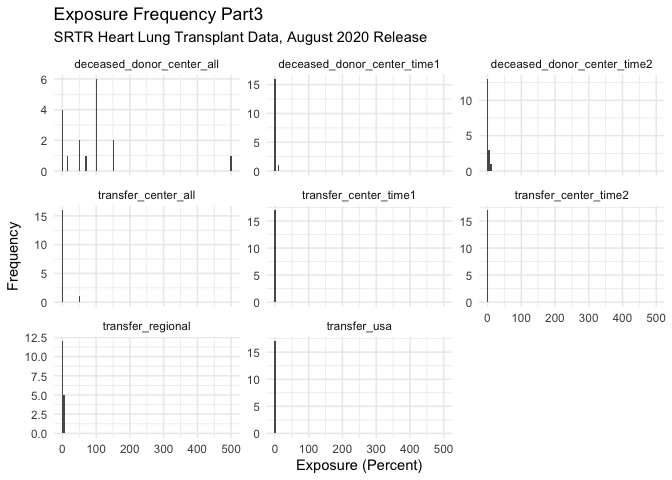
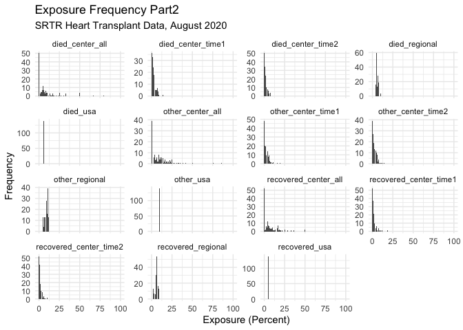
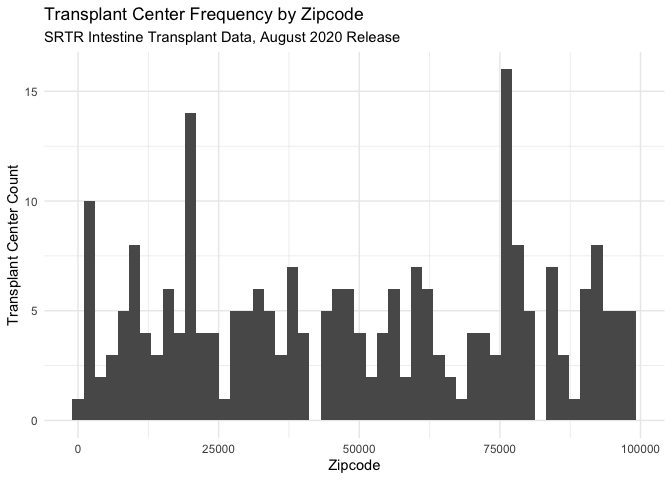
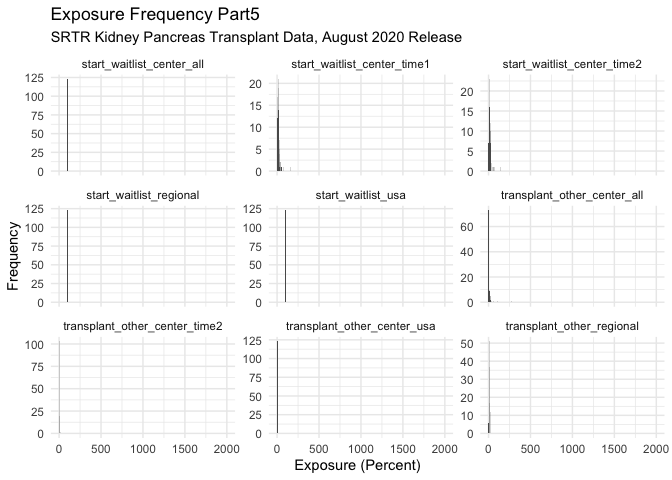

IterationMS
================
Matthew Spotnitz
11/24/2021

``` r
library(tidyverse)
```

    ## ── Attaching packages ─────────────────────────────────────── tidyverse 1.3.1 ──

    ## ✓ ggplot2 3.3.5     ✓ purrr   0.3.4
    ## ✓ tibble  3.1.5     ✓ dplyr   1.0.7
    ## ✓ tidyr   1.1.3     ✓ stringr 1.4.0
    ## ✓ readr   2.0.1     ✓ forcats 0.5.1

    ## ── Conflicts ────────────────────────────────────────── tidyverse_conflicts() ──
    ## x dplyr::filter() masks stats::filter()
    ## x dplyr::lag()    masks stats::lag()

``` r
library(readxl)
library(haven)
library(ggplot2)
library(zipcodeR)
library(ggmap)
```

    ## Google's Terms of Service: https://cloud.google.com/maps-platform/terms/.

    ## Please cite ggmap if you use it! See citation("ggmap") for details.

``` r
library(leaflet)
library(kableExtra)
```

    ## 
    ## Attaching package: 'kableExtra'

    ## The following object is masked from 'package:dplyr':
    ## 
    ##     group_rows

I will define the iterators

``` r
path = "../data/csrs_final_tables_2006_KI.xls"
phrase = "SRTR Kidney Transplant Data, August 2020 Release"
df_paths = tibble(paths = c("../data/csrs_final_tables_2006_HL.xls", "../data/csrs_final_tables_2006_HR.xls", "../data/csrs_final_tables_2006_IN.xls", "../data/csrs_final_tables_2006_KI.xls", "../data/csrs_final_tables_2006_KP.xls", "../data/csrs_final_tables_2006_LI.xls", "../data/csrs_final_tables_2006_LU.xls", "../data/csrs_final_tables_2006_PA.xls"), phrases = c("SRTR Heart Lung Transplant Data, August 2020 Release", "SRTR Heart Transplant Data, August 2020", "SRTR Intestine Transplant Data, August 2020 Release", "SRTR Kidney Transplant Data, August 2020 Release", "SRTR Kidney Pancreas Transplant Data, August 2020 Release", "SRTR Liver Transplant Data, August 2020 Release", "SRTR Lung Transplant Data, August 2020", "SRTR Pancreas Transplant Data, August 2020 Release"))
```

Function to read csv file

``` r
read_file = function(x){
  x = read_excel(path, sheet = "Table B1")
x = janitor::clean_names(x)
str(x)
return(x) 
}
```

Function to clean dataframe

``` r
clean_data_frame = function(x){
  x = x %>% rename(newlistings_center_time1 = wla_addcen_nc1, newlistings_center_time2 = wla_addcen_nc2, newlistings_center_all = wla_addcen_pcz,newlistings_regional = wla_addcen_prz, newlistings_usa = wla_addcen_puz)  %>% rename( endlistings_center_time1 = wla_end_nc1, endlistings_center_time2 = wla_end_nc2, endlistings_center_all = wla_end_pcz, endlistings_regional = wla_end_prz, endlistings_usa = wla_end_puz) %>% rename(deteriorated_center_time1 = wla_remdet_nc1, deteriorated_center_time2 = wla_remdet_nc2, deteriorated_center_all = wla_remdet_pcz, deteriorated_regional = wla_remdet_prz, deteriorated_usa = wla_remdet_puz) %>% rename( died_center_time1 = wla_remdied_nc1, died_center_time2 = wla_remdied_nc2, died_center_all = wla_remdied_pcz, died_regional = wla_remdied_prz, died_usa = wla_remdied_puz) %>% rename(other_center_time1 = wla_remoth_nc1, other_center_time2 = wla_remoth_nc2, other_center_all = wla_remoth_pcz, other_regional = wla_remoth_prz, other_usa = wla_remoth_puz) %>% rename( recovered_center_time1 = wla_remrec_nc1, recovered_center_time2 = wla_remrec_nc2, recovered_center_all = wla_remrec_pcz, recovered_regional = wla_remrec_prz, recovered_usa = wla_remrec_puz) %>% rename(transfer_center_time1 = wla_remtfer_nc1, transfer_center_time2 = wla_remtfer_nc2, transfer_center_all = wla_remtfer_pcz, transfer_regional = wla_remtfer_prz, transfer_usa = wla_remtfer_puz) %>% rename(deceased_donor_center_time1 = wla_remtxc_nc1, deceased_donor_center_time2 = wla_remtxc_nc2, deceased_donor_center_all = wla_remtxc_pcz, deceased_donor_regional = wla_remtxc_prz, deceased_donor_usa = wla_remtxc_puz) %>% rename(living_donor_center_time1 = wla_remtxl_nc1, living_donor_center_time2 = wla_remtxl_nc2, living_donor_center_all = wla_remtxl_pcz, living_donor_regional = wla_remtxl_prz, living_donor_usa = wla_remtxl_puz) %>% rename(transplant_other_center_time1 = wla_remtxoc_nc1, transplant_other_center_time2 = wla_remtxoc_nc2, transplant_other_center_all = wla_remtxoc_pcz, transplant_other_regional = wla_remtxoc_prz, transplant_other_center_usa = wla_remtxoc_puz) %>% rename(start_waitlist_center_time1 = wla_st_nc1, start_waitlist_center_time2 = wla_st_nc2, start_waitlist_center_all = wla_st_pcz, start_waitlist_regional = wla_st_prz, start_waitlist_usa = wla_st_puz)
  
x = x [-c(1), ]
x[, c(4,6:60)] <- sapply(x[, c(4,6:60)], as.numeric)
x = drop_na(x)
str(x)
return (x)
}
```

Outcomes and zipcodes

``` r
outcomes_and_zipcodes = function(x){
  x = x %>% mutate(newlistings_percent_mortality = 100*died_center_all/newlistings_center_all, newlistings_percent_deteriorated = 100*deteriorated_center_all/newlistings_center_all, newlistings_percent_transfer = 100* transfer_center_all/newlistings_center_all, newlistings_percent_living_donor = 100* living_donor_center_all/newlistings_center_all, newlistings_percent_deceased_donor = 100*deceased_donor_center_all/newlistings_center_all, newlistings_percent_recovered = 100* recovered_center_all/newlistings_center_all, living_deceased_graft_ratio = living_donor_center_all/deceased_donor_center_all)
  
df_zipcodes = read_excel("../data/zipcodes.xlsx")
df_zipcodes = df_zipcodes[-c(1), ]
df_zipcodes[, c(2)] = sapply(df_zipcodes[, c(2)], as.numeric)
df_zipcodes = janitor::clean_names(df_zipcodes)

for (zipcode in df_zipcodes["zipcode"]){
    df_zip_geo = tibble(geocode_zip(zipcode))
}
df_geo_merge = merge(df_zipcodes, df_zip_geo, all = TRUE)
x = merge(x, df_geo_merge, all = TRUE)
return(x)
}
```

Exposures One

``` r
plot_exposures_one = function(x){
  x1 = x[, c(6:20)]
plot = ggplot(gather(x1), aes(value)) + geom_histogram(bins = 100) + facet_wrap(~key, scales = "free_y")  +coord_cartesian(xlim = c(0, 2000)) + labs(title = "Exposure Frequency Part1", subtitle = phrase, x = "Exposure (Percent)", y = "Frequency") + theme_minimal()
print(plot)
}
```

Exposures Part Two

``` r
plot_exposures_two = function(x){
  x2 = x[, c(21:35)]
plot = ggplot(gather(x2), aes(value)) + geom_histogram(bins = 100) + facet_wrap(~key, scales = "free_y") +coord_cartesian(xlim = c(0, 100)) + labs(title = "Exposure Frequency Part2", subtitle = phrase, x = "Exposure (Percent)", y = "Frequency") + theme_minimal()
print(plot)
}
```

Exposures Part Three

``` r
plot_exposures_three = function(x){
x3 = x[, c(36:43)]
plot = ggplot(gather(x3), aes(value)) + geom_histogram(bins = 100) + facet_wrap(~key, scales = "free_y") +coord_cartesian(xlim = c(0, 500)) + labs(title = "Exposure Frequency Part3", subtitle = phrase, x = "Exposure (Percent)", y = "Frequency") + theme_minimal()
print(plot)
}
```

Exposures Part Four

``` r
plot_exposures_four = function(x){
x4 = x[, c(44:51)]
plot = ggplot(gather(x4), aes(value)) + geom_histogram(bins = 100) + facet_wrap(~key, scales = "free_y") +coord_cartesian(xlim = c(0, 200)) + labs(title = "Exposure Frequency Part4", subtitle = phrase, x = "Exposure (Percent)", y = "Frequency") + theme_minimal()
print(plot)
}
```

Exposures Part Five

``` r
plot_exposures_five = function(x){
x5 = x[, c(52:60)]
plot = ggplot(gather(x5), aes(value)) + geom_histogram(bins = 100) + facet_wrap(~key, scales = "free_y") +coord_cartesian(xlim = c(0, 2000)) + labs(title = "Exposure Frequency Part5", subtitle = phrase, x = "Exposure (Percent)", y = "Frequency") + theme_minimal()
print(plot)
}
```

Outcomes and zipcodes

``` r
plot_outcomes = function(x){
  x = x[, c(61:66)] %>% filter(newlistings_percent_transfer <= 100)
plot = ggplot(gather(x), aes(value)) + geom_histogram(bins = 30) + facet_wrap(~key, scales = "free_y") + coord_cartesian(xlim = c(0, 100)) + labs(title = "Outcome Frequency", subtitle = phrase, x = "Outcome (Percent)", y = "Frequency") + theme_minimal()
print(plot)
}
```

Zipcode Histogram

``` r
zipcode_histogram = function(x){
z = x %>% ggplot(aes(zipcode)) + geom_histogram(bins = 50) + 
  labs(
    title = "Transplant Center Frequency by Zipcode", subtitle = phrase,
    x = "Zipcode",
    y = "Transplant Center Count"
  ) + theme_minimal()
print(z)
}
```

Make Second Dataframe

``` r
second_data_frame = function(x){
df_two = read_excel(x, sheet = "Tables B2-B3 Center")
df_two = janitor::clean_names(df_two)
str(df_two)
#head(df_two)
#tail(df_two)
#view(df_two)
colnames = colnames(df_two)

df_two_names = read_excel("../data/B2 names.xlsx")
df_two_names = janitor::clean_names(df_two_names)
df_two_names = df_two_names %>% mutate(c = paste(a,b))
setnames = df_two_names %>% pull(c)
df_two = setNames(df_two, setnames)
df_two = janitor::clean_names(df_two)
df_two_clean = df_two[-c(1), ]
df_two_clean = df_two_clean %>% rename (entire_name= center_name_na , ctr_cd = center_code_na)
return (df_two_clean)
}
```

Plot Demographics

``` r
plot_demographics = function(x,y){

df_two_select = y %>% select(entire_name, ctr_cd, asian_allc2, african_american_allc2, hispanic_latino_allc2, white_allc2, race_other_allc2, race_unknown_allc2) 
df_social = merge(x, df_two_select)
df_demographics = df_social[, c(1,2,3, 68, 71:76)]
#view(df_demographics)
df_demographics_pivot =
  pivot_longer(
    df_demographics, 
    asian_allc2:race_unknown_allc2,
    names_to = "race_category", 
    values_to = "race_category_percent") %>% mutate(race_category_percent = as.numeric(race_category_percent)) %>% mutate(race_category = as.factor(race_category))

plot = df_demographics_pivot %>% ggplot(aes(x=zipcode, y =race_category_percent, color = race_category)) + geom_point()+ 
  labs(
    title = "Patient Demographics by Zipcode",subtitle = phrase,
    x = "Zipcode",
    y = "Race (Percent)", color = "Race"
  ) + theme_minimal() + scale_color_hue(labels = c("African American", "Asian", "Hispanic or Latino", "Other", "Unknown", "White"))
print(plot)
}
```

Plot Age

``` r
plot_age = function(x,y){

df_two_age = y[, c(1,2,4,6,8,10,12,14,16,18,20,22)]
df_age = merge(x, df_two_age)
df_age = df_age[, c(1,2,3, 5,68, 72:79)]
#view(df_age)
df_age_pivot =
  pivot_longer(
    df_age, 
    age_2_11_allc2:age_70_allc2,
    names_to = "age_category", 
    values_to = "age_category_percent") %>% mutate (age_category_percent = as.numeric(age_category_percent)) %>% mutate(age_category = factor(age_category, levels =c("age_2_allc2","age_2_11_allc2", "age_12_17_allc2", "age_18_34_allc2", "age_35_49_allc2", "age_50_64_allc2", "age_65_69_allc2", "age_70_allc2"))) %>% drop_na()
#view(df_age_pivot)
plot = df_age_pivot %>% ggplot(aes(x=zipcode, y =age_category_percent, color = age_category)) + geom_point() + 
  labs(
    title = "Patient Age Groups by Zipcode", subtitle = phrase,
    x = "Zipcode",
    y = "Age Group (Percent)",color = "Age Group"
  ) + theme_minimal()  + scale_color_hue(labels = c("Less Than 2 Years", "2 to 11 Years", "12 to 17 Years", "18 to 34 Years", "35 to 49 Years", "50 to 64 Years", "64 to 69 Years", "More Than 70 Years"))
print(plot)
}
```

Now I will make a gender dataframe and plot the gender distributions by
zipcode.

``` r
plot_gender = function(x,y){

df_two_gender = y[, c(1,2,34,36)]
df_gender = merge(x, df_two_gender)
df_gender = df_gender[, c(1,2,3, 68, 71:72)]
#view(df_gender)
df_gender_pivot =
  pivot_longer(
    df_gender, 
    female_allc2:male_allc2,
    names_to = "gender_category", 
    values_to = "gender_category_percent") %>% mutate (gender_category_percent = as.numeric(gender_category_percent)) %>% mutate(gender_category = as.factor(gender_category))
#view(df_gender_pivot)
plot = df_gender_pivot %>% ggplot(aes(x=zipcode, y =gender_category_percent, color = gender_category)) + geom_point()+ 
  labs(
    title = "Patient Gender Groups by Zipcode", subtitle = phrase,
    x = "Zipcode",
    y = "Gender Group (Percent)", color = "Gender"
  ) + theme_minimal() + scale_color_hue(labels = c("Female", "Male"))
print(plot)

}
```

Leaflet

``` r
leaflet = function(x){
library(leaflet)
leaflet(options = leafletOptions(minZoom = 0, maxZoom = 18))
m = x %>% leaflet() %>% addTiles() %>% addCircleMarkers(lat = ~lat, lng = ~lng)
print(m)

}
```

Merge and Write Dataframe

``` r
merge_and_write = function(x,y) {
df = merge(x, y)
path = sub('.xls', '_clean.csv', path)
write.csv(df, path)
}
```

Age Merge and Write Dataframe

``` r
age_merge_and_write = function(x,y) {
df_two_age = y[, c(1,2,6,8,10,12,14,16,18,20,22)]
df_age = merge(x, df_two_age)
df_age = df_age[, c(1,2,3, 68, 71:78)]
#view(df_age)
df_age_pivot =
  pivot_longer(
    df_age, 
    age_2_11_allc2:age_70_allc2,
    names_to = "age_category", 
    values_to = "age_category_percent") %>% mutate (age_category_percent = as.numeric(age_category_percent)) %>% mutate(age_category = factor(age_category, levels =c("age_2_allc2","age_2_11_allc2", "age_12_17_allc2", "age_18_34_allc2", "age_35_49_allc2", "age_50_64_allc2", "age_65_69_allc2", "age_70_allc2"))) %>% drop_na()
path = sub('.xls', '_age.csv', path)
write.csv(df_age_pivot, path)
}
```

Demographics Merge and Write Dataframe

``` r
demographics_merge_and_write = function(x,y) {
df_two_select = y %>% select(entire_name, ctr_cd, asian_allc2, african_american_allc2, hispanic_latino_allc2, white_allc2, race_other_allc2, race_unknown_allc2) 
df_social = merge(x, df_two_select)
df_demographics = df_social[, c(1,2,3, 68, 71:76)]
#view(df_demographics)
df_demographics_pivot =
  pivot_longer(
    df_demographics, 
    asian_allc2:race_unknown_allc2,
    names_to = "race_category", 
    values_to = "race_category_percent") %>% mutate(race_category_percent = as.numeric(race_category_percent)) %>% mutate(race_category = as.factor(race_category))
path = sub('.xls', '_demographics.csv', path)
write.csv(df_demographics_pivot, path)
}
```

Gender

``` r
gender_merge_and_write = function(x,y) {
df_two_gender = y[, c(1,2,34,36)]
df_gender = merge(x, df_two_gender)
df_gender = df_gender[, c(1,2,3, 68, 71:72)]
#view(df_gender)
df_gender_pivot =
  pivot_longer(
    df_gender, 
    female_allc2:male_allc2,
    names_to = "gender_category", 
    values_to = "gender_category_percent") %>% mutate (gender_category_percent = as.numeric(gender_category_percent)) %>% mutate(gender_category = as.factor(gender_category))

path = sub('.xls', '_gender.csv', path)
write.csv(df_gender_pivot, path)
}
```

Master function

``` r
automate_eda = function(x){
df_one = read_file(x)
df_one = clean_data_frame(df_one)
df_one = outcomes_and_zipcodes(df_one)
plot_exposures_one(df_one)
plot_exposures_two(df_one)
plot_exposures_three(df_one)
plot_exposures_four(df_one)
plot_exposures_five(df_one)
plot_outcomes(df_one)
zipcode_histogram(df_one)
df_two_clean = second_data_frame(path) 
plot_demographics(df_one, df_two_clean)
plot_age(df_one, df_two_clean)
plot_gender(df_one, df_two_clean)
merge_and_write(df_one, df_two_clean)
age_merge_and_write(df_one, df_two_clean)
}
```

Test the functions

``` r
df_one = read_file(path)
```

    ## tibble [240 × 60] (S3: tbl_df/tbl/data.frame)
    ##  $ entire_name    : chr [1:240] "Center Name" "Children's of Alabama (ALCH)" "University of Alabama Hospital (ALUA)" "Birmingham VA Medical Center (ALVA)" ...
    ##  $ ctr_cd         : chr [1:240] "Center Code" "ALCH" "ALUA" "ALVA" ...
    ##  $ ctr_ty         : chr [1:240] "Center Type" "TX1" "TX1" "TX1" ...
    ##  $ release_date   : chr [1:240] "Release Date" "44046.791666666664" "44046.791666666664" "44046.791666666664" ...
    ##  $ org            : chr [1:240] "Organ" "KI" "KI" "KI" ...
    ##  $ wla_addcen_nc1 : chr [1:240] "New Listings" "13" "426" "36" ...
    ##  $ wla_addcen_nc2 : chr [1:240] "New Listings" "7" "447" "35" ...
    ##  $ wla_addcen_pcz : chr [1:240] "New Listings" "35" "26.766467066" "52.23880597" ...
    ##  $ wla_addcen_prz : chr [1:240] "New Listings" "41.814623235" "41.814623235" "41.814623235" ...
    ##  $ wla_addcen_puz : chr [1:240] "New Listings" "42.165757431999999" "42.165757431999999" "42.165757431999999" ...
    ##  $ wla_end_nc1    : chr [1:240] "On waitlist at end" "20" "1670" "67" ...
    ##  $ wla_end_nc2    : chr [1:240] "On waitlist at end" "12" "1166" "81" ...
    ##  $ wla_end_pcz    : chr [1:240] "On waitlist at end" "60" "69.820359281" "120.89552239" ...
    ##  $ wla_end_prz    : chr [1:240] "On waitlist at end" "95.994687544" "95.994687544" "95.994687544" ...
    ##  $ wla_end_puz    : chr [1:240] "On waitlist at end" "100.24608634000001" "100.24608634000001" "100.24608634000001" ...
    ##  $ wla_remdet_nc1 : chr [1:240] "Deteriorated" "0" "42" "3" ...
    ##  $ wla_remdet_nc2 : chr [1:240] "Deteriorated" "0" "50" "2" ...
    ##  $ wla_remdet_pcz : chr [1:240] "Deteriorated" "0" "2.994011976" "2.9850746269" ...
    ##  $ wla_remdet_prz : chr [1:240] "Deteriorated" "4.0682231232" "4.0682231232" "4.0682231232" ...
    ##  $ wla_remdet_puz : chr [1:240] "Deteriorated" "4.1735847565000004" "4.1735847565000004" "4.1735847565000004" ...
    ##  $ wla_remdied_nc1: chr [1:240] "Died" "2" "162" "3" ...
    ##  $ wla_remdied_nc2: chr [1:240] "Died" "0" "63" "3" ...
    ##  $ wla_remdied_pcz: chr [1:240] "Died" "0" "3.7724550898" "4.4776119403" ...
    ##  $ wla_remdied_prz: chr [1:240] "Died" "3.8235705298" "3.8235705298" "3.8235705298" ...
    ##  $ wla_remdied_puz: chr [1:240] "Died" "3.8316334597999999" "3.8316334597999999" "3.8316334597999999" ...
    ##  $ wla_remoth_nc1 : chr [1:240] "Other Reasons" "0" "379" "1" ...
    ##  $ wla_remoth_nc2 : chr [1:240] "Other Reasons" "2" "491" "0" ...
    ##  $ wla_remoth_pcz : chr [1:240] "Other Reasons" "10" "29.401197605" "0" ...
    ##  $ wla_remoth_prz : chr [1:240] "Other Reasons" "9.5344610653" "9.5344610653" "9.5344610653" ...
    ##  $ wla_remoth_puz : chr [1:240] "Other Reasons" "5.3723908918000003" "5.3723908918000003" "5.3723908918000003" ...
    ##  $ wla_remrec_nc1 : chr [1:240] "Recovered" "0" "0" "0" ...
    ##  $ wla_remrec_nc2 : chr [1:240] "Recovered" "0" "6" "0" ...
    ##  $ wla_remrec_pcz : chr [1:240] "Recovered" "0" "0.3592814371" "0" ...
    ##  $ wla_remrec_prz : chr [1:240] "Recovered" "0.1188312596" "0.1188312596" "0.1188312596" ...
    ##  $ wla_remrec_puz : chr [1:240] "Recovered" "0.19963630609999999" "0.19963630609999999" "0.19963630609999999" ...
    ##  $ wla_remtfer_nc1: chr [1:240] "Transferred to another center" "1" "3" "1" ...
    ##  $ wla_remtfer_nc2: chr [1:240] "Transferred to another center" "2" "1" "0" ...
    ##  $ wla_remtfer_pcz: chr [1:240] "Transferred to another center" "10" "0.0598802395" "0" ...
    ##  $ wla_remtfer_prz: chr [1:240] "Transferred to another center" "0.6221165944" "0.6221165944" "0.6221165944" ...
    ##  $ wla_remtfer_puz: chr [1:240] "Transferred to another center" "1.4409392789" "1.4409392789" "1.4409392789" ...
    ##  $ wla_remtxc_nc1 : chr [1:240] "Received deceased donor tx" "11" "170" "5" ...
    ##  $ wla_remtxc_nc2 : chr [1:240] "Received deceased donor tx" "7" "203" "7" ...
    ##  $ wla_remtxc_pcz : chr [1:240] "Received deceased donor tx" "35" "12.155688623" "10.447761194" ...
    ##  $ wla_remtxc_prz : chr [1:240] "Received deceased donor tx" "17.398294422" "17.398294422" "17.398294422" ...
    ##  $ wla_remtxc_puz : chr [1:240] "Received deceased donor tx" "16.302972801999999" "16.302972801999999" "16.302972801999999" ...
    ##  $ wla_remtxl_nc1 : chr [1:240] "Received living donor tx" "3" "84" "0" ...
    ##  $ wla_remtxl_nc2 : chr [1:240] "Received living donor tx" "4" "75" "0" ...
    ##  $ wla_remtxl_pcz : chr [1:240] "Received living donor tx" "20" "4.4910179641" "0" ...
    ##  $ wla_remtxl_prz : chr [1:240] "Received living donor tx" "5.5431287572" "5.5431287572" "5.5431287572" ...
    ##  $ wla_remtxl_puz : chr [1:240] "Received living donor tx" "6.7273481973000004" "6.7273481973000004" "6.7273481973000004" ...
    ##  $ wla_remtxoc_nc1: chr [1:240] "Transplanted at another center" "0" "68" "6" ...
    ##  $ wla_remtxoc_nc2: chr [1:240] "Transplanted at another center" "0" "62" "9" ...
    ##  $ wla_remtxoc_pcz: chr [1:240] "Transplanted at another center" "0" "3.7125748503" "13.432835821" ...
    ##  $ wla_remtxoc_prz: chr [1:240] "Transplanted at another center" "4.7113099399" "4.7113099399" "4.7113099399" ...
    ##  $ wla_remtxoc_puz: chr [1:240] "Transplanted at another center" "3.8711654015999999" "3.8711654015999999" "3.8711654015999999" ...
    ##  $ wla_st_nc1     : chr [1:240] "On waitlist at start" "24" "2152" "50" ...
    ##  $ wla_st_nc2     : chr [1:240] "On waitlist at start" "20" "1670" "67" ...
    ##  $ wla_st_pcz     : chr [1:240] "On waitlist at start" "100" "100" "100" ...
    ##  $ wla_st_prz     : chr [1:240] "On waitlist at start" "100" "100" "100" ...
    ##  $ wla_st_puz     : chr [1:240] "On waitlist at start" "100" "100" "100" ...

``` r
df_one = clean_data_frame(df_one)
```

    ## Warning in lapply(X = X, FUN = FUN, ...): NAs introduced by coercion

    ## Warning in lapply(X = X, FUN = FUN, ...): NAs introduced by coercion

    ## Warning in lapply(X = X, FUN = FUN, ...): NAs introduced by coercion

    ## Warning in lapply(X = X, FUN = FUN, ...): NAs introduced by coercion

    ## Warning in lapply(X = X, FUN = FUN, ...): NAs introduced by coercion

    ## Warning in lapply(X = X, FUN = FUN, ...): NAs introduced by coercion

    ## Warning in lapply(X = X, FUN = FUN, ...): NAs introduced by coercion

    ## Warning in lapply(X = X, FUN = FUN, ...): NAs introduced by coercion

    ## Warning in lapply(X = X, FUN = FUN, ...): NAs introduced by coercion

    ## Warning in lapply(X = X, FUN = FUN, ...): NAs introduced by coercion

    ## Warning in lapply(X = X, FUN = FUN, ...): NAs introduced by coercion

    ## tibble [236 × 60] (S3: tbl_df/tbl/data.frame)
    ##  $ entire_name                  : chr [1:236] "Children's of Alabama (ALCH)" "University of Alabama Hospital (ALUA)" "Birmingham VA Medical Center (ALVA)" "Arkansas Children's Hospital (ARCH)" ...
    ##  $ ctr_cd                       : chr [1:236] "ALCH" "ALUA" "ALVA" "ARCH" ...
    ##  $ ctr_ty                       : chr [1:236] "TX1" "TX1" "TX1" "TX1" ...
    ##  $ release_date                 : num [1:236] 44047 44047 44047 44047 44047 ...
    ##  $ org                          : chr [1:236] "KI" "KI" "KI" "KI" ...
    ##  $ newlistings_center_time1     : num [1:236] 13 426 36 14 145 19 193 478 76 116 ...
    ##  $ newlistings_center_time2     : num [1:236] 7 447 35 5 188 27 124 486 56 126 ...
    ##  $ newlistings_center_all       : num [1:236] 35 26.8 52.2 125 93.5 ...
    ##  $ newlistings_regional         : num [1:236] 41.8 41.8 41.8 41.8 41.8 ...
    ##  $ newlistings_usa              : num [1:236] 42.2 42.2 42.2 42.2 42.2 ...
    ##  $ endlistings_center_time1     : num [1:236] 20 1670 67 4 201 19 705 910 108 129 ...
    ##  $ endlistings_center_time2     : num [1:236] 12 1166 81 4 176 ...
    ##  $ endlistings_center_all       : num [1:236] 60 69.8 120.9 100 87.6 ...
    ##  $ endlistings_regional         : num [1:236] 96 96 96 96 96 ...
    ##  $ endlistings_usa              : num [1:236] 100 100 100 100 100 ...
    ##  $ deteriorated_center_time1    : num [1:236] 0 42 3 0 15 0 19 23 4 3 ...
    ##  $ deteriorated_center_time2    : num [1:236] 0 50 2 0 21 0 90 11 3 5 ...
    ##  $ deteriorated_center_all      : num [1:236] 0 2.99 2.99 0 10.45 ...
    ##  $ deteriorated_regional        : num [1:236] 4.07 4.07 4.07 4.07 4.07 ...
    ##  $ deteriorated_usa             : num [1:236] 4.17 4.17 4.17 4.17 4.17 ...
    ##  $ died_center_time1            : num [1:236] 2 162 3 0 4 1 45 29 3 3 ...
    ##  $ died_center_time2            : num [1:236] 0 63 3 0 8 0 22 44 6 4 ...
    ##  $ died_center_all              : num [1:236] 0 3.77 4.48 0 3.98 ...
    ##  $ died_regional                : num [1:236] 3.82 3.82 3.82 3.82 3.82 ...
    ##  $ died_usa                     : num [1:236] 3.83 3.83 3.83 3.83 3.83 ...
    ##  $ other_center_time1           : num [1:236] 0 379 1 1 10 1 7 44 3 6 ...
    ##  $ other_center_time2           : num [1:236] 2 491 0 0 8 0 50 66 2 11 ...
    ##  $ other_center_all             : num [1:236] 10 29.4 0 0 3.98 ...
    ##  $ other_regional               : num [1:236] 9.53 9.53 9.53 9.53 9.53 ...
    ##  $ other_usa                    : num [1:236] 5.37 5.37 5.37 5.37 5.37 ...
    ##  $ recovered_center_time1       : num [1:236] 0 0 0 0 0 0 0 4 0 0 ...
    ##  $ recovered_center_time2       : num [1:236] 0 6 0 0 0 0 7 1 1 2 ...
    ##  $ recovered_center_all         : num [1:236] 0 0.359 0 0 0 ...
    ##  $ recovered_regional           : num [1:236] 0.119 0.119 0.119 0.119 0.119 ...
    ##  $ recovered_usa                : num [1:236] 0.2 0.2 0.2 0.2 0.2 ...
    ##  $ transfer_center_time1        : num [1:236] 1 3 1 1 1 1 8 7 0 1 ...
    ##  $ transfer_center_time2        : num [1:236] 2 1 0 0 1 1 4 3 3 3 ...
    ##  $ transfer_center_all          : num [1:236] 10 0.0599 0 0 0.4975 ...
    ##  $ transfer_regional            : num [1:236] 0.622 0.622 0.622 0.622 0.622 ...
    ##  $ transfer_usa                 : num [1:236] 1.44 1.44 1.44 1.44 1.44 ...
    ##  $ deceased_donor_center_time1  : num [1:236] 11 170 5 12 102 11 131 258 14 78 ...
    ##  $ deceased_donor_center_time2  : num [1:236] 7 203 7 5 160 18 106 344 20 95 ...
    ##  $ deceased_donor_center_all    : num [1:236] 35 12.2 10.4 125 79.6 ...
    ##  $ deceased_donor_regional      : num [1:236] 17.4 17.4 17.4 17.4 17.4 ...
    ##  $ deceased_donor_usa           : num [1:236] 16.3 16.3 16.3 16.3 16.3 ...
    ##  $ living_donor_center_time1    : num [1:236] 3 84 0 1 7 0 38 82 12 11 ...
    ##  $ living_donor_center_time2    : num [1:236] 4 75 0 0 7 12 45 70 6 10 ...
    ##  $ living_donor_center_all      : num [1:236] 20 4.49 0 0 3.48 ...
    ##  $ living_donor_regional        : num [1:236] 5.54 5.54 5.54 5.54 5.54 ...
    ##  $ living_donor_usa             : num [1:236] 6.73 6.73 6.73 6.73 6.73 ...
    ##  $ transplant_other_center_time1: num [1:236] 0 68 6 0 5 1 8 36 1 3 ...
    ##  $ transplant_other_center_time2: num [1:236] 0 62 9 0 8 0 5 36 3 2 ...
    ##  $ transplant_other_center_all  : num [1:236] 0 3.71 13.43 0 3.98 ...
    ##  $ transplant_other_regional    : num [1:236] 4.71 4.71 4.71 4.71 4.71 ...
    ##  $ transplant_other_center_usa  : num [1:236] 3.87 3.87 3.87 3.87 3.87 ...
    ##  $ start_waitlist_center_time1  : num [1:236] 24 2152 50 5 200 ...
    ##  $ start_waitlist_center_time2  : num [1:236] 20 1670 67 4 201 19 705 910 108 129 ...
    ##  $ start_waitlist_center_all    : num [1:236] 100 100 100 100 100 100 100 100 100 100 ...
    ##  $ start_waitlist_regional      : num [1:236] 100 100 100 100 100 100 100 100 100 100 ...
    ##  $ start_waitlist_usa           : num [1:236] 100 100 100 100 100 100 100 100 100 100 ...

``` r
df_one = outcomes_and_zipcodes(df_one)
plot_exposures_one(df_one)
```

    ## Warning: Removed 30 rows containing non-finite values (stat_bin).

<!-- -->

``` r
plot_exposures_two(df_one)
```

    ## Warning: Removed 30 rows containing non-finite values (stat_bin).

<!-- -->

``` r
plot_exposures_three(df_one)
```

    ## Warning: Removed 16 rows containing non-finite values (stat_bin).

<!-- -->

``` r
plot_exposures_four(df_one)
```

    ## Warning: Removed 16 rows containing non-finite values (stat_bin).

<!-- -->

``` r
plot_exposures_five(df_one)
```

    ## Warning: Removed 18 rows containing non-finite values (stat_bin).

<!-- -->

``` r
plot_outcomes(df_one)
```

<!-- -->

``` r
zipcode_histogram(df_one)
```

<!-- -->

``` r
df_two_clean = second_data_frame(path) 
```

    ## tibble [239 × 191] (S3: tbl_df/tbl/data.frame)
    ##  $ entire_name    : chr [1:239] "Center Name" "Hartford Hospital (CTHH)" "Yale New Haven Hospital (CTYN)" "Beth Israel Deaconess Medical Center (MABI)" ...
    ##  $ ctr_cd         : chr [1:239] "Center Code" "CTHH" "CTYN" "MABI" ...
    ##  $ ctr_ty         : chr [1:239] "Center Type" "TX1" "TX1" "TX1" ...
    ##  $ release_date   : chr [1:239] "Release Date" "44046.791666666664" "44046.791666666664" "44046.791666666664" ...
    ##  $ org            : chr [1:239] "Organ" "KI" "KI" "KI" ...
    ##  $ wlc_a10_allc2  : chr [1:239] "Age 2-11" "0.2857142857" "0.3053435115" "0" ...
    ##  $ wlc_a10_newc2  : chr [1:239] "Age 2-11" "0" "0.4255319149" "0" ...
    ##  $ wlc_a17_allc2  : chr [1:239] "Age 12-17" "1.7142857143" "0.9160305344" "0" ...
    ##  $ wlc_a17_newc2  : chr [1:239] "Age 12-17" "0.5494505495" "0.4255319149" "0" ...
    ##  $ wlc_a2_allc2   : chr [1:239] "Age < 2" "0" "0.1526717557" "0" ...
    ##  $ wlc_a2_newc2   : chr [1:239] "Age < 2" "0" "0" "0" ...
    ##  $ wlc_a34_allc2  : chr [1:239] "Age 18-34" "9.7142857143" "10.381679389" "7.0652173913" ...
    ##  $ wlc_a34_newc2  : chr [1:239] "Age 18-34" "7.1428571429" "12.765957447" "11.214953271" ...
    ##  $ wlc_a49_allc2  : chr [1:239] "Age 35-49" "23.714285714" "27.480916031" "26.358695652" ...
    ##  $ wlc_a49_newc2  : chr [1:239] "Age 35-49" "26.373626374" "26.808510638" "20.560747664" ...
    ##  $ wlc_a64_allc2  : chr [1:239] "Age 50-64" "43.428571429" "47.022900763" "52.717391304" ...
    ##  $ wlc_a64_newc2  : chr [1:239] "Age 50-64" "41.758241758" "40" "52.336448598" ...
    ##  $ wlc_a69_allc2  : chr [1:239] "Age 65-69" "14.857142857" "10.229007634" "13.315217391" ...
    ##  $ wlc_a69_newc2  : chr [1:239] "Age 65-69" "17.582417582" "13.191489362" "14.953271028" ...
    ##  $ wlc_a70p_allc2 : chr [1:239] "Age 70+" "6.2857142857" "3.5114503817" "0.5434782609" ...
    ##  $ wlc_a70p_newc2 : chr [1:239] "Age 70+" "6.5934065934" "6.3829787234" "0.9345794393" ...
    ##  $ wlc_all_allc2  : chr [1:239] "All" "100" "100" "100" ...
    ##  $ wlc_all_newc2  : chr [1:239] "All" "100" "100" "100" ...
    ##  $ wlc_bab_allc2  : chr [1:239] "Blood Type AB" "1.4285714286" "2.5954198473" "4.0760869565" ...
    ##  $ wlc_bab_newc2  : chr [1:239] "Blood Type AB" "3.8461538462" "2.1276595745" "6.5420560748" ...
    ##  $ wlc_ba_allc2   : chr [1:239] "Blood Type A" "29.714285714" "26.717557252" "29.619565217" ...
    ##  $ wlc_ba_newc2   : chr [1:239] "Blood Type A" "31.868131868" "33.191489362" "37.38317757" ...
    ##  $ wlc_bb_allc2   : chr [1:239] "Blood Type B" "18" "19.694656489" "16.847826087" ...
    ##  $ wlc_bb_newc2   : chr [1:239] "Blood Type B" "16.483516484" "15.319148936" "13.08411215" ...
    ##  $ wlc_bo_allc2   : chr [1:239] "Blood Type O" "50.857142857" "50.992366412" "49.456521739" ...
    ##  $ wlc_bo_newc2   : chr [1:239] "Blood Type O" "47.802197802" "49.361702128" "42.990654206" ...
    ##  $ wlc_bu_allc2   : chr [1:239] "Blood Type Unknown" "0" "0" "0" ...
    ##  $ wlc_bu_newc2   : chr [1:239] "Blood Type Unknown" "0" "0" "0" ...
    ##  $ wlc_gf_allc2   : chr [1:239] "Female" "41.428571429" "36.79389313" "37.5" ...
    ##  $ wlc_gf_newc2   : chr [1:239] "Female" "32.417582418" "39.574468085" "33.644859813" ...
    ##  $ wlc_gm_allc2   : chr [1:239] "Male" "58.571428571" "63.20610687" "62.5" ...
    ##  $ wlc_gm_newc2   : chr [1:239] "Male" "67.582417582" "60.425531915" "66.355140187" ...
    ##  $ wlc_gu_allc2   : chr [1:239] "Gender Unknown" "0" "0" "0" ...
    ##  $ wlc_gu_newc2   : chr [1:239] "Gender Unknown" "0" "0" "0" ...
    ##  $ wlc_hrcar_allc2: chr [1:239] "Cardiomyopathy" "-" "-" "-" ...
    ##  $ wlc_hrcar_newc2: chr [1:239] "Cardiomyopathy" "-" "-" "-" ...
    ##  $ wlc_hrcon_allc2: chr [1:239] "Congenital Heart Disease" "-" "-" "-" ...
    ##  $ wlc_hrcon_newc2: chr [1:239] "Congenital Heart Disease" "-" "-" "-" ...
    ##  $ wlc_hrcor_allc2: chr [1:239] "Coronary Artery Disease" "-" "-" "-" ...
    ##  $ wlc_hrcor_newc2: chr [1:239] "Coronary Artery Disease" "-" "-" "-" ...
    ##  $ wlc_hrmis_allc2: chr [1:239] "Primary Disease Missing" "-" "-" "-" ...
    ##  $ wlc_hrmis_newc2: chr [1:239] "Primary Disease Missing" "-" "-" "-" ...
    ##  $ wlc_hroth_allc2: chr [1:239] "Primary Disease Other" "-" "-" "-" ...
    ##  $ wlc_hroth_newc2: chr [1:239] "Primary Disease Other" "-" "-" "-" ...
    ##  $ wlc_hrrtr_allc2: chr [1:239] "Retransplant/Graft Failure" "-" "-" "-" ...
    ##  $ wlc_hrrtr_newc2: chr [1:239] "Retransplant/Graft Failure" "-" "-" "-" ...
    ##  $ wlc_hrvlv_allc2: chr [1:239] "Valvular Heart Disease" "-" "-" "-" ...
    ##  $ wlc_hrvlv_newc2: chr [1:239] "Valvular Heart Disease" "-" "-" "-" ...
    ##  $ wlc_infbp_allc2: chr [1:239] "Functional Bowel Problem" "-" "-" "-" ...
    ##  $ wlc_infbp_newc2: chr [1:239] "Functional Bowel Problem" "-" "-" "-" ...
    ##  $ wlc_inmis_allc2: chr [1:239] "Primary Disease Missing" "-" "-" "-" ...
    ##  $ wlc_inmis_newc2: chr [1:239] "Primary Disease Missing" "-" "-" "-" ...
    ##  $ wlc_inoth_allc2: chr [1:239] "Primary Disease Other" "-" "-" "-" ...
    ##  $ wlc_inoth_newc2: chr [1:239] "Primary Disease Other" "-" "-" "-" ...
    ##  $ wlc_inrtr_allc2: chr [1:239] "Retransplant/Graft Failure" "-" "-" "-" ...
    ##  $ wlc_inrtr_newc2: chr [1:239] "Retransplant/Graft Failure" "-" "-" "-" ...
    ##  $ wlc_insgs_allc2: chr [1:239] "Short Gut Syndrome" "-" "-" "-" ...
    ##  $ wlc_insgs_newc2: chr [1:239] "Short Gut Syndrome" "-" "-" "-" ...
    ##  $ wlc_kidia_allc2: chr [1:239] "Diabetes" "40.571428571" "36.183206107" "36.141304348" ...
    ##  $ wlc_kidia_newc2: chr [1:239] "Diabetes" "40.10989011" "28.510638298" "31.775700935" ...
    ##  $ wlc_kiglo_allc2: chr [1:239] "Glomerular Diseases" "19.428571429" "23.20610687" "19.836956522" ...
    ##  $ wlc_kiglo_newc2: chr [1:239] "Glomerular Diseases" "18.681318681" "26.808510638" "21.495327103" ...
    ##  $ wlc_kihyp_allc2: chr [1:239] "Hypertensive Nephrosclerosis" "18.571428571" "17.251908397" "20.923913043" ...
    ##  $ wlc_kihyp_newc2: chr [1:239] "Hypertensive Nephrosclerosis" "20.879120879" "17.872340426" "18.691588785" ...
    ##  $ wlc_kimis_allc2: chr [1:239] "Primary Disease Missing" "1.1428571429" "0.1526717557" "0.8152173913" ...
    ##  $ wlc_kimis_newc2: chr [1:239] "Primary Disease Missing" "0" "0" "0.9345794393" ...
    ##  $ wlc_kineo_allc2: chr [1:239] "Neoplasms" "0.5714285714" "0.7633587786" "0" ...
    ##  $ wlc_kineo_newc2: chr [1:239] "Neoplasms" "0" "1.7021276596" "0" ...
    ##  $ wlc_kioth_allc2: chr [1:239] "Primary Disease Other" "7.1428571429" "7.9389312977" "7.8804347826" ...
    ##  $ wlc_kioth_newc2: chr [1:239] "Primary Disease Other" "7.6923076923" "7.6595744681" "10.280373832" ...
    ##  $ wlc_kipol_allc2: chr [1:239] "Polycystic Kidneys" "8.8571428571" "6.8702290076" "8.6956521739" ...
    ##  $ wlc_kipol_newc2: chr [1:239] "Polycystic Kidneys" "8.2417582418" "8.9361702128" "6.5420560748" ...
    ##  $ wlc_kiren_allc2: chr [1:239] "Renovascular & Vascular Diseases" "0" "0.1526717557" "0.2717391304" ...
    ##  $ wlc_kiren_newc2: chr [1:239] "Renovascular & Vascular Diseases" "0" "0" "0.9345794393" ...
    ##  $ wlc_kirtr_allc2: chr [1:239] "Retransplant/Graft Failure" "0" "0" "0" ...
    ##  $ wlc_kirtr_newc2: chr [1:239] "Retransplant/Graft Failure" "0" "0" "0" ...
    ##  $ wlc_kitub_allc2: chr [1:239] "Tubular and Interstitial Diseases" "2.5714285714" "4.7328244275" "4.347826087" ...
    ##  $ wlc_kitub_newc2: chr [1:239] "Tubular and Interstitial Diseases" "2.7472527473" "5.5319148936" "5.6074766355" ...
    ##  $ wlc_liacu_allc2: chr [1:239] "Acute Hepatic Necrosis" "-" "-" "-" ...
    ##  $ wlc_liacu_newc2: chr [1:239] "Acute Hepatic Necrosis" "-" "-" "-" ...
    ##  $ wlc_libil_allc2: chr [1:239] "Biliary Atresia" "-" "-" "-" ...
    ##  $ wlc_libil_newc2: chr [1:239] "Biliary Atresia" "-" "-" "-" ...
    ##  $ wlc_licho_allc2: chr [1:239] "Cholestatic Liver Disease/Cirrhosis" "-" "-" "-" ...
    ##  $ wlc_licho_newc2: chr [1:239] "Cholestatic Liver Disease/Cirrhosis" "-" "-" "-" ...
    ##  $ wlc_limal_allc2: chr [1:239] "Malignant Neoplasms" "-" "-" "-" ...
    ##  $ wlc_limal_newc2: chr [1:239] "Malignant Neoplasms" "-" "-" "-" ...
    ##  $ wlc_limet_allc2: chr [1:239] "Metabolic Diseases" "-" "-" "-" ...
    ##  $ wlc_limet_newc2: chr [1:239] "Metabolic Diseases" "-" "-" "-" ...
    ##  $ wlc_limis_allc2: chr [1:239] "Primary Disease Missing" "-" "-" "-" ...
    ##  $ wlc_limis_newc2: chr [1:239] "Primary Disease Missing" "-" "-" "-" ...
    ##  $ wlc_linch_allc2: chr [1:239] "Non-Cholestatic Cirrhosis" "-" "-" "-" ...
    ##  $ wlc_linch_newc2: chr [1:239] "Non-Cholestatic Cirrhosis" "-" "-" "-" ...
    ##  $ wlc_lioth_allc2: chr [1:239] "Primary Disease Other" "-" "-" "-" ...
    ##  $ wlc_lioth_newc2: chr [1:239] "Primary Disease Other" "-" "-" "-" ...
    ##   [list output truncated]

``` r
plot_demographics(df_one, df_two_clean)
```

<!-- -->

``` r
plot_age(df_one, df_two_clean)
```

<!-- -->

``` r
plot_gender(df_one, df_two_clean)
```

<!-- -->

``` r
leaflet(df_one)
```

<!-- -->

``` r
merge_and_write(df_one, df_two_clean)
age_merge_and_write(df_one, df_two_clean)
demographics_merge_and_write(df_one, df_two_clean)
gender_merge_and_write(df_one, df_two_clean)
```

Test master function

``` r
for(i in seq_len(nrow(df_paths))) {
  path = toString(df_paths[i, 1])
  phrase = toString(df_paths[i,2])
  automate_eda(path)
}
```

    ## tibble [40 × 60] (S3: tbl_df/tbl/data.frame)
    ##  $ entire_name    : chr [1:40] "Center Name" "University of Alabama Hospital (ALUA)" "Banner University Medical Center-Tucson (AZUA)" "Cedars-Sinai Medical Center (CACS)" ...
    ##  $ ctr_cd         : chr [1:40] "Center Code" "ALUA" "AZUA" "CACS" ...
    ##  $ ctr_ty         : chr [1:40] "Center Type" "TX1" "TX1" "TX1" ...
    ##  $ release_date   : chr [1:40] "Release Date" "44046.791666666664" "44046.791666666664" "44046.791666666664" ...
    ##  $ org            : chr [1:40] "Organ" "HL" "HL" "HL" ...
    ##  $ wla_addcen_nc1 : chr [1:40] "New Listings" "2" "0" "1" ...
    ##  $ wla_addcen_nc2 : chr [1:40] "New Listings" "6" "0" "0" ...
    ##  $ wla_addcen_pcz : chr [1:40] "New Listings" "600" "0" "0" ...
    ##  $ wla_addcen_prz : chr [1:40] "New Listings" "250" "50" "50" ...
    ##  $ wla_addcen_puz : chr [1:40] "New Listings" "138.29787234" "138.29787234" "138.29787234" ...
    ##  $ wla_end_nc1    : chr [1:40] "On waitlist at end" "1" "1" "1" ...
    ##  $ wla_end_nc2    : chr [1:40] "On waitlist at end" "0" "0" "0" ...
    ##  $ wla_end_pcz    : chr [1:40] "On waitlist at end" "0" "0" "0" ...
    ##  $ wla_end_prz    : chr [1:40] "On waitlist at end" "50" "75" "75" ...
    ##  $ wla_end_puz    : chr [1:40] "On waitlist at end" "97.872340425999994" "97.872340425999994" "97.872340425999994" ...
    ##  $ wla_remdet_nc1 : chr [1:40] "Deteriorated" "0" "0" "1" ...
    ##  $ wla_remdet_nc2 : chr [1:40] "Deteriorated" "0" "0" "0" ...
    ##  $ wla_remdet_pcz : chr [1:40] "Deteriorated" "0" "0" "0" ...
    ##  $ wla_remdet_prz : chr [1:40] "Deteriorated" "50" "10" "10" ...
    ##  $ wla_remdet_puz : chr [1:40] "Deteriorated" "17.021276596" "17.021276596" "17.021276596" ...
    ##  $ wla_remdied_nc1: chr [1:40] "Died" "1" "0" "1" ...
    ##  $ wla_remdied_nc2: chr [1:40] "Died" "1" "0" "1" ...
    ##  $ wla_remdied_pcz: chr [1:40] "Died" "100" "0" "100" ...
    ##  $ wla_remdied_prz: chr [1:40] "Died" "25" "5" "5" ...
    ##  $ wla_remdied_puz: chr [1:40] "Died" "8.5106382978999999" "8.5106382978999999" "8.5106382978999999" ...
    ##  $ wla_remoth_nc1 : chr [1:40] "Other Reasons" "0" "0" "0" ...
    ##  $ wla_remoth_nc2 : chr [1:40] "Other Reasons" "1" "0" "0" ...
    ##  $ wla_remoth_pcz : chr [1:40] "Other Reasons" "100" "0" "0" ...
    ##  $ wla_remoth_prz : chr [1:40] "Other Reasons" "25" "0" "0" ...
    ##  $ wla_remoth_puz : chr [1:40] "Other Reasons" "10.638297872000001" "10.638297872000001" "10.638297872000001" ...
    ##  $ wla_remrec_nc1 : chr [1:40] "Recovered" "0" "0" "0" ...
    ##  $ wla_remrec_nc2 : chr [1:40] "Recovered" "0" "1" "0" ...
    ##  $ wla_remrec_pcz : chr [1:40] "Recovered" "0" "100" "0" ...
    ##  $ wla_remrec_prz : chr [1:40] "Recovered" "0" "5" "5" ...
    ##  $ wla_remrec_puz : chr [1:40] "Recovered" "6.3829787233999999" "6.3829787233999999" "6.3829787233999999" ...
    ##  $ wla_remtfer_nc1: chr [1:40] "Transferred to another center" "0" "0" "0" ...
    ##  $ wla_remtfer_nc2: chr [1:40] "Transferred to another center" "0" "0" "0" ...
    ##  $ wla_remtfer_pcz: chr [1:40] "Transferred to another center" "0" "0" "0" ...
    ##  $ wla_remtfer_prz: chr [1:40] "Transferred to another center" "0" "5" "5" ...
    ##  $ wla_remtfer_puz: chr [1:40] "Transferred to another center" "2.1276595745" "2.1276595745" "2.1276595745" ...
    ##  $ wla_remtxc_nc1 : chr [1:40] "Received deceased donor tx" "1" "0" "0" ...
    ##  $ wla_remtxc_nc2 : chr [1:40] "Received deceased donor tx" "5" "0" "0" ...
    ##  $ wla_remtxc_pcz : chr [1:40] "Received deceased donor tx" "500" "0" "0" ...
    ##  $ wla_remtxc_prz : chr [1:40] "Received deceased donor tx" "200" "50" "50" ...
    ##  $ wla_remtxc_puz : chr [1:40] "Received deceased donor tx" "95.744680850999998" "95.744680850999998" "95.744680850999998" ...
    ##  $ wla_remtxl_nc1 : chr [1:40] "Received living donor tx" "0" "0" "0" ...
    ##  $ wla_remtxl_nc2 : chr [1:40] "Received living donor tx" "0" "0" "0" ...
    ##  $ wla_remtxl_pcz : chr [1:40] "Received living donor tx" "0" "0" "0" ...
    ##  $ wla_remtxl_prz : chr [1:40] "Received living donor tx" "0" "0" "0" ...
    ##  $ wla_remtxl_puz : chr [1:40] "Received living donor tx" "0" "0" "0" ...
    ##  $ wla_remtxoc_nc1: chr [1:40] "Transplanted at another center" "0" "0" "0" ...
    ##  $ wla_remtxoc_nc2: chr [1:40] "Transplanted at another center" "0" "0" "0" ...
    ##  $ wla_remtxoc_pcz: chr [1:40] "Transplanted at another center" "0" "0" "0" ...
    ##  $ wla_remtxoc_prz: chr [1:40] "Transplanted at another center" "0" "0" "0" ...
    ##  $ wla_remtxoc_puz: chr [1:40] "Transplanted at another center" "0" "0" "0" ...
    ##  $ wla_st_nc1     : chr [1:40] "On waitlist at start" "1" "1" "2" ...
    ##  $ wla_st_nc2     : chr [1:40] "On waitlist at start" "1" "1" "1" ...
    ##  $ wla_st_pcz     : chr [1:40] "On waitlist at start" "100" "100" "100" ...
    ##  $ wla_st_prz     : chr [1:40] "On waitlist at start" "100" "100" "100" ...
    ##  $ wla_st_puz     : chr [1:40] "On waitlist at start" "100" "100" "100" ...

    ## Warning in lapply(X = X, FUN = FUN, ...): NAs introduced by coercion

    ## Warning in lapply(X = X, FUN = FUN, ...): NAs introduced by coercion

    ## Warning in lapply(X = X, FUN = FUN, ...): NAs introduced by coercion

    ## Warning in lapply(X = X, FUN = FUN, ...): NAs introduced by coercion

    ## Warning in lapply(X = X, FUN = FUN, ...): NAs introduced by coercion

    ## Warning in lapply(X = X, FUN = FUN, ...): NAs introduced by coercion

    ## Warning in lapply(X = X, FUN = FUN, ...): NAs introduced by coercion

    ## Warning in lapply(X = X, FUN = FUN, ...): NAs introduced by coercion

    ## Warning in lapply(X = X, FUN = FUN, ...): NAs introduced by coercion

    ## Warning in lapply(X = X, FUN = FUN, ...): NAs introduced by coercion

    ## Warning in lapply(X = X, FUN = FUN, ...): NAs introduced by coercion

    ## Warning in lapply(X = X, FUN = FUN, ...): NAs introduced by coercion

    ## Warning in lapply(X = X, FUN = FUN, ...): NAs introduced by coercion

    ## Warning in lapply(X = X, FUN = FUN, ...): NAs introduced by coercion

    ## Warning in lapply(X = X, FUN = FUN, ...): NAs introduced by coercion

    ## Warning in lapply(X = X, FUN = FUN, ...): NAs introduced by coercion

    ## Warning in lapply(X = X, FUN = FUN, ...): NAs introduced by coercion

    ## Warning in lapply(X = X, FUN = FUN, ...): NAs introduced by coercion

    ## Warning in lapply(X = X, FUN = FUN, ...): NAs introduced by coercion

    ## Warning in lapply(X = X, FUN = FUN, ...): NAs introduced by coercion

    ## Warning in lapply(X = X, FUN = FUN, ...): NAs introduced by coercion

    ## Warning in lapply(X = X, FUN = FUN, ...): NAs introduced by coercion

    ## tibble [17 × 60] (S3: tbl_df/tbl/data.frame)
    ##  $ entire_name                  : chr [1:17] "University of Alabama Hospital (ALUA)" "Banner University Medical Center-Tucson (AZUA)" "Cedars-Sinai Medical Center (CACS)" "University of California San Diego Medical Center (CASD)" ...
    ##  $ ctr_cd                       : chr [1:17] "ALUA" "AZUA" "CACS" "CASD" ...
    ##  $ ctr_ty                       : chr [1:17] "TX1" "TX1" "TX1" "TX1" ...
    ##  $ release_date                 : num [1:17] 44047 44047 44047 44047 44047 ...
    ##  $ org                          : chr [1:17] "HL" "HL" "HL" "HL" ...
    ##  $ newlistings_center_time1     : num [1:17] 2 0 1 2 4 15 5 1 1 4 ...
    ##  $ newlistings_center_time2     : num [1:17] 6 0 0 3 0 7 2 0 0 3 ...
    ##  $ newlistings_center_all       : num [1:17] 600 0 0 150 0 ...
    ##  $ newlistings_regional         : num [1:17] 250 50 50 50 50 ...
    ##  $ newlistings_usa              : num [1:17] 138 138 138 138 138 ...
    ##  $ endlistings_center_time1     : num [1:17] 1 1 1 2 3 13 1 2 1 2 ...
    ##  $ endlistings_center_time2     : num [1:17] 0 0 0 3 2 10 2 0 0 0 ...
    ##  $ endlistings_center_all       : num [1:17] 0 0 0 150 66.7 ...
    ##  $ endlistings_regional         : num [1:17] 50 75 75 75 75 ...
    ##  $ endlistings_usa              : num [1:17] 97.9 97.9 97.9 97.9 97.9 ...
    ##  $ deteriorated_center_time1    : num [1:17] 0 0 1 0 1 0 0 0 0 0 ...
    ##  $ deteriorated_center_time2    : num [1:17] 0 0 0 0 1 1 0 1 0 1 ...
    ##  $ deteriorated_center_all      : num [1:17] 0 0 0 0 33.3 ...
    ##  $ deteriorated_regional        : num [1:17] 50 10 10 10 10 ...
    ##  $ deteriorated_usa             : num [1:17] 17 17 17 17 17 ...
    ##  $ died_center_time1            : num [1:17] 1 0 1 1 1 0 4 0 0 0 ...
    ##  $ died_center_time2            : num [1:17] 1 0 1 0 0 0 0 0 0 0 ...
    ##  $ died_center_all              : num [1:17] 100 0 100 0 0 0 0 0 0 0 ...
    ##  $ died_regional                : num [1:17] 25 5 5 5 5 5 25 25 0 0 ...
    ##  $ died_usa                     : num [1:17] 8.51 8.51 8.51 8.51 8.51 ...
    ##  $ other_center_time1           : num [1:17] 0 0 0 0 0 1 0 0 0 1 ...
    ##  $ other_center_time2           : num [1:17] 1 0 0 0 0 0 0 0 0 1 ...
    ##  $ other_center_all             : num [1:17] 100 0 0 0 0 0 0 0 0 50 ...
    ##  $ other_regional               : num [1:17] 25 0 0 0 0 ...
    ##  $ other_usa                    : num [1:17] 10.6 10.6 10.6 10.6 10.6 ...
    ##  $ recovered_center_time1       : num [1:17] 0 0 0 1 0 1 0 0 0 0 ...
    ##  $ recovered_center_time2       : num [1:17] 0 1 0 0 0 0 0 0 0 0 ...
    ##  $ recovered_center_all         : num [1:17] 0 100 0 0 0 0 0 0 0 0 ...
    ##  $ recovered_regional           : num [1:17] 0 5 5 5 5 ...
    ##  $ recovered_usa                : num [1:17] 6.38 6.38 6.38 6.38 6.38 ...
    ##  $ transfer_center_time1        : num [1:17] 0 0 0 0 0 0 0 0 0 0 ...
    ##  $ transfer_center_time2        : num [1:17] 0 0 0 1 0 0 0 0 0 0 ...
    ##  $ transfer_center_all          : num [1:17] 0 0 0 50 0 0 0 0 0 0 ...
    ##  $ transfer_regional            : num [1:17] 0 5 5 5 5 5 0 0 0 0 ...
    ##  $ transfer_usa                 : num [1:17] 2.13 2.13 2.13 2.13 2.13 ...
    ##  $ deceased_donor_center_time1  : num [1:17] 1 0 0 0 1 10 0 0 0 2 ...
    ##  $ deceased_donor_center_time2  : num [1:17] 5 0 0 1 0 9 1 1 1 3 ...
    ##  $ deceased_donor_center_all    : num [1:17] 500 0 0 50 0 ...
    ##  $ deceased_donor_regional      : num [1:17] 200 50 50 50 50 ...
    ##  $ deceased_donor_usa           : num [1:17] 95.7 95.7 95.7 95.7 95.7 ...
    ##  $ living_donor_center_time1    : num [1:17] 0 0 0 0 0 0 0 0 0 0 ...
    ##  $ living_donor_center_time2    : num [1:17] 0 0 0 0 0 0 0 0 0 0 ...
    ##  $ living_donor_center_all      : num [1:17] 0 0 0 0 0 0 0 0 0 0 ...
    ##  $ living_donor_regional        : num [1:17] 0 0 0 0 0 0 0 0 0 0 ...
    ##  $ living_donor_usa             : num [1:17] 0 0 0 0 0 0 0 0 0 0 ...
    ##  $ transplant_other_center_time1: num [1:17] 0 0 0 0 0 0 0 0 0 0 ...
    ##  $ transplant_other_center_time2: num [1:17] 0 0 0 0 0 0 0 0 0 0 ...
    ##  $ transplant_other_center_all  : num [1:17] 0 0 0 0 0 0 0 0 0 0 ...
    ##  $ transplant_other_regional    : num [1:17] 0 0 0 0 0 0 0 0 0 0 ...
    ##  $ transplant_other_center_usa  : num [1:17] 0 0 0 0 0 0 0 0 0 0 ...
    ##  $ start_waitlist_center_time1  : num [1:17] 1 1 2 2 2 10 0 1 0 1 ...
    ##  $ start_waitlist_center_time2  : num [1:17] 1 1 1 2 3 13 1 2 1 2 ...
    ##  $ start_waitlist_center_all    : num [1:17] 100 100 100 100 100 100 100 100 100 100 ...
    ##  $ start_waitlist_regional      : num [1:17] 100 100 100 100 100 100 100 100 100 100 ...
    ##  $ start_waitlist_usa           : num [1:17] 100 100 100 100 100 100 100 100 100 100 ...

    ## Warning: Removed 3315 rows containing non-finite values (stat_bin).

<!-- -->

    ## Warning: Removed 3315 rows containing non-finite values (stat_bin).

<!-- -->

    ## Warning: Removed 1768 rows containing non-finite values (stat_bin).

<!-- -->

    ## Warning: Removed 1768 rows containing non-finite values (stat_bin).

<!-- -->

    ## Warning: Removed 1989 rows containing non-finite values (stat_bin).

<!-- --><!-- -->

    ## tibble [30 × 191] (S3: tbl_df/tbl/data.frame)
    ##  $ entire_name    : chr [1:30] "Center Name" "Massachusetts General Hospital (MAMG)" "Brigham and Women's Hospital (MAPB)" "University of Maryland Medical System (MDUM)" ...
    ##  $ ctr_cd         : chr [1:30] "Center Code" "MAMG" "MAPB" "MDUM" ...
    ##  $ ctr_ty         : chr [1:30] "Center Type" "TX1" "TX1" "TX1" ...
    ##  $ release_date   : chr [1:30] "Release Date" "44046.791666666664" "44046.791666666664" "44046.791666666664" ...
    ##  $ org            : chr [1:30] "Organ" "HL" "HL" "HL" ...
    ##  $ wlc_a10_allc2  : chr [1:30] "Age 2-11" "-" "0" "-" ...
    ##  $ wlc_a10_newc2  : chr [1:30] "Age 2-11" "0" "0" "0" ...
    ##  $ wlc_a17_allc2  : chr [1:30] "Age 12-17" "-" "0" "-" ...
    ##  $ wlc_a17_newc2  : chr [1:30] "Age 12-17" "0" "0" "0" ...
    ##  $ wlc_a2_allc2   : chr [1:30] "Age < 2" "-" "0" "-" ...
    ##  $ wlc_a2_newc2   : chr [1:30] "Age < 2" "0" "0" "0" ...
    ##  $ wlc_a34_allc2  : chr [1:30] "Age 18-34" "-" "0" "-" ...
    ##  $ wlc_a34_newc2  : chr [1:30] "Age 18-34" "0" "33.333333333" "33.333333333" ...
    ##  $ wlc_a49_allc2  : chr [1:30] "Age 35-49" "-" "100" "-" ...
    ##  $ wlc_a49_newc2  : chr [1:30] "Age 35-49" "100" "66.666666667" "33.333333333" ...
    ##  $ wlc_a64_allc2  : chr [1:30] "Age 50-64" "-" "0" "-" ...
    ##  $ wlc_a64_newc2  : chr [1:30] "Age 50-64" "0" "0" "0" ...
    ##  $ wlc_a69_allc2  : chr [1:30] "Age 65-69" "-" "0" "-" ...
    ##  $ wlc_a69_newc2  : chr [1:30] "Age 65-69" "0" "0" "33.333333333" ...
    ##  $ wlc_a70p_allc2 : chr [1:30] "Age 70+" "-" "0" "-" ...
    ##  $ wlc_a70p_newc2 : chr [1:30] "Age 70+" "0" "0" "0" ...
    ##  $ wlc_all_allc2  : chr [1:30] "All" "-" "100" "-" ...
    ##  $ wlc_all_newc2  : chr [1:30] "All" "100" "100" "100" ...
    ##  $ wlc_bab_allc2  : chr [1:30] "Blood Type AB" "-" "0" "-" ...
    ##  $ wlc_bab_newc2  : chr [1:30] "Blood Type AB" "0" "0" "0" ...
    ##  $ wlc_ba_allc2   : chr [1:30] "Blood Type A" "-" "0" "-" ...
    ##  $ wlc_ba_newc2   : chr [1:30] "Blood Type A" "100" "33.333333333" "33.333333333" ...
    ##  $ wlc_bb_allc2   : chr [1:30] "Blood Type B" "-" "0" "-" ...
    ##  $ wlc_bb_newc2   : chr [1:30] "Blood Type B" "0" "0" "33.333333333" ...
    ##  $ wlc_bo_allc2   : chr [1:30] "Blood Type O" "-" "100" "-" ...
    ##  $ wlc_bo_newc2   : chr [1:30] "Blood Type O" "0" "66.666666667" "33.333333333" ...
    ##  $ wlc_bu_allc2   : chr [1:30] "Blood Type Unknown" "-" "0" "-" ...
    ##  $ wlc_bu_newc2   : chr [1:30] "Blood Type Unknown" "0" "0" "0" ...
    ##  $ wlc_gf_allc2   : chr [1:30] "Female" "-" "50" "-" ...
    ##  $ wlc_gf_newc2   : chr [1:30] "Female" "0" "33.333333333" "100" ...
    ##  $ wlc_gm_allc2   : chr [1:30] "Male" "-" "50" "-" ...
    ##  $ wlc_gm_newc2   : chr [1:30] "Male" "100" "66.666666667" "0" ...
    ##  $ wlc_gu_allc2   : chr [1:30] "Gender Unknown" "-" "0" "-" ...
    ##  $ wlc_gu_newc2   : chr [1:30] "Gender Unknown" "0" "0" "0" ...
    ##  $ wlc_hrcar_allc2: chr [1:30] "Cardiomyopathy" "-" "-" "-" ...
    ##  $ wlc_hrcar_newc2: chr [1:30] "Cardiomyopathy" "-" "-" "-" ...
    ##  $ wlc_hrcon_allc2: chr [1:30] "Congenital Heart Disease" "-" "-" "-" ...
    ##  $ wlc_hrcon_newc2: chr [1:30] "Congenital Heart Disease" "-" "-" "-" ...
    ##  $ wlc_hrcor_allc2: chr [1:30] "Coronary Artery Disease" "-" "-" "-" ...
    ##  $ wlc_hrcor_newc2: chr [1:30] "Coronary Artery Disease" "-" "-" "-" ...
    ##  $ wlc_hrmis_allc2: chr [1:30] "Primary Disease Missing" "-" "-" "-" ...
    ##  $ wlc_hrmis_newc2: chr [1:30] "Primary Disease Missing" "-" "-" "-" ...
    ##  $ wlc_hroth_allc2: chr [1:30] "Primary Disease Other" "-" "-" "-" ...
    ##  $ wlc_hroth_newc2: chr [1:30] "Primary Disease Other" "-" "-" "-" ...
    ##  $ wlc_hrrtr_allc2: chr [1:30] "Retransplant/Graft Failure" "-" "-" "-" ...
    ##  $ wlc_hrrtr_newc2: chr [1:30] "Retransplant/Graft Failure" "-" "-" "-" ...
    ##  $ wlc_hrvlv_allc2: chr [1:30] "Valvular Heart Disease" "-" "-" "-" ...
    ##  $ wlc_hrvlv_newc2: chr [1:30] "Valvular Heart Disease" "-" "-" "-" ...
    ##  $ wlc_infbp_allc2: chr [1:30] "Functional Bowel Problem" "-" "-" "-" ...
    ##  $ wlc_infbp_newc2: chr [1:30] "Functional Bowel Problem" "-" "-" "-" ...
    ##  $ wlc_inmis_allc2: chr [1:30] "Primary Disease Missing" "-" "-" "-" ...
    ##  $ wlc_inmis_newc2: chr [1:30] "Primary Disease Missing" "-" "-" "-" ...
    ##  $ wlc_inoth_allc2: chr [1:30] "Primary Disease Other" "-" "-" "-" ...
    ##  $ wlc_inoth_newc2: chr [1:30] "Primary Disease Other" "-" "-" "-" ...
    ##  $ wlc_inrtr_allc2: chr [1:30] "Retransplant/Graft Failure" "-" "-" "-" ...
    ##  $ wlc_inrtr_newc2: chr [1:30] "Retransplant/Graft Failure" "-" "-" "-" ...
    ##  $ wlc_insgs_allc2: chr [1:30] "Short Gut Syndrome" "-" "-" "-" ...
    ##  $ wlc_insgs_newc2: chr [1:30] "Short Gut Syndrome" "-" "-" "-" ...
    ##  $ wlc_kidia_allc2: chr [1:30] "Diabetes" "-" "-" "-" ...
    ##  $ wlc_kidia_newc2: chr [1:30] "Diabetes" "-" "-" "-" ...
    ##  $ wlc_kiglo_allc2: chr [1:30] "Glomerular Diseases" "-" "-" "-" ...
    ##  $ wlc_kiglo_newc2: chr [1:30] "Glomerular Diseases" "-" "-" "-" ...
    ##  $ wlc_kihyp_allc2: chr [1:30] "Hypertensive Nephrosclerosis" "-" "-" "-" ...
    ##  $ wlc_kihyp_newc2: chr [1:30] "Hypertensive Nephrosclerosis" "-" "-" "-" ...
    ##  $ wlc_kimis_allc2: chr [1:30] "Primary Disease Missing" "-" "-" "-" ...
    ##  $ wlc_kimis_newc2: chr [1:30] "Primary Disease Missing" "-" "-" "-" ...
    ##  $ wlc_kineo_allc2: chr [1:30] "Neoplasms" "-" "-" "-" ...
    ##  $ wlc_kineo_newc2: chr [1:30] "Neoplasms" "-" "-" "-" ...
    ##  $ wlc_kioth_allc2: chr [1:30] "Primary Disease Other" "-" "-" "-" ...
    ##  $ wlc_kioth_newc2: chr [1:30] "Primary Disease Other" "-" "-" "-" ...
    ##  $ wlc_kipol_allc2: chr [1:30] "Polycystic Kidneys" "-" "-" "-" ...
    ##  $ wlc_kipol_newc2: chr [1:30] "Polycystic Kidneys" "-" "-" "-" ...
    ##  $ wlc_kiren_allc2: chr [1:30] "Renovascular & Vascular Diseases" "-" "-" "-" ...
    ##  $ wlc_kiren_newc2: chr [1:30] "Renovascular & Vascular Diseases" "-" "-" "-" ...
    ##  $ wlc_kirtr_allc2: chr [1:30] "Retransplant/Graft Failure" "-" "-" "-" ...
    ##  $ wlc_kirtr_newc2: chr [1:30] "Retransplant/Graft Failure" "-" "-" "-" ...
    ##  $ wlc_kitub_allc2: chr [1:30] "Tubular and Interstitial Diseases" "-" "-" "-" ...
    ##  $ wlc_kitub_newc2: chr [1:30] "Tubular and Interstitial Diseases" "-" "-" "-" ...
    ##  $ wlc_liacu_allc2: chr [1:30] "Acute Hepatic Necrosis" "-" "-" "-" ...
    ##  $ wlc_liacu_newc2: chr [1:30] "Acute Hepatic Necrosis" "-" "-" "-" ...
    ##  $ wlc_libil_allc2: chr [1:30] "Biliary Atresia" "-" "-" "-" ...
    ##  $ wlc_libil_newc2: chr [1:30] "Biliary Atresia" "-" "-" "-" ...
    ##  $ wlc_licho_allc2: chr [1:30] "Cholestatic Liver Disease/Cirrhosis" "-" "-" "-" ...
    ##  $ wlc_licho_newc2: chr [1:30] "Cholestatic Liver Disease/Cirrhosis" "-" "-" "-" ...
    ##  $ wlc_limal_allc2: chr [1:30] "Malignant Neoplasms" "-" "-" "-" ...
    ##  $ wlc_limal_newc2: chr [1:30] "Malignant Neoplasms" "-" "-" "-" ...
    ##  $ wlc_limet_allc2: chr [1:30] "Metabolic Diseases" "-" "-" "-" ...
    ##  $ wlc_limet_newc2: chr [1:30] "Metabolic Diseases" "-" "-" "-" ...
    ##  $ wlc_limis_allc2: chr [1:30] "Primary Disease Missing" "-" "-" "-" ...
    ##  $ wlc_limis_newc2: chr [1:30] "Primary Disease Missing" "-" "-" "-" ...
    ##  $ wlc_linch_allc2: chr [1:30] "Non-Cholestatic Cirrhosis" "-" "-" "-" ...
    ##  $ wlc_linch_newc2: chr [1:30] "Non-Cholestatic Cirrhosis" "-" "-" "-" ...
    ##  $ wlc_lioth_allc2: chr [1:30] "Primary Disease Other" "-" "-" "-" ...
    ##  $ wlc_lioth_newc2: chr [1:30] "Primary Disease Other" "-" "-" "-" ...
    ##   [list output truncated]

    ## Warning in mask$eval_all_mutate(quo): NAs introduced by coercion

<!-- -->

    ## Warning: Removed 18 rows containing missing values (geom_point).

    ## Warning in mask$eval_all_mutate(quo): NAs introduced by coercion

<!-- -->

    ## Warning in mask$eval_all_mutate(quo): NAs introduced by coercion

<!-- -->

    ## Warning: Removed 6 rows containing missing values (geom_point).

    ## Warning: NAs introduced by coercion

    ## tibble [142 × 60] (S3: tbl_df/tbl/data.frame)
    ##  $ entire_name    : chr [1:142] "Center Name" "Children's of Alabama (ALCH)" "University of Alabama Hospital (ALUA)" "Baptist Medical Center (ARBH)" ...
    ##  $ ctr_cd         : chr [1:142] "Center Code" "ALCH" "ALUA" "ARBH" ...
    ##  $ ctr_ty         : chr [1:142] "Center Type" "TX1" "TX1" "TX1" ...
    ##  $ release_date   : chr [1:142] "Release Date" "44046.791666666664" "44046.791666666664" "44046.791666666664" ...
    ##  $ org            : chr [1:142] "Organ" "HR" "HR" "HR" ...
    ##  $ wla_addcen_nc1 : chr [1:142] "New Listings" "18" "33" "25" ...
    ##  $ wla_addcen_nc2 : chr [1:142] "New Listings" "11" "35" "14" ...
    ##  $ wla_addcen_pcz : chr [1:142] "New Listings" "183.33333333" "175" "36.842105263" ...
    ##  $ wla_addcen_prz : chr [1:142] "New Listings" "109.95762712" "109.95762712" "109.95762712" ...
    ##  $ wla_addcen_puz : chr [1:142] "New Listings" "123.19143379" "123.19143379" "123.19143379" ...
    ##  $ wla_end_nc1    : chr [1:142] "On waitlist at end" "6" "20" "38" ...
    ##  $ wla_end_nc2    : chr [1:142] "On waitlist at end" "4" "24" "30" ...
    ##  $ wla_end_pcz    : chr [1:142] "On waitlist at end" "66.666666667" "120" "78.947368421" ...
    ##  $ wla_end_prz    : chr [1:142] "On waitlist at end" "89.618644068" "89.618644068" "89.618644068" ...
    ##  $ wla_end_puz    : chr [1:142] "On waitlist at end" "98.250195873999999" "98.250195873999999" "98.250195873999999" ...
    ##  $ wla_remdet_nc1 : chr [1:142] "Deteriorated" "1" "2" "3" ...
    ##  $ wla_remdet_nc2 : chr [1:142] "Deteriorated" "0" "0" "8" ...
    ##  $ wla_remdet_pcz : chr [1:142] "Deteriorated" "0" "0" "21.052631579" ...
    ##  $ wla_remdet_prz : chr [1:142] "Deteriorated" "11.228813559" "11.228813559" "11.228813559" ...
    ##  $ wla_remdet_puz : chr [1:142] "Deteriorated" "7.8610603290999999" "7.8610603290999999" "7.8610603290999999" ...
    ##  $ wla_remdied_nc1: chr [1:142] "Died" "2" "6" "0" ...
    ##  $ wla_remdied_nc2: chr [1:142] "Died" "4" "1" "0" ...
    ##  $ wla_remdied_pcz: chr [1:142] "Died" "66.666666667" "5" "0" ...
    ##  $ wla_remdied_prz: chr [1:142] "Died" "7.6271186441" "7.6271186441" "7.6271186441" ...
    ##  $ wla_remdied_puz: chr [1:142] "Died" "5.8500914076999999" "5.8500914076999999" "5.8500914076999999" ...
    ##  $ wla_remoth_nc1 : chr [1:142] "Other Reasons" "0" "6" "4" ...
    ##  $ wla_remoth_nc2 : chr [1:142] "Other Reasons" "0" "7" "0" ...
    ##  $ wla_remoth_pcz : chr [1:142] "Other Reasons" "0" "35" "0" ...
    ##  $ wla_remoth_prz : chr [1:142] "Other Reasons" "11.016949153" "11.016949153" "11.016949153" ...
    ##  $ wla_remoth_puz : chr [1:142] "Other Reasons" "9.2452337425" "9.2452337425" "9.2452337425" ...
    ##  $ wla_remrec_nc1 : chr [1:142] "Recovered" "3" "0" "1" ...
    ##  $ wla_remrec_nc2 : chr [1:142] "Recovered" "1" "2" "0" ...
    ##  $ wla_remrec_pcz : chr [1:142] "Recovered" "16.666666667" "10" "0" ...
    ##  $ wla_remrec_prz : chr [1:142] "Recovered" "5.9322033898" "5.9322033898" "5.9322033898" ...
    ##  $ wla_remrec_puz : chr [1:142] "Recovered" "5.3016453382000002" "5.3016453382000002" "5.3016453382000002" ...
    ##  $ wla_remtfer_nc1: chr [1:142] "Transferred to another center" "0" "1" "0" ...
    ##  $ wla_remtfer_nc2: chr [1:142] "Transferred to another center" "0" "0" "1" ...
    ##  $ wla_remtfer_pcz: chr [1:142] "Transferred to another center" "0" "0" "2.6315789474" ...
    ##  $ wla_remtfer_prz: chr [1:142] "Transferred to another center" "1.2711864407" "1.2711864407" "1.2711864407" ...
    ##  $ wla_remtfer_puz: chr [1:142] "Transferred to another center" "2.9250457038" "2.9250457038" "2.9250457038" ...
    ##  $ wla_remtxc_nc1 : chr [1:142] "Received deceased donor tx" "10" "26" "9" ...
    ##  $ wla_remtxc_nc2 : chr [1:142] "Received deceased donor tx" "8" "21" "12" ...
    ##  $ wla_remtxc_pcz : chr [1:142] "Received deceased donor tx" "133.33333333" "105" "31.578947368" ...
    ##  $ wla_remtxc_prz : chr [1:142] "Received deceased donor tx" "83.050847458" "83.050847458" "83.050847458" ...
    ##  $ wla_remtxc_puz : chr [1:142] "Received deceased donor tx" "92.765735179000004" "92.765735179000004" "92.765735179000004" ...
    ##  $ wla_remtxl_nc1 : chr [1:142] "Received living donor tx" "0" "0" "0" ...
    ##  $ wla_remtxl_nc2 : chr [1:142] "Received living donor tx" "0" "0" "0" ...
    ##  $ wla_remtxl_pcz : chr [1:142] "Received living donor tx" "0" "0" "0" ...
    ##  $ wla_remtxl_prz : chr [1:142] "Received living donor tx" "0" "0" "0" ...
    ##  $ wla_remtxl_puz : chr [1:142] "Received living donor tx" "0" "0" "0" ...
    ##  $ wla_remtxoc_nc1: chr [1:142] "Transplanted at another center" "0" "0" "0" ...
    ##  $ wla_remtxoc_nc2: chr [1:142] "Transplanted at another center" "0" "0" "1" ...
    ##  $ wla_remtxoc_pcz: chr [1:142] "Transplanted at another center" "0" "0" "2.6315789474" ...
    ##  $ wla_remtxoc_prz: chr [1:142] "Transplanted at another center" "0.2118644068" "0.2118644068" "0.2118644068" ...
    ##  $ wla_remtxoc_puz: chr [1:142] "Transplanted at another center" "0.99242622089999999" "0.99242622089999999" "0.99242622089999999" ...
    ##  $ wla_st_nc1     : chr [1:142] "On waitlist at start" "4" "28" "30" ...
    ##  $ wla_st_nc2     : chr [1:142] "On waitlist at start" "6" "20" "38" ...
    ##  $ wla_st_pcz     : chr [1:142] "On waitlist at start" "100" "100" "100" ...
    ##  $ wla_st_prz     : chr [1:142] "On waitlist at start" "100" "100" "100" ...
    ##  $ wla_st_puz     : chr [1:142] "On waitlist at start" "100" "100" "100" ...

    ## Warning in lapply(X = X, FUN = FUN, ...): NAs introduced by coercion

    ## Warning in lapply(X = X, FUN = FUN, ...): NAs introduced by coercion

    ## Warning in lapply(X = X, FUN = FUN, ...): NAs introduced by coercion

    ## Warning in lapply(X = X, FUN = FUN, ...): NAs introduced by coercion

    ## Warning in lapply(X = X, FUN = FUN, ...): NAs introduced by coercion

    ## Warning in lapply(X = X, FUN = FUN, ...): NAs introduced by coercion

    ## Warning in lapply(X = X, FUN = FUN, ...): NAs introduced by coercion

    ## Warning in lapply(X = X, FUN = FUN, ...): NAs introduced by coercion

    ## Warning in lapply(X = X, FUN = FUN, ...): NAs introduced by coercion

    ## Warning in lapply(X = X, FUN = FUN, ...): NAs introduced by coercion

    ## Warning in lapply(X = X, FUN = FUN, ...): NAs introduced by coercion

<!-- -->

    ## tibble [139 × 60] (S3: tbl_df/tbl/data.frame)
    ##  $ entire_name                  : chr [1:139] "Children's of Alabama (ALCH)" "University of Alabama Hospital (ALUA)" "Baptist Medical Center (ARBH)" "Arkansas Children's Hospital (ARCH)" ...
    ##  $ ctr_cd                       : chr [1:139] "ALCH" "ALUA" "ARBH" "ARCH" ...
    ##  $ ctr_ty                       : chr [1:139] "TX1" "TX1" "TX1" "TX1" ...
    ##  $ release_date                 : num [1:139] 44047 44047 44047 44047 44047 ...
    ##  $ org                          : chr [1:139] "HR" "HR" "HR" "HR" ...
    ##  $ newlistings_center_time1     : num [1:139] 18 33 25 7 18 53 21 11 7 161 ...
    ##  $ newlistings_center_time2     : num [1:139] 11 35 14 10 12 51 18 7 8 154 ...
    ##  $ newlistings_center_all       : num [1:139] 183.3 175 36.8 500 200 ...
    ##  $ newlistings_regional         : num [1:139] 110 110 110 110 141 ...
    ##  $ newlistings_usa              : num [1:139] 123 123 123 123 123 ...
    ##  $ endlistings_center_time1     : num [1:139] 6 20 38 2 6 26 7 4 7 126 ...
    ##  $ endlistings_center_time2     : num [1:139] 4 24 30 4 5 23 6 1 6 107 ...
    ##  $ endlistings_center_all       : num [1:139] 66.7 120 78.9 200 83.3 ...
    ##  $ endlistings_regional         : num [1:139] 89.6 89.6 89.6 89.6 87.3 ...
    ##  $ endlistings_usa              : num [1:139] 98.3 98.3 98.3 98.3 98.3 ...
    ##  $ deteriorated_center_time1    : num [1:139] 1 2 3 0 2 5 1 0 0 5 ...
    ##  $ deteriorated_center_time2    : num [1:139] 0 0 8 2 1 1 3 0 2 15 ...
    ##  $ deteriorated_center_all      : num [1:139] 0 0 21.1 100 16.7 ...
    ##  $ deteriorated_regional        : num [1:139] 11.23 11.23 11.23 11.23 8.83 ...
    ##  $ deteriorated_usa             : num [1:139] 7.86 7.86 7.86 7.86 7.86 ...
    ##  $ died_center_time1            : num [1:139] 2 6 0 1 1 0 1 0 1 7 ...
    ##  $ died_center_time2            : num [1:139] 4 1 0 0 0 1 1 0 0 8 ...
    ##  $ died_center_all              : num [1:139] 66.7 5 0 0 0 ...
    ##  $ died_regional                : num [1:139] 7.63 7.63 7.63 7.63 5.13 ...
    ##  $ died_usa                     : num [1:139] 5.85 5.85 5.85 5.85 5.85 ...
    ##  $ other_center_time1           : num [1:139] 0 6 4 0 1 3 6 0 0 9 ...
    ##  $ other_center_time2           : num [1:139] 0 7 0 0 0 2 6 0 1 15 ...
    ##  $ other_center_all             : num [1:139] 0 35 0 0 0 ...
    ##  $ other_regional               : num [1:139] 11 11 11 11 10.9 ...
    ##  $ other_usa                    : num [1:139] 9.25 9.25 9.25 9.25 9.25 ...
    ##  $ recovered_center_time1       : num [1:139] 3 0 1 1 1 5 2 0 0 3 ...
    ##  $ recovered_center_time2       : num [1:139] 1 2 0 0 1 4 1 1 0 10 ...
    ##  $ recovered_center_all         : num [1:139] 16.7 10 0 0 16.7 ...
    ##  $ recovered_regional           : num [1:139] 5.93 5.93 5.93 5.93 5.95 ...
    ##  $ recovered_usa                : num [1:139] 5.3 5.3 5.3 5.3 5.3 ...
    ##  $ transfer_center_time1        : num [1:139] 0 1 0 0 0 0 1 0 0 0 ...
    ##  $ transfer_center_time2        : num [1:139] 0 0 1 0 0 0 0 0 0 3 ...
    ##  $ transfer_center_all          : num [1:139] 0 0 2.63 0 0 ...
    ##  $ transfer_regional            : num [1:139] 1.27 1.27 1.27 1.27 2.26 ...
    ##  $ transfer_usa                 : num [1:139] 2.93 2.93 2.93 2.93 2.93 ...
    ##  $ deceased_donor_center_time1  : num [1:139] 10 26 9 4 12 49 16 8 7 122 ...
    ##  $ deceased_donor_center_time2  : num [1:139] 8 21 12 6 11 44 8 9 6 118 ...
    ##  $ deceased_donor_center_all    : num [1:139] 133.3 105 31.6 300 183.3 ...
    ##  $ deceased_donor_regional      : num [1:139] 83.1 83.1 83.1 83.1 119.1 ...
    ##  $ deceased_donor_usa           : num [1:139] 92.8 92.8 92.8 92.8 92.8 ...
    ##  $ living_donor_center_time1    : num [1:139] 0 0 0 0 0 0 0 0 0 0 ...
    ##  $ living_donor_center_time2    : num [1:139] 0 0 0 0 0 0 0 0 0 0 ...
    ##  $ living_donor_center_all      : num [1:139] 0 0 0 0 0 0 0 0 0 0 ...
    ##  $ living_donor_regional        : num [1:139] 0 0 0 0 0 0 0 0 0 0 ...
    ##  $ living_donor_usa             : num [1:139] 0 0 0 0 0 0 0 0 0 0 ...
    ##  $ transplant_other_center_time1: num [1:139] 0 0 0 0 0 0 0 0 0 3 ...
    ##  $ transplant_other_center_time2: num [1:139] 0 0 1 0 0 2 0 0 0 4 ...
    ##  $ transplant_other_center_all  : num [1:139] 0 0 2.63 0 0 ...
    ##  $ transplant_other_regional    : num [1:139] 0.212 0.212 0.212 0.212 1.848 ...
    ##  $ transplant_other_center_usa  : num [1:139] 0.992 0.992 0.992 0.992 0.992 ...
    ##  $ start_waitlist_center_time1  : num [1:139] 4 28 30 1 5 35 13 1 8 114 ...
    ##  $ start_waitlist_center_time2  : num [1:139] 6 20 38 2 6 26 7 4 7 126 ...
    ##  $ start_waitlist_center_all    : num [1:139] 100 100 100 100 100 100 100 100 100 100 ...
    ##  $ start_waitlist_regional      : num [1:139] 100 100 100 100 100 100 100 100 100 100 ...
    ##  $ start_waitlist_usa           : num [1:139] 100 100 100 100 100 100 100 100 100 100 ...

    ## Warning: Removed 1680 rows containing non-finite values (stat_bin).

<!-- -->

    ## Warning: Removed 1680 rows containing non-finite values (stat_bin).

<!-- -->

    ## Warning: Removed 896 rows containing non-finite values (stat_bin).

<!-- -->

    ## Warning: Removed 896 rows containing non-finite values (stat_bin).

<!-- -->

    ## Warning: Removed 1008 rows containing non-finite values (stat_bin).

<!-- --><!-- -->

    ## Warning: Removed 13 rows containing non-finite values (stat_bin).

<!-- -->

    ## tibble [139 × 203] (S3: tbl_df/tbl/data.frame)
    ##  $ entire_name    : chr [1:139] "Center Name" "Hartford Hospital (CTHH)" "Yale New Haven Hospital (CTYN)" "Boston Children's Hospital (MACH)" ...
    ##  $ ctr_cd         : chr [1:139] "Center Code" "CTHH" "CTYN" "MACH" ...
    ##  $ ctr_ty         : chr [1:139] "Center Type" "TX1" "TX1" "TX1" ...
    ##  $ release_date   : chr [1:139] "Release Date" "44046.791666666664" "44046.791666666664" "44046.791666666664" ...
    ##  $ org            : chr [1:139] "Organ" "HR" "HR" "HR" ...
    ##  $ wlc_a10_allc2  : chr [1:139] "Age 2-11" "0" "0" "29.411764706" ...
    ##  $ wlc_a10_newc2  : chr [1:139] "Age 2-11" "0" "1.8181818182" "26.666666667" ...
    ##  $ wlc_a17_allc2  : chr [1:139] "Age 12-17" "0" "0" "29.411764706" ...
    ##  $ wlc_a17_newc2  : chr [1:139] "Age 12-17" "0" "0" "33.333333333" ...
    ##  $ wlc_a2_allc2   : chr [1:139] "Age < 2" "0" "0" "23.529411765" ...
    ##  $ wlc_a2_newc2   : chr [1:139] "Age < 2" "0" "0" "40" ...
    ##  $ wlc_a34_allc2  : chr [1:139] "Age 18-34" "8.6956521739" "9.5238095238" "17.647058824" ...
    ##  $ wlc_a34_newc2  : chr [1:139] "Age 18-34" "3.8461538462" "7.2727272727" "0" ...
    ##  $ wlc_a49_allc2  : chr [1:139] "Age 35-49" "21.739130435" "23.80952381" "0" ...
    ##  $ wlc_a49_newc2  : chr [1:139] "Age 35-49" "11.538461538" "25.454545455" "0" ...
    ##  $ wlc_a64_allc2  : chr [1:139] "Age 50-64" "60.869565217" "47.619047619" "0" ...
    ##  $ wlc_a64_newc2  : chr [1:139] "Age 50-64" "50" "43.636363636" "0" ...
    ##  $ wlc_a69_allc2  : chr [1:139] "Age 65-69" "8.6956521739" "19.047619048" "0" ...
    ##  $ wlc_a69_newc2  : chr [1:139] "Age 65-69" "26.923076923" "12.727272727" "0" ...
    ##  $ wlc_a70p_allc2 : chr [1:139] "Age 70+" "0" "0" "0" ...
    ##  $ wlc_a70p_newc2 : chr [1:139] "Age 70+" "7.6923076923" "9.0909090909" "0" ...
    ##  $ wlc_all_allc2  : chr [1:139] "All" "100" "100" "100" ...
    ##  $ wlc_all_newc2  : chr [1:139] "All" "100" "100" "100" ...
    ##  $ wlc_bab_allc2  : chr [1:139] "Blood Type AB" "4.347826087" "9.5238095238" "5.8823529412" ...
    ##  $ wlc_bab_newc2  : chr [1:139] "Blood Type AB" "7.6923076923" "9.0909090909" "6.6666666667" ...
    ##  $ wlc_ba_allc2   : chr [1:139] "Blood Type A" "21.739130435" "19.047619048" "23.529411765" ...
    ##  $ wlc_ba_newc2   : chr [1:139] "Blood Type A" "26.923076923" "25.454545455" "46.666666667" ...
    ##  $ wlc_bb_allc2   : chr [1:139] "Blood Type B" "4.347826087" "9.5238095238" "23.529411765" ...
    ##  $ wlc_bb_newc2   : chr [1:139] "Blood Type B" "7.6923076923" "20" "26.666666667" ...
    ##  $ wlc_bo_allc2   : chr [1:139] "Blood Type O" "69.565217391" "61.904761905" "47.058823529" ...
    ##  $ wlc_bo_newc2   : chr [1:139] "Blood Type O" "57.692307692" "45.454545455" "20" ...
    ##  $ wlc_bu_allc2   : chr [1:139] "Blood Type Unknown" "0" "0" "0" ...
    ##  $ wlc_bu_newc2   : chr [1:139] "Blood Type Unknown" "0" "0" "0" ...
    ##  $ wlc_gf_allc2   : chr [1:139] "Female" "30.434782609" "28.571428571" "47.058823529" ...
    ##  $ wlc_gf_newc2   : chr [1:139] "Female" "23.076923077" "38.181818182" "53.333333333" ...
    ##  $ wlc_gm_allc2   : chr [1:139] "Male" "69.565217391" "71.428571429" "52.941176471" ...
    ##  $ wlc_gm_newc2   : chr [1:139] "Male" "76.923076923" "61.818181818" "46.666666667" ...
    ##  $ wlc_gu_allc2   : chr [1:139] "Gender Unknown" "0" "0" "0" ...
    ##  $ wlc_gu_newc2   : chr [1:139] "Gender Unknown" "0" "0" "0" ...
    ##  $ wlc_hrcar_allc2: chr [1:139] "Cardiomyopathy" "60.869565217" "61.904761905" "23.529411765" ...
    ##  $ wlc_hrcar_newc2: chr [1:139] "Cardiomyopathy" "53.846153846" "58.181818182" "60" ...
    ##  $ wlc_hrcon_allc2: chr [1:139] "Congenital Heart Disease" "0" "0" "58.823529412" ...
    ##  $ wlc_hrcon_newc2: chr [1:139] "Congenital Heart Disease" "0" "1.8181818182" "26.666666667" ...
    ##  $ wlc_hrcor_allc2: chr [1:139] "Coronary Artery Disease" "30.434782609" "38.095238095" "5.8823529412" ...
    ##  $ wlc_hrcor_newc2: chr [1:139] "Coronary Artery Disease" "42.307692308" "36.363636364" "13.333333333" ...
    ##  $ wlc_hrmis_allc2: chr [1:139] "Primary Disease Missing" "0" "0" "0" ...
    ##  $ wlc_hrmis_newc2: chr [1:139] "Primary Disease Missing" "0" "0" "0" ...
    ##  $ wlc_hroth_allc2: chr [1:139] "Primary Disease Other" "0" "0" "0" ...
    ##  $ wlc_hroth_newc2: chr [1:139] "Primary Disease Other" "0" "1.8181818182" "0" ...
    ##  $ wlc_hrrtr_allc2: chr [1:139] "Retransplant/Graft Failure" "8.6956521739" "0" "11.764705882" ...
    ##  $ wlc_hrrtr_newc2: chr [1:139] "Retransplant/Graft Failure" "3.8461538462" "1.8181818182" "0" ...
    ##  $ wlc_hrvlv_allc2: chr [1:139] "Valvular Heart Disease" "0" "0" "0" ...
    ##  $ wlc_hrvlv_newc2: chr [1:139] "Valvular Heart Disease" "0" "0" "0" ...
    ##  $ wlc_infbp_allc2: chr [1:139] "Functional Bowel Problem" "-" "-" "-" ...
    ##  $ wlc_infbp_newc2: chr [1:139] "Functional Bowel Problem" "-" "-" "-" ...
    ##  $ wlc_inmis_allc2: chr [1:139] "Primary Disease Missing" "-" "-" "-" ...
    ##  $ wlc_inmis_newc2: chr [1:139] "Primary Disease Missing" "-" "-" "-" ...
    ##  $ wlc_inoth_allc2: chr [1:139] "Primary Disease Other" "-" "-" "-" ...
    ##  $ wlc_inoth_newc2: chr [1:139] "Primary Disease Other" "-" "-" "-" ...
    ##  $ wlc_inrtr_allc2: chr [1:139] "Retransplant/Graft Failure" "-" "-" "-" ...
    ##  $ wlc_inrtr_newc2: chr [1:139] "Retransplant/Graft Failure" "-" "-" "-" ...
    ##  $ wlc_insgs_allc2: chr [1:139] "Short Gut Syndrome" "-" "-" "-" ...
    ##  $ wlc_insgs_newc2: chr [1:139] "Short Gut Syndrome" "-" "-" "-" ...
    ##  $ wlc_kidia_allc2: chr [1:139] "Diabetes" "-" "-" "-" ...
    ##  $ wlc_kidia_newc2: chr [1:139] "Diabetes" "-" "-" "-" ...
    ##  $ wlc_kiglo_allc2: chr [1:139] "Glomerular Diseases" "-" "-" "-" ...
    ##  $ wlc_kiglo_newc2: chr [1:139] "Glomerular Diseases" "-" "-" "-" ...
    ##  $ wlc_kihyp_allc2: chr [1:139] "Hypertensive Nephrosclerosis" "-" "-" "-" ...
    ##  $ wlc_kihyp_newc2: chr [1:139] "Hypertensive Nephrosclerosis" "-" "-" "-" ...
    ##  $ wlc_kimis_allc2: chr [1:139] "Primary Disease Missing" "-" "-" "-" ...
    ##  $ wlc_kimis_newc2: chr [1:139] "Primary Disease Missing" "-" "-" "-" ...
    ##  $ wlc_kineo_allc2: chr [1:139] "Neoplasms" "-" "-" "-" ...
    ##  $ wlc_kineo_newc2: chr [1:139] "Neoplasms" "-" "-" "-" ...
    ##  $ wlc_kioth_allc2: chr [1:139] "Primary Disease Other" "-" "-" "-" ...
    ##  $ wlc_kioth_newc2: chr [1:139] "Primary Disease Other" "-" "-" "-" ...
    ##  $ wlc_kipol_allc2: chr [1:139] "Polycystic Kidneys" "-" "-" "-" ...
    ##  $ wlc_kipol_newc2: chr [1:139] "Polycystic Kidneys" "-" "-" "-" ...
    ##  $ wlc_kiren_allc2: chr [1:139] "Renovascular & Vascular Diseases" "-" "-" "-" ...
    ##  $ wlc_kiren_newc2: chr [1:139] "Renovascular & Vascular Diseases" "-" "-" "-" ...
    ##  $ wlc_kirtr_allc2: chr [1:139] "Retransplant/Graft Failure" "-" "-" "-" ...
    ##  $ wlc_kirtr_newc2: chr [1:139] "Retransplant/Graft Failure" "-" "-" "-" ...
    ##  $ wlc_kitub_allc2: chr [1:139] "Tubular and Interstitial Diseases" "-" "-" "-" ...
    ##  $ wlc_kitub_newc2: chr [1:139] "Tubular and Interstitial Diseases" "-" "-" "-" ...
    ##  $ wlc_liacu_allc2: chr [1:139] "Acute Hepatic Necrosis" "-" "-" "-" ...
    ##  $ wlc_liacu_newc2: chr [1:139] "Acute Hepatic Necrosis" "-" "-" "-" ...
    ##  $ wlc_libil_allc2: chr [1:139] "Biliary Atresia" "-" "-" "-" ...
    ##  $ wlc_libil_newc2: chr [1:139] "Biliary Atresia" "-" "-" "-" ...
    ##  $ wlc_licho_allc2: chr [1:139] "Cholestatic Liver Disease/Cirrhosis" "-" "-" "-" ...
    ##  $ wlc_licho_newc2: chr [1:139] "Cholestatic Liver Disease/Cirrhosis" "-" "-" "-" ...
    ##  $ wlc_limal_allc2: chr [1:139] "Malignant Neoplasms" "-" "-" "-" ...
    ##  $ wlc_limal_newc2: chr [1:139] "Malignant Neoplasms" "-" "-" "-" ...
    ##  $ wlc_limet_allc2: chr [1:139] "Metabolic Diseases" "-" "-" "-" ...
    ##  $ wlc_limet_newc2: chr [1:139] "Metabolic Diseases" "-" "-" "-" ...
    ##  $ wlc_limis_allc2: chr [1:139] "Primary Disease Missing" "-" "-" "-" ...
    ##  $ wlc_limis_newc2: chr [1:139] "Primary Disease Missing" "-" "-" "-" ...
    ##  $ wlc_linch_allc2: chr [1:139] "Non-Cholestatic Cirrhosis" "-" "-" "-" ...
    ##  $ wlc_linch_newc2: chr [1:139] "Non-Cholestatic Cirrhosis" "-" "-" "-" ...
    ##  $ wlc_lioth_allc2: chr [1:139] "Primary Disease Other" "-" "-" "-" ...
    ##  $ wlc_lioth_newc2: chr [1:139] "Primary Disease Other" "-" "-" "-" ...
    ##   [list output truncated]

    ## Warning: Removed 72 rows containing missing values (geom_point).

<!-- --><!-- -->

    ## Warning: Removed 24 rows containing missing values (geom_point).

    ## tibble [25 × 60] (S3: tbl_df/tbl/data.frame)
    ##  $ entire_name    : chr [1:25] "Center Name" "University of Alabama Hospital (ALUA)" "Childrens Hospital Los Angeles (CACL)" "Lucile Salter Packard Children's Hospital at Stanford (CAPC)" ...
    ##  $ ctr_cd         : chr [1:25] "Center Code" "ALUA" "CACL" "CAPC" ...
    ##  $ ctr_ty         : chr [1:25] "Center Type" "TX1" "TX1" "TX1" ...
    ##  $ release_date   : chr [1:25] "Release Date" "44046.791666666664" "44046.791666666664" "44046.791666666664" ...
    ##  $ org            : chr [1:25] "Organ" "IN" "IN" "IN" ...
    ##  $ wla_addcen_nc1 : chr [1:25] "New Listings" "3" "1" "0" ...
    ##  $ wla_addcen_nc2 : chr [1:25] "New Listings" "0" "0" "2" ...
    ##  $ wla_addcen_pcz : chr [1:25] "New Listings" "-" "-" "100" ...
    ##  $ wla_addcen_prz : chr [1:25] "New Listings" "150" "30" "30" ...
    ##  $ wla_addcen_puz : chr [1:25] "New Listings" "41.869918699000003" "41.869918699000003" "41.869918699000003" ...
    ##  $ wla_end_nc1    : chr [1:25] "On waitlist at end" "0" "0" "2" ...
    ##  $ wla_end_nc2    : chr [1:25] "On waitlist at end" "0" "0" "3" ...
    ##  $ wla_end_pcz    : chr [1:25] "On waitlist at end" "-" "-" "150" ...
    ##  $ wla_end_prz    : chr [1:25] "On waitlist at end" "80" "103.33333333" "103.33333333" ...
    ##  $ wla_end_puz    : chr [1:25] "On waitlist at end" "91.869918698999996" "91.869918698999996" "91.869918698999996" ...
    ##  $ wla_remdet_nc1 : chr [1:25] "Deteriorated" "0" "0" "0" ...
    ##  $ wla_remdet_nc2 : chr [1:25] "Deteriorated" "0" "0" "0" ...
    ##  $ wla_remdet_pcz : chr [1:25] "Deteriorated" "-" "-" "0" ...
    ##  $ wla_remdet_prz : chr [1:25] "Deteriorated" "10" "0" "0" ...
    ##  $ wla_remdet_puz : chr [1:25] "Deteriorated" "2.0325203252000001" "2.0325203252000001" "2.0325203252000001" ...
    ##  $ wla_remdied_nc1: chr [1:25] "Died" "1" "0" "0" ...
    ##  $ wla_remdied_nc2: chr [1:25] "Died" "0" "0" "0" ...
    ##  $ wla_remdied_pcz: chr [1:25] "Died" "-" "-" "0" ...
    ##  $ wla_remdied_prz: chr [1:25] "Died" "20" "16.666666667" "16.666666667" ...
    ##  $ wla_remdied_puz: chr [1:25] "Died" "5.6910569106000004" "5.6910569106000004" "5.6910569106000004" ...
    ##  $ wla_remoth_nc1 : chr [1:25] "Other Reasons" "1" "1" "0" ...
    ##  $ wla_remoth_nc2 : chr [1:25] "Other Reasons" "0" "0" "0" ...
    ##  $ wla_remoth_pcz : chr [1:25] "Other Reasons" "-" "-" "0" ...
    ##  $ wla_remoth_prz : chr [1:25] "Other Reasons" "10" "0" "0" ...
    ##  $ wla_remoth_puz : chr [1:25] "Other Reasons" "2.4390243902000002" "2.4390243902000002" "2.4390243902000002" ...
    ##  $ wla_remrec_nc1 : chr [1:25] "Recovered" "0" "0" "0" ...
    ##  $ wla_remrec_nc2 : chr [1:25] "Recovered" "0" "0" "1" ...
    ##  $ wla_remrec_pcz : chr [1:25] "Recovered" "-" "-" "50" ...
    ##  $ wla_remrec_prz : chr [1:25] "Recovered" "10" "3.3333333333" "3.3333333333" ...
    ##  $ wla_remrec_puz : chr [1:25] "Recovered" "5.2845528455000004" "5.2845528455000004" "5.2845528455000004" ...
    ##  $ wla_remtfer_nc1: chr [1:25] "Transferred to another center" "0" "0" "0" ...
    ##  $ wla_remtfer_nc2: chr [1:25] "Transferred to another center" "0" "0" "0" ...
    ##  $ wla_remtfer_pcz: chr [1:25] "Transferred to another center" "-" "-" "0" ...
    ##  $ wla_remtfer_prz: chr [1:25] "Transferred to another center" "0" "0" "0" ...
    ##  $ wla_remtfer_puz: chr [1:25] "Transferred to another center" "0.81300813009999995" "0.81300813009999995" "0.81300813009999995" ...
    ##  $ wla_remtxc_nc1 : chr [1:25] "Received deceased donor tx" "3" "0" "2" ...
    ##  $ wla_remtxc_nc2 : chr [1:25] "Received deceased donor tx" "0" "0" "0" ...
    ##  $ wla_remtxc_pcz : chr [1:25] "Received deceased donor tx" "-" "-" "0" ...
    ##  $ wla_remtxc_prz : chr [1:25] "Received deceased donor tx" "120" "6.6666666667" "6.6666666667" ...
    ##  $ wla_remtxc_puz : chr [1:25] "Received deceased donor tx" "32.926829267999999" "32.926829267999999" "32.926829267999999" ...
    ##  $ wla_remtxl_nc1 : chr [1:25] "Received living donor tx" "0" "0" "0" ...
    ##  $ wla_remtxl_nc2 : chr [1:25] "Received living donor tx" "0" "0" "0" ...
    ##  $ wla_remtxl_pcz : chr [1:25] "Received living donor tx" "-" "-" "0" ...
    ##  $ wla_remtxl_prz : chr [1:25] "Received living donor tx" "0" "0" "0" ...
    ##  $ wla_remtxl_puz : chr [1:25] "Received living donor tx" "0" "0" "0" ...
    ##  $ wla_remtxoc_nc1: chr [1:25] "Transplanted at another center" "0" "0" "0" ...
    ##  $ wla_remtxoc_nc2: chr [1:25] "Transplanted at another center" "0" "0" "0" ...
    ##  $ wla_remtxoc_pcz: chr [1:25] "Transplanted at another center" "-" "-" "0" ...
    ##  $ wla_remtxoc_prz: chr [1:25] "Transplanted at another center" "0" "0" "0" ...
    ##  $ wla_remtxoc_puz: chr [1:25] "Transplanted at another center" "0.81300813009999995" "0.81300813009999995" "0.81300813009999995" ...
    ##  $ wla_st_nc1     : chr [1:25] "On waitlist at start" "2" "0" "4" ...
    ##  $ wla_st_nc2     : chr [1:25] "On waitlist at start" "0" "0" "2" ...
    ##  $ wla_st_pcz     : chr [1:25] "On waitlist at start" "-" "-" "100" ...
    ##  $ wla_st_prz     : chr [1:25] "On waitlist at start" "100" "100" "100" ...
    ##  $ wla_st_puz     : chr [1:25] "On waitlist at start" "100" "100" "100" ...

    ## Warning in lapply(X = X, FUN = FUN, ...): NAs introduced by coercion

    ## Warning in lapply(X = X, FUN = FUN, ...): NAs introduced by coercion

    ## Warning in lapply(X = X, FUN = FUN, ...): NAs introduced by coercion

    ## Warning in lapply(X = X, FUN = FUN, ...): NAs introduced by coercion

    ## Warning in lapply(X = X, FUN = FUN, ...): NAs introduced by coercion

    ## Warning in lapply(X = X, FUN = FUN, ...): NAs introduced by coercion

    ## Warning in lapply(X = X, FUN = FUN, ...): NAs introduced by coercion

    ## Warning in lapply(X = X, FUN = FUN, ...): NAs introduced by coercion

    ## Warning in lapply(X = X, FUN = FUN, ...): NAs introduced by coercion

    ## Warning in lapply(X = X, FUN = FUN, ...): NAs introduced by coercion

    ## Warning in lapply(X = X, FUN = FUN, ...): NAs introduced by coercion

<!-- -->

    ## tibble [18 × 60] (S3: tbl_df/tbl/data.frame)
    ##  $ entire_name                  : chr [1:18] "Lucile Salter Packard Children's Hospital at Stanford (CAPC)" "University of California at Los Angeles Medical Center (CAUC)" "Georgetown University Medical Center (DCGU)" "Jackson Memorial Hospital University of Miami School of Medicine (FLJM)" ...
    ##  $ ctr_cd                       : chr [1:18] "CAPC" "CAUC" "DCGU" "FLJM" ...
    ##  $ ctr_ty                       : chr [1:18] "TX1" "TX1" "TX1" "TX1" ...
    ##  $ release_date                 : num [1:18] 44047 44047 44047 44047 44047 ...
    ##  $ org                          : chr [1:18] "IN" "IN" "IN" "IN" ...
    ##  $ newlistings_center_time1     : num [1:18] 0 7 20 18 0 8 0 3 1 5 ...
    ##  $ newlistings_center_time2     : num [1:18] 2 6 18 15 2 11 1 4 0 3 ...
    ##  $ newlistings_center_all       : num [1:18] 100 21.4 90 150 50 ...
    ##  $ newlistings_regional         : num [1:18] 30 30 24.3 150 66.7 ...
    ##  $ newlistings_usa              : num [1:18] 41.9 41.9 41.9 41.9 41.9 ...
    ##  $ endlistings_center_time1     : num [1:18] 2 28 20 10 4 5 2 1 2 4 ...
    ##  $ endlistings_center_time2     : num [1:18] 3 27 12 8 5 9 2 1 0 5 ...
    ##  $ endlistings_center_all       : num [1:18] 150 96.4 60 80 125 ...
    ##  $ endlistings_regional         : num [1:18] 103.3 103.3 92.2 80 83.3 ...
    ##  $ endlistings_usa              : num [1:18] 91.9 91.9 91.9 91.9 91.9 ...
    ##  $ deteriorated_center_time1    : num [1:18] 0 4 0 1 0 0 0 0 0 0 ...
    ##  $ deteriorated_center_time2    : num [1:18] 0 0 0 1 0 1 0 1 0 0 ...
    ##  $ deteriorated_center_all      : num [1:18] 0 0 0 10 0 20 0 100 0 0 ...
    ##  $ deteriorated_regional        : num [1:18] 0 0 0.87 10 0 ...
    ##  $ deteriorated_usa             : num [1:18] 2.03 2.03 2.03 2.03 2.03 ...
    ##  $ died_center_time1            : num [1:18] 0 1 2 2 0 0 0 0 0 0 ...
    ##  $ died_center_time2            : num [1:18] 0 5 2 2 0 0 1 0 0 0 ...
    ##  $ died_center_all              : num [1:18] 0 17.9 10 20 0 ...
    ##  $ died_regional                : num [1:18] 16.67 16.67 2.61 20 0 ...
    ##  $ died_usa                     : num [1:18] 5.69 5.69 5.69 5.69 5.69 ...
    ##  $ other_center_time1           : num [1:18] 0 0 2 0 0 1 0 0 0 0 ...
    ##  $ other_center_time2           : num [1:18] 0 0 1 1 0 0 0 0 2 0 ...
    ##  $ other_center_all             : num [1:18] 0 0 5 10 0 0 0 0 100 0 ...
    ##  $ other_regional               : num [1:18] 0 0 0.87 10 33.33 ...
    ##  $ other_usa                    : num [1:18] 2.44 2.44 2.44 2.44 2.44 ...
    ##  $ recovered_center_time1       : num [1:18] 0 0 2 1 0 0 0 0 0 0 ...
    ##  $ recovered_center_time2       : num [1:18] 1 0 6 1 0 1 0 0 0 0 ...
    ##  $ recovered_center_all         : num [1:18] 50 0 30 10 0 20 0 0 0 0 ...
    ##  $ recovered_regional           : num [1:18] 3.33 3.33 6.96 10 0 ...
    ##  $ recovered_usa                : num [1:18] 5.28 5.28 5.28 5.28 5.28 ...
    ##  $ transfer_center_time1        : num [1:18] 0 0 1 1 0 0 0 0 0 0 ...
    ##  $ transfer_center_time2        : num [1:18] 0 0 0 0 0 0 0 0 0 0 ...
    ##  $ transfer_center_all          : num [1:18] 0 0 0 0 0 0 0 0 0 0 ...
    ##  $ transfer_regional            : num [1:18] 0 0 0 0 0 0 0 0 0 0 ...
    ##  $ transfer_usa                 : num [1:18] 0.813 0.813 0.813 0.813 0.813 ...
    ##  $ deceased_donor_center_time1  : num [1:18] 2 2 18 20 1 8 0 3 0 4 ...
    ##  $ deceased_donor_center_time2  : num [1:18] 0 2 17 12 1 5 0 3 0 2 ...
    ##  $ deceased_donor_center_all    : num [1:18] 0 7.14 85 120 25 ...
    ##  $ deceased_donor_regional      : num [1:18] 6.67 6.67 20 120 50 ...
    ##  $ deceased_donor_usa           : num [1:18] 32.9 32.9 32.9 32.9 32.9 ...
    ##  $ living_donor_center_time1    : num [1:18] 0 0 0 0 0 0 0 0 0 0 ...
    ##  $ living_donor_center_time2    : num [1:18] 0 0 0 0 0 0 0 0 0 0 ...
    ##  $ living_donor_center_all      : num [1:18] 0 0 0 0 0 0 0 0 0 0 ...
    ##  $ living_donor_regional        : num [1:18] 0 0 0 0 0 0 0 0 0 0 ...
    ##  $ living_donor_usa             : num [1:18] 0 0 0 0 0 0 0 0 0 0 ...
    ##  $ transplant_other_center_time1: num [1:18] 0 0 1 0 0 0 0 0 0 0 ...
    ##  $ transplant_other_center_time2: num [1:18] 0 0 0 0 0 0 0 0 0 0 ...
    ##  $ transplant_other_center_all  : num [1:18] 0 0 0 0 0 0 0 0 0 0 ...
    ##  $ transplant_other_regional    : num [1:18] 0 0 0.87 0 0 ...
    ##  $ transplant_other_center_usa  : num [1:18] 0.813 0.813 0.813 0.813 0.813 ...
    ##  $ start_waitlist_center_time1  : num [1:18] 4 28 26 17 5 6 2 1 1 3 ...
    ##  $ start_waitlist_center_time2  : num [1:18] 2 28 20 10 4 5 2 1 2 4 ...
    ##  $ start_waitlist_center_all    : num [1:18] 100 100 100 100 100 100 100 100 100 100 ...
    ##  $ start_waitlist_regional      : num [1:18] 100 100 100 100 100 100 100 100 100 100 ...
    ##  $ start_waitlist_usa           : num [1:18] 100 100 100 100 100 100 100 100 100 100 ...

    ## Warning: Removed 3300 rows containing non-finite values (stat_bin).

<!-- -->

    ## Warning: Removed 3300 rows containing non-finite values (stat_bin).

<!-- -->

    ## Warning: Removed 1760 rows containing non-finite values (stat_bin).

<!-- -->

    ## Warning: Removed 1760 rows containing non-finite values (stat_bin).

<!-- -->

    ## Warning: Removed 1980 rows containing non-finite values (stat_bin).

<!-- --><!-- --><!-- -->

    ## tibble [21 × 191] (S3: tbl_df/tbl/data.frame)
    ##  $ entire_name    : chr [1:21] "Center Name" "Boston Children's Hospital (MACH)" "Georgetown University Medical Center (DCGU)" "UPMC Children's Hospital of Pittsburgh (PACH)" ...
    ##  $ ctr_cd         : chr [1:21] "Center Code" "MACH" "DCGU" "PACH" ...
    ##  $ ctr_ty         : chr [1:21] "Center Type" "TX1" "TX1" "TX1" ...
    ##  $ release_date   : chr [1:21] "Release Date" "44046.791666666664" "44046.791666666664" "44046.791666666664" ...
    ##  $ org            : chr [1:21] "Organ" "IN" "IN" "IN" ...
    ##  $ wlc_a10_allc2  : chr [1:21] "Age 2-11" "50" "33.333333333" "35.555555556" ...
    ##  $ wlc_a10_newc2  : chr [1:21] "Age 2-11" "0" "11.111111111" "33.333333333" ...
    ##  $ wlc_a17_allc2  : chr [1:21] "Age 12-17" "0" "0" "4.4444444444" ...
    ##  $ wlc_a17_newc2  : chr [1:21] "Age 12-17" "100" "0" "22.222222222" ...
    ##  $ wlc_a2_allc2   : chr [1:21] "Age < 2" "50" "8.3333333333" "56.666666667" ...
    ##  $ wlc_a2_newc2   : chr [1:21] "Age < 2" "0" "27.777777778" "33.333333333" ...
    ##  $ wlc_a34_allc2  : chr [1:21] "Age 18-34" "0" "8.3333333333" "3.3333333333" ...
    ##  $ wlc_a34_newc2  : chr [1:21] "Age 18-34" "0" "16.666666667" "11.111111111" ...
    ##  $ wlc_a49_allc2  : chr [1:21] "Age 35-49" "0" "41.666666667" "0" ...
    ##  $ wlc_a49_newc2  : chr [1:21] "Age 35-49" "0" "33.333333333" "0" ...
    ##  $ wlc_a64_allc2  : chr [1:21] "Age 50-64" "0" "8.3333333333" "0" ...
    ##  $ wlc_a64_newc2  : chr [1:21] "Age 50-64" "0" "11.111111111" "0" ...
    ##  $ wlc_a69_allc2  : chr [1:21] "Age 65-69" "0" "0" "0" ...
    ##  $ wlc_a69_newc2  : chr [1:21] "Age 65-69" "0" "0" "0" ...
    ##  $ wlc_a70p_allc2 : chr [1:21] "Age 70+" "0" "0" "0" ...
    ##  $ wlc_a70p_newc2 : chr [1:21] "Age 70+" "0" "0" "0" ...
    ##  $ wlc_all_allc2  : chr [1:21] "All" "100" "100" "100" ...
    ##  $ wlc_all_newc2  : chr [1:21] "All" "100" "100" "100" ...
    ##  $ wlc_bab_allc2  : chr [1:21] "Blood Type AB" "0" "0" "5.5555555556" ...
    ##  $ wlc_bab_newc2  : chr [1:21] "Blood Type AB" "0" "5.5555555556" "11.111111111" ...
    ##  $ wlc_ba_allc2   : chr [1:21] "Blood Type A" "0" "25" "33.333333333" ...
    ##  $ wlc_ba_newc2   : chr [1:21] "Blood Type A" "0" "55.555555556" "33.333333333" ...
    ##  $ wlc_bb_allc2   : chr [1:21] "Blood Type B" "0" "8.3333333333" "12.222222222" ...
    ##  $ wlc_bb_newc2   : chr [1:21] "Blood Type B" "0" "0" "33.333333333" ...
    ##  $ wlc_bo_allc2   : chr [1:21] "Blood Type O" "100" "66.666666667" "48.888888889" ...
    ##  $ wlc_bo_newc2   : chr [1:21] "Blood Type O" "100" "38.888888889" "22.222222222" ...
    ##  $ wlc_bu_allc2   : chr [1:21] "Blood Type Unknown" "0" "0" "0" ...
    ##  $ wlc_bu_newc2   : chr [1:21] "Blood Type Unknown" "0" "0" "0" ...
    ##  $ wlc_gf_allc2   : chr [1:21] "Female" "100" "33.333333333" "42.222222222" ...
    ##  $ wlc_gf_newc2   : chr [1:21] "Female" "0" "50" "33.333333333" ...
    ##  $ wlc_gm_allc2   : chr [1:21] "Male" "0" "66.666666667" "57.777777778" ...
    ##  $ wlc_gm_newc2   : chr [1:21] "Male" "100" "50" "66.666666667" ...
    ##  $ wlc_gu_allc2   : chr [1:21] "Gender Unknown" "0" "0" "0" ...
    ##  $ wlc_gu_newc2   : chr [1:21] "Gender Unknown" "0" "0" "0" ...
    ##  $ wlc_hrcar_allc2: chr [1:21] "Cardiomyopathy" "-" "-" "-" ...
    ##  $ wlc_hrcar_newc2: chr [1:21] "Cardiomyopathy" "-" "-" "-" ...
    ##  $ wlc_hrcon_allc2: chr [1:21] "Congenital Heart Disease" "-" "-" "-" ...
    ##  $ wlc_hrcon_newc2: chr [1:21] "Congenital Heart Disease" "-" "-" "-" ...
    ##  $ wlc_hrcor_allc2: chr [1:21] "Coronary Artery Disease" "-" "-" "-" ...
    ##  $ wlc_hrcor_newc2: chr [1:21] "Coronary Artery Disease" "-" "-" "-" ...
    ##  $ wlc_hrmis_allc2: chr [1:21] "Primary Disease Missing" "-" "-" "-" ...
    ##  $ wlc_hrmis_newc2: chr [1:21] "Primary Disease Missing" "-" "-" "-" ...
    ##  $ wlc_hroth_allc2: chr [1:21] "Primary Disease Other" "-" "-" "-" ...
    ##  $ wlc_hroth_newc2: chr [1:21] "Primary Disease Other" "-" "-" "-" ...
    ##  $ wlc_hrrtr_allc2: chr [1:21] "Retransplant/Graft Failure" "-" "-" "-" ...
    ##  $ wlc_hrrtr_newc2: chr [1:21] "Retransplant/Graft Failure" "-" "-" "-" ...
    ##  $ wlc_hrvlv_allc2: chr [1:21] "Valvular Heart Disease" "-" "-" "-" ...
    ##  $ wlc_hrvlv_newc2: chr [1:21] "Valvular Heart Disease" "-" "-" "-" ...
    ##  $ wlc_infbp_allc2: chr [1:21] "Functional Bowel Problem" "0" "16.666666667" "26.666666667" ...
    ##  $ wlc_infbp_newc2: chr [1:21] "Functional Bowel Problem" "0" "11.111111111" "11.111111111" ...
    ##  $ wlc_inmis_allc2: chr [1:21] "Primary Disease Missing" "0" "0" "0" ...
    ##  $ wlc_inmis_newc2: chr [1:21] "Primary Disease Missing" "0" "0" "0" ...
    ##  $ wlc_inoth_allc2: chr [1:21] "Primary Disease Other" "50" "25" "18.888888889" ...
    ##  $ wlc_inoth_newc2: chr [1:21] "Primary Disease Other" "100" "11.111111111" "22.222222222" ...
    ##  $ wlc_inrtr_allc2: chr [1:21] "Retransplant/Graft Failure" "0" "0" "0" ...
    ##  $ wlc_inrtr_newc2: chr [1:21] "Retransplant/Graft Failure" "0" "0" "0" ...
    ##  $ wlc_insgs_allc2: chr [1:21] "Short Gut Syndrome" "50" "58.333333333" "54.444444444" ...
    ##  $ wlc_insgs_newc2: chr [1:21] "Short Gut Syndrome" "0" "77.777777778" "66.666666667" ...
    ##  $ wlc_kidia_allc2: chr [1:21] "Diabetes" "-" "-" "-" ...
    ##  $ wlc_kidia_newc2: chr [1:21] "Diabetes" "-" "-" "-" ...
    ##  $ wlc_kiglo_allc2: chr [1:21] "Glomerular Diseases" "-" "-" "-" ...
    ##  $ wlc_kiglo_newc2: chr [1:21] "Glomerular Diseases" "-" "-" "-" ...
    ##  $ wlc_kihyp_allc2: chr [1:21] "Hypertensive Nephrosclerosis" "-" "-" "-" ...
    ##  $ wlc_kihyp_newc2: chr [1:21] "Hypertensive Nephrosclerosis" "-" "-" "-" ...
    ##  $ wlc_kimis_allc2: chr [1:21] "Primary Disease Missing" "-" "-" "-" ...
    ##  $ wlc_kimis_newc2: chr [1:21] "Primary Disease Missing" "-" "-" "-" ...
    ##  $ wlc_kineo_allc2: chr [1:21] "Neoplasms" "-" "-" "-" ...
    ##  $ wlc_kineo_newc2: chr [1:21] "Neoplasms" "-" "-" "-" ...
    ##  $ wlc_kioth_allc2: chr [1:21] "Primary Disease Other" "-" "-" "-" ...
    ##  $ wlc_kioth_newc2: chr [1:21] "Primary Disease Other" "-" "-" "-" ...
    ##  $ wlc_kipol_allc2: chr [1:21] "Polycystic Kidneys" "-" "-" "-" ...
    ##  $ wlc_kipol_newc2: chr [1:21] "Polycystic Kidneys" "-" "-" "-" ...
    ##  $ wlc_kiren_allc2: chr [1:21] "Renovascular & Vascular Diseases" "-" "-" "-" ...
    ##  $ wlc_kiren_newc2: chr [1:21] "Renovascular & Vascular Diseases" "-" "-" "-" ...
    ##  $ wlc_kirtr_allc2: chr [1:21] "Retransplant/Graft Failure" "-" "-" "-" ...
    ##  $ wlc_kirtr_newc2: chr [1:21] "Retransplant/Graft Failure" "-" "-" "-" ...
    ##  $ wlc_kitub_allc2: chr [1:21] "Tubular and Interstitial Diseases" "-" "-" "-" ...
    ##  $ wlc_kitub_newc2: chr [1:21] "Tubular and Interstitial Diseases" "-" "-" "-" ...
    ##  $ wlc_liacu_allc2: chr [1:21] "Acute Hepatic Necrosis" "-" "-" "-" ...
    ##  $ wlc_liacu_newc2: chr [1:21] "Acute Hepatic Necrosis" "-" "-" "-" ...
    ##  $ wlc_libil_allc2: chr [1:21] "Biliary Atresia" "-" "-" "-" ...
    ##  $ wlc_libil_newc2: chr [1:21] "Biliary Atresia" "-" "-" "-" ...
    ##  $ wlc_licho_allc2: chr [1:21] "Cholestatic Liver Disease/Cirrhosis" "-" "-" "-" ...
    ##  $ wlc_licho_newc2: chr [1:21] "Cholestatic Liver Disease/Cirrhosis" "-" "-" "-" ...
    ##  $ wlc_limal_allc2: chr [1:21] "Malignant Neoplasms" "-" "-" "-" ...
    ##  $ wlc_limal_newc2: chr [1:21] "Malignant Neoplasms" "-" "-" "-" ...
    ##  $ wlc_limet_allc2: chr [1:21] "Metabolic Diseases" "-" "-" "-" ...
    ##  $ wlc_limet_newc2: chr [1:21] "Metabolic Diseases" "-" "-" "-" ...
    ##  $ wlc_limis_allc2: chr [1:21] "Primary Disease Missing" "-" "-" "-" ...
    ##  $ wlc_limis_newc2: chr [1:21] "Primary Disease Missing" "-" "-" "-" ...
    ##  $ wlc_linch_allc2: chr [1:21] "Non-Cholestatic Cirrhosis" "-" "-" "-" ...
    ##  $ wlc_linch_newc2: chr [1:21] "Non-Cholestatic Cirrhosis" "-" "-" "-" ...
    ##  $ wlc_lioth_allc2: chr [1:21] "Primary Disease Other" "-" "-" "-" ...
    ##  $ wlc_lioth_newc2: chr [1:21] "Primary Disease Other" "-" "-" "-" ...
    ##   [list output truncated]

<!-- --><!-- -->

    ## tibble [240 × 60] (S3: tbl_df/tbl/data.frame)
    ##  $ entire_name    : chr [1:240] "Center Name" "Children's of Alabama (ALCH)" "University of Alabama Hospital (ALUA)" "Birmingham VA Medical Center (ALVA)" ...
    ##  $ ctr_cd         : chr [1:240] "Center Code" "ALCH" "ALUA" "ALVA" ...
    ##  $ ctr_ty         : chr [1:240] "Center Type" "TX1" "TX1" "TX1" ...
    ##  $ release_date   : chr [1:240] "Release Date" "44046.791666666664" "44046.791666666664" "44046.791666666664" ...
    ##  $ org            : chr [1:240] "Organ" "KI" "KI" "KI" ...
    ##  $ wla_addcen_nc1 : chr [1:240] "New Listings" "13" "426" "36" ...
    ##  $ wla_addcen_nc2 : chr [1:240] "New Listings" "7" "447" "35" ...
    ##  $ wla_addcen_pcz : chr [1:240] "New Listings" "35" "26.766467066" "52.23880597" ...
    ##  $ wla_addcen_prz : chr [1:240] "New Listings" "41.814623235" "41.814623235" "41.814623235" ...
    ##  $ wla_addcen_puz : chr [1:240] "New Listings" "42.165757431999999" "42.165757431999999" "42.165757431999999" ...
    ##  $ wla_end_nc1    : chr [1:240] "On waitlist at end" "20" "1670" "67" ...
    ##  $ wla_end_nc2    : chr [1:240] "On waitlist at end" "12" "1166" "81" ...
    ##  $ wla_end_pcz    : chr [1:240] "On waitlist at end" "60" "69.820359281" "120.89552239" ...
    ##  $ wla_end_prz    : chr [1:240] "On waitlist at end" "95.994687544" "95.994687544" "95.994687544" ...
    ##  $ wla_end_puz    : chr [1:240] "On waitlist at end" "100.24608634000001" "100.24608634000001" "100.24608634000001" ...
    ##  $ wla_remdet_nc1 : chr [1:240] "Deteriorated" "0" "42" "3" ...
    ##  $ wla_remdet_nc2 : chr [1:240] "Deteriorated" "0" "50" "2" ...
    ##  $ wla_remdet_pcz : chr [1:240] "Deteriorated" "0" "2.994011976" "2.9850746269" ...
    ##  $ wla_remdet_prz : chr [1:240] "Deteriorated" "4.0682231232" "4.0682231232" "4.0682231232" ...
    ##  $ wla_remdet_puz : chr [1:240] "Deteriorated" "4.1735847565000004" "4.1735847565000004" "4.1735847565000004" ...
    ##  $ wla_remdied_nc1: chr [1:240] "Died" "2" "162" "3" ...
    ##  $ wla_remdied_nc2: chr [1:240] "Died" "0" "63" "3" ...
    ##  $ wla_remdied_pcz: chr [1:240] "Died" "0" "3.7724550898" "4.4776119403" ...
    ##  $ wla_remdied_prz: chr [1:240] "Died" "3.8235705298" "3.8235705298" "3.8235705298" ...
    ##  $ wla_remdied_puz: chr [1:240] "Died" "3.8316334597999999" "3.8316334597999999" "3.8316334597999999" ...
    ##  $ wla_remoth_nc1 : chr [1:240] "Other Reasons" "0" "379" "1" ...
    ##  $ wla_remoth_nc2 : chr [1:240] "Other Reasons" "2" "491" "0" ...
    ##  $ wla_remoth_pcz : chr [1:240] "Other Reasons" "10" "29.401197605" "0" ...
    ##  $ wla_remoth_prz : chr [1:240] "Other Reasons" "9.5344610653" "9.5344610653" "9.5344610653" ...
    ##  $ wla_remoth_puz : chr [1:240] "Other Reasons" "5.3723908918000003" "5.3723908918000003" "5.3723908918000003" ...
    ##  $ wla_remrec_nc1 : chr [1:240] "Recovered" "0" "0" "0" ...
    ##  $ wla_remrec_nc2 : chr [1:240] "Recovered" "0" "6" "0" ...
    ##  $ wla_remrec_pcz : chr [1:240] "Recovered" "0" "0.3592814371" "0" ...
    ##  $ wla_remrec_prz : chr [1:240] "Recovered" "0.1188312596" "0.1188312596" "0.1188312596" ...
    ##  $ wla_remrec_puz : chr [1:240] "Recovered" "0.19963630609999999" "0.19963630609999999" "0.19963630609999999" ...
    ##  $ wla_remtfer_nc1: chr [1:240] "Transferred to another center" "1" "3" "1" ...
    ##  $ wla_remtfer_nc2: chr [1:240] "Transferred to another center" "2" "1" "0" ...
    ##  $ wla_remtfer_pcz: chr [1:240] "Transferred to another center" "10" "0.0598802395" "0" ...
    ##  $ wla_remtfer_prz: chr [1:240] "Transferred to another center" "0.6221165944" "0.6221165944" "0.6221165944" ...
    ##  $ wla_remtfer_puz: chr [1:240] "Transferred to another center" "1.4409392789" "1.4409392789" "1.4409392789" ...
    ##  $ wla_remtxc_nc1 : chr [1:240] "Received deceased donor tx" "11" "170" "5" ...
    ##  $ wla_remtxc_nc2 : chr [1:240] "Received deceased donor tx" "7" "203" "7" ...
    ##  $ wla_remtxc_pcz : chr [1:240] "Received deceased donor tx" "35" "12.155688623" "10.447761194" ...
    ##  $ wla_remtxc_prz : chr [1:240] "Received deceased donor tx" "17.398294422" "17.398294422" "17.398294422" ...
    ##  $ wla_remtxc_puz : chr [1:240] "Received deceased donor tx" "16.302972801999999" "16.302972801999999" "16.302972801999999" ...
    ##  $ wla_remtxl_nc1 : chr [1:240] "Received living donor tx" "3" "84" "0" ...
    ##  $ wla_remtxl_nc2 : chr [1:240] "Received living donor tx" "4" "75" "0" ...
    ##  $ wla_remtxl_pcz : chr [1:240] "Received living donor tx" "20" "4.4910179641" "0" ...
    ##  $ wla_remtxl_prz : chr [1:240] "Received living donor tx" "5.5431287572" "5.5431287572" "5.5431287572" ...
    ##  $ wla_remtxl_puz : chr [1:240] "Received living donor tx" "6.7273481973000004" "6.7273481973000004" "6.7273481973000004" ...
    ##  $ wla_remtxoc_nc1: chr [1:240] "Transplanted at another center" "0" "68" "6" ...
    ##  $ wla_remtxoc_nc2: chr [1:240] "Transplanted at another center" "0" "62" "9" ...
    ##  $ wla_remtxoc_pcz: chr [1:240] "Transplanted at another center" "0" "3.7125748503" "13.432835821" ...
    ##  $ wla_remtxoc_prz: chr [1:240] "Transplanted at another center" "4.7113099399" "4.7113099399" "4.7113099399" ...
    ##  $ wla_remtxoc_puz: chr [1:240] "Transplanted at another center" "3.8711654015999999" "3.8711654015999999" "3.8711654015999999" ...
    ##  $ wla_st_nc1     : chr [1:240] "On waitlist at start" "24" "2152" "50" ...
    ##  $ wla_st_nc2     : chr [1:240] "On waitlist at start" "20" "1670" "67" ...
    ##  $ wla_st_pcz     : chr [1:240] "On waitlist at start" "100" "100" "100" ...
    ##  $ wla_st_prz     : chr [1:240] "On waitlist at start" "100" "100" "100" ...
    ##  $ wla_st_puz     : chr [1:240] "On waitlist at start" "100" "100" "100" ...

    ## Warning in lapply(X = X, FUN = FUN, ...): NAs introduced by coercion

    ## Warning in lapply(X = X, FUN = FUN, ...): NAs introduced by coercion

    ## Warning in lapply(X = X, FUN = FUN, ...): NAs introduced by coercion

    ## Warning in lapply(X = X, FUN = FUN, ...): NAs introduced by coercion

    ## Warning in lapply(X = X, FUN = FUN, ...): NAs introduced by coercion

    ## Warning in lapply(X = X, FUN = FUN, ...): NAs introduced by coercion

    ## Warning in lapply(X = X, FUN = FUN, ...): NAs introduced by coercion

    ## Warning in lapply(X = X, FUN = FUN, ...): NAs introduced by coercion

    ## Warning in lapply(X = X, FUN = FUN, ...): NAs introduced by coercion

    ## Warning in lapply(X = X, FUN = FUN, ...): NAs introduced by coercion

    ## Warning in lapply(X = X, FUN = FUN, ...): NAs introduced by coercion

<!-- -->

    ## tibble [236 × 60] (S3: tbl_df/tbl/data.frame)
    ##  $ entire_name                  : chr [1:236] "Children's of Alabama (ALCH)" "University of Alabama Hospital (ALUA)" "Birmingham VA Medical Center (ALVA)" "Arkansas Children's Hospital (ARCH)" ...
    ##  $ ctr_cd                       : chr [1:236] "ALCH" "ALUA" "ALVA" "ARCH" ...
    ##  $ ctr_ty                       : chr [1:236] "TX1" "TX1" "TX1" "TX1" ...
    ##  $ release_date                 : num [1:236] 44047 44047 44047 44047 44047 ...
    ##  $ org                          : chr [1:236] "KI" "KI" "KI" "KI" ...
    ##  $ newlistings_center_time1     : num [1:236] 13 426 36 14 145 19 193 478 76 116 ...
    ##  $ newlistings_center_time2     : num [1:236] 7 447 35 5 188 27 124 486 56 126 ...
    ##  $ newlistings_center_all       : num [1:236] 35 26.8 52.2 125 93.5 ...
    ##  $ newlistings_regional         : num [1:236] 41.8 41.8 41.8 41.8 41.8 ...
    ##  $ newlistings_usa              : num [1:236] 42.2 42.2 42.2 42.2 42.2 ...
    ##  $ endlistings_center_time1     : num [1:236] 20 1670 67 4 201 19 705 910 108 129 ...
    ##  $ endlistings_center_time2     : num [1:236] 12 1166 81 4 176 ...
    ##  $ endlistings_center_all       : num [1:236] 60 69.8 120.9 100 87.6 ...
    ##  $ endlistings_regional         : num [1:236] 96 96 96 96 96 ...
    ##  $ endlistings_usa              : num [1:236] 100 100 100 100 100 ...
    ##  $ deteriorated_center_time1    : num [1:236] 0 42 3 0 15 0 19 23 4 3 ...
    ##  $ deteriorated_center_time2    : num [1:236] 0 50 2 0 21 0 90 11 3 5 ...
    ##  $ deteriorated_center_all      : num [1:236] 0 2.99 2.99 0 10.45 ...
    ##  $ deteriorated_regional        : num [1:236] 4.07 4.07 4.07 4.07 4.07 ...
    ##  $ deteriorated_usa             : num [1:236] 4.17 4.17 4.17 4.17 4.17 ...
    ##  $ died_center_time1            : num [1:236] 2 162 3 0 4 1 45 29 3 3 ...
    ##  $ died_center_time2            : num [1:236] 0 63 3 0 8 0 22 44 6 4 ...
    ##  $ died_center_all              : num [1:236] 0 3.77 4.48 0 3.98 ...
    ##  $ died_regional                : num [1:236] 3.82 3.82 3.82 3.82 3.82 ...
    ##  $ died_usa                     : num [1:236] 3.83 3.83 3.83 3.83 3.83 ...
    ##  $ other_center_time1           : num [1:236] 0 379 1 1 10 1 7 44 3 6 ...
    ##  $ other_center_time2           : num [1:236] 2 491 0 0 8 0 50 66 2 11 ...
    ##  $ other_center_all             : num [1:236] 10 29.4 0 0 3.98 ...
    ##  $ other_regional               : num [1:236] 9.53 9.53 9.53 9.53 9.53 ...
    ##  $ other_usa                    : num [1:236] 5.37 5.37 5.37 5.37 5.37 ...
    ##  $ recovered_center_time1       : num [1:236] 0 0 0 0 0 0 0 4 0 0 ...
    ##  $ recovered_center_time2       : num [1:236] 0 6 0 0 0 0 7 1 1 2 ...
    ##  $ recovered_center_all         : num [1:236] 0 0.359 0 0 0 ...
    ##  $ recovered_regional           : num [1:236] 0.119 0.119 0.119 0.119 0.119 ...
    ##  $ recovered_usa                : num [1:236] 0.2 0.2 0.2 0.2 0.2 ...
    ##  $ transfer_center_time1        : num [1:236] 1 3 1 1 1 1 8 7 0 1 ...
    ##  $ transfer_center_time2        : num [1:236] 2 1 0 0 1 1 4 3 3 3 ...
    ##  $ transfer_center_all          : num [1:236] 10 0.0599 0 0 0.4975 ...
    ##  $ transfer_regional            : num [1:236] 0.622 0.622 0.622 0.622 0.622 ...
    ##  $ transfer_usa                 : num [1:236] 1.44 1.44 1.44 1.44 1.44 ...
    ##  $ deceased_donor_center_time1  : num [1:236] 11 170 5 12 102 11 131 258 14 78 ...
    ##  $ deceased_donor_center_time2  : num [1:236] 7 203 7 5 160 18 106 344 20 95 ...
    ##  $ deceased_donor_center_all    : num [1:236] 35 12.2 10.4 125 79.6 ...
    ##  $ deceased_donor_regional      : num [1:236] 17.4 17.4 17.4 17.4 17.4 ...
    ##  $ deceased_donor_usa           : num [1:236] 16.3 16.3 16.3 16.3 16.3 ...
    ##  $ living_donor_center_time1    : num [1:236] 3 84 0 1 7 0 38 82 12 11 ...
    ##  $ living_donor_center_time2    : num [1:236] 4 75 0 0 7 12 45 70 6 10 ...
    ##  $ living_donor_center_all      : num [1:236] 20 4.49 0 0 3.48 ...
    ##  $ living_donor_regional        : num [1:236] 5.54 5.54 5.54 5.54 5.54 ...
    ##  $ living_donor_usa             : num [1:236] 6.73 6.73 6.73 6.73 6.73 ...
    ##  $ transplant_other_center_time1: num [1:236] 0 68 6 0 5 1 8 36 1 3 ...
    ##  $ transplant_other_center_time2: num [1:236] 0 62 9 0 8 0 5 36 3 2 ...
    ##  $ transplant_other_center_all  : num [1:236] 0 3.71 13.43 0 3.98 ...
    ##  $ transplant_other_regional    : num [1:236] 4.71 4.71 4.71 4.71 4.71 ...
    ##  $ transplant_other_center_usa  : num [1:236] 3.87 3.87 3.87 3.87 3.87 ...
    ##  $ start_waitlist_center_time1  : num [1:236] 24 2152 50 5 200 ...
    ##  $ start_waitlist_center_time2  : num [1:236] 20 1670 67 4 201 19 705 910 108 129 ...
    ##  $ start_waitlist_center_all    : num [1:236] 100 100 100 100 100 100 100 100 100 100 ...
    ##  $ start_waitlist_regional      : num [1:236] 100 100 100 100 100 100 100 100 100 100 ...
    ##  $ start_waitlist_usa           : num [1:236] 100 100 100 100 100 100 100 100 100 100 ...

    ## Warning: Removed 30 rows containing non-finite values (stat_bin).

<!-- -->

    ## Warning: Removed 30 rows containing non-finite values (stat_bin).

<!-- -->

    ## Warning: Removed 16 rows containing non-finite values (stat_bin).

<!-- -->

    ## Warning: Removed 16 rows containing non-finite values (stat_bin).

<!-- -->

    ## Warning: Removed 18 rows containing non-finite values (stat_bin).

<!-- --><!-- --><!-- -->

    ## tibble [239 × 191] (S3: tbl_df/tbl/data.frame)
    ##  $ entire_name    : chr [1:239] "Center Name" "Hartford Hospital (CTHH)" "Yale New Haven Hospital (CTYN)" "Beth Israel Deaconess Medical Center (MABI)" ...
    ##  $ ctr_cd         : chr [1:239] "Center Code" "CTHH" "CTYN" "MABI" ...
    ##  $ ctr_ty         : chr [1:239] "Center Type" "TX1" "TX1" "TX1" ...
    ##  $ release_date   : chr [1:239] "Release Date" "44046.791666666664" "44046.791666666664" "44046.791666666664" ...
    ##  $ org            : chr [1:239] "Organ" "KI" "KI" "KI" ...
    ##  $ wlc_a10_allc2  : chr [1:239] "Age 2-11" "0.2857142857" "0.3053435115" "0" ...
    ##  $ wlc_a10_newc2  : chr [1:239] "Age 2-11" "0" "0.4255319149" "0" ...
    ##  $ wlc_a17_allc2  : chr [1:239] "Age 12-17" "1.7142857143" "0.9160305344" "0" ...
    ##  $ wlc_a17_newc2  : chr [1:239] "Age 12-17" "0.5494505495" "0.4255319149" "0" ...
    ##  $ wlc_a2_allc2   : chr [1:239] "Age < 2" "0" "0.1526717557" "0" ...
    ##  $ wlc_a2_newc2   : chr [1:239] "Age < 2" "0" "0" "0" ...
    ##  $ wlc_a34_allc2  : chr [1:239] "Age 18-34" "9.7142857143" "10.381679389" "7.0652173913" ...
    ##  $ wlc_a34_newc2  : chr [1:239] "Age 18-34" "7.1428571429" "12.765957447" "11.214953271" ...
    ##  $ wlc_a49_allc2  : chr [1:239] "Age 35-49" "23.714285714" "27.480916031" "26.358695652" ...
    ##  $ wlc_a49_newc2  : chr [1:239] "Age 35-49" "26.373626374" "26.808510638" "20.560747664" ...
    ##  $ wlc_a64_allc2  : chr [1:239] "Age 50-64" "43.428571429" "47.022900763" "52.717391304" ...
    ##  $ wlc_a64_newc2  : chr [1:239] "Age 50-64" "41.758241758" "40" "52.336448598" ...
    ##  $ wlc_a69_allc2  : chr [1:239] "Age 65-69" "14.857142857" "10.229007634" "13.315217391" ...
    ##  $ wlc_a69_newc2  : chr [1:239] "Age 65-69" "17.582417582" "13.191489362" "14.953271028" ...
    ##  $ wlc_a70p_allc2 : chr [1:239] "Age 70+" "6.2857142857" "3.5114503817" "0.5434782609" ...
    ##  $ wlc_a70p_newc2 : chr [1:239] "Age 70+" "6.5934065934" "6.3829787234" "0.9345794393" ...
    ##  $ wlc_all_allc2  : chr [1:239] "All" "100" "100" "100" ...
    ##  $ wlc_all_newc2  : chr [1:239] "All" "100" "100" "100" ...
    ##  $ wlc_bab_allc2  : chr [1:239] "Blood Type AB" "1.4285714286" "2.5954198473" "4.0760869565" ...
    ##  $ wlc_bab_newc2  : chr [1:239] "Blood Type AB" "3.8461538462" "2.1276595745" "6.5420560748" ...
    ##  $ wlc_ba_allc2   : chr [1:239] "Blood Type A" "29.714285714" "26.717557252" "29.619565217" ...
    ##  $ wlc_ba_newc2   : chr [1:239] "Blood Type A" "31.868131868" "33.191489362" "37.38317757" ...
    ##  $ wlc_bb_allc2   : chr [1:239] "Blood Type B" "18" "19.694656489" "16.847826087" ...
    ##  $ wlc_bb_newc2   : chr [1:239] "Blood Type B" "16.483516484" "15.319148936" "13.08411215" ...
    ##  $ wlc_bo_allc2   : chr [1:239] "Blood Type O" "50.857142857" "50.992366412" "49.456521739" ...
    ##  $ wlc_bo_newc2   : chr [1:239] "Blood Type O" "47.802197802" "49.361702128" "42.990654206" ...
    ##  $ wlc_bu_allc2   : chr [1:239] "Blood Type Unknown" "0" "0" "0" ...
    ##  $ wlc_bu_newc2   : chr [1:239] "Blood Type Unknown" "0" "0" "0" ...
    ##  $ wlc_gf_allc2   : chr [1:239] "Female" "41.428571429" "36.79389313" "37.5" ...
    ##  $ wlc_gf_newc2   : chr [1:239] "Female" "32.417582418" "39.574468085" "33.644859813" ...
    ##  $ wlc_gm_allc2   : chr [1:239] "Male" "58.571428571" "63.20610687" "62.5" ...
    ##  $ wlc_gm_newc2   : chr [1:239] "Male" "67.582417582" "60.425531915" "66.355140187" ...
    ##  $ wlc_gu_allc2   : chr [1:239] "Gender Unknown" "0" "0" "0" ...
    ##  $ wlc_gu_newc2   : chr [1:239] "Gender Unknown" "0" "0" "0" ...
    ##  $ wlc_hrcar_allc2: chr [1:239] "Cardiomyopathy" "-" "-" "-" ...
    ##  $ wlc_hrcar_newc2: chr [1:239] "Cardiomyopathy" "-" "-" "-" ...
    ##  $ wlc_hrcon_allc2: chr [1:239] "Congenital Heart Disease" "-" "-" "-" ...
    ##  $ wlc_hrcon_newc2: chr [1:239] "Congenital Heart Disease" "-" "-" "-" ...
    ##  $ wlc_hrcor_allc2: chr [1:239] "Coronary Artery Disease" "-" "-" "-" ...
    ##  $ wlc_hrcor_newc2: chr [1:239] "Coronary Artery Disease" "-" "-" "-" ...
    ##  $ wlc_hrmis_allc2: chr [1:239] "Primary Disease Missing" "-" "-" "-" ...
    ##  $ wlc_hrmis_newc2: chr [1:239] "Primary Disease Missing" "-" "-" "-" ...
    ##  $ wlc_hroth_allc2: chr [1:239] "Primary Disease Other" "-" "-" "-" ...
    ##  $ wlc_hroth_newc2: chr [1:239] "Primary Disease Other" "-" "-" "-" ...
    ##  $ wlc_hrrtr_allc2: chr [1:239] "Retransplant/Graft Failure" "-" "-" "-" ...
    ##  $ wlc_hrrtr_newc2: chr [1:239] "Retransplant/Graft Failure" "-" "-" "-" ...
    ##  $ wlc_hrvlv_allc2: chr [1:239] "Valvular Heart Disease" "-" "-" "-" ...
    ##  $ wlc_hrvlv_newc2: chr [1:239] "Valvular Heart Disease" "-" "-" "-" ...
    ##  $ wlc_infbp_allc2: chr [1:239] "Functional Bowel Problem" "-" "-" "-" ...
    ##  $ wlc_infbp_newc2: chr [1:239] "Functional Bowel Problem" "-" "-" "-" ...
    ##  $ wlc_inmis_allc2: chr [1:239] "Primary Disease Missing" "-" "-" "-" ...
    ##  $ wlc_inmis_newc2: chr [1:239] "Primary Disease Missing" "-" "-" "-" ...
    ##  $ wlc_inoth_allc2: chr [1:239] "Primary Disease Other" "-" "-" "-" ...
    ##  $ wlc_inoth_newc2: chr [1:239] "Primary Disease Other" "-" "-" "-" ...
    ##  $ wlc_inrtr_allc2: chr [1:239] "Retransplant/Graft Failure" "-" "-" "-" ...
    ##  $ wlc_inrtr_newc2: chr [1:239] "Retransplant/Graft Failure" "-" "-" "-" ...
    ##  $ wlc_insgs_allc2: chr [1:239] "Short Gut Syndrome" "-" "-" "-" ...
    ##  $ wlc_insgs_newc2: chr [1:239] "Short Gut Syndrome" "-" "-" "-" ...
    ##  $ wlc_kidia_allc2: chr [1:239] "Diabetes" "40.571428571" "36.183206107" "36.141304348" ...
    ##  $ wlc_kidia_newc2: chr [1:239] "Diabetes" "40.10989011" "28.510638298" "31.775700935" ...
    ##  $ wlc_kiglo_allc2: chr [1:239] "Glomerular Diseases" "19.428571429" "23.20610687" "19.836956522" ...
    ##  $ wlc_kiglo_newc2: chr [1:239] "Glomerular Diseases" "18.681318681" "26.808510638" "21.495327103" ...
    ##  $ wlc_kihyp_allc2: chr [1:239] "Hypertensive Nephrosclerosis" "18.571428571" "17.251908397" "20.923913043" ...
    ##  $ wlc_kihyp_newc2: chr [1:239] "Hypertensive Nephrosclerosis" "20.879120879" "17.872340426" "18.691588785" ...
    ##  $ wlc_kimis_allc2: chr [1:239] "Primary Disease Missing" "1.1428571429" "0.1526717557" "0.8152173913" ...
    ##  $ wlc_kimis_newc2: chr [1:239] "Primary Disease Missing" "0" "0" "0.9345794393" ...
    ##  $ wlc_kineo_allc2: chr [1:239] "Neoplasms" "0.5714285714" "0.7633587786" "0" ...
    ##  $ wlc_kineo_newc2: chr [1:239] "Neoplasms" "0" "1.7021276596" "0" ...
    ##  $ wlc_kioth_allc2: chr [1:239] "Primary Disease Other" "7.1428571429" "7.9389312977" "7.8804347826" ...
    ##  $ wlc_kioth_newc2: chr [1:239] "Primary Disease Other" "7.6923076923" "7.6595744681" "10.280373832" ...
    ##  $ wlc_kipol_allc2: chr [1:239] "Polycystic Kidneys" "8.8571428571" "6.8702290076" "8.6956521739" ...
    ##  $ wlc_kipol_newc2: chr [1:239] "Polycystic Kidneys" "8.2417582418" "8.9361702128" "6.5420560748" ...
    ##  $ wlc_kiren_allc2: chr [1:239] "Renovascular & Vascular Diseases" "0" "0.1526717557" "0.2717391304" ...
    ##  $ wlc_kiren_newc2: chr [1:239] "Renovascular & Vascular Diseases" "0" "0" "0.9345794393" ...
    ##  $ wlc_kirtr_allc2: chr [1:239] "Retransplant/Graft Failure" "0" "0" "0" ...
    ##  $ wlc_kirtr_newc2: chr [1:239] "Retransplant/Graft Failure" "0" "0" "0" ...
    ##  $ wlc_kitub_allc2: chr [1:239] "Tubular and Interstitial Diseases" "2.5714285714" "4.7328244275" "4.347826087" ...
    ##  $ wlc_kitub_newc2: chr [1:239] "Tubular and Interstitial Diseases" "2.7472527473" "5.5319148936" "5.6074766355" ...
    ##  $ wlc_liacu_allc2: chr [1:239] "Acute Hepatic Necrosis" "-" "-" "-" ...
    ##  $ wlc_liacu_newc2: chr [1:239] "Acute Hepatic Necrosis" "-" "-" "-" ...
    ##  $ wlc_libil_allc2: chr [1:239] "Biliary Atresia" "-" "-" "-" ...
    ##  $ wlc_libil_newc2: chr [1:239] "Biliary Atresia" "-" "-" "-" ...
    ##  $ wlc_licho_allc2: chr [1:239] "Cholestatic Liver Disease/Cirrhosis" "-" "-" "-" ...
    ##  $ wlc_licho_newc2: chr [1:239] "Cholestatic Liver Disease/Cirrhosis" "-" "-" "-" ...
    ##  $ wlc_limal_allc2: chr [1:239] "Malignant Neoplasms" "-" "-" "-" ...
    ##  $ wlc_limal_newc2: chr [1:239] "Malignant Neoplasms" "-" "-" "-" ...
    ##  $ wlc_limet_allc2: chr [1:239] "Metabolic Diseases" "-" "-" "-" ...
    ##  $ wlc_limet_newc2: chr [1:239] "Metabolic Diseases" "-" "-" "-" ...
    ##  $ wlc_limis_allc2: chr [1:239] "Primary Disease Missing" "-" "-" "-" ...
    ##  $ wlc_limis_newc2: chr [1:239] "Primary Disease Missing" "-" "-" "-" ...
    ##  $ wlc_linch_allc2: chr [1:239] "Non-Cholestatic Cirrhosis" "-" "-" "-" ...
    ##  $ wlc_linch_newc2: chr [1:239] "Non-Cholestatic Cirrhosis" "-" "-" "-" ...
    ##  $ wlc_lioth_allc2: chr [1:239] "Primary Disease Other" "-" "-" "-" ...
    ##  $ wlc_lioth_newc2: chr [1:239] "Primary Disease Other" "-" "-" "-" ...
    ##   [list output truncated]

<!-- --><!-- -->

    ## tibble [130 × 60] (S3: tbl_df/tbl/data.frame)
    ##  $ entire_name    : chr [1:130] "Center Name" "University of Alabama Hospital (ALUA)" "Banner-University Medical Center Phoenix (AZGS)" "Mayo Clinic Hospital (AZMC)" ...
    ##  $ ctr_cd         : chr [1:130] "Center Code" "ALUA" "AZGS" "AZMC" ...
    ##  $ ctr_ty         : chr [1:130] "Center Type" "TX1" "TX1" "TX1" ...
    ##  $ release_date   : chr [1:130] "Release Date" "44046.791666666664" "44046.791666666664" "44046.791666666664" ...
    ##  $ org            : chr [1:130] "Organ" "KP" "KP" "KP" ...
    ##  $ wla_addcen_nc1 : chr [1:130] "New Listings" "14" "5" "26" ...
    ##  $ wla_addcen_nc2 : chr [1:130] "New Listings" "10" "5" "20" ...
    ##  $ wla_addcen_pcz : chr [1:130] "New Listings" "111.11111111" "83.333333333" "111.11111111" ...
    ##  $ wla_addcen_prz : chr [1:130] "New Listings" "102.73224044" "60.948905109" "60.948905109" ...
    ##  $ wla_addcen_puz : chr [1:130] "New Listings" "88.955582233000001" "88.955582233000001" "88.955582233000001" ...
    ##  $ wla_end_nc1    : chr [1:130] "On waitlist at end" "9" "6" "18" ...
    ##  $ wla_end_nc2    : chr [1:130] "On waitlist at end" "6" "4" "13" ...
    ##  $ wla_end_pcz    : chr [1:130] "On waitlist at end" "66.666666667" "66.666666667" "72.222222222" ...
    ##  $ wla_end_prz    : chr [1:130] "On waitlist at end" "95.081967213" "95.255474453" "95.255474453" ...
    ##  $ wla_end_puz    : chr [1:130] "On waitlist at end" "104.86194478" "104.86194478" "104.86194478" ...
    ##  $ wla_remdet_nc1 : chr [1:130] "Deteriorated" "1" "0" "0" ...
    ##  $ wla_remdet_nc2 : chr [1:130] "Deteriorated" "0" "1" "0" ...
    ##  $ wla_remdet_pcz : chr [1:130] "Deteriorated" "0" "16.666666667" "0" ...
    ##  $ wla_remdet_prz : chr [1:130] "Deteriorated" "8.1967213115" "5.4744525547" "5.4744525547" ...
    ##  $ wla_remdet_puz : chr [1:130] "Deteriorated" "5.3421368546999997" "5.3421368546999997" "5.3421368546999997" ...
    ##  $ wla_remdied_nc1: chr [1:130] "Died" "1" "0" "0" ...
    ##  $ wla_remdied_nc2: chr [1:130] "Died" "1" "1" "1" ...
    ##  $ wla_remdied_pcz: chr [1:130] "Died" "11.111111111" "16.666666667" "5.5555555556" ...
    ##  $ wla_remdied_prz: chr [1:130] "Died" "7.1038251366" "4.7445255474" "4.7445255474" ...
    ##  $ wla_remdied_puz: chr [1:130] "Died" "4.6218487394999999" "4.6218487394999999" "4.6218487394999999" ...
    ##  $ wla_remoth_nc1 : chr [1:130] "Other Reasons" "2" "1" "2" ...
    ##  $ wla_remoth_nc2 : chr [1:130] "Other Reasons" "3" "1" "5" ...
    ##  $ wla_remoth_pcz : chr [1:130] "Other Reasons" "33.333333333" "16.666666667" "27.777777778" ...
    ##  $ wla_remoth_prz : chr [1:130] "Other Reasons" "11.475409836" "9.8540145985" "9.8540145985" ...
    ##  $ wla_remoth_puz : chr [1:130] "Other Reasons" "9.1836734694000004" "9.1836734694000004" "9.1836734694000004" ...
    ##  $ wla_remrec_nc1 : chr [1:130] "Recovered" "0" "0" "0" ...
    ##  $ wla_remrec_nc2 : chr [1:130] "Recovered" "0" "0" "0" ...
    ##  $ wla_remrec_pcz : chr [1:130] "Recovered" "0" "0" "0" ...
    ##  $ wla_remrec_prz : chr [1:130] "Recovered" "0" "0.3649635036" "0.3649635036" ...
    ##  $ wla_remrec_puz : chr [1:130] "Recovered" "0.54021608639999996" "0.54021608639999996" "0.54021608639999996" ...
    ##  $ wla_remtfer_nc1: chr [1:130] "Transferred to another center" "0" "1" "0" ...
    ##  $ wla_remtfer_nc2: chr [1:130] "Transferred to another center" "0" "0" "0" ...
    ##  $ wla_remtfer_pcz: chr [1:130] "Transferred to another center" "0" "0" "0" ...
    ##  $ wla_remtfer_prz: chr [1:130] "Transferred to another center" "2.1857923497" "1.4598540146" "1.4598540146" ...
    ##  $ wla_remtfer_puz: chr [1:130] "Transferred to another center" "1.2004801920999999" "1.2004801920999999" "1.2004801920999999" ...
    ##  $ wla_remtxc_nc1 : chr [1:130] "Received deceased donor tx" "6" "7" "21" ...
    ##  $ wla_remtxc_nc2 : chr [1:130] "Received deceased donor tx" "8" "4" "19" ...
    ##  $ wla_remtxc_pcz : chr [1:130] "Received deceased donor tx" "88.888888889" "66.666666667" "105.55555556" ...
    ##  $ wla_remtxc_prz : chr [1:130] "Received deceased donor tx" "74.316939891" "41.605839416" "41.605839416" ...
    ##  $ wla_remtxc_puz : chr [1:130] "Received deceased donor tx" "54.801920768000002" "54.801920768000002" "54.801920768000002" ...
    ##  $ wla_remtxl_nc1 : chr [1:130] "Received living donor tx" "2" "1" "0" ...
    ##  $ wla_remtxl_nc2 : chr [1:130] "Received living donor tx" "0" "0" "0" ...
    ##  $ wla_remtxl_pcz : chr [1:130] "Received living donor tx" "0" "0" "0" ...
    ##  $ wla_remtxl_prz : chr [1:130] "Received living donor tx" "0.5464480874" "0.3649635036" "0.3649635036" ...
    ##  $ wla_remtxl_puz : chr [1:130] "Received living donor tx" "3.6014405761999999" "3.6014405761999999" "3.6014405761999999" ...
    ##  $ wla_remtxoc_nc1: chr [1:130] "Transplanted at another center" "0" "0" "0" ...
    ##  $ wla_remtxoc_nc2: chr [1:130] "Transplanted at another center" "1" "0" "0" ...
    ##  $ wla_remtxoc_pcz: chr [1:130] "Transplanted at another center" "11.111111111" "0" "0" ...
    ##  $ wla_remtxoc_prz: chr [1:130] "Transplanted at another center" "3.825136612" "1.8248175182" "1.8248175182" ...
    ##  $ wla_remtxoc_puz: chr [1:130] "Transplanted at another center" "4.8019207682999996" "4.8019207682999996" "4.8019207682999996" ...
    ##  $ wla_st_nc1     : chr [1:130] "On waitlist at start" "7" "11" "15" ...
    ##  $ wla_st_nc2     : chr [1:130] "On waitlist at start" "9" "6" "18" ...
    ##  $ wla_st_pcz     : chr [1:130] "On waitlist at start" "100" "100" "100" ...
    ##  $ wla_st_prz     : chr [1:130] "On waitlist at start" "100" "100" "100" ...
    ##  $ wla_st_puz     : chr [1:130] "On waitlist at start" "100" "100" "100" ...

    ## Warning in lapply(X = X, FUN = FUN, ...): NAs introduced by coercion

    ## Warning in lapply(X = X, FUN = FUN, ...): NAs introduced by coercion

    ## Warning in lapply(X = X, FUN = FUN, ...): NAs introduced by coercion

    ## Warning in lapply(X = X, FUN = FUN, ...): NAs introduced by coercion

    ## Warning in lapply(X = X, FUN = FUN, ...): NAs introduced by coercion

    ## Warning in lapply(X = X, FUN = FUN, ...): NAs introduced by coercion

    ## Warning in lapply(X = X, FUN = FUN, ...): NAs introduced by coercion

    ## Warning in lapply(X = X, FUN = FUN, ...): NAs introduced by coercion

    ## Warning in lapply(X = X, FUN = FUN, ...): NAs introduced by coercion

    ## Warning in lapply(X = X, FUN = FUN, ...): NAs introduced by coercion

    ## Warning in lapply(X = X, FUN = FUN, ...): NAs introduced by coercion

<!-- -->

    ## tibble [123 × 60] (S3: tbl_df/tbl/data.frame)
    ##  $ entire_name                  : chr [1:123] "University of Alabama Hospital (ALUA)" "Banner-University Medical Center Phoenix (AZGS)" "Mayo Clinic Hospital (AZMC)" "Banner University Medical Center-Tucson (AZUA)" ...
    ##  $ ctr_cd                       : chr [1:123] "ALUA" "AZGS" "AZMC" "AZUA" ...
    ##  $ ctr_ty                       : chr [1:123] "TX1" "TX1" "TX1" "TX1" ...
    ##  $ release_date                 : num [1:123] 44047 44047 44047 44047 44047 ...
    ##  $ org                          : chr [1:123] "KP" "KP" "KP" "KP" ...
    ##  $ newlistings_center_time1     : num [1:123] 14 5 26 4 8 7 5 12 25 4 ...
    ##  $ newlistings_center_time2     : num [1:123] 10 5 20 2 7 7 6 8 20 0 ...
    ##  $ newlistings_center_all       : num [1:123] 111.1 83.3 111.1 100 77.8 ...
    ##  $ newlistings_regional         : num [1:123] 102.7 60.9 60.9 60.9 60.9 ...
    ##  $ newlistings_usa              : num [1:123] 89 89 89 89 89 ...
    ##  $ endlistings_center_time1     : num [1:123] 9 6 18 2 9 10 9 21 25 9 ...
    ##  $ endlistings_center_time2     : num [1:123] 6 4 13 1 7 11 9 16 25 4 ...
    ##  $ endlistings_center_all       : num [1:123] 66.7 66.7 72.2 50 77.8 ...
    ##  $ endlistings_regional         : num [1:123] 95.1 95.3 95.3 95.3 95.3 ...
    ##  $ endlistings_usa              : num [1:123] 105 105 105 105 105 ...
    ##  $ deteriorated_center_time1    : num [1:123] 1 0 0 0 0 1 0 0 1 0 ...
    ##  $ deteriorated_center_time2    : num [1:123] 0 1 0 0 0 1 1 0 3 1 ...
    ##  $ deteriorated_center_all      : num [1:123] 0 16.7 0 0 0 ...
    ##  $ deteriorated_regional        : num [1:123] 8.2 5.47 5.47 5.47 5.47 ...
    ##  $ deteriorated_usa             : num [1:123] 5.34 5.34 5.34 5.34 5.34 ...
    ##  $ died_center_time1            : num [1:123] 1 0 0 0 0 0 0 0 1 0 ...
    ##  $ died_center_time2            : num [1:123] 1 1 1 0 0 0 0 0 2 0 ...
    ##  $ died_center_all              : num [1:123] 11.11 16.67 5.56 0 0 ...
    ##  $ died_regional                : num [1:123] 7.1 4.74 4.74 4.74 4.74 ...
    ##  $ died_usa                     : num [1:123] 4.62 4.62 4.62 4.62 4.62 ...
    ##  $ other_center_time1           : num [1:123] 2 1 2 0 0 0 0 0 2 2 ...
    ##  $ other_center_time2           : num [1:123] 3 1 5 0 1 1 1 4 2 1 ...
    ##  $ other_center_all             : num [1:123] 33.3 16.7 27.8 0 11.1 ...
    ##  $ other_regional               : num [1:123] 11.48 9.85 9.85 9.85 9.85 ...
    ##  $ other_usa                    : num [1:123] 9.18 9.18 9.18 9.18 9.18 ...
    ##  $ recovered_center_time1       : num [1:123] 0 0 0 0 0 0 0 0 0 0 ...
    ##  $ recovered_center_time2       : num [1:123] 0 0 0 0 0 0 0 0 0 0 ...
    ##  $ recovered_center_all         : num [1:123] 0 0 0 0 0 0 0 0 0 0 ...
    ##  $ recovered_regional           : num [1:123] 0 0.365 0.365 0.365 0.365 ...
    ##  $ recovered_usa                : num [1:123] 0.54 0.54 0.54 0.54 0.54 ...
    ##  $ transfer_center_time1        : num [1:123] 0 1 0 0 0 0 0 0 0 0 ...
    ##  $ transfer_center_time2        : num [1:123] 0 0 0 0 0 0 0 0 0 1 ...
    ##  $ transfer_center_all          : num [1:123] 0 0 0 0 0 ...
    ##  $ transfer_regional            : num [1:123] 2.19 1.46 1.46 1.46 1.46 ...
    ##  $ transfer_usa                 : num [1:123] 1.2 1.2 1.2 1.2 1.2 ...
    ##  $ deceased_donor_center_time1  : num [1:123] 6 7 21 4 2 3 4 8 16 1 ...
    ##  $ deceased_donor_center_time2  : num [1:123] 8 4 19 3 8 4 4 8 13 0 ...
    ##  $ deceased_donor_center_all    : num [1:123] 88.9 66.7 105.6 150 88.9 ...
    ##  $ deceased_donor_regional      : num [1:123] 74.3 41.6 41.6 41.6 41.6 ...
    ##  $ deceased_donor_usa           : num [1:123] 54.8 54.8 54.8 54.8 54.8 ...
    ##  $ living_donor_center_time1    : num [1:123] 2 1 0 0 1 0 0 2 1 0 ...
    ##  $ living_donor_center_time2    : num [1:123] 0 0 0 0 0 0 0 1 0 0 ...
    ##  $ living_donor_center_all      : num [1:123] 0 0 0 0 0 ...
    ##  $ living_donor_regional        : num [1:123] 0.546 0.365 0.365 0.365 0.365 ...
    ##  $ living_donor_usa             : num [1:123] 3.6 3.6 3.6 3.6 3.6 ...
    ##  $ transplant_other_center_time1: num [1:123] 0 0 0 0 0 1 0 2 0 1 ...
    ##  $ transplant_other_center_time2: num [1:123] 1 0 0 0 0 0 0 0 0 2 ...
    ##  $ transplant_other_center_all  : num [1:123] 11.1 0 0 0 0 ...
    ##  $ transplant_other_regional    : num [1:123] 3.83 1.82 1.82 1.82 1.82 ...
    ##  $ transplant_other_center_usa  : num [1:123] 4.8 4.8 4.8 4.8 4.8 ...
    ##  $ start_waitlist_center_time1  : num [1:123] 7 11 15 2 4 8 8 21 21 9 ...
    ##  $ start_waitlist_center_time2  : num [1:123] 9 6 18 2 9 10 9 21 25 9 ...
    ##  $ start_waitlist_center_all    : num [1:123] 100 100 100 100 100 100 100 100 100 100 ...
    ##  $ start_waitlist_regional      : num [1:123] 100 100 100 100 100 100 100 100 100 100 ...
    ##  $ start_waitlist_usa           : num [1:123] 100 100 100 100 100 100 100 100 100 100 ...

    ## Warning: Removed 1725 rows containing non-finite values (stat_bin).

<!-- -->

    ## Warning: Removed 1725 rows containing non-finite values (stat_bin).

<!-- -->

    ## Warning: Removed 920 rows containing non-finite values (stat_bin).

<!-- -->

    ## Warning: Removed 920 rows containing non-finite values (stat_bin).

<!-- -->

    ## Warning: Removed 1035 rows containing non-finite values (stat_bin).

<!-- --><!-- -->

    ## tibble [127 × 191] (S3: tbl_df/tbl/data.frame)
    ##  $ entire_name    : chr [1:127] "Center Name" "Yale New Haven Hospital (CTYN)" "Beth Israel Deaconess Medical Center (MABI)" "Massachusetts General Hospital (MAMG)" ...
    ##  $ ctr_cd         : chr [1:127] "Center Code" "CTYN" "MABI" "MAMG" ...
    ##  $ ctr_ty         : chr [1:127] "Center Type" "TX1" "TX1" "TX1" ...
    ##  $ release_date   : chr [1:127] "Release Date" "44046.791666666664" "44046.791666666664" "44046.791666666664" ...
    ##  $ org            : chr [1:127] "Organ" "KP" "KP" "KP" ...
    ##  $ wlc_a10_allc2  : chr [1:127] "Age 2-11" "0" "0" "0" ...
    ##  $ wlc_a10_newc2  : chr [1:127] "Age 2-11" "-" "0" "0" ...
    ##  $ wlc_a17_allc2  : chr [1:127] "Age 12-17" "0" "0" "0" ...
    ##  $ wlc_a17_newc2  : chr [1:127] "Age 12-17" "-" "0" "0" ...
    ##  $ wlc_a2_allc2   : chr [1:127] "Age < 2" "0" "0" "0" ...
    ##  $ wlc_a2_newc2   : chr [1:127] "Age < 2" "-" "0" "0" ...
    ##  $ wlc_a34_allc2  : chr [1:127] "Age 18-34" "100" "20.689655172" "50" ...
    ##  $ wlc_a34_newc2  : chr [1:127] "Age 18-34" "-" "13.333333333" "14.285714286" ...
    ##  $ wlc_a49_allc2  : chr [1:127] "Age 35-49" "0" "68.965517241" "50" ...
    ##  $ wlc_a49_newc2  : chr [1:127] "Age 35-49" "-" "73.333333333" "85.714285714" ...
    ##  $ wlc_a64_allc2  : chr [1:127] "Age 50-64" "0" "10.344827586" "0" ...
    ##  $ wlc_a64_newc2  : chr [1:127] "Age 50-64" "-" "13.333333333" "0" ...
    ##  $ wlc_a69_allc2  : chr [1:127] "Age 65-69" "0" "0" "0" ...
    ##  $ wlc_a69_newc2  : chr [1:127] "Age 65-69" "-" "0" "0" ...
    ##  $ wlc_a70p_allc2 : chr [1:127] "Age 70+" "0" "0" "0" ...
    ##  $ wlc_a70p_newc2 : chr [1:127] "Age 70+" "-" "0" "0" ...
    ##  $ wlc_all_allc2  : chr [1:127] "All" "100" "100" "100" ...
    ##  $ wlc_all_newc2  : chr [1:127] "All" "-" "100" "100" ...
    ##  $ wlc_bab_allc2  : chr [1:127] "Blood Type AB" "0" "6.8965517241" "0" ...
    ##  $ wlc_bab_newc2  : chr [1:127] "Blood Type AB" "-" "6.6666666667" "0" ...
    ##  $ wlc_ba_allc2   : chr [1:127] "Blood Type A" "0" "31.034482759" "33.333333333" ...
    ##  $ wlc_ba_newc2   : chr [1:127] "Blood Type A" "-" "33.333333333" "57.142857143" ...
    ##  $ wlc_bb_allc2   : chr [1:127] "Blood Type B" "100" "17.24137931" "0" ...
    ##  $ wlc_bb_newc2   : chr [1:127] "Blood Type B" "-" "6.6666666667" "0" ...
    ##  $ wlc_bo_allc2   : chr [1:127] "Blood Type O" "0" "44.827586207" "66.666666667" ...
    ##  $ wlc_bo_newc2   : chr [1:127] "Blood Type O" "-" "53.333333333" "42.857142857" ...
    ##  $ wlc_bu_allc2   : chr [1:127] "Blood Type Unknown" "0" "0" "0" ...
    ##  $ wlc_bu_newc2   : chr [1:127] "Blood Type Unknown" "-" "0" "0" ...
    ##  $ wlc_gf_allc2   : chr [1:127] "Female" "100" "48.275862069" "33.333333333" ...
    ##  $ wlc_gf_newc2   : chr [1:127] "Female" "-" "26.666666667" "28.571428571" ...
    ##  $ wlc_gm_allc2   : chr [1:127] "Male" "0" "51.724137931" "66.666666667" ...
    ##  $ wlc_gm_newc2   : chr [1:127] "Male" "-" "73.333333333" "71.428571429" ...
    ##  $ wlc_gu_allc2   : chr [1:127] "Gender Unknown" "0" "0" "0" ...
    ##  $ wlc_gu_newc2   : chr [1:127] "Gender Unknown" "-" "0" "0" ...
    ##  $ wlc_hrcar_allc2: chr [1:127] "Cardiomyopathy" "-" "-" "-" ...
    ##  $ wlc_hrcar_newc2: chr [1:127] "Cardiomyopathy" "-" "-" "-" ...
    ##  $ wlc_hrcon_allc2: chr [1:127] "Congenital Heart Disease" "-" "-" "-" ...
    ##  $ wlc_hrcon_newc2: chr [1:127] "Congenital Heart Disease" "-" "-" "-" ...
    ##  $ wlc_hrcor_allc2: chr [1:127] "Coronary Artery Disease" "-" "-" "-" ...
    ##  $ wlc_hrcor_newc2: chr [1:127] "Coronary Artery Disease" "-" "-" "-" ...
    ##  $ wlc_hrmis_allc2: chr [1:127] "Primary Disease Missing" "-" "-" "-" ...
    ##  $ wlc_hrmis_newc2: chr [1:127] "Primary Disease Missing" "-" "-" "-" ...
    ##  $ wlc_hroth_allc2: chr [1:127] "Primary Disease Other" "-" "-" "-" ...
    ##  $ wlc_hroth_newc2: chr [1:127] "Primary Disease Other" "-" "-" "-" ...
    ##  $ wlc_hrrtr_allc2: chr [1:127] "Retransplant/Graft Failure" "-" "-" "-" ...
    ##  $ wlc_hrrtr_newc2: chr [1:127] "Retransplant/Graft Failure" "-" "-" "-" ...
    ##  $ wlc_hrvlv_allc2: chr [1:127] "Valvular Heart Disease" "-" "-" "-" ...
    ##  $ wlc_hrvlv_newc2: chr [1:127] "Valvular Heart Disease" "-" "-" "-" ...
    ##  $ wlc_infbp_allc2: chr [1:127] "Functional Bowel Problem" "-" "-" "-" ...
    ##  $ wlc_infbp_newc2: chr [1:127] "Functional Bowel Problem" "-" "-" "-" ...
    ##  $ wlc_inmis_allc2: chr [1:127] "Primary Disease Missing" "-" "-" "-" ...
    ##  $ wlc_inmis_newc2: chr [1:127] "Primary Disease Missing" "-" "-" "-" ...
    ##  $ wlc_inoth_allc2: chr [1:127] "Primary Disease Other" "-" "-" "-" ...
    ##  $ wlc_inoth_newc2: chr [1:127] "Primary Disease Other" "-" "-" "-" ...
    ##  $ wlc_inrtr_allc2: chr [1:127] "Retransplant/Graft Failure" "-" "-" "-" ...
    ##  $ wlc_inrtr_newc2: chr [1:127] "Retransplant/Graft Failure" "-" "-" "-" ...
    ##  $ wlc_insgs_allc2: chr [1:127] "Short Gut Syndrome" "-" "-" "-" ...
    ##  $ wlc_insgs_newc2: chr [1:127] "Short Gut Syndrome" "-" "-" "-" ...
    ##  $ wlc_kidia_allc2: chr [1:127] "Diabetes" "-" "-" "-" ...
    ##  $ wlc_kidia_newc2: chr [1:127] "Diabetes" "-" "-" "-" ...
    ##  $ wlc_kiglo_allc2: chr [1:127] "Glomerular Diseases" "-" "-" "-" ...
    ##  $ wlc_kiglo_newc2: chr [1:127] "Glomerular Diseases" "-" "-" "-" ...
    ##  $ wlc_kihyp_allc2: chr [1:127] "Hypertensive Nephrosclerosis" "-" "-" "-" ...
    ##  $ wlc_kihyp_newc2: chr [1:127] "Hypertensive Nephrosclerosis" "-" "-" "-" ...
    ##  $ wlc_kimis_allc2: chr [1:127] "Primary Disease Missing" "-" "-" "-" ...
    ##  $ wlc_kimis_newc2: chr [1:127] "Primary Disease Missing" "-" "-" "-" ...
    ##  $ wlc_kineo_allc2: chr [1:127] "Neoplasms" "-" "-" "-" ...
    ##  $ wlc_kineo_newc2: chr [1:127] "Neoplasms" "-" "-" "-" ...
    ##  $ wlc_kioth_allc2: chr [1:127] "Primary Disease Other" "-" "-" "-" ...
    ##  $ wlc_kioth_newc2: chr [1:127] "Primary Disease Other" "-" "-" "-" ...
    ##  $ wlc_kipol_allc2: chr [1:127] "Polycystic Kidneys" "-" "-" "-" ...
    ##  $ wlc_kipol_newc2: chr [1:127] "Polycystic Kidneys" "-" "-" "-" ...
    ##  $ wlc_kiren_allc2: chr [1:127] "Renovascular & Vascular Diseases" "-" "-" "-" ...
    ##  $ wlc_kiren_newc2: chr [1:127] "Renovascular & Vascular Diseases" "-" "-" "-" ...
    ##  $ wlc_kirtr_allc2: chr [1:127] "Retransplant/Graft Failure" "-" "-" "-" ...
    ##  $ wlc_kirtr_newc2: chr [1:127] "Retransplant/Graft Failure" "-" "-" "-" ...
    ##  $ wlc_kitub_allc2: chr [1:127] "Tubular and Interstitial Diseases" "-" "-" "-" ...
    ##  $ wlc_kitub_newc2: chr [1:127] "Tubular and Interstitial Diseases" "-" "-" "-" ...
    ##  $ wlc_liacu_allc2: chr [1:127] "Acute Hepatic Necrosis" "-" "-" "-" ...
    ##  $ wlc_liacu_newc2: chr [1:127] "Acute Hepatic Necrosis" "-" "-" "-" ...
    ##  $ wlc_libil_allc2: chr [1:127] "Biliary Atresia" "-" "-" "-" ...
    ##  $ wlc_libil_newc2: chr [1:127] "Biliary Atresia" "-" "-" "-" ...
    ##  $ wlc_licho_allc2: chr [1:127] "Cholestatic Liver Disease/Cirrhosis" "-" "-" "-" ...
    ##  $ wlc_licho_newc2: chr [1:127] "Cholestatic Liver Disease/Cirrhosis" "-" "-" "-" ...
    ##  $ wlc_limal_allc2: chr [1:127] "Malignant Neoplasms" "-" "-" "-" ...
    ##  $ wlc_limal_newc2: chr [1:127] "Malignant Neoplasms" "-" "-" "-" ...
    ##  $ wlc_limet_allc2: chr [1:127] "Metabolic Diseases" "-" "-" "-" ...
    ##  $ wlc_limet_newc2: chr [1:127] "Metabolic Diseases" "-" "-" "-" ...
    ##  $ wlc_limis_allc2: chr [1:127] "Primary Disease Missing" "-" "-" "-" ...
    ##  $ wlc_limis_newc2: chr [1:127] "Primary Disease Missing" "-" "-" "-" ...
    ##  $ wlc_linch_allc2: chr [1:127] "Non-Cholestatic Cirrhosis" "-" "-" "-" ...
    ##  $ wlc_linch_newc2: chr [1:127] "Non-Cholestatic Cirrhosis" "-" "-" "-" ...
    ##  $ wlc_lioth_allc2: chr [1:127] "Primary Disease Other" "-" "-" "-" ...
    ##  $ wlc_lioth_newc2: chr [1:127] "Primary Disease Other" "-" "-" "-" ...
    ##   [list output truncated]

    ## Warning in mask$eval_all_mutate(quo): NAs introduced by coercion

<!-- -->

    ## Warning: Removed 12 rows containing missing values (geom_point).

    ## Warning in mask$eval_all_mutate(quo): NAs introduced by coercion

<!-- -->

    ## Warning in mask$eval_all_mutate(quo): NAs introduced by coercion

<!-- -->

    ## Warning: Removed 4 rows containing missing values (geom_point).

    ## Warning: NAs introduced by coercion

    ## tibble [145 × 60] (S3: tbl_df/tbl/data.frame)
    ##  $ entire_name    : chr [1:145] "Center Name" "Children's of Alabama (ALCH)" "University of Alabama Hospital (ALUA)" "UAMS Medical Center (ARUA)" ...
    ##  $ ctr_cd         : chr [1:145] "Center Code" "ALCH" "ALUA" "ARUA" ...
    ##  $ ctr_ty         : chr [1:145] "Center Type" "TX1" "TX1" "TX1" ...
    ##  $ release_date   : chr [1:145] "Release Date" "44046.791666666664" "44046.791666666664" "44046.791666666664" ...
    ##  $ org            : chr [1:145] "Organ" "LI" "LI" "LI" ...
    ##  $ wla_addcen_nc1 : chr [1:145] "New Listings" "10" "204" "54" ...
    ##  $ wla_addcen_nc2 : chr [1:145] "New Listings" "5" "176" "61" ...
    ##  $ wla_addcen_pcz : chr [1:145] "New Listings" "83.333333333" "115.03267974" "127.08333333" ...
    ##  $ wla_addcen_prz : chr [1:145] "New Listings" "155.59968229" "155.59968229" "155.59968229" ...
    ##  $ wla_addcen_puz : chr [1:145] "New Listings" "98.666178087000006" "98.666178087000006" "98.666178087000006" ...
    ##  $ wla_end_nc1    : chr [1:145] "On waitlist at end" "6" "153" "48" ...
    ##  $ wla_end_nc2    : chr [1:145] "On waitlist at end" "4" "145" "43" ...
    ##  $ wla_end_pcz    : chr [1:145] "On waitlist at end" "66.666666667" "94.77124183" "89.583333333" ...
    ##  $ wla_end_prz    : chr [1:145] "On waitlist at end" "101.8268467" "101.8268467" "101.8268467" ...
    ##  $ wla_end_puz    : chr [1:145] "On waitlist at end" "95.536826676000004" "95.536826676000004" "95.536826676000004" ...
    ##  $ wla_remdet_nc1 : chr [1:145] "Deteriorated" "0" "4" "11" ...
    ##  $ wla_remdet_nc2 : chr [1:145] "Deteriorated" "0" "10" "15" ...
    ##  $ wla_remdet_pcz : chr [1:145] "Deteriorated" "0" "6.5359477124" "31.25" ...
    ##  $ wla_remdet_prz : chr [1:145] "Deteriorated" "9.4519459889" "9.4519459889" "9.4519459889" ...
    ##  $ wla_remdet_puz : chr [1:145] "Deteriorated" "8.8164162696999995" "8.8164162696999995" "8.8164162696999995" ...
    ##  $ wla_remdied_nc1: chr [1:145] "Died" "0" "24" "2" ...
    ##  $ wla_remdied_nc2: chr [1:145] "Died" "0" "26" "0" ...
    ##  $ wla_remdied_pcz: chr [1:145] "Died" "0" "16.993464052" "0" ...
    ##  $ wla_remdied_prz: chr [1:145] "Died" "10.484511517" "10.484511517" "10.484511517" ...
    ##  $ wla_remdied_puz: chr [1:145] "Died" "8.8750458042999991" "8.8750458042999991" "8.8750458042999991" ...
    ##  $ wla_remoth_nc1 : chr [1:145] "Other Reasons" "0" "12" "7" ...
    ##  $ wla_remoth_nc2 : chr [1:145] "Other Reasons" "0" "13" "6" ...
    ##  $ wla_remoth_pcz : chr [1:145] "Other Reasons" "0" "8.4967320261" "12.5" ...
    ##  $ wla_remoth_prz : chr [1:145] "Other Reasons" "9.6902303415" "9.6902303415" "9.6902303415" ...
    ##  $ wla_remoth_puz : chr [1:145] "Other Reasons" "9.1095639427999995" "9.1095639427999995" "9.1095639427999995" ...
    ##  $ wla_remrec_nc1 : chr [1:145] "Recovered" "0" "1" "3" ...
    ##  $ wla_remrec_nc2 : chr [1:145] "Recovered" "2" "6" "2" ...
    ##  $ wla_remrec_pcz : chr [1:145] "Recovered" "33.333333333" "3.9215686275" "4.1666666667" ...
    ##  $ wla_remrec_prz : chr [1:145] "Recovered" "6.1159650516" "6.1159650516" "6.1159650516" ...
    ##  $ wla_remrec_puz : chr [1:145] "Recovered" "7.1601319165000001" "7.1601319165000001" "7.1601319165000001" ...
    ##  $ wla_remtfer_nc1: chr [1:145] "Transferred to another center" "0" "0" "0" ...
    ##  $ wla_remtfer_nc2: chr [1:145] "Transferred to another center" "0" "0" "0" ...
    ##  $ wla_remtfer_pcz: chr [1:145] "Transferred to another center" "0" "0" "0" ...
    ##  $ wla_remtfer_prz: chr [1:145] "Transferred to another center" "1.2708498809" "1.2708498809" "1.2708498809" ...
    ##  $ wla_remtfer_puz: chr [1:145] "Transferred to another center" "1.1506046170999999" "1.1506046170999999" "1.1506046170999999" ...
    ##  $ wla_remtxc_nc1 : chr [1:145] "Received deceased donor tx" "6" "119" "37" ...
    ##  $ wla_remtxc_nc2 : chr [1:145] "Received deceased donor tx" "5" "128" "43" ...
    ##  $ wla_remtxc_pcz : chr [1:145] "Received deceased donor tx" "83.333333333" "83.660130719" "89.583333333" ...
    ##  $ wla_remtxc_prz : chr [1:145] "Received deceased donor tx" "113.89992057" "113.89992057" "113.89992057" ...
    ##  $ wla_remtxc_puz : chr [1:145] "Received deceased donor tx" "61.355807988000002" "61.355807988000002" "61.355807988000002" ...
    ##  $ wla_remtxl_nc1 : chr [1:145] "Received living donor tx" "0" "0" "0" ...
    ##  $ wla_remtxl_nc2 : chr [1:145] "Received living donor tx" "0" "0" "0" ...
    ##  $ wla_remtxl_pcz : chr [1:145] "Received living donor tx" "0" "0" "0" ...
    ##  $ wla_remtxl_prz : chr [1:145] "Received living donor tx" "0.8737092931" "0.8737092931" "0.8737092931" ...
    ##  $ wla_remtxl_puz : chr [1:145] "Received living donor tx" "3.8402345180999999" "3.8402345180999999" "3.8402345180999999" ...
    ##  $ wla_remtxoc_nc1: chr [1:145] "Transplanted at another center" "0" "5" "1" ...
    ##  $ wla_remtxoc_nc2: chr [1:145] "Transplanted at another center" "0" "1" "0" ...
    ##  $ wla_remtxoc_pcz: chr [1:145] "Transplanted at another center" "0" "0.6535947712" "0" ...
    ##  $ wla_remtxoc_prz: chr [1:145] "Transplanted at another center" "1.9857029388" "1.9857029388" "1.9857029388" ...
    ##  $ wla_remtxoc_puz: chr [1:145] "Transplanted at another center" "2.8215463540000001" "2.8215463540000001" "2.8215463540000001" ...
    ##  $ wla_st_nc1     : chr [1:145] "On waitlist at start" "2" "114" "55" ...
    ##  $ wla_st_nc2     : chr [1:145] "On waitlist at start" "6" "153" "48" ...
    ##  $ wla_st_pcz     : chr [1:145] "On waitlist at start" "100" "100" "100" ...
    ##  $ wla_st_prz     : chr [1:145] "On waitlist at start" "100" "100" "100" ...
    ##  $ wla_st_puz     : chr [1:145] "On waitlist at start" "100" "100" "100" ...

    ## Warning in lapply(X = X, FUN = FUN, ...): NAs introduced by coercion

    ## Warning in lapply(X = X, FUN = FUN, ...): NAs introduced by coercion

    ## Warning in lapply(X = X, FUN = FUN, ...): NAs introduced by coercion

    ## Warning in lapply(X = X, FUN = FUN, ...): NAs introduced by coercion

    ## Warning in lapply(X = X, FUN = FUN, ...): NAs introduced by coercion

    ## Warning in lapply(X = X, FUN = FUN, ...): NAs introduced by coercion

    ## Warning in lapply(X = X, FUN = FUN, ...): NAs introduced by coercion

    ## Warning in lapply(X = X, FUN = FUN, ...): NAs introduced by coercion

    ## Warning in lapply(X = X, FUN = FUN, ...): NAs introduced by coercion

    ## Warning in lapply(X = X, FUN = FUN, ...): NAs introduced by coercion

    ## Warning in lapply(X = X, FUN = FUN, ...): NAs introduced by coercion

<!-- -->

    ## tibble [140 × 60] (S3: tbl_df/tbl/data.frame)
    ##  $ entire_name                  : chr [1:140] "Children's of Alabama (ALCH)" "University of Alabama Hospital (ALUA)" "UAMS Medical Center (ARUA)" "Phoenix Children's Hospital (AZCH)" ...
    ##  $ ctr_cd                       : chr [1:140] "ALCH" "ALUA" "ARUA" "AZCH" ...
    ##  $ ctr_ty                       : chr [1:140] "TX1" "TX1" "TX1" "TX1" ...
    ##  $ release_date                 : num [1:140] 44047 44047 44047 44047 44047 ...
    ##  $ org                          : chr [1:140] "LI" "LI" "LI" "LI" ...
    ##  $ newlistings_center_time1     : num [1:140] 10 204 54 19 140 145 41 24 43 162 ...
    ##  $ newlistings_center_time2     : num [1:140] 5 176 61 26 142 216 32 11 21 116 ...
    ##  $ newlistings_center_all       : num [1:140] 83.3 115 127.1 325 302.1 ...
    ##  $ newlistings_regional         : num [1:140] 155.6 155.6 155.6 77.9 77.9 ...
    ##  $ newlistings_usa              : num [1:140] 98.7 98.7 98.7 98.7 98.7 ...
    ##  $ endlistings_center_time1     : num [1:140] 6 153 48 8 47 97 24 20 28 157 ...
    ##  $ endlistings_center_time2     : num [1:140] 4 145 43 12 29 121 25 11 19 122 ...
    ##  $ endlistings_center_all       : num [1:140] 66.7 94.8 89.6 150 61.7 ...
    ##  $ endlistings_regional         : num [1:140] 101.8 101.8 101.8 94.4 94.4 ...
    ##  $ endlistings_usa              : num [1:140] 95.5 95.5 95.5 95.5 95.5 ...
    ##  $ deteriorated_center_time1    : num [1:140] 0 4 11 3 9 4 6 2 3 8 ...
    ##  $ deteriorated_center_time2    : num [1:140] 0 10 15 1 9 2 1 2 0 6 ...
    ##  $ deteriorated_center_all      : num [1:140] 0 6.54 31.25 12.5 19.15 ...
    ##  $ deteriorated_regional        : num [1:140] 9.45 9.45 9.45 7.49 7.49 ...
    ##  $ deteriorated_usa             : num [1:140] 8.82 8.82 8.82 8.82 8.82 ...
    ##  $ died_center_time1            : num [1:140] 0 24 2 1 5 4 0 1 1 7 ...
    ##  $ died_center_time2            : num [1:140] 0 26 0 1 4 6 1 1 0 20 ...
    ##  $ died_center_all              : num [1:140] 0 16.99 0 12.5 8.51 ...
    ##  $ died_regional                : num [1:140] 10.48 10.48 10.48 7.25 7.25 ...
    ##  $ died_usa                     : num [1:140] 8.88 8.88 8.88 8.88 8.88 ...
    ##  $ other_center_time1           : num [1:140] 0 12 7 0 2 18 1 0 1 9 ...
    ##  $ other_center_time2           : num [1:140] 0 13 6 0 8 12 4 2 0 13 ...
    ##  $ other_center_all             : num [1:140] 0 8.5 12.5 0 17 ...
    ##  $ other_regional               : num [1:140] 9.69 9.69 9.69 9.57 9.57 ...
    ##  $ other_usa                    : num [1:140] 9.11 9.11 9.11 9.11 9.11 ...
    ##  $ recovered_center_time1       : num [1:140] 0 1 3 2 7 2 0 1 4 20 ...
    ##  $ recovered_center_time2       : num [1:140] 2 6 2 9 11 3 0 0 2 14 ...
    ##  $ recovered_center_all         : num [1:140] 33.33 3.92 4.17 112.5 23.4 ...
    ##  $ recovered_regional           : num [1:140] 6.12 6.12 6.12 6.51 6.51 ...
    ##  $ recovered_usa                : num [1:140] 7.16 7.16 7.16 7.16 7.16 ...
    ##  $ transfer_center_time1        : num [1:140] 0 0 0 2 1 2 1 0 0 2 ...
    ##  $ transfer_center_time2        : num [1:140] 0 0 0 4 0 0 1 7 0 0 ...
    ##  $ transfer_center_all          : num [1:140] 0 0 0 50 0 ...
    ##  $ transfer_regional            : num [1:140] 1.27 1.27 1.27 1.51 1.51 ...
    ##  $ transfer_usa                 : num [1:140] 1.15 1.15 1.15 1.15 1.15 ...
    ##  $ deceased_donor_center_time1  : num [1:140] 6 119 37 8 120 128 22 10 26 112 ...
    ##  $ deceased_donor_center_time2  : num [1:140] 5 128 43 6 128 167 24 7 22 96 ...
    ##  $ deceased_donor_center_all    : num [1:140] 83.3 83.7 89.6 75 272.3 ...
    ##  $ deceased_donor_regional      : num [1:140] 113.9 113.9 113.9 47.2 47.2 ...
    ##  $ deceased_donor_usa           : num [1:140] 61.4 61.4 61.4 61.4 61.4 ...
    ##  $ living_donor_center_time1    : num [1:140] 0 0 0 0 0 1 0 0 2 0 ...
    ##  $ living_donor_center_time2    : num [1:140] 0 0 0 0 0 0 0 0 5 0 ...
    ##  $ living_donor_center_all      : num [1:140] 0 0 0 0 0 ...
    ##  $ living_donor_regional        : num [1:140] 0.874 0.874 0.874 2.322 2.322 ...
    ##  $ living_donor_usa             : num [1:140] 3.84 3.84 3.84 3.84 3.84 ...
    ##  $ transplant_other_center_time1: num [1:140] 0 5 1 0 0 1 0 2 0 0 ...
    ##  $ transplant_other_center_time2: num [1:140] 0 1 0 1 0 2 0 1 1 2 ...
    ##  $ transplant_other_center_all  : num [1:140] 0 0.654 0 12.5 0 ...
    ##  $ transplant_other_regional    : num [1:140] 1.99 1.99 1.99 1.65 1.65 ...
    ##  $ transplant_other_center_usa  : num [1:140] 2.82 2.82 2.82 2.82 2.82 ...
    ##  $ start_waitlist_center_time1  : num [1:140] 2 114 55 5 51 112 13 12 22 153 ...
    ##  $ start_waitlist_center_time2  : num [1:140] 6 153 48 8 47 97 24 20 28 157 ...
    ##  $ start_waitlist_center_all    : num [1:140] 100 100 100 100 100 100 100 100 100 100 ...
    ##  $ start_waitlist_regional      : num [1:140] 100 100 100 100 100 100 100 100 100 100 ...
    ##  $ start_waitlist_usa           : num [1:140] 100 100 100 100 100 100 100 100 100 100 ...

    ## Warning: Removed 1500 rows containing non-finite values (stat_bin).

<!-- -->

    ## Warning: Removed 1500 rows containing non-finite values (stat_bin).

<!-- -->

    ## Warning: Removed 800 rows containing non-finite values (stat_bin).

<!-- -->

    ## Warning: Removed 800 rows containing non-finite values (stat_bin).

<!-- -->

    ## Warning: Removed 900 rows containing non-finite values (stat_bin).

<!-- --><!-- -->

    ## Warning: Removed 2 rows containing non-finite values (stat_bin).

<!-- -->

    ## tibble [144 × 191] (S3: tbl_df/tbl/data.frame)
    ##  $ entire_name    : chr [1:144] "Center Name" "Hartford Hospital (CTHH)" "Yale New Haven Hospital (CTYN)" "Beth Israel Deaconess Medical Center (MABI)" ...
    ##  $ ctr_cd         : chr [1:144] "Center Code" "CTHH" "CTYN" "MABI" ...
    ##  $ ctr_ty         : chr [1:144] "Center Type" "TX1" "TX1" "TX1" ...
    ##  $ release_date   : chr [1:144] "Release Date" "44046.791666666664" "44046.791666666664" "44046.791666666664" ...
    ##  $ org            : chr [1:144] "Organ" "LI" "LI" "LI" ...
    ##  $ wlc_a10_allc2  : chr [1:144] "Age 2-11" "0" "0.78125" "0" ...
    ##  $ wlc_a10_newc2  : chr [1:144] "Age 2-11" "0" "0" "0" ...
    ##  $ wlc_a17_allc2  : chr [1:144] "Age 12-17" "0" "2.34375" "0" ...
    ##  $ wlc_a17_newc2  : chr [1:144] "Age 12-17" "0" "2.5641025641" "0" ...
    ##  $ wlc_a2_allc2   : chr [1:144] "Age < 2" "0" "3.125" "0" ...
    ##  $ wlc_a2_newc2   : chr [1:144] "Age < 2" "0" "6.4102564103" "0" ...
    ##  $ wlc_a34_allc2  : chr [1:144] "Age 18-34" "0" "6.25" "7.3770491803" ...
    ##  $ wlc_a34_newc2  : chr [1:144] "Age 18-34" "4.4444444444" "6.4102564103" "6.7307692308" ...
    ##  $ wlc_a49_allc2  : chr [1:144] "Age 35-49" "7.8947368421" "10.15625" "15.573770492" ...
    ##  $ wlc_a49_newc2  : chr [1:144] "Age 35-49" "8.8888888889" "11.538461538" "16.346153846" ...
    ##  $ wlc_a64_allc2  : chr [1:144] "Age 50-64" "65.789473684" "57.8125" "61.475409836" ...
    ##  $ wlc_a64_newc2  : chr [1:144] "Age 50-64" "62.222222222" "51.282051282" "57.692307692" ...
    ##  $ wlc_a69_allc2  : chr [1:144] "Age 65-69" "21.052631579" "17.1875" "13.93442623" ...
    ##  $ wlc_a69_newc2  : chr [1:144] "Age 65-69" "20" "17.948717949" "16.346153846" ...
    ##  $ wlc_a70p_allc2 : chr [1:144] "Age 70+" "5.2631578947" "2.34375" "1.6393442623" ...
    ##  $ wlc_a70p_newc2 : chr [1:144] "Age 70+" "4.4444444444" "3.8461538462" "2.8846153846" ...
    ##  $ wlc_all_allc2  : chr [1:144] "All" "100" "100" "100" ...
    ##  $ wlc_all_newc2  : chr [1:144] "All" "100" "100" "100" ...
    ##  $ wlc_bab_allc2  : chr [1:144] "Blood Type AB" "0" "0.78125" "2.4590163934" ...
    ##  $ wlc_bab_newc2  : chr [1:144] "Blood Type AB" "0" "3.8461538462" "3.8461538462" ...
    ##  $ wlc_ba_allc2   : chr [1:144] "Blood Type A" "60.526315789" "42.96875" "27.049180328" ...
    ##  $ wlc_ba_newc2   : chr [1:144] "Blood Type A" "53.333333333" "35.897435897" "34.615384615" ...
    ##  $ wlc_bb_allc2   : chr [1:144] "Blood Type B" "15.789473684" "10.15625" "11.475409836" ...
    ##  $ wlc_bb_newc2   : chr [1:144] "Blood Type B" "11.111111111" "8.9743589744" "14.423076923" ...
    ##  $ wlc_bo_allc2   : chr [1:144] "Blood Type O" "23.684210526" "46.09375" "59.016393443" ...
    ##  $ wlc_bo_newc2   : chr [1:144] "Blood Type O" "35.555555556" "51.282051282" "47.115384615" ...
    ##  $ wlc_bu_allc2   : chr [1:144] "Blood Type Unknown" "0" "0" "0" ...
    ##  $ wlc_bu_newc2   : chr [1:144] "Blood Type Unknown" "0" "0" "0" ...
    ##  $ wlc_gf_allc2   : chr [1:144] "Female" "26.315789474" "37.5" "31.967213115" ...
    ##  $ wlc_gf_newc2   : chr [1:144] "Female" "24.444444444" "38.461538462" "28.846153846" ...
    ##  $ wlc_gm_allc2   : chr [1:144] "Male" "73.684210526" "62.5" "68.032786885" ...
    ##  $ wlc_gm_newc2   : chr [1:144] "Male" "75.555555556" "61.538461538" "71.153846154" ...
    ##  $ wlc_gu_allc2   : chr [1:144] "Gender Unknown" "0" "0" "0" ...
    ##  $ wlc_gu_newc2   : chr [1:144] "Gender Unknown" "0" "0" "0" ...
    ##  $ wlc_hrcar_allc2: chr [1:144] "Cardiomyopathy" "-" "-" "-" ...
    ##  $ wlc_hrcar_newc2: chr [1:144] "Cardiomyopathy" "-" "-" "-" ...
    ##  $ wlc_hrcon_allc2: chr [1:144] "Congenital Heart Disease" "-" "-" "-" ...
    ##  $ wlc_hrcon_newc2: chr [1:144] "Congenital Heart Disease" "-" "-" "-" ...
    ##  $ wlc_hrcor_allc2: chr [1:144] "Coronary Artery Disease" "-" "-" "-" ...
    ##  $ wlc_hrcor_newc2: chr [1:144] "Coronary Artery Disease" "-" "-" "-" ...
    ##  $ wlc_hrmis_allc2: chr [1:144] "Primary Disease Missing" "-" "-" "-" ...
    ##  $ wlc_hrmis_newc2: chr [1:144] "Primary Disease Missing" "-" "-" "-" ...
    ##  $ wlc_hroth_allc2: chr [1:144] "Primary Disease Other" "-" "-" "-" ...
    ##  $ wlc_hroth_newc2: chr [1:144] "Primary Disease Other" "-" "-" "-" ...
    ##  $ wlc_hrrtr_allc2: chr [1:144] "Retransplant/Graft Failure" "-" "-" "-" ...
    ##  $ wlc_hrrtr_newc2: chr [1:144] "Retransplant/Graft Failure" "-" "-" "-" ...
    ##  $ wlc_hrvlv_allc2: chr [1:144] "Valvular Heart Disease" "-" "-" "-" ...
    ##  $ wlc_hrvlv_newc2: chr [1:144] "Valvular Heart Disease" "-" "-" "-" ...
    ##  $ wlc_infbp_allc2: chr [1:144] "Functional Bowel Problem" "-" "-" "-" ...
    ##  $ wlc_infbp_newc2: chr [1:144] "Functional Bowel Problem" "-" "-" "-" ...
    ##  $ wlc_inmis_allc2: chr [1:144] "Primary Disease Missing" "-" "-" "-" ...
    ##  $ wlc_inmis_newc2: chr [1:144] "Primary Disease Missing" "-" "-" "-" ...
    ##  $ wlc_inoth_allc2: chr [1:144] "Primary Disease Other" "-" "-" "-" ...
    ##  $ wlc_inoth_newc2: chr [1:144] "Primary Disease Other" "-" "-" "-" ...
    ##  $ wlc_inrtr_allc2: chr [1:144] "Retransplant/Graft Failure" "-" "-" "-" ...
    ##  $ wlc_inrtr_newc2: chr [1:144] "Retransplant/Graft Failure" "-" "-" "-" ...
    ##  $ wlc_insgs_allc2: chr [1:144] "Short Gut Syndrome" "-" "-" "-" ...
    ##  $ wlc_insgs_newc2: chr [1:144] "Short Gut Syndrome" "-" "-" "-" ...
    ##  $ wlc_kidia_allc2: chr [1:144] "Diabetes" "-" "-" "-" ...
    ##  $ wlc_kidia_newc2: chr [1:144] "Diabetes" "-" "-" "-" ...
    ##  $ wlc_kiglo_allc2: chr [1:144] "Glomerular Diseases" "-" "-" "-" ...
    ##  $ wlc_kiglo_newc2: chr [1:144] "Glomerular Diseases" "-" "-" "-" ...
    ##  $ wlc_kihyp_allc2: chr [1:144] "Hypertensive Nephrosclerosis" "-" "-" "-" ...
    ##  $ wlc_kihyp_newc2: chr [1:144] "Hypertensive Nephrosclerosis" "-" "-" "-" ...
    ##  $ wlc_kimis_allc2: chr [1:144] "Primary Disease Missing" "-" "-" "-" ...
    ##  $ wlc_kimis_newc2: chr [1:144] "Primary Disease Missing" "-" "-" "-" ...
    ##  $ wlc_kineo_allc2: chr [1:144] "Neoplasms" "-" "-" "-" ...
    ##  $ wlc_kineo_newc2: chr [1:144] "Neoplasms" "-" "-" "-" ...
    ##  $ wlc_kioth_allc2: chr [1:144] "Primary Disease Other" "-" "-" "-" ...
    ##  $ wlc_kioth_newc2: chr [1:144] "Primary Disease Other" "-" "-" "-" ...
    ##  $ wlc_kipol_allc2: chr [1:144] "Polycystic Kidneys" "-" "-" "-" ...
    ##  $ wlc_kipol_newc2: chr [1:144] "Polycystic Kidneys" "-" "-" "-" ...
    ##  $ wlc_kiren_allc2: chr [1:144] "Renovascular & Vascular Diseases" "-" "-" "-" ...
    ##  $ wlc_kiren_newc2: chr [1:144] "Renovascular & Vascular Diseases" "-" "-" "-" ...
    ##  $ wlc_kirtr_allc2: chr [1:144] "Retransplant/Graft Failure" "-" "-" "-" ...
    ##  $ wlc_kirtr_newc2: chr [1:144] "Retransplant/Graft Failure" "-" "-" "-" ...
    ##  $ wlc_kitub_allc2: chr [1:144] "Tubular and Interstitial Diseases" "-" "-" "-" ...
    ##  $ wlc_kitub_newc2: chr [1:144] "Tubular and Interstitial Diseases" "-" "-" "-" ...
    ##  $ wlc_liacu_allc2: chr [1:144] "Acute Hepatic Necrosis" "0" "2.34375" "1.6393442623" ...
    ##  $ wlc_liacu_newc2: chr [1:144] "Acute Hepatic Necrosis" "6.6666666667" "3.8461538462" "7.6923076923" ...
    ##  $ wlc_libil_allc2: chr [1:144] "Biliary Atresia" "0" "3.125" "0" ...
    ##  $ wlc_libil_newc2: chr [1:144] "Biliary Atresia" "0" "5.1282051282" "0" ...
    ##  $ wlc_licho_allc2: chr [1:144] "Cholestatic Liver Disease/Cirrhosis" "2.6315789474" "5.46875" "5.737704918" ...
    ##  $ wlc_licho_newc2: chr [1:144] "Cholestatic Liver Disease/Cirrhosis" "2.2222222222" "3.8461538462" "2.8846153846" ...
    ##  $ wlc_limal_allc2: chr [1:144] "Malignant Neoplasms" "21.052631579" "5.46875" "18.032786885" ...
    ##  $ wlc_limal_newc2: chr [1:144] "Malignant Neoplasms" "17.777777778" "6.4102564103" "25" ...
    ##  $ wlc_limet_allc2: chr [1:144] "Metabolic Diseases" "0" "3.125" "3.2786885246" ...
    ##  $ wlc_limet_newc2: chr [1:144] "Metabolic Diseases" "0" "3.8461538462" "4.8076923077" ...
    ##  $ wlc_limis_allc2: chr [1:144] "Primary Disease Missing" "0" "0" "0" ...
    ##  $ wlc_limis_newc2: chr [1:144] "Primary Disease Missing" "0" "0" "0" ...
    ##  $ wlc_linch_allc2: chr [1:144] "Non-Cholestatic Cirrhosis" "76.315789474" "80.46875" "67.213114754" ...
    ##  $ wlc_linch_newc2: chr [1:144] "Non-Cholestatic Cirrhosis" "71.111111111" "75.641025641" "56.730769231" ...
    ##  $ wlc_lioth_allc2: chr [1:144] "Primary Disease Other" "0" "0" "4.0983606557" ...
    ##  $ wlc_lioth_newc2: chr [1:144] "Primary Disease Other" "2.2222222222" "1.2820512821" "2.8846153846" ...
    ##   [list output truncated]

    ## Warning: Removed 12 rows containing missing values (geom_point).

<!-- --><!-- -->

    ## Warning: Removed 4 rows containing missing values (geom_point).

    ## tibble [73 × 60] (S3: tbl_df/tbl/data.frame)
    ##  $ entire_name    : chr [1:73] "Center Name" "University of Alabama Hospital (ALUA)" "St. Joseph's Hospital and Medical Center (AZSJ)" "Banner University Medical Center-Tucson (AZUA)" ...
    ##  $ ctr_cd         : chr [1:73] "Center Code" "ALUA" "AZSJ" "AZUA" ...
    ##  $ ctr_ty         : chr [1:73] "Center Type" "TX1" "TX1" "TX1" ...
    ##  $ release_date   : chr [1:73] "Release Date" "44046.791666666664" "44046.791666666664" "44046.791666666664" ...
    ##  $ org            : chr [1:73] "Organ" "LU" "LU" "LU" ...
    ##  $ wla_addcen_nc1 : chr [1:73] "Added to the waitlist at this center | Year 1" "14" "117" "40" ...
    ##  $ wla_addcen_nc2 : chr [1:73] "Added to the waitlist at this center | Year 2" "18" "127" "46" ...
    ##  $ wla_addcen_pcz : chr [1:73] "Percent Added to the waitlist at this center | center" "138.46153846" "793.75" "2300" ...
    ##  $ wla_addcen_prz : chr [1:73] "Percent Added to the waitlist at this center | region" "314.42307692" "227.68595041" "227.68595041" ...
    ##  $ wla_addcen_puz : chr [1:73] "Percent Added to the waitlist at this center | nation" "224.67173462" "224.67173462" "224.67173462" ...
    ##  $ wla_end_nc1    : chr [1:73] "On waitlist at end of period  | Year 1" "13" "16" "2" ...
    ##  $ wla_end_nc2    : chr [1:73] "On waitlist at end of period  | Year 2" "12" "18" "14" ...
    ##  $ wla_end_pcz    : chr [1:73] "Percent On waitlist at end of period  | center" "92.307692308" "112.5" "700" ...
    ##  $ wla_end_prz    : chr [1:73] "Percent On waitlist at end of period  | region" "94.230769231" "113.63636364" "113.63636364" ...
    ##  $ wla_end_puz    : chr [1:73] "Percent On waitlist at end of period  | nation" "97.304768487000004" "97.304768487000004" "97.304768487000004" ...
    ##  $ wla_remdet_nc1 : chr [1:73] "Deteriorated | Year 1" "3" "1" "1" ...
    ##  $ wla_remdet_nc2 : chr [1:73] "Deteriorated | Year 2" "2" "4" "0" ...
    ##  $ wla_remdet_pcz : chr [1:73] "Percent Deteriorated | center" "15.384615385" "25" "0" ...
    ##  $ wla_remdet_prz : chr [1:73] "Percent Deteriorated | region" "25.961538462" "11.570247934" "11.570247934" ...
    ##  $ wla_remdet_puz : chr [1:73] "Percent Deteriorated | nation" "11.472011057" "11.472011057" "11.472011057" ...
    ##  $ wla_remdied_nc1: chr [1:73] "Died | Year 1" "6" "0" "1" ...
    ##  $ wla_remdied_nc2: chr [1:73] "Died | Year 2" "2" "0" "2" ...
    ##  $ wla_remdied_pcz: chr [1:73] "Percent Died | center" "15.384615385" "0" "100" ...
    ##  $ wla_remdied_prz: chr [1:73] "Percent Died | region" "3.8461538462" "10.743801653" "10.743801653" ...
    ##  $ wla_remdied_puz: chr [1:73] "Percent Died | nation" "10.158949550999999" "10.158949550999999" "10.158949550999999" ...
    ##  $ wla_remoth_nc1 : chr [1:73] "Removed Other Reasons | Year 1" "2" "2" "0" ...
    ##  $ wla_remoth_nc2 : chr [1:73] "Removed Other Reasons | Year 2" "6" "2" "1" ...
    ##  $ wla_remoth_pcz : chr [1:73] "Percent Removed Other Reasons | center" "46.153846154" "12.5" "50" ...
    ##  $ wla_remoth_prz : chr [1:73] "Percent Removed Other Reasons | region" "18.269230769" "9.0909090909" "9.0909090909" ...
    ##  $ wla_remoth_puz : chr [1:73] "Percent Removed Other Reasons | nation" "11.333794057" "11.333794057" "11.333794057" ...
    ##  $ wla_remrec_nc1 : chr [1:73] "Recovered | Year 1" "1" "0" "0" ...
    ##  $ wla_remrec_nc2 : chr [1:73] "Recovered | Year 2" "1" "0" "0" ...
    ##  $ wla_remrec_pcz : chr [1:73] "Percent Recovered | center" "7.6923076923" "0" "0" ...
    ##  $ wla_remrec_prz : chr [1:73] "Percent Recovered | region" "6.7307692308" "2.0661157025" "2.0661157025" ...
    ##  $ wla_remrec_puz : chr [1:73] "Percent Recovered | nation" "2.9716655149000002" "2.9716655149000002" "2.9716655149000002" ...
    ##  $ wla_remtfer_nc1: chr [1:73] "Transferred to another center | Year 1" "0" "0" "0" ...
    ##  $ wla_remtfer_nc2: chr [1:73] "Transferred to another center | Year 2" "0" "0" "0" ...
    ##  $ wla_remtfer_pcz: chr [1:73] "Percent Transferred to another center | center" "0" "0" "0" ...
    ##  $ wla_remtfer_prz: chr [1:73] "Percent Transferred to another center | region" "2.8846153846" "2.0661157025" "2.0661157025" ...
    ##  $ wla_remtfer_puz: chr [1:73] "Percent Transferred to another center | nation" "1.8659295092999999" "1.8659295092999999" "1.8659295092999999" ...
    ##  $ wla_remtxc_nc1 : chr [1:73] "Received deceased donor transplant* | Year 1" "19" "104" "41" ...
    ##  $ wla_remtxc_nc2 : chr [1:73] "Received deceased donor transplant* | Year 2" "8" "119" "31" ...
    ##  $ wla_remtxc_pcz : chr [1:73] "Percent Received deceased donor transplant* | center" "61.538461538" "743.75" "1550" ...
    ##  $ wla_remtxc_prz : chr [1:73] "Percent Received deceased donor transplant* | region" "260.57692308" "177.68595041" "177.68595041" ...
    ##  $ wla_remtxc_puz : chr [1:73] "Percent Received deceased donor transplant* | nation" "187.56046993999999" "187.56046993999999" "187.56046993999999" ...
    ##  $ wla_remtxl_nc1 : chr [1:73] "Received living donor transplant* | Year 1" "0" "0" "0" ...
    ##  $ wla_remtxl_nc2 : chr [1:73] "Received living donor transplant* | Year 2" "0" "0" "0" ...
    ##  $ wla_remtxl_pcz : chr [1:73] "Percent Received living donor transplant* | center" "0" "0" "0" ...
    ##  $ wla_remtxl_prz : chr [1:73] "Percent Received living donor transplant* | region" "0" "0" "0" ...
    ##  $ wla_remtxl_puz : chr [1:73] "Percent Received living donor transplant* | nation" "0" "0" "0" ...
    ##  $ wla_remtxoc_nc1: chr [1:73] "Transplanted at another center | Year 1" "1" "0" "0" ...
    ##  $ wla_remtxoc_nc2: chr [1:73] "Transplanted at another center | Year 2" "0" "0" "0" ...
    ##  $ wla_remtxoc_pcz: chr [1:73] "Percent Transplanted at another center | center" "0" "0" "0" ...
    ##  $ wla_remtxoc_prz: chr [1:73] "Percent Transplanted at another center | region" "1.9230769231" "0.826446281" "0.826446281" ...
    ##  $ wla_remtxoc_puz: chr [1:73] "Percent Transplanted at another center | nation" "2.00414651" "2.00414651" "2.00414651" ...
    ##  $ wla_st_nc1     : chr [1:73] "On waitlist at start | Year 1" "31" "6" "5" ...
    ##  $ wla_st_nc2     : chr [1:73] "On waitlist at start | Year 2" "13" "16" "2" ...
    ##  $ wla_st_pcz     : chr [1:73] "Percent On waitlist at start | center" "100" "100" "100" ...
    ##  $ wla_st_prz     : chr [1:73] "Percent On waitlist at start | region" "100" "100" "100" ...
    ##  $ wla_st_puz     : chr [1:73] "Percent On waitlist at start | nation" "100" "100" "100" ...

    ## Warning in lapply(X = X, FUN = FUN, ...): NAs introduced by coercion

    ## Warning in lapply(X = X, FUN = FUN, ...): NAs introduced by coercion

    ## Warning in lapply(X = X, FUN = FUN, ...): NAs introduced by coercion

    ## Warning in lapply(X = X, FUN = FUN, ...): NAs introduced by coercion

    ## Warning in lapply(X = X, FUN = FUN, ...): NAs introduced by coercion

    ## Warning in lapply(X = X, FUN = FUN, ...): NAs introduced by coercion

    ## Warning in lapply(X = X, FUN = FUN, ...): NAs introduced by coercion

    ## Warning in lapply(X = X, FUN = FUN, ...): NAs introduced by coercion

<!-- -->

    ## tibble [71 × 60] (S3: tbl_df/tbl/data.frame)
    ##  $ entire_name                  : chr [1:71] "University of Alabama Hospital (ALUA)" "St. Joseph's Hospital and Medical Center (AZSJ)" "Banner University Medical Center-Tucson (AZUA)" "Cedars-Sinai Medical Center (CACS)" ...
    ##  $ ctr_cd                       : chr [1:71] "ALUA" "AZSJ" "AZUA" "CACS" ...
    ##  $ ctr_ty                       : chr [1:71] "TX1" "TX1" "TX1" "TX1" ...
    ##  $ release_date                 : num [1:71] 44047 44047 44047 44047 44047 ...
    ##  $ org                          : chr [1:71] "LU" "LU" "LU" "LU" ...
    ##  $ newlistings_center_time1     : num [1:71] 14 117 40 24 4 26 74 60 95 42 ...
    ##  $ newlistings_center_time2     : num [1:71] 18 127 46 28 2 39 96 74 104 26 ...
    ##  $ newlistings_center_all       : num [1:71] 138 794 2300 156 200 ...
    ##  $ newlistings_regional         : num [1:71] 314 228 228 228 228 ...
    ##  $ newlistings_usa              : num [1:71] 225 225 225 225 225 ...
    ##  $ endlistings_center_time1     : num [1:71] 13 16 2 18 1 15 45 29 65 49 ...
    ##  $ endlistings_center_time2     : num [1:71] 12 18 14 19 2 14 59 53 57 37 ...
    ##  $ endlistings_center_all       : num [1:71] 92.3 112.5 700 105.6 200 ...
    ##  $ endlistings_regional         : num [1:71] 94.2 113.6 113.6 113.6 113.6 ...
    ##  $ endlistings_usa              : num [1:71] 97.3 97.3 97.3 97.3 97.3 ...
    ##  $ deteriorated_center_time1    : num [1:71] 3 1 1 1 0 1 5 4 5 4 ...
    ##  $ deteriorated_center_time2    : num [1:71] 2 4 0 3 0 2 8 6 2 3 ...
    ##  $ deteriorated_center_all      : num [1:71] 15.4 25 0 16.7 0 ...
    ##  $ deteriorated_regional        : num [1:71] 26 11.6 11.6 11.6 11.6 ...
    ##  $ deteriorated_usa             : num [1:71] 11.5 11.5 11.5 11.5 11.5 ...
    ##  $ died_center_time1            : num [1:71] 6 0 1 3 0 1 5 3 7 10 ...
    ##  $ died_center_time2            : num [1:71] 2 0 2 4 0 0 3 2 11 4 ...
    ##  $ died_center_all              : num [1:71] 15.4 0 100 22.2 0 ...
    ##  $ died_regional                : num [1:71] 3.85 10.74 10.74 10.74 10.74 ...
    ##  $ died_usa                     : num [1:71] 10.2 10.2 10.2 10.2 10.2 ...
    ##  $ other_center_time1           : num [1:71] 2 2 0 1 2 3 5 3 3 2 ...
    ##  $ other_center_time2           : num [1:71] 6 2 1 1 0 1 4 6 2 5 ...
    ##  $ other_center_all             : num [1:71] 46.15 12.5 50 5.56 0 ...
    ##  $ other_regional               : num [1:71] 18.27 9.09 9.09 9.09 9.09 ...
    ##  $ other_usa                    : num [1:71] 11.3 11.3 11.3 11.3 11.3 ...
    ##  $ recovered_center_time1       : num [1:71] 1 0 0 1 0 1 1 1 1 0 ...
    ##  $ recovered_center_time2       : num [1:71] 1 0 0 0 0 0 0 0 5 0 ...
    ##  $ recovered_center_all         : num [1:71] 7.69 0 0 0 0 ...
    ##  $ recovered_regional           : num [1:71] 6.73 2.07 2.07 2.07 2.07 ...
    ##  $ recovered_usa                : num [1:71] 2.97 2.97 2.97 2.97 2.97 ...
    ##  $ transfer_center_time1        : num [1:71] 0 0 0 0 0 0 0 0 1 2 ...
    ##  $ transfer_center_time2        : num [1:71] 0 0 0 2 0 1 0 1 1 0 ...
    ##  $ transfer_center_all          : num [1:71] 0 0 0 11.1 0 ...
    ##  $ transfer_regional            : num [1:71] 2.88 2.07 2.07 2.07 2.07 ...
    ##  $ transfer_usa                 : num [1:71] 1.87 1.87 1.87 1.87 1.87 ...
    ##  $ deceased_donor_center_time1  : num [1:71] 19 104 41 21 2 23 54 49 78 16 ...
    ##  $ deceased_donor_center_time2  : num [1:71] 8 119 31 17 1 36 66 35 91 25 ...
    ##  $ deceased_donor_center_all    : num [1:71] 61.5 743.8 1550 94.4 100 ...
    ##  $ deceased_donor_regional      : num [1:71] 261 178 178 178 178 ...
    ##  $ deceased_donor_usa           : num [1:71] 188 188 188 188 188 ...
    ##  $ living_donor_center_time1    : num [1:71] 0 0 0 0 0 0 0 0 0 0 ...
    ##  $ living_donor_center_time2    : num [1:71] 0 0 0 0 0 0 0 0 0 0 ...
    ##  $ living_donor_center_all      : num [1:71] 0 0 0 0 0 0 0 0 0 0 ...
    ##  $ living_donor_regional        : num [1:71] 0 0 0 0 0 0 0 0 0 0 ...
    ##  $ living_donor_usa             : num [1:71] 0 0 0 0 0 0 0 0 0 0 ...
    ##  $ transplant_other_center_time1: num [1:71] 1 0 0 1 0 2 0 0 0 1 ...
    ##  $ transplant_other_center_time2: num [1:71] 0 0 0 0 0 0 1 0 0 1 ...
    ##  $ transplant_other_center_all  : num [1:71] 0 0 0 0 0 ...
    ##  $ transplant_other_regional    : num [1:71] 1.923 0.826 0.826 0.826 0.826 ...
    ##  $ transplant_other_center_usa  : num [1:71] 2 2 2 2 2 ...
    ##  $ start_waitlist_center_time1  : num [1:71] 31 6 5 22 1 20 41 29 65 42 ...
    ##  $ start_waitlist_center_time2  : num [1:71] 13 16 2 18 1 15 45 29 65 49 ...
    ##  $ start_waitlist_center_all    : num [1:71] 100 100 100 100 100 100 100 100 100 100 ...
    ##  $ start_waitlist_regional      : num [1:71] 100 100 100 100 100 100 100 100 100 100 ...
    ##  $ start_waitlist_usa           : num [1:71] 100 100 100 100 100 100 100 100 100 100 ...

    ## Warning: Removed 2520 rows containing non-finite values (stat_bin).

<!-- -->

    ## Warning: Removed 2520 rows containing non-finite values (stat_bin).

<!-- -->

    ## Warning: Removed 1344 rows containing non-finite values (stat_bin).

<!-- -->

    ## Warning: Removed 1344 rows containing non-finite values (stat_bin).

<!-- -->

    ## Warning: Removed 1512 rows containing non-finite values (stat_bin).

<!-- --><!-- -->

    ## Warning: Removed 1 rows containing non-finite values (stat_bin).

<!-- -->

    ## tibble [73 × 191] (S3: tbl_df/tbl/data.frame)
    ##  $ entire_name    : chr [1:73] "Center Name" "Boston Children's Hospital (MACH)" "Massachusetts General Hospital (MAMG)" "Brigham and Women's Hospital (MAPB)" ...
    ##  $ ctr_cd         : chr [1:73] "Center Code" "MACH" "MAMG" "MAPB" ...
    ##  $ ctr_ty         : chr [1:73] "Center Type" "TX1" "TX1" "TX1" ...
    ##  $ release_date   : chr [1:73] "Release Date" "44046.791666666664" "44046.791666666664" "44046.791666666664" ...
    ##  $ org            : chr [1:73] "Organ" "LU" "LU" "LU" ...
    ##  $ wlc_a10_allc2  : chr [1:73] "Age  (Percent)2-11 years |All Waitlist| center" "0" "0" "0" ...
    ##  $ wlc_a10_newc2  : chr [1:73] "Age  (Percent)2-11 years |New Waitlist| Center" "57.142857143" "0" "0" ...
    ##  $ wlc_a17_allc2  : chr [1:73] "Age  (Percent)12-17 years |All Waitlist| center" "0" "0" "0" ...
    ##  $ wlc_a17_newc2  : chr [1:73] "Age  (Percent)12-17 years |New Waitlist| Center" "28.571428571" "0" "0" ...
    ##  $ wlc_a2_allc2   : chr [1:73] "Age  (Percent)<2 years |All Waitlist| center" "0" "0" "0" ...
    ##  $ wlc_a2_newc2   : chr [1:73] "Age  (Percent)<2 years |New Waitlist| Center" "14.285714286" "0" "0" ...
    ##  $ wlc_a34_allc2  : chr [1:73] "Age  (Percent)18-34 years |All Waitlist| center" "100" "0" "0" ...
    ##  $ wlc_a34_newc2  : chr [1:73] "Age  (Percent)18-34 years |New Waitlist| Center" "0" "10" "5.5555555556" ...
    ##  $ wlc_a49_allc2  : chr [1:73] "Age  (Percent)35-49 years |All Waitlist| center" "0" "0" "16.666666667" ...
    ##  $ wlc_a49_newc2  : chr [1:73] "Age  (Percent)35-49 years |New Waitlist| Center" "0" "10" "18.518518519" ...
    ##  $ wlc_a64_allc2  : chr [1:73] "Age  (Percent)50-64 years |All Waitlist| center" "0" "77.777777778" "47.222222222" ...
    ##  $ wlc_a64_newc2  : chr [1:73] "Age  (Percent)50-64 years |New Waitlist| Center" "0" "60" "38.888888889" ...
    ##  $ wlc_a69_allc2  : chr [1:73] "Age  (Percent)65-69 years |All Waitlist| center" "0" "11.111111111" "22.222222222" ...
    ##  $ wlc_a69_newc2  : chr [1:73] "Age  (Percent)65-69 years |New Waitlist| Center" "0" "16.666666667" "20.37037037" ...
    ##  $ wlc_a70p_allc2 : chr [1:73] "Age  (Percent)70+ years |All Waitlist| center" "0" "11.111111111" "13.888888889" ...
    ##  $ wlc_a70p_newc2 : chr [1:73] "Age  (Percent)70+ years |New Waitlist| Center" "0" "3.3333333333" "16.666666667" ...
    ##  $ wlc_all_allc2  : chr [1:73] "All (Percent) |All Waitlist| center" "100" "100" "100" ...
    ##  $ wlc_all_newc2  : chr [1:73] "All (Percent) |New Waitlist| Center" "100" "100" "100" ...
    ##  $ wlc_bab_allc2  : chr [1:73] "Blood Type (Percent)AB |All Waitlist| center" "0" "0" "2.7777777778" ...
    ##  $ wlc_bab_newc2  : chr [1:73] "Blood Type (Percent)AB |New Waitlist| Center" "14.285714286" "6.6666666667" "11.111111111" ...
    ##  $ wlc_ba_allc2   : chr [1:73] "Blood Type (Percent)A  |All Waitlist| center" "0" "22.222222222" "30.555555556" ...
    ##  $ wlc_ba_newc2   : chr [1:73] "Blood Type (Percent)A  |New Waitlist| Center" "57.142857143" "36.666666667" "38.888888889" ...
    ##  $ wlc_bb_allc2   : chr [1:73] "Blood Type (Percent)B  |All Waitlist| center" "0" "0" "8.3333333333" ...
    ##  $ wlc_bb_newc2   : chr [1:73] "Blood Type (Percent)B  |New Waitlist| Center" "28.571428571" "0" "9.2592592593" ...
    ##  $ wlc_bo_allc2   : chr [1:73] "Blood Type (Percent)O  |All Waitlist| center" "100" "77.777777778" "58.333333333" ...
    ##  $ wlc_bo_newc2   : chr [1:73] "Blood Type (Percent)O  |New Waitlist| Center" "0" "56.666666667" "40.740740741" ...
    ##  $ wlc_bu_allc2   : chr [1:73] "Blood Type (Percent)Unknown |All Waitlist| center" "0" "0" "0" ...
    ##  $ wlc_bu_newc2   : chr [1:73] "Blood Type (Percent)Unknown |New Waitlist| Center" "0" "0" "0" ...
    ##  $ wlc_gf_allc2   : chr [1:73] "Gender (Percent)Female |All Waitlist| center" "100" "77.777777778" "58.333333333" ...
    ##  $ wlc_gf_newc2   : chr [1:73] "Gender (Percent)Female |New Waitlist| Center" "85.714285714" "43.333333333" "35.185185185" ...
    ##  $ wlc_gm_allc2   : chr [1:73] "Gender (Percent)Male |All Waitlist| center" "0" "22.222222222" "41.666666667" ...
    ##  $ wlc_gm_newc2   : chr [1:73] "Gender (Percent)Male |New Waitlist| Center" "14.285714286" "56.666666667" "64.814814815" ...
    ##  $ wlc_gu_allc2   : chr [1:73] "Gender (Percent)Unknown |All Waitlist| center" "0" "0" "0" ...
    ##  $ wlc_gu_newc2   : chr [1:73] "Gender (Percent)Unknown |New Waitlist| Center" "0" "0" "0" ...
    ##  $ wlc_hrcar_allc2: chr [1:73] "Primary Disease (Percent)Cardiomyopathy |All Waitlist| center" "-" "-" "-" ...
    ##  $ wlc_hrcar_newc2: chr [1:73] "Primary Disease (Percent)Cardiomyopathy |New Waitlist| Center" "-" "-" "-" ...
    ##  $ wlc_hrcon_allc2: chr [1:73] "Primary Disease (Percent)Congenital Heart Disease |All Waitlist| center" "-" "-" "-" ...
    ##  $ wlc_hrcon_newc2: chr [1:73] "Primary Disease (Percent)Congenital Heart Disease |New Waitlist| Center" "-" "-" "-" ...
    ##  $ wlc_hrcor_allc2: chr [1:73] "Primary Disease (Percent)Coronary Artery Disease |All Waitlist| center" "-" "-" "-" ...
    ##  $ wlc_hrcor_newc2: chr [1:73] "Primary Disease (Percent)Coronary Artery Disease |New Waitlist| Center" "-" "-" "-" ...
    ##  $ wlc_hrmis_allc2: chr [1:73] "Primary Disease (Percent)Missing |All Waitlist| center" "-" "-" "-" ...
    ##  $ wlc_hrmis_newc2: chr [1:73] "Primary Disease (Percent)Missing |New Waitlist| Center" "-" "-" "-" ...
    ##  $ wlc_hroth_allc2: chr [1:73] "Primary Disease (Percent)Other |All Waitlist| center" "-" "-" "-" ...
    ##  $ wlc_hroth_newc2: chr [1:73] "Primary Disease (Percent)Other |New Waitlist| Center" "-" "-" "-" ...
    ##  $ wlc_hrrtr_allc2: chr [1:73] "Primary Disease (Percent)Retransplant/Graft Failure |All Waitlist| center" "-" "-" "-" ...
    ##  $ wlc_hrrtr_newc2: chr [1:73] "Primary Disease (Percent)Retransplant/Graft Failure |New Waitlist| Center" "-" "-" "-" ...
    ##  $ wlc_hrvlv_allc2: chr [1:73] "Primary Disease (Percent)Valvular Heart Disease |All Waitlist| center" "-" "-" "-" ...
    ##  $ wlc_hrvlv_newc2: chr [1:73] "Primary Disease (Percent)Valvular Heart Disease |New Waitlist| Center" "-" "-" "-" ...
    ##  $ wlc_infbp_allc2: chr [1:73] "Primary Disease (Percent)Functional Bowel Problem |All Waitlist| center" "-" "-" "-" ...
    ##  $ wlc_infbp_newc2: chr [1:73] "Primary Disease (Percent)Functional Bowel Problem |New Waitlist| Center" "-" "-" "-" ...
    ##  $ wlc_inmis_allc2: chr [1:73] "Primary Disease (Percent)Missing |All Waitlist| center" "-" "-" "-" ...
    ##  $ wlc_inmis_newc2: chr [1:73] "Primary Disease (Percent)Missing |New Waitlist| Center" "-" "-" "-" ...
    ##  $ wlc_inoth_allc2: chr [1:73] "Primary Disease (Percent)Other |All Waitlist| center" "-" "-" "-" ...
    ##  $ wlc_inoth_newc2: chr [1:73] "Primary Disease (Percent)Other |New Waitlist| Center" "-" "-" "-" ...
    ##  $ wlc_inrtr_allc2: chr [1:73] "Primary Disease (Percent)Retransplant/Graft Failure |All Waitlist| center" "-" "-" "-" ...
    ##  $ wlc_inrtr_newc2: chr [1:73] "Primary Disease (Percent)Retransplant/Graft Failure |New Waitlist| Center" "-" "-" "-" ...
    ##  $ wlc_insgs_allc2: chr [1:73] "Primary Disease (Percent)Short Gut Syndrome |All Waitlist| center" "-" "-" "-" ...
    ##  $ wlc_insgs_newc2: chr [1:73] "Primary Disease (Percent)Short Gut Syndrome |New Waitlist| Center" "-" "-" "-" ...
    ##  $ wlc_kidia_allc2: chr [1:73] "Primary Disease (Percent)Diabetes |All Waitlist| center" "-" "-" "-" ...
    ##  $ wlc_kidia_newc2: chr [1:73] "Primary Disease (Percent)Diabetes |New Waitlist| Center" "-" "-" "-" ...
    ##  $ wlc_kiglo_allc2: chr [1:73] "Primary Disease (Percent)Glomerular Diseases |All Waitlist| center" "-" "-" "-" ...
    ##  $ wlc_kiglo_newc2: chr [1:73] "Primary Disease (Percent)Glomerular Diseases |New Waitlist| Center" "-" "-" "-" ...
    ##  $ wlc_kihyp_allc2: chr [1:73] "Primary Disease (Percent)Hypertensive Nephrosclerosis |All Waitlist| center" "-" "-" "-" ...
    ##  $ wlc_kihyp_newc2: chr [1:73] "Primary Disease (Percent)Hypertensive Nephrosclerosis |New Waitlist| Center" "-" "-" "-" ...
    ##  $ wlc_kimis_allc2: chr [1:73] "Primary Disease (Percent)Missing |All Waitlist| center" "-" "-" "-" ...
    ##  $ wlc_kimis_newc2: chr [1:73] "Primary Disease (Percent)Missing |New Waitlist| Center" "-" "-" "-" ...
    ##  $ wlc_kineo_allc2: chr [1:73] "Primary Disease (Percent)Neoplasms |All Waitlist| center" "-" "-" "-" ...
    ##  $ wlc_kineo_newc2: chr [1:73] "Primary Disease (Percent)Neoplasms |New Waitlist| Center" "-" "-" "-" ...
    ##  $ wlc_kioth_allc2: chr [1:73] "Primary Disease (Percent)Other |All Waitlist| center" "-" "-" "-" ...
    ##  $ wlc_kioth_newc2: chr [1:73] "Primary Disease (Percent)Other |New Waitlist| Center" "-" "-" "-" ...
    ##  $ wlc_kipol_allc2: chr [1:73] "Primary Disease (Percent)Polycystic Kidneys |All Waitlist| center" "-" "-" "-" ...
    ##  $ wlc_kipol_newc2: chr [1:73] "Primary Disease (Percent)Polycystic Kidneys |New Waitlist| Center" "-" "-" "-" ...
    ##  $ wlc_kiren_allc2: chr [1:73] "Primary Disease (Percent)Renovascular & Vascular Diseases |All Waitlist| center" "-" "-" "-" ...
    ##  $ wlc_kiren_newc2: chr [1:73] "Primary Disease (Percent)Renovascular & Vascular Diseases |New Waitlist| Center" "-" "-" "-" ...
    ##  $ wlc_kirtr_allc2: chr [1:73] "Primary Disease (Percent)Retransplant/Graft Failure |All Waitlist| center" "-" "-" "-" ...
    ##  $ wlc_kirtr_newc2: chr [1:73] "Primary Disease (Percent)Retransplant/Graft Failure |New Waitlist| Center" "-" "-" "-" ...
    ##  $ wlc_kitub_allc2: chr [1:73] "Primary Disease (Percent)Tubular and Interstitial Diseases |All Waitlist| center" "-" "-" "-" ...
    ##  $ wlc_kitub_newc2: chr [1:73] "Primary Disease (Percent)Tubular and Interstitial Diseases |New Waitlist| Center" "-" "-" "-" ...
    ##  $ wlc_liacu_allc2: chr [1:73] "Primary Disease (Percent)Acute Hepatic Necrosis |All Waitlist| center" "-" "-" "-" ...
    ##  $ wlc_liacu_newc2: chr [1:73] "Primary Disease (Percent)Acute Hepatic Necrosis |New Waitlist| Center" "-" "-" "-" ...
    ##  $ wlc_libil_allc2: chr [1:73] "Primary Disease (Percent)Biliary Atresia |All Waitlist| center" "-" "-" "-" ...
    ##  $ wlc_libil_newc2: chr [1:73] "Primary Disease (Percent)Biliary Atresia |New Waitlist| Center" "-" "-" "-" ...
    ##  $ wlc_licho_allc2: chr [1:73] "Primary Disease (Percent)Cholestatic Liver Disease/Cirrhosis |All Waitlist| center" "-" "-" "-" ...
    ##  $ wlc_licho_newc2: chr [1:73] "Primary Disease (Percent)Cholestatic Liver Disease/Cirrhosis |New Waitlist| Center" "-" "-" "-" ...
    ##  $ wlc_limal_allc2: chr [1:73] "Primary Disease (Percent)Malignant Neoplasms |All Waitlist| center" "-" "-" "-" ...
    ##  $ wlc_limal_newc2: chr [1:73] "Primary Disease (Percent)Malignant Neoplasms |New Waitlist| Center" "-" "-" "-" ...
    ##  $ wlc_limet_allc2: chr [1:73] "Primary Disease (Percent)Metabolic Diseases |All Waitlist| center" "-" "-" "-" ...
    ##  $ wlc_limet_newc2: chr [1:73] "Primary Disease (Percent)Metabolic Diseases |New Waitlist| Center" "-" "-" "-" ...
    ##  $ wlc_limis_allc2: chr [1:73] "Primary Disease (Percent)Missing |All Waitlist| center" "-" "-" "-" ...
    ##  $ wlc_limis_newc2: chr [1:73] "Primary Disease (Percent)Missing |New Waitlist| Center" "-" "-" "-" ...
    ##  $ wlc_linch_allc2: chr [1:73] "Primary Disease (Percent)Non-Cholestatic Cirrhosis |All Waitlist| center" "-" "-" "-" ...
    ##  $ wlc_linch_newc2: chr [1:73] "Primary Disease (Percent)Non-Cholestatic Cirrhosis |New Waitlist| Center" "-" "-" "-" ...
    ##  $ wlc_lioth_allc2: chr [1:73] "Primary Disease (Percent)Other |All Waitlist| center" "-" "-" "-" ...
    ##  $ wlc_lioth_newc2: chr [1:73] "Primary Disease (Percent)Other |New Waitlist| Center" "-" "-" "-" ...
    ##   [list output truncated]

    ## Warning: Removed 6 rows containing missing values (geom_point).

<!-- --><!-- -->

    ## Warning: Removed 2 rows containing missing values (geom_point).

    ## tibble [112 × 60] (S3: tbl_df/tbl/data.frame)
    ##  $ entire_name    : chr [1:112] "Center Name" "University of Alabama Hospital (ALUA)" "Banner-University Medical Center Phoenix (AZGS)" "Mayo Clinic Hospital (AZMC)" ...
    ##  $ ctr_cd         : chr [1:112] "Center Code" "ALUA" "AZGS" "AZMC" ...
    ##  $ ctr_ty         : chr [1:112] "Center Type" "TX1" "TX1" "TX1" ...
    ##  $ release_date   : chr [1:112] "Release Date" "44046.791666666664" "44046.791666666664" "44046.791666666664" ...
    ##  $ org            : chr [1:112] "Organ" "PA" "PA" "PA" ...
    ##  $ wla_addcen_nc1 : chr [1:112] "New Listings" "7" "2" "6" ...
    ##  $ wla_addcen_nc2 : chr [1:112] "New Listings" "4" "0" "1" ...
    ##  $ wla_addcen_pcz : chr [1:112] "New Listings" "40" "0" "9.0909090909" ...
    ##  $ wla_addcen_prz : chr [1:112] "New Listings" "108.82352941" "29.6875" "29.6875" ...
    ##  $ wla_addcen_puz : chr [1:112] "New Listings" "43.638850888999997" "43.638850888999997" "43.638850888999997" ...
    ##  $ wla_end_nc1    : chr [1:112] "On waitlist at end" "10" "6" "11" ...
    ##  $ wla_end_nc2    : chr [1:112] "On waitlist at end" "7" "4" "1" ...
    ##  $ wla_end_pcz    : chr [1:112] "On waitlist at end" "70" "66.666666667" "9.0909090909" ...
    ##  $ wla_end_prz    : chr [1:112] "On waitlist at end" "94.117647059" "96.875" "96.875" ...
    ##  $ wla_end_puz    : chr [1:112] "On waitlist at end" "94.801641587000006" "94.801641587000006" "94.801641587000006" ...
    ##  $ wla_remdet_nc1 : chr [1:112] "Deteriorated" "0" "0" "1" ...
    ##  $ wla_remdet_nc2 : chr [1:112] "Deteriorated" "3" "1" "0" ...
    ##  $ wla_remdet_pcz : chr [1:112] "Deteriorated" "30" "16.666666667" "0" ...
    ##  $ wla_remdet_prz : chr [1:112] "Deteriorated" "11.764705882" "3.125" "3.125" ...
    ##  $ wla_remdet_puz : chr [1:112] "Deteriorated" "5.0615595075000002" "5.0615595075000002" "5.0615595075000002" ...
    ##  $ wla_remdied_nc1: chr [1:112] "Died" "1" "0" "1" ...
    ##  $ wla_remdied_nc2: chr [1:112] "Died" "0" "0" "0" ...
    ##  $ wla_remdied_pcz: chr [1:112] "Died" "0" "0" "0" ...
    ##  $ wla_remdied_prz: chr [1:112] "Died" "2.9411764706" "1.5625" "1.5625" ...
    ##  $ wla_remdied_puz: chr [1:112] "Died" "1.7783857729000001" "1.7783857729000001" "1.7783857729000001" ...
    ##  $ wla_remoth_nc1 : chr [1:112] "Other Reasons" "2" "1" "4" ...
    ##  $ wla_remoth_nc2 : chr [1:112] "Other Reasons" "3" "1" "10" ...
    ##  $ wla_remoth_pcz : chr [1:112] "Other Reasons" "30" "16.666666667" "90.909090909" ...
    ##  $ wla_remoth_prz : chr [1:112] "Other Reasons" "35.294117647" "17.1875" "17.1875" ...
    ##  $ wla_remoth_puz : chr [1:112] "Other Reasons" "19.699042408" "19.699042408" "19.699042408" ...
    ##  $ wla_remrec_nc1 : chr [1:112] "Recovered" "0" "0" "0" ...
    ##  $ wla_remrec_nc2 : chr [1:112] "Recovered" "0" "0" "0" ...
    ##  $ wla_remrec_pcz : chr [1:112] "Recovered" "0" "0" "0" ...
    ##  $ wla_remrec_prz : chr [1:112] "Recovered" "2.9411764706" "1.5625" "1.5625" ...
    ##  $ wla_remrec_puz : chr [1:112] "Recovered" "1.5047879617" "1.5047879617" "1.5047879617" ...
    ##  $ wla_remtfer_nc1: chr [1:112] "Transferred to another center" "0" "0" "0" ...
    ##  $ wla_remtfer_nc2: chr [1:112] "Transferred to another center" "0" "0" "0" ...
    ##  $ wla_remtfer_pcz: chr [1:112] "Transferred to another center" "0" "0" "0" ...
    ##  $ wla_remtfer_prz: chr [1:112] "Transferred to another center" "0" "0" "0" ...
    ##  $ wla_remtfer_puz: chr [1:112] "Transferred to another center" "0.68399452800000005" "0.68399452800000005" "0.68399452800000005" ...
    ##  $ wla_remtxc_nc1 : chr [1:112] "Received deceased donor tx" "2" "1" "4" ...
    ##  $ wla_remtxc_nc2 : chr [1:112] "Received deceased donor tx" "1" "0" "1" ...
    ##  $ wla_remtxc_pcz : chr [1:112] "Received deceased donor tx" "10" "0" "9.0909090909" ...
    ##  $ wla_remtxc_prz : chr [1:112] "Received deceased donor tx" "58.823529412" "9.375" "9.375" ...
    ##  $ wla_remtxc_puz : chr [1:112] "Received deceased donor tx" "19.425444595999998" "19.425444595999998" "19.425444595999998" ...
    ##  $ wla_remtxl_nc1 : chr [1:112] "Received living donor tx" "0" "0" "0" ...
    ##  $ wla_remtxl_nc2 : chr [1:112] "Received living donor tx" "0" "0" "0" ...
    ##  $ wla_remtxl_pcz : chr [1:112] "Received living donor tx" "0" "0" "0" ...
    ##  $ wla_remtxl_prz : chr [1:112] "Received living donor tx" "0" "0" "0" ...
    ##  $ wla_remtxl_puz : chr [1:112] "Received living donor tx" "0" "0" "0" ...
    ##  $ wla_remtxoc_nc1: chr [1:112] "Transplanted at another center" "0" "0" "0" ...
    ##  $ wla_remtxoc_nc2: chr [1:112] "Transplanted at another center" "0" "0" "0" ...
    ##  $ wla_remtxoc_pcz: chr [1:112] "Transplanted at another center" "0" "0" "0" ...
    ##  $ wla_remtxoc_prz: chr [1:112] "Transplanted at another center" "2.9411764706" "0" "0" ...
    ##  $ wla_remtxoc_puz: chr [1:112] "Transplanted at another center" "0.68399452800000005" "0.68399452800000005" "0.68399452800000005" ...
    ##  $ wla_st_nc1     : chr [1:112] "On waitlist at start" "8" "6" "15" ...
    ##  $ wla_st_nc2     : chr [1:112] "On waitlist at start" "10" "6" "11" ...
    ##  $ wla_st_pcz     : chr [1:112] "On waitlist at start" "100" "100" "100" ...
    ##  $ wla_st_prz     : chr [1:112] "On waitlist at start" "100" "100" "100" ...
    ##  $ wla_st_puz     : chr [1:112] "On waitlist at start" "100" "100" "100" ...

    ## Warning in lapply(X = X, FUN = FUN, ...): NAs introduced by coercion

    ## Warning in lapply(X = X, FUN = FUN, ...): NAs introduced by coercion

    ## Warning in lapply(X = X, FUN = FUN, ...): NAs introduced by coercion

    ## Warning in lapply(X = X, FUN = FUN, ...): NAs introduced by coercion

    ## Warning in lapply(X = X, FUN = FUN, ...): NAs introduced by coercion

    ## Warning in lapply(X = X, FUN = FUN, ...): NAs introduced by coercion

    ## Warning in lapply(X = X, FUN = FUN, ...): NAs introduced by coercion

    ## Warning in lapply(X = X, FUN = FUN, ...): NAs introduced by coercion

    ## Warning in lapply(X = X, FUN = FUN, ...): NAs introduced by coercion

    ## Warning in lapply(X = X, FUN = FUN, ...): NAs introduced by coercion

    ## Warning in lapply(X = X, FUN = FUN, ...): NAs introduced by coercion

<!-- -->

    ## tibble [76 × 60] (S3: tbl_df/tbl/data.frame)
    ##  $ entire_name                  : chr [1:76] "University of Alabama Hospital (ALUA)" "Banner-University Medical Center Phoenix (AZGS)" "Mayo Clinic Hospital (AZMC)" "University of California Irvine Medical Center (CAIM)" ...
    ##  $ ctr_cd                       : chr [1:76] "ALUA" "AZGS" "AZMC" "CAIM" ...
    ##  $ ctr_ty                       : chr [1:76] "TX1" "TX1" "TX1" "TX1" ...
    ##  $ release_date                 : num [1:76] 44047 44047 44047 44047 44047 ...
    ##  $ org                          : chr [1:76] "PA" "PA" "PA" "PA" ...
    ##  $ newlistings_center_time1     : num [1:76] 7 2 6 2 0 2 1 4 4 19 ...
    ##  $ newlistings_center_time2     : num [1:76] 4 0 1 0 1 3 1 4 4 11 ...
    ##  $ newlistings_center_all       : num [1:76] 40 0 9.09 0 50 ...
    ##  $ newlistings_regional         : num [1:76] 108.8 29.7 29.7 29.7 29.7 ...
    ##  $ newlistings_usa              : num [1:76] 43.6 43.6 43.6 43.6 43.6 ...
    ##  $ endlistings_center_time1     : num [1:76] 10 6 11 2 2 16 3 15 2 23 ...
    ##  $ endlistings_center_time2     : num [1:76] 7 4 1 0 2 18 3 17 5 16 ...
    ##  $ endlistings_center_all       : num [1:76] 70 66.67 9.09 0 100 ...
    ##  $ endlistings_regional         : num [1:76] 94.1 96.9 96.9 96.9 96.9 ...
    ##  $ endlistings_usa              : num [1:76] 94.8 94.8 94.8 94.8 94.8 ...
    ##  $ deteriorated_center_time1    : num [1:76] 0 0 1 0 0 0 0 3 0 0 ...
    ##  $ deteriorated_center_time2    : num [1:76] 3 1 0 1 0 0 0 0 0 0 ...
    ##  $ deteriorated_center_all      : num [1:76] 30 16.7 0 50 0 ...
    ##  $ deteriorated_regional        : num [1:76] 11.76 3.12 3.12 3.12 3.12 ...
    ##  $ deteriorated_usa             : num [1:76] 5.06 5.06 5.06 5.06 5.06 ...
    ##  $ died_center_time1            : num [1:76] 1 0 1 0 0 0 0 1 0 1 ...
    ##  $ died_center_time2            : num [1:76] 0 0 0 0 0 0 0 1 0 0 ...
    ##  $ died_center_all              : num [1:76] 0 0 0 0 0 ...
    ##  $ died_regional                : num [1:76] 2.94 1.56 1.56 1.56 1.56 ...
    ##  $ died_usa                     : num [1:76] 1.78 1.78 1.78 1.78 1.78 ...
    ##  $ other_center_time1           : num [1:76] 2 1 4 0 0 3 0 3 3 1 ...
    ##  $ other_center_time2           : num [1:76] 3 1 10 0 0 0 0 0 1 4 ...
    ##  $ other_center_all             : num [1:76] 30 16.7 90.9 0 0 ...
    ##  $ other_regional               : num [1:76] 35.3 17.2 17.2 17.2 17.2 ...
    ##  $ other_usa                    : num [1:76] 19.7 19.7 19.7 19.7 19.7 ...
    ##  $ recovered_center_time1       : num [1:76] 0 0 0 0 0 0 0 0 0 1 ...
    ##  $ recovered_center_time2       : num [1:76] 0 0 0 0 1 0 0 0 0 2 ...
    ##  $ recovered_center_all         : num [1:76] 0 0 0 0 50 ...
    ##  $ recovered_regional           : num [1:76] 2.94 1.56 1.56 1.56 1.56 ...
    ##  $ recovered_usa                : num [1:76] 1.5 1.5 1.5 1.5 1.5 ...
    ##  $ transfer_center_time1        : num [1:76] 0 0 0 0 0 0 0 0 0 1 ...
    ##  $ transfer_center_time2        : num [1:76] 0 0 0 0 0 0 0 0 0 0 ...
    ##  $ transfer_center_all          : num [1:76] 0 0 0 0 0 0 0 0 0 0 ...
    ##  $ transfer_regional            : num [1:76] 0 0 0 0 0 ...
    ##  $ transfer_usa                 : num [1:76] 0.684 0.684 0.684 0.684 0.684 ...
    ##  $ deceased_donor_center_time1  : num [1:76] 2 1 4 1 2 0 1 3 2 9 ...
    ##  $ deceased_donor_center_time2  : num [1:76] 1 0 1 1 0 1 1 1 0 12 ...
    ##  $ deceased_donor_center_all    : num [1:76] 10 0 9.09 50 0 ...
    ##  $ deceased_donor_regional      : num [1:76] 58.82 9.38 9.38 9.38 9.38 ...
    ##  $ deceased_donor_usa           : num [1:76] 19.4 19.4 19.4 19.4 19.4 ...
    ##  $ living_donor_center_time1    : num [1:76] 0 0 0 0 0 0 0 0 0 0 ...
    ##  $ living_donor_center_time2    : num [1:76] 0 0 0 0 0 0 0 0 0 0 ...
    ##  $ living_donor_center_all      : num [1:76] 0 0 0 0 0 0 0 0 0 0 ...
    ##  $ living_donor_regional        : num [1:76] 0 0 0 0 0 0 0 0 0 0 ...
    ##  $ living_donor_usa             : num [1:76] 0 0 0 0 0 0 0 0 0 0 ...
    ##  $ transplant_other_center_time1: num [1:76] 0 0 0 0 0 0 0 0 0 1 ...
    ##  $ transplant_other_center_time2: num [1:76] 0 0 0 0 0 0 0 0 0 0 ...
    ##  $ transplant_other_center_all  : num [1:76] 0 0 0 0 0 0 0 0 0 0 ...
    ##  $ transplant_other_regional    : num [1:76] 2.94 0 0 0 0 ...
    ##  $ transplant_other_center_usa  : num [1:76] 0.684 0.684 0.684 0.684 0.684 ...
    ##  $ start_waitlist_center_time1  : num [1:76] 8 6 15 1 4 17 3 21 3 18 ...
    ##  $ start_waitlist_center_time2  : num [1:76] 10 6 11 2 2 16 3 15 2 23 ...
    ##  $ start_waitlist_center_all    : num [1:76] 100 100 100 100 100 100 100 100 100 100 ...
    ##  $ start_waitlist_regional      : num [1:76] 100 100 100 100 100 100 100 100 100 100 ...
    ##  $ start_waitlist_usa           : num [1:76] 100 100 100 100 100 100 100 100 100 100 ...

    ## Warning: Removed 2430 rows containing non-finite values (stat_bin).

<!-- -->

    ## Warning: Removed 2430 rows containing non-finite values (stat_bin).

<!-- -->

    ## Warning: Removed 1296 rows containing non-finite values (stat_bin).

<!-- -->

    ## Warning: Removed 1296 rows containing non-finite values (stat_bin).

<!-- -->

    ## Warning: Removed 1458 rows containing non-finite values (stat_bin).

<!-- --><!-- -->

    ## tibble [99 × 191] (S3: tbl_df/tbl/data.frame)
    ##  $ entire_name    : chr [1:99] "Center Name" "Yale New Haven Hospital (CTYN)" "Beth Israel Deaconess Medical Center (MABI)" "Boston Children's Hospital (MACH)" ...
    ##  $ ctr_cd         : chr [1:99] "Center Code" "CTYN" "MABI" "MACH" ...
    ##  $ ctr_ty         : chr [1:99] "Center Type" "TX1" "TX1" "TX1" ...
    ##  $ release_date   : chr [1:99] "Release Date" "44046.791666666664" "44046.791666666664" "44046.791666666664" ...
    ##  $ org            : chr [1:99] "Organ" "PA" "PA" "PA" ...
    ##  $ wlc_a10_allc2  : chr [1:99] "Age 2-11" "0" "0" "0" ...
    ##  $ wlc_a10_newc2  : chr [1:99] "Age 2-11" "-" "0" "0" ...
    ##  $ wlc_a17_allc2  : chr [1:99] "Age 12-17" "0" "0" "0" ...
    ##  $ wlc_a17_newc2  : chr [1:99] "Age 12-17" "-" "0" "100" ...
    ##  $ wlc_a2_allc2   : chr [1:99] "Age < 2" "0" "0" "100" ...
    ##  $ wlc_a2_newc2   : chr [1:99] "Age < 2" "-" "0" "0" ...
    ##  $ wlc_a34_allc2  : chr [1:99] "Age 18-34" "50" "44.444444444" "0" ...
    ##  $ wlc_a34_newc2  : chr [1:99] "Age 18-34" "-" "0" "0" ...
    ##  $ wlc_a49_allc2  : chr [1:99] "Age 35-49" "50" "55.555555556" "0" ...
    ##  $ wlc_a49_newc2  : chr [1:99] "Age 35-49" "-" "100" "0" ...
    ##  $ wlc_a64_allc2  : chr [1:99] "Age 50-64" "0" "0" "0" ...
    ##  $ wlc_a64_newc2  : chr [1:99] "Age 50-64" "-" "0" "0" ...
    ##  $ wlc_a69_allc2  : chr [1:99] "Age 65-69" "0" "0" "0" ...
    ##  $ wlc_a69_newc2  : chr [1:99] "Age 65-69" "-" "0" "0" ...
    ##  $ wlc_a70p_allc2 : chr [1:99] "Age 70+" "0" "0" "0" ...
    ##  $ wlc_a70p_newc2 : chr [1:99] "Age 70+" "-" "0" "0" ...
    ##  $ wlc_all_allc2  : chr [1:99] "All" "100" "100" "100" ...
    ##  $ wlc_all_newc2  : chr [1:99] "All" "-" "100" "100" ...
    ##  $ wlc_bab_allc2  : chr [1:99] "Blood Type AB" "0" "0" "0" ...
    ##  $ wlc_bab_newc2  : chr [1:99] "Blood Type AB" "-" "0" "0" ...
    ##  $ wlc_ba_allc2   : chr [1:99] "Blood Type A" "0" "11.111111111" "0" ...
    ##  $ wlc_ba_newc2   : chr [1:99] "Blood Type A" "-" "0" "0" ...
    ##  $ wlc_bb_allc2   : chr [1:99] "Blood Type B" "0" "0" "0" ...
    ##  $ wlc_bb_newc2   : chr [1:99] "Blood Type B" "-" "0" "0" ...
    ##  $ wlc_bo_allc2   : chr [1:99] "Blood Type O" "100" "88.888888889" "100" ...
    ##  $ wlc_bo_newc2   : chr [1:99] "Blood Type O" "-" "100" "100" ...
    ##  $ wlc_bu_allc2   : chr [1:99] "Blood Type Unknown" "0" "0" "0" ...
    ##  $ wlc_bu_newc2   : chr [1:99] "Blood Type Unknown" "-" "0" "0" ...
    ##  $ wlc_gf_allc2   : chr [1:99] "Female" "50" "44.444444444" "100" ...
    ##  $ wlc_gf_newc2   : chr [1:99] "Female" "-" "0" "0" ...
    ##  $ wlc_gm_allc2   : chr [1:99] "Male" "50" "55.555555556" "0" ...
    ##  $ wlc_gm_newc2   : chr [1:99] "Male" "-" "100" "100" ...
    ##  $ wlc_gu_allc2   : chr [1:99] "Gender Unknown" "0" "0" "0" ...
    ##  $ wlc_gu_newc2   : chr [1:99] "Gender Unknown" "-" "0" "0" ...
    ##  $ wlc_hrcar_allc2: chr [1:99] "Cardiomyopathy" "-" "-" "-" ...
    ##  $ wlc_hrcar_newc2: chr [1:99] "Cardiomyopathy" "-" "-" "-" ...
    ##  $ wlc_hrcon_allc2: chr [1:99] "Congenital Heart Disease" "-" "-" "-" ...
    ##  $ wlc_hrcon_newc2: chr [1:99] "Congenital Heart Disease" "-" "-" "-" ...
    ##  $ wlc_hrcor_allc2: chr [1:99] "Coronary Artery Disease" "-" "-" "-" ...
    ##  $ wlc_hrcor_newc2: chr [1:99] "Coronary Artery Disease" "-" "-" "-" ...
    ##  $ wlc_hrmis_allc2: chr [1:99] "Primary Disease Missing" "-" "-" "-" ...
    ##  $ wlc_hrmis_newc2: chr [1:99] "Primary Disease Missing" "-" "-" "-" ...
    ##  $ wlc_hroth_allc2: chr [1:99] "Primary Disease Other" "-" "-" "-" ...
    ##  $ wlc_hroth_newc2: chr [1:99] "Primary Disease Other" "-" "-" "-" ...
    ##  $ wlc_hrrtr_allc2: chr [1:99] "Retransplant/Graft Failure" "-" "-" "-" ...
    ##  $ wlc_hrrtr_newc2: chr [1:99] "Retransplant/Graft Failure" "-" "-" "-" ...
    ##  $ wlc_hrvlv_allc2: chr [1:99] "Valvular Heart Disease" "-" "-" "-" ...
    ##  $ wlc_hrvlv_newc2: chr [1:99] "Valvular Heart Disease" "-" "-" "-" ...
    ##  $ wlc_infbp_allc2: chr [1:99] "Functional Bowel Problem" "-" "-" "-" ...
    ##  $ wlc_infbp_newc2: chr [1:99] "Functional Bowel Problem" "-" "-" "-" ...
    ##  $ wlc_inmis_allc2: chr [1:99] "Primary Disease Missing" "-" "-" "-" ...
    ##  $ wlc_inmis_newc2: chr [1:99] "Primary Disease Missing" "-" "-" "-" ...
    ##  $ wlc_inoth_allc2: chr [1:99] "Primary Disease Other" "-" "-" "-" ...
    ##  $ wlc_inoth_newc2: chr [1:99] "Primary Disease Other" "-" "-" "-" ...
    ##  $ wlc_inrtr_allc2: chr [1:99] "Retransplant/Graft Failure" "-" "-" "-" ...
    ##  $ wlc_inrtr_newc2: chr [1:99] "Retransplant/Graft Failure" "-" "-" "-" ...
    ##  $ wlc_insgs_allc2: chr [1:99] "Short Gut Syndrome" "-" "-" "-" ...
    ##  $ wlc_insgs_newc2: chr [1:99] "Short Gut Syndrome" "-" "-" "-" ...
    ##  $ wlc_kidia_allc2: chr [1:99] "Diabetes" "-" "-" "-" ...
    ##  $ wlc_kidia_newc2: chr [1:99] "Diabetes" "-" "-" "-" ...
    ##  $ wlc_kiglo_allc2: chr [1:99] "Glomerular Diseases" "-" "-" "-" ...
    ##  $ wlc_kiglo_newc2: chr [1:99] "Glomerular Diseases" "-" "-" "-" ...
    ##  $ wlc_kihyp_allc2: chr [1:99] "Hypertensive Nephrosclerosis" "-" "-" "-" ...
    ##  $ wlc_kihyp_newc2: chr [1:99] "Hypertensive Nephrosclerosis" "-" "-" "-" ...
    ##  $ wlc_kimis_allc2: chr [1:99] "Primary Disease Missing" "-" "-" "-" ...
    ##  $ wlc_kimis_newc2: chr [1:99] "Primary Disease Missing" "-" "-" "-" ...
    ##  $ wlc_kineo_allc2: chr [1:99] "Neoplasms" "-" "-" "-" ...
    ##  $ wlc_kineo_newc2: chr [1:99] "Neoplasms" "-" "-" "-" ...
    ##  $ wlc_kioth_allc2: chr [1:99] "Primary Disease Other" "-" "-" "-" ...
    ##  $ wlc_kioth_newc2: chr [1:99] "Primary Disease Other" "-" "-" "-" ...
    ##  $ wlc_kipol_allc2: chr [1:99] "Polycystic Kidneys" "-" "-" "-" ...
    ##  $ wlc_kipol_newc2: chr [1:99] "Polycystic Kidneys" "-" "-" "-" ...
    ##  $ wlc_kiren_allc2: chr [1:99] "Renovascular & Vascular Diseases" "-" "-" "-" ...
    ##  $ wlc_kiren_newc2: chr [1:99] "Renovascular & Vascular Diseases" "-" "-" "-" ...
    ##  $ wlc_kirtr_allc2: chr [1:99] "Retransplant/Graft Failure" "-" "-" "-" ...
    ##  $ wlc_kirtr_newc2: chr [1:99] "Retransplant/Graft Failure" "-" "-" "-" ...
    ##  $ wlc_kitub_allc2: chr [1:99] "Tubular and Interstitial Diseases" "-" "-" "-" ...
    ##  $ wlc_kitub_newc2: chr [1:99] "Tubular and Interstitial Diseases" "-" "-" "-" ...
    ##  $ wlc_liacu_allc2: chr [1:99] "Acute Hepatic Necrosis" "-" "-" "-" ...
    ##  $ wlc_liacu_newc2: chr [1:99] "Acute Hepatic Necrosis" "-" "-" "-" ...
    ##  $ wlc_libil_allc2: chr [1:99] "Biliary Atresia" "-" "-" "-" ...
    ##  $ wlc_libil_newc2: chr [1:99] "Biliary Atresia" "-" "-" "-" ...
    ##  $ wlc_licho_allc2: chr [1:99] "Cholestatic Liver Disease/Cirrhosis" "-" "-" "-" ...
    ##  $ wlc_licho_newc2: chr [1:99] "Cholestatic Liver Disease/Cirrhosis" "-" "-" "-" ...
    ##  $ wlc_limal_allc2: chr [1:99] "Malignant Neoplasms" "-" "-" "-" ...
    ##  $ wlc_limal_newc2: chr [1:99] "Malignant Neoplasms" "-" "-" "-" ...
    ##  $ wlc_limet_allc2: chr [1:99] "Metabolic Diseases" "-" "-" "-" ...
    ##  $ wlc_limet_newc2: chr [1:99] "Metabolic Diseases" "-" "-" "-" ...
    ##  $ wlc_limis_allc2: chr [1:99] "Primary Disease Missing" "-" "-" "-" ...
    ##  $ wlc_limis_newc2: chr [1:99] "Primary Disease Missing" "-" "-" "-" ...
    ##  $ wlc_linch_allc2: chr [1:99] "Non-Cholestatic Cirrhosis" "-" "-" "-" ...
    ##  $ wlc_linch_newc2: chr [1:99] "Non-Cholestatic Cirrhosis" "-" "-" "-" ...
    ##  $ wlc_lioth_allc2: chr [1:99] "Primary Disease Other" "-" "-" "-" ...
    ##  $ wlc_lioth_newc2: chr [1:99] "Primary Disease Other" "-" "-" "-" ...
    ##   [list output truncated]

    ## Warning in mask$eval_all_mutate(quo): NAs introduced by coercion

<!-- -->

    ## Warning: Removed 6 rows containing missing values (geom_point).

    ## Warning in mask$eval_all_mutate(quo): NAs introduced by coercion

<!-- -->

    ## Warning in mask$eval_all_mutate(quo): NAs introduced by coercion

<!-- -->

    ## Warning: Removed 2 rows containing missing values (geom_point).

    ## Warning: NAs introduced by coercion

<!-- -->
