IterationMS
================
Matthew Spotnitz
11/24/2021

``` r
library(tidyverse)
```

    ## ── Attaching packages ─────────────────────────────────────── tidyverse 1.3.1 ──

    ## ✓ ggplot2 3.3.5     ✓ purrr   0.3.4
    ## ✓ tibble  3.1.5     ✓ dplyr   1.0.7
    ## ✓ tidyr   1.1.3     ✓ stringr 1.4.0
    ## ✓ readr   2.0.1     ✓ forcats 0.5.1

    ## ── Conflicts ────────────────────────────────────────── tidyverse_conflicts() ──
    ## x dplyr::filter() masks stats::filter()
    ## x dplyr::lag()    masks stats::lag()

``` r
library(readxl)
library(haven)
library(ggplot2)
library(zipcodeR)
library(ggmap)
```

    ## Google's Terms of Service: https://cloud.google.com/maps-platform/terms/.

    ## Please cite ggmap if you use it! See citation("ggmap") for details.

``` r
library(leaflet)
library(kableExtra)
```

    ## 
    ## Attaching package: 'kableExtra'

    ## The following object is masked from 'package:dplyr':
    ## 
    ##     group_rows

I will define the iterators

``` r
path = "../data/csrs_final_tables_2006_KI.xls"
phrase = "STTR Kidney Transplant Data, August 2020 Release"
df_paths = tibble(paths = c("../data/csrs_final_tables_2006_KI.xls", "../data/csrs_final_tables_2006_KP.xls"), phrases = c("STTR Kidney Transplant Data, August 2020 Release", "STTR Kidney Pancreas Transplant Data, August 2020 Release"))
```

Function to read csv file

``` r
read_file = function(x){
  x = read_excel(path, sheet = "Table B1")
x = janitor::clean_names(x)
str(x)
return(x) 
}
```

Function to clean dataframe

``` r
clean_data_frame = function(x){
  x = x %>% rename(newlistings_center_time1 = wla_addcen_nc1, newlistings_center_time2 = wla_addcen_nc2, newlistings_center_all = wla_addcen_pcz,newlistings_regional = wla_addcen_prz, newlistings_usa = wla_addcen_puz)  %>% rename( endlistings_center_time1 = wla_end_nc1, endlistings_center_time2 = wla_end_nc2, endlistings_center_all = wla_end_pcz, endlistings_regional = wla_end_prz, endlistings_usa = wla_end_puz) %>% rename(deteriorated_center_time1 = wla_remdet_nc1, deteriorated_center_time2 = wla_remdet_nc2, deteriorated_center_all = wla_remdet_pcz, deteriorated_regional = wla_remdet_prz, deteriorated_usa = wla_remdet_puz) %>% rename( died_center_time1 = wla_remdied_nc1, died_center_time2 = wla_remdied_nc2, died_center_all = wla_remdied_pcz, died_regional = wla_remdied_prz, died_usa = wla_remdied_puz) %>% rename(other_center_time1 = wla_remoth_nc1, other_center_time2 = wla_remoth_nc2, other_center_all = wla_remoth_pcz, other_regional = wla_remoth_prz, other_usa = wla_remoth_puz) %>% rename( recovered_center_time1 = wla_remrec_nc1, recovered_center_time2 = wla_remrec_nc2, recovered_center_all = wla_remrec_pcz, recovered_regional = wla_remrec_prz, recovered_usa = wla_remrec_puz) %>% rename(transfer_center_time1 = wla_remtfer_nc1, transfer_center_time2 = wla_remtfer_nc2, transfer_center_all = wla_remtfer_pcz, transfer_regional = wla_remtfer_prz, transfer_usa = wla_remtfer_puz) %>% rename(deceased_donor_center_time1 = wla_remtxc_nc1, deceased_donor_center_time2 = wla_remtxc_nc2, deceased_donor_center_all = wla_remtxc_pcz, deceased_donor_regional = wla_remtxc_prz, deceased_donor_usa = wla_remtxc_puz) %>% rename(living_donor_center_time1 = wla_remtxl_nc1, living_donor_center_time2 = wla_remtxl_nc2, living_donor_center_all = wla_remtxl_pcz, living_donor_regional = wla_remtxl_prz, living_donor_usa = wla_remtxl_puz) %>% rename(transplant_other_center_time1 = wla_remtxoc_nc1, transplant_other_center_time2 = wla_remtxoc_nc2, transplant_other_center_all = wla_remtxoc_pcz, transplant_other_regional = wla_remtxoc_prz, transplant_other_center_usa = wla_remtxoc_puz) %>% rename(start_waitlist_center_time1 = wla_st_nc1, start_waitlist_center_time2 = wla_st_nc2, start_waitlist_center_all = wla_st_pcz, start_waitlist_regional = wla_st_prz, start_waitlist_usa = wla_st_puz)
  
x = x [-c(1), ]
x[, c(4,6:60)] <- sapply(x[, c(4,6:60)], as.numeric)
x = drop_na(x)
str(x)
return (x)
}
```

Outcomes and zipcodes

``` r
outcomes_and_zipcodes = function(x){
  x = x %>% mutate(newlistings_percent_mortality = 100*died_center_all/newlistings_center_all, newlistings_percent_deteriorated = 100*deteriorated_center_all/newlistings_center_all, newlistings_percent_transfer = 100* transfer_center_all/newlistings_center_all, newlistings_percent_living_donor = 100* living_donor_center_all/newlistings_center_all, newlistings_percent_deceased_donor = 100*deceased_donor_center_all/newlistings_center_all, newlistings_percent_recovered = 100* recovered_center_all/newlistings_center_all, living_deceased_graft_ratio = living_donor_center_all/deceased_donor_center_all)
  
df_zipcodes = read_excel("../data/zipcodes.xlsx")
df_zipcodes = df_zipcodes[-c(1), ]
df_zipcodes[, c(2)] = sapply(df_zipcodes[, c(2)], as.numeric)
df_zipcodes = janitor::clean_names(df_zipcodes)

for (zipcode in df_zipcodes["zipcode"]){
    df_zip_geo = tibble(geocode_zip(zipcode))
}
df_geo_merge = merge(df_zipcodes, df_zip_geo, all = TRUE)
x = merge(x, df_geo_merge, all = TRUE)
return(x)
}
```

Exposures One

``` r
plot_exposures_one = function(x){
  x1 = x[, c(6:20)]
plot = ggplot(gather(x1), aes(value)) + geom_histogram(bins = 100) + facet_wrap(~key, scales = "free_y")  +coord_cartesian(xlim = c(0, 2000)) + labs(title = "Exposure Frequency Part1", subtitle = phrase, x = "Exposure (Percent)", y = "Frequency") + theme_minimal()
print(plot)
}
```

Exposures Part Two

``` r
plot_exposures_two = function(x){
  x2 = x[, c(21:35)]
plot = ggplot(gather(x2), aes(value)) + geom_histogram(bins = 100) + facet_wrap(~key, scales = "free_y") +coord_cartesian(xlim = c(0, 100)) + labs(title = "Exposure Frequency Part2", subtitle = phrase, x = "Exposure (Percent)", y = "Frequency") + theme_minimal()
print(plot)
}
```

Exposures Part Three

``` r
plot_exposures_three = function(x){
x3 = x[, c(36:43)]
plot = ggplot(gather(x3), aes(value)) + geom_histogram(bins = 100) + facet_wrap(~key, scales = "free_y") +coord_cartesian(xlim = c(0, 500)) + labs(title = "Exposure Frequency Part3", subtitle = phrase, x = "Exposure (Percent)", y = "Frequency") + theme_minimal()
print(plot)
}
```

Exposures Part Four

``` r
plot_exposures_four = function(x){
x4 = x[, c(44:51)]
plot = ggplot(gather(x4), aes(value)) + geom_histogram(bins = 100) + facet_wrap(~key, scales = "free_y") +coord_cartesian(xlim = c(0, 200)) + labs(title = "Exposure Frequency Part4", subtitle = phrase, x = "Exposure (Percent)", y = "Frequency") + theme_minimal()
print(plot)
}
```

Exposures Part Five

``` r
plot_exposures_five = function(x){
x5 = x[, c(52:60)]
plot = ggplot(gather(x5), aes(value)) + geom_histogram(bins = 100) + facet_wrap(~key, scales = "free_y") +coord_cartesian(xlim = c(0, 2000)) + labs(title = "Exposure Frequency Part5", subtitle = phrase, x = "Exposure (Percent)", y = "Frequency") + theme_minimal()
print(plot)
}
```

Outcomes and zipcodes

``` r
plot_outcomes = function(x){
  x = x[, c(61:66)] %>% filter(newlistings_percent_transfer <= 100)
plot = ggplot(gather(x), aes(value)) + geom_histogram(bins = 30) + facet_wrap(~key, scales = "free_y") + coord_cartesian(xlim = c(0, 100)) + labs(title = "Outcome Frequency", subtitle = phrase, x = "Outcome (Percent)", y = "Frequency") + theme_minimal()
print(plot)
}
```

Zipcode Histogram

``` r
zipcode_histogram = function(x){
z = x %>% ggplot(aes(zipcode)) + geom_histogram(bins = 50) + 
  labs(
    title = "Transplant Center Frequency by Zipcode", subtitle = phrase,
    x = "Zipcode",
    y = "Transplant Center Count"
  ) + theme_minimal()
print(z)
}
```

Make Second Dataframe

``` r
second_data_frame = function(x){
df_two = read_excel(x, sheet = "Tables B2-B3 Center")
df_two = janitor::clean_names(df_two)
str(df_two)
#head(df_two)
#tail(df_two)
#view(df_two)
colnames = colnames(df_two)

df_two_names = read_excel("../data/B2 names.xlsx")
df_two_names = janitor::clean_names(df_two_names)
df_two_names = df_two_names %>% mutate(c = paste(a,b))
setnames = df_two_names %>% pull(c)
df_two = setNames(df_two, setnames)
df_two = janitor::clean_names(df_two)
df_two_clean = df_two[-c(1), ]
df_two_clean = df_two_clean %>% rename (entire_name= center_name_na , ctr_cd = center_code_na)
return (df_two_clean)
}
```

Plot Demographics

``` r
plot_demographics = function(x,y){

df_two_select = y %>% select(entire_name, ctr_cd, asian_allc2, african_american_allc2, hispanic_latino_allc2, white_allc2, race_other_allc2, race_unknown_allc2) 
df_social = merge(x, df_two_select)
df_demographics = df_social[, c(1,2,3, 68, 71:76)]
#view(df_demographics)
df_demographics_pivot =
  pivot_longer(
    df_demographics, 
    asian_allc2:race_unknown_allc2,
    names_to = "race_category", 
    values_to = "race_category_percent") %>% mutate(race_category_percent = as.numeric(race_category_percent)) %>% mutate(race_category = as.factor(race_category))

plot = df_demographics_pivot %>% ggplot(aes(x=zipcode, y =race_category_percent, color = race_category)) + geom_point()+ 
  labs(
    title = "Patient Demographics by Zipcode",subtitle = phrase,
    x = "Zipcode",
    y = "Race (Percent)"
  ) + theme_minimal() + scale_color_hue(labels = c("African American", "Asian", "Hispanic or Latino", "Other", "Unknown", "White"))
print(plot)
}
```

Plot Age

``` r
plot_age = function(x,y){

df_two_age = y[, c(1,2,6,8,10,12,14,16,18,20,22)]
df_age = merge(x, df_two_age)
df_age = df_age[, c(1,2,3, 68, 71:78)]
#view(df_age)
df_age_pivot =
  pivot_longer(
    df_age, 
    age_2_11_allc2:age_70_allc2,
    names_to = "age_category", 
    values_to = "age_category_percent") %>% mutate (age_category_percent = as.numeric(age_category_percent)) %>% mutate(age_category = factor(age_category, levels =c("age_2_allc2","age_2_11_allc2", "age_12_17_allc2", "age_18_34_allc2", "age_35_49_allc2", "age_50_64_allc2", "age_65_69_allc2", "age_70_allc2"))) %>% drop_na()
#view(df_age_pivot)
plot = df_age_pivot %>% ggplot(aes(x=zipcode, y =age_category_percent, color = age_category)) + geom_point() + 
  labs(
    title = "Patient Age Groups by Zipcode", subtitle = phrase,
    x = "Zipcode",
    y = "Age Group (Percent)"
  ) + theme_minimal()  + scale_color_hue(labels = c("Less Than 2 Years", "2 to 11 Years", "12 to 17 Years", "18 to 34 Years", "35 to 49 Years", "50 to 64 Years", "64 to 69 Years", "More Than 70 Years"))
print(plot)
}
```

Now I will make a gender dataframe and plot the gender distributions by
zipcode.

``` r
plot_gender = function(x,y){

df_two_gender = y[, c(1,2,34,36)]
df_gender = merge(x, df_two_gender)
df_gender = df_gender[, c(1,2,3, 68, 71:72)]
#view(df_gender)
df_gender_pivot =
  pivot_longer(
    df_gender, 
    female_allc2:male_allc2,
    names_to = "gender_category", 
    values_to = "gender_category_percent") %>% mutate (gender_category_percent = as.numeric(gender_category_percent)) %>% mutate(gender_category = as.factor(gender_category))
#view(df_gender_pivot)
plot = df_gender_pivot %>% ggplot(aes(x=zipcode, y =gender_category_percent, color = gender_category)) + geom_point()+ 
  labs(
    title = "Patient Gender Groups by Zipcode", subtitle = phrase,
    x = "Zipcode",
    y = "Gender Group (Percent)"
  ) + theme_minimal() + scale_color_hue(labels = c("Female", "Male"))
print(plot)

}
```

Leaflet

``` r
leaflet = function(x){
library(leaflet)
leaflet(options = leafletOptions(minZoom = 0, maxZoom = 18))
m = x %>% leaflet() %>% addTiles() %>% addCircleMarkers(lat = ~lat, lng = ~lng)
m

}
```

Master function

``` r
automate_eda = function(x){
df_one = read_file(x)
df_one = clean_data_frame(df_one)
df_one = outcomes_and_zipcodes(df_one)
plot_exposures_one(df_one)
plot_exposures_two(df_one)
plot_exposures_three(df_one)
plot_exposures_four(df_one)
plot_exposures_five(df_one)
plot_outcomes(df_one)
zipcode_histogram(df_one)
df_two_clean = second_data_frame(path) 
plot_demographics(df_one, df_two_clean)
plot_age(df_one, df_two_clean)
plot_gender(df_one, df_two_clean)

#write a merge and save dataframe function
#leaflet(df_one)
}
```

Test the functions

``` r
df_one = read_file(path)
```

    ## tibble [240 × 60] (S3: tbl_df/tbl/data.frame)
    ##  $ entire_name    : chr [1:240] "Center Name" "Children's of Alabama (ALCH)" "University of Alabama Hospital (ALUA)" "Birmingham VA Medical Center (ALVA)" ...
    ##  $ ctr_cd         : chr [1:240] "Center Code" "ALCH" "ALUA" "ALVA" ...
    ##  $ ctr_ty         : chr [1:240] "Center Type" "TX1" "TX1" "TX1" ...
    ##  $ release_date   : chr [1:240] "Release Date" "44046.791666666664" "44046.791666666664" "44046.791666666664" ...
    ##  $ org            : chr [1:240] "Organ" "KI" "KI" "KI" ...
    ##  $ wla_addcen_nc1 : chr [1:240] "New Listings" "13" "426" "36" ...
    ##  $ wla_addcen_nc2 : chr [1:240] "New Listings" "7" "447" "35" ...
    ##  $ wla_addcen_pcz : chr [1:240] "New Listings" "35" "26.766467066" "52.23880597" ...
    ##  $ wla_addcen_prz : chr [1:240] "New Listings" "41.814623235" "41.814623235" "41.814623235" ...
    ##  $ wla_addcen_puz : chr [1:240] "New Listings" "42.165757431999999" "42.165757431999999" "42.165757431999999" ...
    ##  $ wla_end_nc1    : chr [1:240] "On waitlist at end" "20" "1670" "67" ...
    ##  $ wla_end_nc2    : chr [1:240] "On waitlist at end" "12" "1166" "81" ...
    ##  $ wla_end_pcz    : chr [1:240] "On waitlist at end" "60" "69.820359281" "120.89552239" ...
    ##  $ wla_end_prz    : chr [1:240] "On waitlist at end" "95.994687544" "95.994687544" "95.994687544" ...
    ##  $ wla_end_puz    : chr [1:240] "On waitlist at end" "100.24608634000001" "100.24608634000001" "100.24608634000001" ...
    ##  $ wla_remdet_nc1 : chr [1:240] "Deteriorated" "0" "42" "3" ...
    ##  $ wla_remdet_nc2 : chr [1:240] "Deteriorated" "0" "50" "2" ...
    ##  $ wla_remdet_pcz : chr [1:240] "Deteriorated" "0" "2.994011976" "2.9850746269" ...
    ##  $ wla_remdet_prz : chr [1:240] "Deteriorated" "4.0682231232" "4.0682231232" "4.0682231232" ...
    ##  $ wla_remdet_puz : chr [1:240] "Deteriorated" "4.1735847565000004" "4.1735847565000004" "4.1735847565000004" ...
    ##  $ wla_remdied_nc1: chr [1:240] "Died" "2" "162" "3" ...
    ##  $ wla_remdied_nc2: chr [1:240] "Died" "0" "63" "3" ...
    ##  $ wla_remdied_pcz: chr [1:240] "Died" "0" "3.7724550898" "4.4776119403" ...
    ##  $ wla_remdied_prz: chr [1:240] "Died" "3.8235705298" "3.8235705298" "3.8235705298" ...
    ##  $ wla_remdied_puz: chr [1:240] "Died" "3.8316334597999999" "3.8316334597999999" "3.8316334597999999" ...
    ##  $ wla_remoth_nc1 : chr [1:240] "Other Reasons" "0" "379" "1" ...
    ##  $ wla_remoth_nc2 : chr [1:240] "Other Reasons" "2" "491" "0" ...
    ##  $ wla_remoth_pcz : chr [1:240] "Other Reasons" "10" "29.401197605" "0" ...
    ##  $ wla_remoth_prz : chr [1:240] "Other Reasons" "9.5344610653" "9.5344610653" "9.5344610653" ...
    ##  $ wla_remoth_puz : chr [1:240] "Other Reasons" "5.3723908918000003" "5.3723908918000003" "5.3723908918000003" ...
    ##  $ wla_remrec_nc1 : chr [1:240] "Recovered" "0" "0" "0" ...
    ##  $ wla_remrec_nc2 : chr [1:240] "Recovered" "0" "6" "0" ...
    ##  $ wla_remrec_pcz : chr [1:240] "Recovered" "0" "0.3592814371" "0" ...
    ##  $ wla_remrec_prz : chr [1:240] "Recovered" "0.1188312596" "0.1188312596" "0.1188312596" ...
    ##  $ wla_remrec_puz : chr [1:240] "Recovered" "0.19963630609999999" "0.19963630609999999" "0.19963630609999999" ...
    ##  $ wla_remtfer_nc1: chr [1:240] "Transferred to another center" "1" "3" "1" ...
    ##  $ wla_remtfer_nc2: chr [1:240] "Transferred to another center" "2" "1" "0" ...
    ##  $ wla_remtfer_pcz: chr [1:240] "Transferred to another center" "10" "0.0598802395" "0" ...
    ##  $ wla_remtfer_prz: chr [1:240] "Transferred to another center" "0.6221165944" "0.6221165944" "0.6221165944" ...
    ##  $ wla_remtfer_puz: chr [1:240] "Transferred to another center" "1.4409392789" "1.4409392789" "1.4409392789" ...
    ##  $ wla_remtxc_nc1 : chr [1:240] "Received deceased donor tx" "11" "170" "5" ...
    ##  $ wla_remtxc_nc2 : chr [1:240] "Received deceased donor tx" "7" "203" "7" ...
    ##  $ wla_remtxc_pcz : chr [1:240] "Received deceased donor tx" "35" "12.155688623" "10.447761194" ...
    ##  $ wla_remtxc_prz : chr [1:240] "Received deceased donor tx" "17.398294422" "17.398294422" "17.398294422" ...
    ##  $ wla_remtxc_puz : chr [1:240] "Received deceased donor tx" "16.302972801999999" "16.302972801999999" "16.302972801999999" ...
    ##  $ wla_remtxl_nc1 : chr [1:240] "Received living donor tx" "3" "84" "0" ...
    ##  $ wla_remtxl_nc2 : chr [1:240] "Received living donor tx" "4" "75" "0" ...
    ##  $ wla_remtxl_pcz : chr [1:240] "Received living donor tx" "20" "4.4910179641" "0" ...
    ##  $ wla_remtxl_prz : chr [1:240] "Received living donor tx" "5.5431287572" "5.5431287572" "5.5431287572" ...
    ##  $ wla_remtxl_puz : chr [1:240] "Received living donor tx" "6.7273481973000004" "6.7273481973000004" "6.7273481973000004" ...
    ##  $ wla_remtxoc_nc1: chr [1:240] "Transplanted at another center" "0" "68" "6" ...
    ##  $ wla_remtxoc_nc2: chr [1:240] "Transplanted at another center" "0" "62" "9" ...
    ##  $ wla_remtxoc_pcz: chr [1:240] "Transplanted at another center" "0" "3.7125748503" "13.432835821" ...
    ##  $ wla_remtxoc_prz: chr [1:240] "Transplanted at another center" "4.7113099399" "4.7113099399" "4.7113099399" ...
    ##  $ wla_remtxoc_puz: chr [1:240] "Transplanted at another center" "3.8711654015999999" "3.8711654015999999" "3.8711654015999999" ...
    ##  $ wla_st_nc1     : chr [1:240] "On waitlist at start" "24" "2152" "50" ...
    ##  $ wla_st_nc2     : chr [1:240] "On waitlist at start" "20" "1670" "67" ...
    ##  $ wla_st_pcz     : chr [1:240] "On waitlist at start" "100" "100" "100" ...
    ##  $ wla_st_prz     : chr [1:240] "On waitlist at start" "100" "100" "100" ...
    ##  $ wla_st_puz     : chr [1:240] "On waitlist at start" "100" "100" "100" ...

``` r
df_one = clean_data_frame(df_one)
```

    ## Warning in lapply(X = X, FUN = FUN, ...): NAs introduced by coercion

    ## Warning in lapply(X = X, FUN = FUN, ...): NAs introduced by coercion

    ## Warning in lapply(X = X, FUN = FUN, ...): NAs introduced by coercion

    ## Warning in lapply(X = X, FUN = FUN, ...): NAs introduced by coercion

    ## Warning in lapply(X = X, FUN = FUN, ...): NAs introduced by coercion

    ## Warning in lapply(X = X, FUN = FUN, ...): NAs introduced by coercion

    ## Warning in lapply(X = X, FUN = FUN, ...): NAs introduced by coercion

    ## Warning in lapply(X = X, FUN = FUN, ...): NAs introduced by coercion

    ## Warning in lapply(X = X, FUN = FUN, ...): NAs introduced by coercion

    ## Warning in lapply(X = X, FUN = FUN, ...): NAs introduced by coercion

    ## Warning in lapply(X = X, FUN = FUN, ...): NAs introduced by coercion

    ## tibble [236 × 60] (S3: tbl_df/tbl/data.frame)
    ##  $ entire_name                  : chr [1:236] "Children's of Alabama (ALCH)" "University of Alabama Hospital (ALUA)" "Birmingham VA Medical Center (ALVA)" "Arkansas Children's Hospital (ARCH)" ...
    ##  $ ctr_cd                       : chr [1:236] "ALCH" "ALUA" "ALVA" "ARCH" ...
    ##  $ ctr_ty                       : chr [1:236] "TX1" "TX1" "TX1" "TX1" ...
    ##  $ release_date                 : num [1:236] 44047 44047 44047 44047 44047 ...
    ##  $ org                          : chr [1:236] "KI" "KI" "KI" "KI" ...
    ##  $ newlistings_center_time1     : num [1:236] 13 426 36 14 145 19 193 478 76 116 ...
    ##  $ newlistings_center_time2     : num [1:236] 7 447 35 5 188 27 124 486 56 126 ...
    ##  $ newlistings_center_all       : num [1:236] 35 26.8 52.2 125 93.5 ...
    ##  $ newlistings_regional         : num [1:236] 41.8 41.8 41.8 41.8 41.8 ...
    ##  $ newlistings_usa              : num [1:236] 42.2 42.2 42.2 42.2 42.2 ...
    ##  $ endlistings_center_time1     : num [1:236] 20 1670 67 4 201 19 705 910 108 129 ...
    ##  $ endlistings_center_time2     : num [1:236] 12 1166 81 4 176 ...
    ##  $ endlistings_center_all       : num [1:236] 60 69.8 120.9 100 87.6 ...
    ##  $ endlistings_regional         : num [1:236] 96 96 96 96 96 ...
    ##  $ endlistings_usa              : num [1:236] 100 100 100 100 100 ...
    ##  $ deteriorated_center_time1    : num [1:236] 0 42 3 0 15 0 19 23 4 3 ...
    ##  $ deteriorated_center_time2    : num [1:236] 0 50 2 0 21 0 90 11 3 5 ...
    ##  $ deteriorated_center_all      : num [1:236] 0 2.99 2.99 0 10.45 ...
    ##  $ deteriorated_regional        : num [1:236] 4.07 4.07 4.07 4.07 4.07 ...
    ##  $ deteriorated_usa             : num [1:236] 4.17 4.17 4.17 4.17 4.17 ...
    ##  $ died_center_time1            : num [1:236] 2 162 3 0 4 1 45 29 3 3 ...
    ##  $ died_center_time2            : num [1:236] 0 63 3 0 8 0 22 44 6 4 ...
    ##  $ died_center_all              : num [1:236] 0 3.77 4.48 0 3.98 ...
    ##  $ died_regional                : num [1:236] 3.82 3.82 3.82 3.82 3.82 ...
    ##  $ died_usa                     : num [1:236] 3.83 3.83 3.83 3.83 3.83 ...
    ##  $ other_center_time1           : num [1:236] 0 379 1 1 10 1 7 44 3 6 ...
    ##  $ other_center_time2           : num [1:236] 2 491 0 0 8 0 50 66 2 11 ...
    ##  $ other_center_all             : num [1:236] 10 29.4 0 0 3.98 ...
    ##  $ other_regional               : num [1:236] 9.53 9.53 9.53 9.53 9.53 ...
    ##  $ other_usa                    : num [1:236] 5.37 5.37 5.37 5.37 5.37 ...
    ##  $ recovered_center_time1       : num [1:236] 0 0 0 0 0 0 0 4 0 0 ...
    ##  $ recovered_center_time2       : num [1:236] 0 6 0 0 0 0 7 1 1 2 ...
    ##  $ recovered_center_all         : num [1:236] 0 0.359 0 0 0 ...
    ##  $ recovered_regional           : num [1:236] 0.119 0.119 0.119 0.119 0.119 ...
    ##  $ recovered_usa                : num [1:236] 0.2 0.2 0.2 0.2 0.2 ...
    ##  $ transfer_center_time1        : num [1:236] 1 3 1 1 1 1 8 7 0 1 ...
    ##  $ transfer_center_time2        : num [1:236] 2 1 0 0 1 1 4 3 3 3 ...
    ##  $ transfer_center_all          : num [1:236] 10 0.0599 0 0 0.4975 ...
    ##  $ transfer_regional            : num [1:236] 0.622 0.622 0.622 0.622 0.622 ...
    ##  $ transfer_usa                 : num [1:236] 1.44 1.44 1.44 1.44 1.44 ...
    ##  $ deceased_donor_center_time1  : num [1:236] 11 170 5 12 102 11 131 258 14 78 ...
    ##  $ deceased_donor_center_time2  : num [1:236] 7 203 7 5 160 18 106 344 20 95 ...
    ##  $ deceased_donor_center_all    : num [1:236] 35 12.2 10.4 125 79.6 ...
    ##  $ deceased_donor_regional      : num [1:236] 17.4 17.4 17.4 17.4 17.4 ...
    ##  $ deceased_donor_usa           : num [1:236] 16.3 16.3 16.3 16.3 16.3 ...
    ##  $ living_donor_center_time1    : num [1:236] 3 84 0 1 7 0 38 82 12 11 ...
    ##  $ living_donor_center_time2    : num [1:236] 4 75 0 0 7 12 45 70 6 10 ...
    ##  $ living_donor_center_all      : num [1:236] 20 4.49 0 0 3.48 ...
    ##  $ living_donor_regional        : num [1:236] 5.54 5.54 5.54 5.54 5.54 ...
    ##  $ living_donor_usa             : num [1:236] 6.73 6.73 6.73 6.73 6.73 ...
    ##  $ transplant_other_center_time1: num [1:236] 0 68 6 0 5 1 8 36 1 3 ...
    ##  $ transplant_other_center_time2: num [1:236] 0 62 9 0 8 0 5 36 3 2 ...
    ##  $ transplant_other_center_all  : num [1:236] 0 3.71 13.43 0 3.98 ...
    ##  $ transplant_other_regional    : num [1:236] 4.71 4.71 4.71 4.71 4.71 ...
    ##  $ transplant_other_center_usa  : num [1:236] 3.87 3.87 3.87 3.87 3.87 ...
    ##  $ start_waitlist_center_time1  : num [1:236] 24 2152 50 5 200 ...
    ##  $ start_waitlist_center_time2  : num [1:236] 20 1670 67 4 201 19 705 910 108 129 ...
    ##  $ start_waitlist_center_all    : num [1:236] 100 100 100 100 100 100 100 100 100 100 ...
    ##  $ start_waitlist_regional      : num [1:236] 100 100 100 100 100 100 100 100 100 100 ...
    ##  $ start_waitlist_usa           : num [1:236] 100 100 100 100 100 100 100 100 100 100 ...

``` r
df_one = outcomes_and_zipcodes(df_one)
plot_exposures_one(df_one)
```

    ## Warning: Removed 30 rows containing non-finite values (stat_bin).

<!-- -->

``` r
plot_exposures_two(df_one)
```

    ## Warning: Removed 30 rows containing non-finite values (stat_bin).

<!-- -->

``` r
plot_exposures_three(df_one)
```

    ## Warning: Removed 16 rows containing non-finite values (stat_bin).

<!-- -->

``` r
plot_exposures_four(df_one)
```

    ## Warning: Removed 16 rows containing non-finite values (stat_bin).

<!-- -->

``` r
plot_exposures_five(df_one)
```

    ## Warning: Removed 18 rows containing non-finite values (stat_bin).

<!-- -->

``` r
plot_outcomes(df_one)
```

<!-- -->

``` r
zipcode_histogram(df_one)
```

<!-- -->

``` r
df_two_clean = second_data_frame(path) 
```

    ## tibble [239 × 191] (S3: tbl_df/tbl/data.frame)
    ##  $ entire_name    : chr [1:239] "Center Name" "Hartford Hospital (CTHH)" "Yale New Haven Hospital (CTYN)" "Beth Israel Deaconess Medical Center (MABI)" ...
    ##  $ ctr_cd         : chr [1:239] "Center Code" "CTHH" "CTYN" "MABI" ...
    ##  $ ctr_ty         : chr [1:239] "Center Type" "TX1" "TX1" "TX1" ...
    ##  $ release_date   : chr [1:239] "Release Date" "44046.791666666664" "44046.791666666664" "44046.791666666664" ...
    ##  $ org            : chr [1:239] "Organ" "KI" "KI" "KI" ...
    ##  $ wlc_a10_allc2  : chr [1:239] "Age 2-11" "0.2857142857" "0.3053435115" "0" ...
    ##  $ wlc_a10_newc2  : chr [1:239] "Age 2-11" "0" "0.4255319149" "0" ...
    ##  $ wlc_a17_allc2  : chr [1:239] "Age 12-17" "1.7142857143" "0.9160305344" "0" ...
    ##  $ wlc_a17_newc2  : chr [1:239] "Age 12-17" "0.5494505495" "0.4255319149" "0" ...
    ##  $ wlc_a2_allc2   : chr [1:239] "Age < 2" "0" "0.1526717557" "0" ...
    ##  $ wlc_a2_newc2   : chr [1:239] "Age < 2" "0" "0" "0" ...
    ##  $ wlc_a34_allc2  : chr [1:239] "Age 18-34" "9.7142857143" "10.381679389" "7.0652173913" ...
    ##  $ wlc_a34_newc2  : chr [1:239] "Age 18-34" "7.1428571429" "12.765957447" "11.214953271" ...
    ##  $ wlc_a49_allc2  : chr [1:239] "Age 35-49" "23.714285714" "27.480916031" "26.358695652" ...
    ##  $ wlc_a49_newc2  : chr [1:239] "Age 35-49" "26.373626374" "26.808510638" "20.560747664" ...
    ##  $ wlc_a64_allc2  : chr [1:239] "Age 50-64" "43.428571429" "47.022900763" "52.717391304" ...
    ##  $ wlc_a64_newc2  : chr [1:239] "Age 50-64" "41.758241758" "40" "52.336448598" ...
    ##  $ wlc_a69_allc2  : chr [1:239] "Age 65-69" "14.857142857" "10.229007634" "13.315217391" ...
    ##  $ wlc_a69_newc2  : chr [1:239] "Age 65-69" "17.582417582" "13.191489362" "14.953271028" ...
    ##  $ wlc_a70p_allc2 : chr [1:239] "Age 70+" "6.2857142857" "3.5114503817" "0.5434782609" ...
    ##  $ wlc_a70p_newc2 : chr [1:239] "Age 70+" "6.5934065934" "6.3829787234" "0.9345794393" ...
    ##  $ wlc_all_allc2  : chr [1:239] "All" "100" "100" "100" ...
    ##  $ wlc_all_newc2  : chr [1:239] "All" "100" "100" "100" ...
    ##  $ wlc_bab_allc2  : chr [1:239] "Blood Type AB" "1.4285714286" "2.5954198473" "4.0760869565" ...
    ##  $ wlc_bab_newc2  : chr [1:239] "Blood Type AB" "3.8461538462" "2.1276595745" "6.5420560748" ...
    ##  $ wlc_ba_allc2   : chr [1:239] "Blood Type A" "29.714285714" "26.717557252" "29.619565217" ...
    ##  $ wlc_ba_newc2   : chr [1:239] "Blood Type A" "31.868131868" "33.191489362" "37.38317757" ...
    ##  $ wlc_bb_allc2   : chr [1:239] "Blood Type B" "18" "19.694656489" "16.847826087" ...
    ##  $ wlc_bb_newc2   : chr [1:239] "Blood Type B" "16.483516484" "15.319148936" "13.08411215" ...
    ##  $ wlc_bo_allc2   : chr [1:239] "Blood Type O" "50.857142857" "50.992366412" "49.456521739" ...
    ##  $ wlc_bo_newc2   : chr [1:239] "Blood Type O" "47.802197802" "49.361702128" "42.990654206" ...
    ##  $ wlc_bu_allc2   : chr [1:239] "Blood Type Unknown" "0" "0" "0" ...
    ##  $ wlc_bu_newc2   : chr [1:239] "Blood Type Unknown" "0" "0" "0" ...
    ##  $ wlc_gf_allc2   : chr [1:239] "Female" "41.428571429" "36.79389313" "37.5" ...
    ##  $ wlc_gf_newc2   : chr [1:239] "Female" "32.417582418" "39.574468085" "33.644859813" ...
    ##  $ wlc_gm_allc2   : chr [1:239] "Male" "58.571428571" "63.20610687" "62.5" ...
    ##  $ wlc_gm_newc2   : chr [1:239] "Male" "67.582417582" "60.425531915" "66.355140187" ...
    ##  $ wlc_gu_allc2   : chr [1:239] "Gender Unknown" "0" "0" "0" ...
    ##  $ wlc_gu_newc2   : chr [1:239] "Gender Unknown" "0" "0" "0" ...
    ##  $ wlc_hrcar_allc2: chr [1:239] "Cardiomyopathy" "-" "-" "-" ...
    ##  $ wlc_hrcar_newc2: chr [1:239] "Cardiomyopathy" "-" "-" "-" ...
    ##  $ wlc_hrcon_allc2: chr [1:239] "Congenital Heart Disease" "-" "-" "-" ...
    ##  $ wlc_hrcon_newc2: chr [1:239] "Congenital Heart Disease" "-" "-" "-" ...
    ##  $ wlc_hrcor_allc2: chr [1:239] "Coronary Artery Disease" "-" "-" "-" ...
    ##  $ wlc_hrcor_newc2: chr [1:239] "Coronary Artery Disease" "-" "-" "-" ...
    ##  $ wlc_hrmis_allc2: chr [1:239] "Primary Disease Missing" "-" "-" "-" ...
    ##  $ wlc_hrmis_newc2: chr [1:239] "Primary Disease Missing" "-" "-" "-" ...
    ##  $ wlc_hroth_allc2: chr [1:239] "Primary Disease Other" "-" "-" "-" ...
    ##  $ wlc_hroth_newc2: chr [1:239] "Primary Disease Other" "-" "-" "-" ...
    ##  $ wlc_hrrtr_allc2: chr [1:239] "Retransplant/Graft Failure" "-" "-" "-" ...
    ##  $ wlc_hrrtr_newc2: chr [1:239] "Retransplant/Graft Failure" "-" "-" "-" ...
    ##  $ wlc_hrvlv_allc2: chr [1:239] "Valvular Heart Disease" "-" "-" "-" ...
    ##  $ wlc_hrvlv_newc2: chr [1:239] "Valvular Heart Disease" "-" "-" "-" ...
    ##  $ wlc_infbp_allc2: chr [1:239] "Functional Bowel Problem" "-" "-" "-" ...
    ##  $ wlc_infbp_newc2: chr [1:239] "Functional Bowel Problem" "-" "-" "-" ...
    ##  $ wlc_inmis_allc2: chr [1:239] "Primary Disease Missing" "-" "-" "-" ...
    ##  $ wlc_inmis_newc2: chr [1:239] "Primary Disease Missing" "-" "-" "-" ...
    ##  $ wlc_inoth_allc2: chr [1:239] "Primary Disease Other" "-" "-" "-" ...
    ##  $ wlc_inoth_newc2: chr [1:239] "Primary Disease Other" "-" "-" "-" ...
    ##  $ wlc_inrtr_allc2: chr [1:239] "Retransplant/Graft Failure" "-" "-" "-" ...
    ##  $ wlc_inrtr_newc2: chr [1:239] "Retransplant/Graft Failure" "-" "-" "-" ...
    ##  $ wlc_insgs_allc2: chr [1:239] "Short Gut Syndrome" "-" "-" "-" ...
    ##  $ wlc_insgs_newc2: chr [1:239] "Short Gut Syndrome" "-" "-" "-" ...
    ##  $ wlc_kidia_allc2: chr [1:239] "Diabetes" "40.571428571" "36.183206107" "36.141304348" ...
    ##  $ wlc_kidia_newc2: chr [1:239] "Diabetes" "40.10989011" "28.510638298" "31.775700935" ...
    ##  $ wlc_kiglo_allc2: chr [1:239] "Glomerular Diseases" "19.428571429" "23.20610687" "19.836956522" ...
    ##  $ wlc_kiglo_newc2: chr [1:239] "Glomerular Diseases" "18.681318681" "26.808510638" "21.495327103" ...
    ##  $ wlc_kihyp_allc2: chr [1:239] "Hypertensive Nephrosclerosis" "18.571428571" "17.251908397" "20.923913043" ...
    ##  $ wlc_kihyp_newc2: chr [1:239] "Hypertensive Nephrosclerosis" "20.879120879" "17.872340426" "18.691588785" ...
    ##  $ wlc_kimis_allc2: chr [1:239] "Primary Disease Missing" "1.1428571429" "0.1526717557" "0.8152173913" ...
    ##  $ wlc_kimis_newc2: chr [1:239] "Primary Disease Missing" "0" "0" "0.9345794393" ...
    ##  $ wlc_kineo_allc2: chr [1:239] "Neoplasms" "0.5714285714" "0.7633587786" "0" ...
    ##  $ wlc_kineo_newc2: chr [1:239] "Neoplasms" "0" "1.7021276596" "0" ...
    ##  $ wlc_kioth_allc2: chr [1:239] "Primary Disease Other" "7.1428571429" "7.9389312977" "7.8804347826" ...
    ##  $ wlc_kioth_newc2: chr [1:239] "Primary Disease Other" "7.6923076923" "7.6595744681" "10.280373832" ...
    ##  $ wlc_kipol_allc2: chr [1:239] "Polycystic Kidneys" "8.8571428571" "6.8702290076" "8.6956521739" ...
    ##  $ wlc_kipol_newc2: chr [1:239] "Polycystic Kidneys" "8.2417582418" "8.9361702128" "6.5420560748" ...
    ##  $ wlc_kiren_allc2: chr [1:239] "Renovascular & Vascular Diseases" "0" "0.1526717557" "0.2717391304" ...
    ##  $ wlc_kiren_newc2: chr [1:239] "Renovascular & Vascular Diseases" "0" "0" "0.9345794393" ...
    ##  $ wlc_kirtr_allc2: chr [1:239] "Retransplant/Graft Failure" "0" "0" "0" ...
    ##  $ wlc_kirtr_newc2: chr [1:239] "Retransplant/Graft Failure" "0" "0" "0" ...
    ##  $ wlc_kitub_allc2: chr [1:239] "Tubular and Interstitial Diseases" "2.5714285714" "4.7328244275" "4.347826087" ...
    ##  $ wlc_kitub_newc2: chr [1:239] "Tubular and Interstitial Diseases" "2.7472527473" "5.5319148936" "5.6074766355" ...
    ##  $ wlc_liacu_allc2: chr [1:239] "Acute Hepatic Necrosis" "-" "-" "-" ...
    ##  $ wlc_liacu_newc2: chr [1:239] "Acute Hepatic Necrosis" "-" "-" "-" ...
    ##  $ wlc_libil_allc2: chr [1:239] "Biliary Atresia" "-" "-" "-" ...
    ##  $ wlc_libil_newc2: chr [1:239] "Biliary Atresia" "-" "-" "-" ...
    ##  $ wlc_licho_allc2: chr [1:239] "Cholestatic Liver Disease/Cirrhosis" "-" "-" "-" ...
    ##  $ wlc_licho_newc2: chr [1:239] "Cholestatic Liver Disease/Cirrhosis" "-" "-" "-" ...
    ##  $ wlc_limal_allc2: chr [1:239] "Malignant Neoplasms" "-" "-" "-" ...
    ##  $ wlc_limal_newc2: chr [1:239] "Malignant Neoplasms" "-" "-" "-" ...
    ##  $ wlc_limet_allc2: chr [1:239] "Metabolic Diseases" "-" "-" "-" ...
    ##  $ wlc_limet_newc2: chr [1:239] "Metabolic Diseases" "-" "-" "-" ...
    ##  $ wlc_limis_allc2: chr [1:239] "Primary Disease Missing" "-" "-" "-" ...
    ##  $ wlc_limis_newc2: chr [1:239] "Primary Disease Missing" "-" "-" "-" ...
    ##  $ wlc_linch_allc2: chr [1:239] "Non-Cholestatic Cirrhosis" "-" "-" "-" ...
    ##  $ wlc_linch_newc2: chr [1:239] "Non-Cholestatic Cirrhosis" "-" "-" "-" ...
    ##  $ wlc_lioth_allc2: chr [1:239] "Primary Disease Other" "-" "-" "-" ...
    ##  $ wlc_lioth_newc2: chr [1:239] "Primary Disease Other" "-" "-" "-" ...
    ##   [list output truncated]

``` r
plot_demographics(df_one, df_two_clean)
```

<!-- -->

``` r
plot_age(df_one, df_two_clean)
```

<!-- -->

``` r
plot_gender(df_one, df_two_clean)
```

<!-- -->

``` r
#write a merge and save dataframe function
#leaflet(df_one)
```

Test master function

``` r
for(i in seq_len(nrow(df_paths))) {
  path = toString(df_paths[i, 1])
  phrase = toString(df_paths[i,2])
  automate_eda(path)
}
```

    ## tibble [240 × 60] (S3: tbl_df/tbl/data.frame)
    ##  $ entire_name    : chr [1:240] "Center Name" "Children's of Alabama (ALCH)" "University of Alabama Hospital (ALUA)" "Birmingham VA Medical Center (ALVA)" ...
    ##  $ ctr_cd         : chr [1:240] "Center Code" "ALCH" "ALUA" "ALVA" ...
    ##  $ ctr_ty         : chr [1:240] "Center Type" "TX1" "TX1" "TX1" ...
    ##  $ release_date   : chr [1:240] "Release Date" "44046.791666666664" "44046.791666666664" "44046.791666666664" ...
    ##  $ org            : chr [1:240] "Organ" "KI" "KI" "KI" ...
    ##  $ wla_addcen_nc1 : chr [1:240] "New Listings" "13" "426" "36" ...
    ##  $ wla_addcen_nc2 : chr [1:240] "New Listings" "7" "447" "35" ...
    ##  $ wla_addcen_pcz : chr [1:240] "New Listings" "35" "26.766467066" "52.23880597" ...
    ##  $ wla_addcen_prz : chr [1:240] "New Listings" "41.814623235" "41.814623235" "41.814623235" ...
    ##  $ wla_addcen_puz : chr [1:240] "New Listings" "42.165757431999999" "42.165757431999999" "42.165757431999999" ...
    ##  $ wla_end_nc1    : chr [1:240] "On waitlist at end" "20" "1670" "67" ...
    ##  $ wla_end_nc2    : chr [1:240] "On waitlist at end" "12" "1166" "81" ...
    ##  $ wla_end_pcz    : chr [1:240] "On waitlist at end" "60" "69.820359281" "120.89552239" ...
    ##  $ wla_end_prz    : chr [1:240] "On waitlist at end" "95.994687544" "95.994687544" "95.994687544" ...
    ##  $ wla_end_puz    : chr [1:240] "On waitlist at end" "100.24608634000001" "100.24608634000001" "100.24608634000001" ...
    ##  $ wla_remdet_nc1 : chr [1:240] "Deteriorated" "0" "42" "3" ...
    ##  $ wla_remdet_nc2 : chr [1:240] "Deteriorated" "0" "50" "2" ...
    ##  $ wla_remdet_pcz : chr [1:240] "Deteriorated" "0" "2.994011976" "2.9850746269" ...
    ##  $ wla_remdet_prz : chr [1:240] "Deteriorated" "4.0682231232" "4.0682231232" "4.0682231232" ...
    ##  $ wla_remdet_puz : chr [1:240] "Deteriorated" "4.1735847565000004" "4.1735847565000004" "4.1735847565000004" ...
    ##  $ wla_remdied_nc1: chr [1:240] "Died" "2" "162" "3" ...
    ##  $ wla_remdied_nc2: chr [1:240] "Died" "0" "63" "3" ...
    ##  $ wla_remdied_pcz: chr [1:240] "Died" "0" "3.7724550898" "4.4776119403" ...
    ##  $ wla_remdied_prz: chr [1:240] "Died" "3.8235705298" "3.8235705298" "3.8235705298" ...
    ##  $ wla_remdied_puz: chr [1:240] "Died" "3.8316334597999999" "3.8316334597999999" "3.8316334597999999" ...
    ##  $ wla_remoth_nc1 : chr [1:240] "Other Reasons" "0" "379" "1" ...
    ##  $ wla_remoth_nc2 : chr [1:240] "Other Reasons" "2" "491" "0" ...
    ##  $ wla_remoth_pcz : chr [1:240] "Other Reasons" "10" "29.401197605" "0" ...
    ##  $ wla_remoth_prz : chr [1:240] "Other Reasons" "9.5344610653" "9.5344610653" "9.5344610653" ...
    ##  $ wla_remoth_puz : chr [1:240] "Other Reasons" "5.3723908918000003" "5.3723908918000003" "5.3723908918000003" ...
    ##  $ wla_remrec_nc1 : chr [1:240] "Recovered" "0" "0" "0" ...
    ##  $ wla_remrec_nc2 : chr [1:240] "Recovered" "0" "6" "0" ...
    ##  $ wla_remrec_pcz : chr [1:240] "Recovered" "0" "0.3592814371" "0" ...
    ##  $ wla_remrec_prz : chr [1:240] "Recovered" "0.1188312596" "0.1188312596" "0.1188312596" ...
    ##  $ wla_remrec_puz : chr [1:240] "Recovered" "0.19963630609999999" "0.19963630609999999" "0.19963630609999999" ...
    ##  $ wla_remtfer_nc1: chr [1:240] "Transferred to another center" "1" "3" "1" ...
    ##  $ wla_remtfer_nc2: chr [1:240] "Transferred to another center" "2" "1" "0" ...
    ##  $ wla_remtfer_pcz: chr [1:240] "Transferred to another center" "10" "0.0598802395" "0" ...
    ##  $ wla_remtfer_prz: chr [1:240] "Transferred to another center" "0.6221165944" "0.6221165944" "0.6221165944" ...
    ##  $ wla_remtfer_puz: chr [1:240] "Transferred to another center" "1.4409392789" "1.4409392789" "1.4409392789" ...
    ##  $ wla_remtxc_nc1 : chr [1:240] "Received deceased donor tx" "11" "170" "5" ...
    ##  $ wla_remtxc_nc2 : chr [1:240] "Received deceased donor tx" "7" "203" "7" ...
    ##  $ wla_remtxc_pcz : chr [1:240] "Received deceased donor tx" "35" "12.155688623" "10.447761194" ...
    ##  $ wla_remtxc_prz : chr [1:240] "Received deceased donor tx" "17.398294422" "17.398294422" "17.398294422" ...
    ##  $ wla_remtxc_puz : chr [1:240] "Received deceased donor tx" "16.302972801999999" "16.302972801999999" "16.302972801999999" ...
    ##  $ wla_remtxl_nc1 : chr [1:240] "Received living donor tx" "3" "84" "0" ...
    ##  $ wla_remtxl_nc2 : chr [1:240] "Received living donor tx" "4" "75" "0" ...
    ##  $ wla_remtxl_pcz : chr [1:240] "Received living donor tx" "20" "4.4910179641" "0" ...
    ##  $ wla_remtxl_prz : chr [1:240] "Received living donor tx" "5.5431287572" "5.5431287572" "5.5431287572" ...
    ##  $ wla_remtxl_puz : chr [1:240] "Received living donor tx" "6.7273481973000004" "6.7273481973000004" "6.7273481973000004" ...
    ##  $ wla_remtxoc_nc1: chr [1:240] "Transplanted at another center" "0" "68" "6" ...
    ##  $ wla_remtxoc_nc2: chr [1:240] "Transplanted at another center" "0" "62" "9" ...
    ##  $ wla_remtxoc_pcz: chr [1:240] "Transplanted at another center" "0" "3.7125748503" "13.432835821" ...
    ##  $ wla_remtxoc_prz: chr [1:240] "Transplanted at another center" "4.7113099399" "4.7113099399" "4.7113099399" ...
    ##  $ wla_remtxoc_puz: chr [1:240] "Transplanted at another center" "3.8711654015999999" "3.8711654015999999" "3.8711654015999999" ...
    ##  $ wla_st_nc1     : chr [1:240] "On waitlist at start" "24" "2152" "50" ...
    ##  $ wla_st_nc2     : chr [1:240] "On waitlist at start" "20" "1670" "67" ...
    ##  $ wla_st_pcz     : chr [1:240] "On waitlist at start" "100" "100" "100" ...
    ##  $ wla_st_prz     : chr [1:240] "On waitlist at start" "100" "100" "100" ...
    ##  $ wla_st_puz     : chr [1:240] "On waitlist at start" "100" "100" "100" ...

    ## Warning in lapply(X = X, FUN = FUN, ...): NAs introduced by coercion

    ## Warning in lapply(X = X, FUN = FUN, ...): NAs introduced by coercion

    ## Warning in lapply(X = X, FUN = FUN, ...): NAs introduced by coercion

    ## Warning in lapply(X = X, FUN = FUN, ...): NAs introduced by coercion

    ## Warning in lapply(X = X, FUN = FUN, ...): NAs introduced by coercion

    ## Warning in lapply(X = X, FUN = FUN, ...): NAs introduced by coercion

    ## Warning in lapply(X = X, FUN = FUN, ...): NAs introduced by coercion

    ## Warning in lapply(X = X, FUN = FUN, ...): NAs introduced by coercion

    ## Warning in lapply(X = X, FUN = FUN, ...): NAs introduced by coercion

    ## Warning in lapply(X = X, FUN = FUN, ...): NAs introduced by coercion

    ## Warning in lapply(X = X, FUN = FUN, ...): NAs introduced by coercion

    ## tibble [236 × 60] (S3: tbl_df/tbl/data.frame)
    ##  $ entire_name                  : chr [1:236] "Children's of Alabama (ALCH)" "University of Alabama Hospital (ALUA)" "Birmingham VA Medical Center (ALVA)" "Arkansas Children's Hospital (ARCH)" ...
    ##  $ ctr_cd                       : chr [1:236] "ALCH" "ALUA" "ALVA" "ARCH" ...
    ##  $ ctr_ty                       : chr [1:236] "TX1" "TX1" "TX1" "TX1" ...
    ##  $ release_date                 : num [1:236] 44047 44047 44047 44047 44047 ...
    ##  $ org                          : chr [1:236] "KI" "KI" "KI" "KI" ...
    ##  $ newlistings_center_time1     : num [1:236] 13 426 36 14 145 19 193 478 76 116 ...
    ##  $ newlistings_center_time2     : num [1:236] 7 447 35 5 188 27 124 486 56 126 ...
    ##  $ newlistings_center_all       : num [1:236] 35 26.8 52.2 125 93.5 ...
    ##  $ newlistings_regional         : num [1:236] 41.8 41.8 41.8 41.8 41.8 ...
    ##  $ newlistings_usa              : num [1:236] 42.2 42.2 42.2 42.2 42.2 ...
    ##  $ endlistings_center_time1     : num [1:236] 20 1670 67 4 201 19 705 910 108 129 ...
    ##  $ endlistings_center_time2     : num [1:236] 12 1166 81 4 176 ...
    ##  $ endlistings_center_all       : num [1:236] 60 69.8 120.9 100 87.6 ...
    ##  $ endlistings_regional         : num [1:236] 96 96 96 96 96 ...
    ##  $ endlistings_usa              : num [1:236] 100 100 100 100 100 ...
    ##  $ deteriorated_center_time1    : num [1:236] 0 42 3 0 15 0 19 23 4 3 ...
    ##  $ deteriorated_center_time2    : num [1:236] 0 50 2 0 21 0 90 11 3 5 ...
    ##  $ deteriorated_center_all      : num [1:236] 0 2.99 2.99 0 10.45 ...
    ##  $ deteriorated_regional        : num [1:236] 4.07 4.07 4.07 4.07 4.07 ...
    ##  $ deteriorated_usa             : num [1:236] 4.17 4.17 4.17 4.17 4.17 ...
    ##  $ died_center_time1            : num [1:236] 2 162 3 0 4 1 45 29 3 3 ...
    ##  $ died_center_time2            : num [1:236] 0 63 3 0 8 0 22 44 6 4 ...
    ##  $ died_center_all              : num [1:236] 0 3.77 4.48 0 3.98 ...
    ##  $ died_regional                : num [1:236] 3.82 3.82 3.82 3.82 3.82 ...
    ##  $ died_usa                     : num [1:236] 3.83 3.83 3.83 3.83 3.83 ...
    ##  $ other_center_time1           : num [1:236] 0 379 1 1 10 1 7 44 3 6 ...
    ##  $ other_center_time2           : num [1:236] 2 491 0 0 8 0 50 66 2 11 ...
    ##  $ other_center_all             : num [1:236] 10 29.4 0 0 3.98 ...
    ##  $ other_regional               : num [1:236] 9.53 9.53 9.53 9.53 9.53 ...
    ##  $ other_usa                    : num [1:236] 5.37 5.37 5.37 5.37 5.37 ...
    ##  $ recovered_center_time1       : num [1:236] 0 0 0 0 0 0 0 4 0 0 ...
    ##  $ recovered_center_time2       : num [1:236] 0 6 0 0 0 0 7 1 1 2 ...
    ##  $ recovered_center_all         : num [1:236] 0 0.359 0 0 0 ...
    ##  $ recovered_regional           : num [1:236] 0.119 0.119 0.119 0.119 0.119 ...
    ##  $ recovered_usa                : num [1:236] 0.2 0.2 0.2 0.2 0.2 ...
    ##  $ transfer_center_time1        : num [1:236] 1 3 1 1 1 1 8 7 0 1 ...
    ##  $ transfer_center_time2        : num [1:236] 2 1 0 0 1 1 4 3 3 3 ...
    ##  $ transfer_center_all          : num [1:236] 10 0.0599 0 0 0.4975 ...
    ##  $ transfer_regional            : num [1:236] 0.622 0.622 0.622 0.622 0.622 ...
    ##  $ transfer_usa                 : num [1:236] 1.44 1.44 1.44 1.44 1.44 ...
    ##  $ deceased_donor_center_time1  : num [1:236] 11 170 5 12 102 11 131 258 14 78 ...
    ##  $ deceased_donor_center_time2  : num [1:236] 7 203 7 5 160 18 106 344 20 95 ...
    ##  $ deceased_donor_center_all    : num [1:236] 35 12.2 10.4 125 79.6 ...
    ##  $ deceased_donor_regional      : num [1:236] 17.4 17.4 17.4 17.4 17.4 ...
    ##  $ deceased_donor_usa           : num [1:236] 16.3 16.3 16.3 16.3 16.3 ...
    ##  $ living_donor_center_time1    : num [1:236] 3 84 0 1 7 0 38 82 12 11 ...
    ##  $ living_donor_center_time2    : num [1:236] 4 75 0 0 7 12 45 70 6 10 ...
    ##  $ living_donor_center_all      : num [1:236] 20 4.49 0 0 3.48 ...
    ##  $ living_donor_regional        : num [1:236] 5.54 5.54 5.54 5.54 5.54 ...
    ##  $ living_donor_usa             : num [1:236] 6.73 6.73 6.73 6.73 6.73 ...
    ##  $ transplant_other_center_time1: num [1:236] 0 68 6 0 5 1 8 36 1 3 ...
    ##  $ transplant_other_center_time2: num [1:236] 0 62 9 0 8 0 5 36 3 2 ...
    ##  $ transplant_other_center_all  : num [1:236] 0 3.71 13.43 0 3.98 ...
    ##  $ transplant_other_regional    : num [1:236] 4.71 4.71 4.71 4.71 4.71 ...
    ##  $ transplant_other_center_usa  : num [1:236] 3.87 3.87 3.87 3.87 3.87 ...
    ##  $ start_waitlist_center_time1  : num [1:236] 24 2152 50 5 200 ...
    ##  $ start_waitlist_center_time2  : num [1:236] 20 1670 67 4 201 19 705 910 108 129 ...
    ##  $ start_waitlist_center_all    : num [1:236] 100 100 100 100 100 100 100 100 100 100 ...
    ##  $ start_waitlist_regional      : num [1:236] 100 100 100 100 100 100 100 100 100 100 ...
    ##  $ start_waitlist_usa           : num [1:236] 100 100 100 100 100 100 100 100 100 100 ...

    ## Warning: Removed 30 rows containing non-finite values (stat_bin).

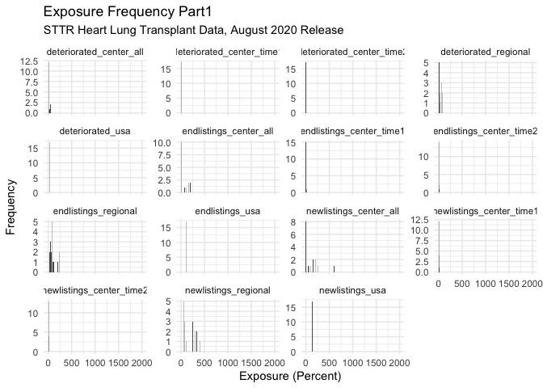<!-- -->

    ## Warning: Removed 30 rows containing non-finite values (stat_bin).

<!-- -->

    ## Warning: Removed 16 rows containing non-finite values (stat_bin).

<!-- -->

    ## Warning: Removed 16 rows containing non-finite values (stat_bin).

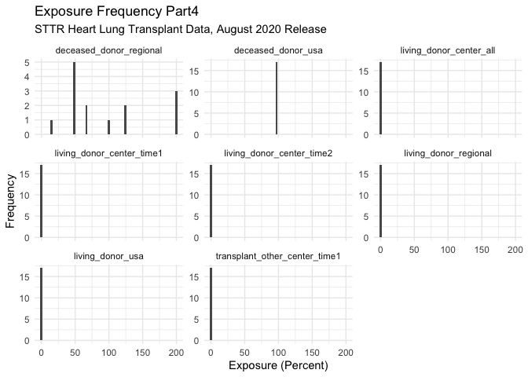<!-- -->

    ## Warning: Removed 18 rows containing non-finite values (stat_bin).

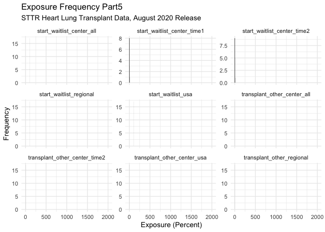<!-- -->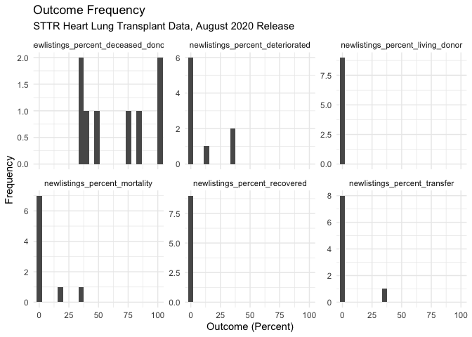<!-- --><!-- -->

    ## tibble [239 × 191] (S3: tbl_df/tbl/data.frame)
    ##  $ entire_name    : chr [1:239] "Center Name" "Hartford Hospital (CTHH)" "Yale New Haven Hospital (CTYN)" "Beth Israel Deaconess Medical Center (MABI)" ...
    ##  $ ctr_cd         : chr [1:239] "Center Code" "CTHH" "CTYN" "MABI" ...
    ##  $ ctr_ty         : chr [1:239] "Center Type" "TX1" "TX1" "TX1" ...
    ##  $ release_date   : chr [1:239] "Release Date" "44046.791666666664" "44046.791666666664" "44046.791666666664" ...
    ##  $ org            : chr [1:239] "Organ" "KI" "KI" "KI" ...
    ##  $ wlc_a10_allc2  : chr [1:239] "Age 2-11" "0.2857142857" "0.3053435115" "0" ...
    ##  $ wlc_a10_newc2  : chr [1:239] "Age 2-11" "0" "0.4255319149" "0" ...
    ##  $ wlc_a17_allc2  : chr [1:239] "Age 12-17" "1.7142857143" "0.9160305344" "0" ...
    ##  $ wlc_a17_newc2  : chr [1:239] "Age 12-17" "0.5494505495" "0.4255319149" "0" ...
    ##  $ wlc_a2_allc2   : chr [1:239] "Age < 2" "0" "0.1526717557" "0" ...
    ##  $ wlc_a2_newc2   : chr [1:239] "Age < 2" "0" "0" "0" ...
    ##  $ wlc_a34_allc2  : chr [1:239] "Age 18-34" "9.7142857143" "10.381679389" "7.0652173913" ...
    ##  $ wlc_a34_newc2  : chr [1:239] "Age 18-34" "7.1428571429" "12.765957447" "11.214953271" ...
    ##  $ wlc_a49_allc2  : chr [1:239] "Age 35-49" "23.714285714" "27.480916031" "26.358695652" ...
    ##  $ wlc_a49_newc2  : chr [1:239] "Age 35-49" "26.373626374" "26.808510638" "20.560747664" ...
    ##  $ wlc_a64_allc2  : chr [1:239] "Age 50-64" "43.428571429" "47.022900763" "52.717391304" ...
    ##  $ wlc_a64_newc2  : chr [1:239] "Age 50-64" "41.758241758" "40" "52.336448598" ...
    ##  $ wlc_a69_allc2  : chr [1:239] "Age 65-69" "14.857142857" "10.229007634" "13.315217391" ...
    ##  $ wlc_a69_newc2  : chr [1:239] "Age 65-69" "17.582417582" "13.191489362" "14.953271028" ...
    ##  $ wlc_a70p_allc2 : chr [1:239] "Age 70+" "6.2857142857" "3.5114503817" "0.5434782609" ...
    ##  $ wlc_a70p_newc2 : chr [1:239] "Age 70+" "6.5934065934" "6.3829787234" "0.9345794393" ...
    ##  $ wlc_all_allc2  : chr [1:239] "All" "100" "100" "100" ...
    ##  $ wlc_all_newc2  : chr [1:239] "All" "100" "100" "100" ...
    ##  $ wlc_bab_allc2  : chr [1:239] "Blood Type AB" "1.4285714286" "2.5954198473" "4.0760869565" ...
    ##  $ wlc_bab_newc2  : chr [1:239] "Blood Type AB" "3.8461538462" "2.1276595745" "6.5420560748" ...
    ##  $ wlc_ba_allc2   : chr [1:239] "Blood Type A" "29.714285714" "26.717557252" "29.619565217" ...
    ##  $ wlc_ba_newc2   : chr [1:239] "Blood Type A" "31.868131868" "33.191489362" "37.38317757" ...
    ##  $ wlc_bb_allc2   : chr [1:239] "Blood Type B" "18" "19.694656489" "16.847826087" ...
    ##  $ wlc_bb_newc2   : chr [1:239] "Blood Type B" "16.483516484" "15.319148936" "13.08411215" ...
    ##  $ wlc_bo_allc2   : chr [1:239] "Blood Type O" "50.857142857" "50.992366412" "49.456521739" ...
    ##  $ wlc_bo_newc2   : chr [1:239] "Blood Type O" "47.802197802" "49.361702128" "42.990654206" ...
    ##  $ wlc_bu_allc2   : chr [1:239] "Blood Type Unknown" "0" "0" "0" ...
    ##  $ wlc_bu_newc2   : chr [1:239] "Blood Type Unknown" "0" "0" "0" ...
    ##  $ wlc_gf_allc2   : chr [1:239] "Female" "41.428571429" "36.79389313" "37.5" ...
    ##  $ wlc_gf_newc2   : chr [1:239] "Female" "32.417582418" "39.574468085" "33.644859813" ...
    ##  $ wlc_gm_allc2   : chr [1:239] "Male" "58.571428571" "63.20610687" "62.5" ...
    ##  $ wlc_gm_newc2   : chr [1:239] "Male" "67.582417582" "60.425531915" "66.355140187" ...
    ##  $ wlc_gu_allc2   : chr [1:239] "Gender Unknown" "0" "0" "0" ...
    ##  $ wlc_gu_newc2   : chr [1:239] "Gender Unknown" "0" "0" "0" ...
    ##  $ wlc_hrcar_allc2: chr [1:239] "Cardiomyopathy" "-" "-" "-" ...
    ##  $ wlc_hrcar_newc2: chr [1:239] "Cardiomyopathy" "-" "-" "-" ...
    ##  $ wlc_hrcon_allc2: chr [1:239] "Congenital Heart Disease" "-" "-" "-" ...
    ##  $ wlc_hrcon_newc2: chr [1:239] "Congenital Heart Disease" "-" "-" "-" ...
    ##  $ wlc_hrcor_allc2: chr [1:239] "Coronary Artery Disease" "-" "-" "-" ...
    ##  $ wlc_hrcor_newc2: chr [1:239] "Coronary Artery Disease" "-" "-" "-" ...
    ##  $ wlc_hrmis_allc2: chr [1:239] "Primary Disease Missing" "-" "-" "-" ...
    ##  $ wlc_hrmis_newc2: chr [1:239] "Primary Disease Missing" "-" "-" "-" ...
    ##  $ wlc_hroth_allc2: chr [1:239] "Primary Disease Other" "-" "-" "-" ...
    ##  $ wlc_hroth_newc2: chr [1:239] "Primary Disease Other" "-" "-" "-" ...
    ##  $ wlc_hrrtr_allc2: chr [1:239] "Retransplant/Graft Failure" "-" "-" "-" ...
    ##  $ wlc_hrrtr_newc2: chr [1:239] "Retransplant/Graft Failure" "-" "-" "-" ...
    ##  $ wlc_hrvlv_allc2: chr [1:239] "Valvular Heart Disease" "-" "-" "-" ...
    ##  $ wlc_hrvlv_newc2: chr [1:239] "Valvular Heart Disease" "-" "-" "-" ...
    ##  $ wlc_infbp_allc2: chr [1:239] "Functional Bowel Problem" "-" "-" "-" ...
    ##  $ wlc_infbp_newc2: chr [1:239] "Functional Bowel Problem" "-" "-" "-" ...
    ##  $ wlc_inmis_allc2: chr [1:239] "Primary Disease Missing" "-" "-" "-" ...
    ##  $ wlc_inmis_newc2: chr [1:239] "Primary Disease Missing" "-" "-" "-" ...
    ##  $ wlc_inoth_allc2: chr [1:239] "Primary Disease Other" "-" "-" "-" ...
    ##  $ wlc_inoth_newc2: chr [1:239] "Primary Disease Other" "-" "-" "-" ...
    ##  $ wlc_inrtr_allc2: chr [1:239] "Retransplant/Graft Failure" "-" "-" "-" ...
    ##  $ wlc_inrtr_newc2: chr [1:239] "Retransplant/Graft Failure" "-" "-" "-" ...
    ##  $ wlc_insgs_allc2: chr [1:239] "Short Gut Syndrome" "-" "-" "-" ...
    ##  $ wlc_insgs_newc2: chr [1:239] "Short Gut Syndrome" "-" "-" "-" ...
    ##  $ wlc_kidia_allc2: chr [1:239] "Diabetes" "40.571428571" "36.183206107" "36.141304348" ...
    ##  $ wlc_kidia_newc2: chr [1:239] "Diabetes" "40.10989011" "28.510638298" "31.775700935" ...
    ##  $ wlc_kiglo_allc2: chr [1:239] "Glomerular Diseases" "19.428571429" "23.20610687" "19.836956522" ...
    ##  $ wlc_kiglo_newc2: chr [1:239] "Glomerular Diseases" "18.681318681" "26.808510638" "21.495327103" ...
    ##  $ wlc_kihyp_allc2: chr [1:239] "Hypertensive Nephrosclerosis" "18.571428571" "17.251908397" "20.923913043" ...
    ##  $ wlc_kihyp_newc2: chr [1:239] "Hypertensive Nephrosclerosis" "20.879120879" "17.872340426" "18.691588785" ...
    ##  $ wlc_kimis_allc2: chr [1:239] "Primary Disease Missing" "1.1428571429" "0.1526717557" "0.8152173913" ...
    ##  $ wlc_kimis_newc2: chr [1:239] "Primary Disease Missing" "0" "0" "0.9345794393" ...
    ##  $ wlc_kineo_allc2: chr [1:239] "Neoplasms" "0.5714285714" "0.7633587786" "0" ...
    ##  $ wlc_kineo_newc2: chr [1:239] "Neoplasms" "0" "1.7021276596" "0" ...
    ##  $ wlc_kioth_allc2: chr [1:239] "Primary Disease Other" "7.1428571429" "7.9389312977" "7.8804347826" ...
    ##  $ wlc_kioth_newc2: chr [1:239] "Primary Disease Other" "7.6923076923" "7.6595744681" "10.280373832" ...
    ##  $ wlc_kipol_allc2: chr [1:239] "Polycystic Kidneys" "8.8571428571" "6.8702290076" "8.6956521739" ...
    ##  $ wlc_kipol_newc2: chr [1:239] "Polycystic Kidneys" "8.2417582418" "8.9361702128" "6.5420560748" ...
    ##  $ wlc_kiren_allc2: chr [1:239] "Renovascular & Vascular Diseases" "0" "0.1526717557" "0.2717391304" ...
    ##  $ wlc_kiren_newc2: chr [1:239] "Renovascular & Vascular Diseases" "0" "0" "0.9345794393" ...
    ##  $ wlc_kirtr_allc2: chr [1:239] "Retransplant/Graft Failure" "0" "0" "0" ...
    ##  $ wlc_kirtr_newc2: chr [1:239] "Retransplant/Graft Failure" "0" "0" "0" ...
    ##  $ wlc_kitub_allc2: chr [1:239] "Tubular and Interstitial Diseases" "2.5714285714" "4.7328244275" "4.347826087" ...
    ##  $ wlc_kitub_newc2: chr [1:239] "Tubular and Interstitial Diseases" "2.7472527473" "5.5319148936" "5.6074766355" ...
    ##  $ wlc_liacu_allc2: chr [1:239] "Acute Hepatic Necrosis" "-" "-" "-" ...
    ##  $ wlc_liacu_newc2: chr [1:239] "Acute Hepatic Necrosis" "-" "-" "-" ...
    ##  $ wlc_libil_allc2: chr [1:239] "Biliary Atresia" "-" "-" "-" ...
    ##  $ wlc_libil_newc2: chr [1:239] "Biliary Atresia" "-" "-" "-" ...
    ##  $ wlc_licho_allc2: chr [1:239] "Cholestatic Liver Disease/Cirrhosis" "-" "-" "-" ...
    ##  $ wlc_licho_newc2: chr [1:239] "Cholestatic Liver Disease/Cirrhosis" "-" "-" "-" ...
    ##  $ wlc_limal_allc2: chr [1:239] "Malignant Neoplasms" "-" "-" "-" ...
    ##  $ wlc_limal_newc2: chr [1:239] "Malignant Neoplasms" "-" "-" "-" ...
    ##  $ wlc_limet_allc2: chr [1:239] "Metabolic Diseases" "-" "-" "-" ...
    ##  $ wlc_limet_newc2: chr [1:239] "Metabolic Diseases" "-" "-" "-" ...
    ##  $ wlc_limis_allc2: chr [1:239] "Primary Disease Missing" "-" "-" "-" ...
    ##  $ wlc_limis_newc2: chr [1:239] "Primary Disease Missing" "-" "-" "-" ...
    ##  $ wlc_linch_allc2: chr [1:239] "Non-Cholestatic Cirrhosis" "-" "-" "-" ...
    ##  $ wlc_linch_newc2: chr [1:239] "Non-Cholestatic Cirrhosis" "-" "-" "-" ...
    ##  $ wlc_lioth_allc2: chr [1:239] "Primary Disease Other" "-" "-" "-" ...
    ##  $ wlc_lioth_newc2: chr [1:239] "Primary Disease Other" "-" "-" "-" ...
    ##   [list output truncated]

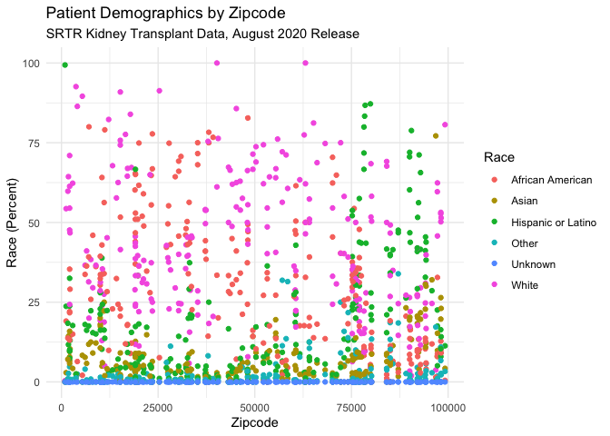<!-- --><!-- -->

    ## tibble [130 × 60] (S3: tbl_df/tbl/data.frame)
    ##  $ entire_name    : chr [1:130] "Center Name" "University of Alabama Hospital (ALUA)" "Banner-University Medical Center Phoenix (AZGS)" "Mayo Clinic Hospital (AZMC)" ...
    ##  $ ctr_cd         : chr [1:130] "Center Code" "ALUA" "AZGS" "AZMC" ...
    ##  $ ctr_ty         : chr [1:130] "Center Type" "TX1" "TX1" "TX1" ...
    ##  $ release_date   : chr [1:130] "Release Date" "44046.791666666664" "44046.791666666664" "44046.791666666664" ...
    ##  $ org            : chr [1:130] "Organ" "KP" "KP" "KP" ...
    ##  $ wla_addcen_nc1 : chr [1:130] "New Listings" "14" "5" "26" ...
    ##  $ wla_addcen_nc2 : chr [1:130] "New Listings" "10" "5" "20" ...
    ##  $ wla_addcen_pcz : chr [1:130] "New Listings" "111.11111111" "83.333333333" "111.11111111" ...
    ##  $ wla_addcen_prz : chr [1:130] "New Listings" "102.73224044" "60.948905109" "60.948905109" ...
    ##  $ wla_addcen_puz : chr [1:130] "New Listings" "88.955582233000001" "88.955582233000001" "88.955582233000001" ...
    ##  $ wla_end_nc1    : chr [1:130] "On waitlist at end" "9" "6" "18" ...
    ##  $ wla_end_nc2    : chr [1:130] "On waitlist at end" "6" "4" "13" ...
    ##  $ wla_end_pcz    : chr [1:130] "On waitlist at end" "66.666666667" "66.666666667" "72.222222222" ...
    ##  $ wla_end_prz    : chr [1:130] "On waitlist at end" "95.081967213" "95.255474453" "95.255474453" ...
    ##  $ wla_end_puz    : chr [1:130] "On waitlist at end" "104.86194478" "104.86194478" "104.86194478" ...
    ##  $ wla_remdet_nc1 : chr [1:130] "Deteriorated" "1" "0" "0" ...
    ##  $ wla_remdet_nc2 : chr [1:130] "Deteriorated" "0" "1" "0" ...
    ##  $ wla_remdet_pcz : chr [1:130] "Deteriorated" "0" "16.666666667" "0" ...
    ##  $ wla_remdet_prz : chr [1:130] "Deteriorated" "8.1967213115" "5.4744525547" "5.4744525547" ...
    ##  $ wla_remdet_puz : chr [1:130] "Deteriorated" "5.3421368546999997" "5.3421368546999997" "5.3421368546999997" ...
    ##  $ wla_remdied_nc1: chr [1:130] "Died" "1" "0" "0" ...
    ##  $ wla_remdied_nc2: chr [1:130] "Died" "1" "1" "1" ...
    ##  $ wla_remdied_pcz: chr [1:130] "Died" "11.111111111" "16.666666667" "5.5555555556" ...
    ##  $ wla_remdied_prz: chr [1:130] "Died" "7.1038251366" "4.7445255474" "4.7445255474" ...
    ##  $ wla_remdied_puz: chr [1:130] "Died" "4.6218487394999999" "4.6218487394999999" "4.6218487394999999" ...
    ##  $ wla_remoth_nc1 : chr [1:130] "Other Reasons" "2" "1" "2" ...
    ##  $ wla_remoth_nc2 : chr [1:130] "Other Reasons" "3" "1" "5" ...
    ##  $ wla_remoth_pcz : chr [1:130] "Other Reasons" "33.333333333" "16.666666667" "27.777777778" ...
    ##  $ wla_remoth_prz : chr [1:130] "Other Reasons" "11.475409836" "9.8540145985" "9.8540145985" ...
    ##  $ wla_remoth_puz : chr [1:130] "Other Reasons" "9.1836734694000004" "9.1836734694000004" "9.1836734694000004" ...
    ##  $ wla_remrec_nc1 : chr [1:130] "Recovered" "0" "0" "0" ...
    ##  $ wla_remrec_nc2 : chr [1:130] "Recovered" "0" "0" "0" ...
    ##  $ wla_remrec_pcz : chr [1:130] "Recovered" "0" "0" "0" ...
    ##  $ wla_remrec_prz : chr [1:130] "Recovered" "0" "0.3649635036" "0.3649635036" ...
    ##  $ wla_remrec_puz : chr [1:130] "Recovered" "0.54021608639999996" "0.54021608639999996" "0.54021608639999996" ...
    ##  $ wla_remtfer_nc1: chr [1:130] "Transferred to another center" "0" "1" "0" ...
    ##  $ wla_remtfer_nc2: chr [1:130] "Transferred to another center" "0" "0" "0" ...
    ##  $ wla_remtfer_pcz: chr [1:130] "Transferred to another center" "0" "0" "0" ...
    ##  $ wla_remtfer_prz: chr [1:130] "Transferred to another center" "2.1857923497" "1.4598540146" "1.4598540146" ...
    ##  $ wla_remtfer_puz: chr [1:130] "Transferred to another center" "1.2004801920999999" "1.2004801920999999" "1.2004801920999999" ...
    ##  $ wla_remtxc_nc1 : chr [1:130] "Received deceased donor tx" "6" "7" "21" ...
    ##  $ wla_remtxc_nc2 : chr [1:130] "Received deceased donor tx" "8" "4" "19" ...
    ##  $ wla_remtxc_pcz : chr [1:130] "Received deceased donor tx" "88.888888889" "66.666666667" "105.55555556" ...
    ##  $ wla_remtxc_prz : chr [1:130] "Received deceased donor tx" "74.316939891" "41.605839416" "41.605839416" ...
    ##  $ wla_remtxc_puz : chr [1:130] "Received deceased donor tx" "54.801920768000002" "54.801920768000002" "54.801920768000002" ...
    ##  $ wla_remtxl_nc1 : chr [1:130] "Received living donor tx" "2" "1" "0" ...
    ##  $ wla_remtxl_nc2 : chr [1:130] "Received living donor tx" "0" "0" "0" ...
    ##  $ wla_remtxl_pcz : chr [1:130] "Received living donor tx" "0" "0" "0" ...
    ##  $ wla_remtxl_prz : chr [1:130] "Received living donor tx" "0.5464480874" "0.3649635036" "0.3649635036" ...
    ##  $ wla_remtxl_puz : chr [1:130] "Received living donor tx" "3.6014405761999999" "3.6014405761999999" "3.6014405761999999" ...
    ##  $ wla_remtxoc_nc1: chr [1:130] "Transplanted at another center" "0" "0" "0" ...
    ##  $ wla_remtxoc_nc2: chr [1:130] "Transplanted at another center" "1" "0" "0" ...
    ##  $ wla_remtxoc_pcz: chr [1:130] "Transplanted at another center" "11.111111111" "0" "0" ...
    ##  $ wla_remtxoc_prz: chr [1:130] "Transplanted at another center" "3.825136612" "1.8248175182" "1.8248175182" ...
    ##  $ wla_remtxoc_puz: chr [1:130] "Transplanted at another center" "4.8019207682999996" "4.8019207682999996" "4.8019207682999996" ...
    ##  $ wla_st_nc1     : chr [1:130] "On waitlist at start" "7" "11" "15" ...
    ##  $ wla_st_nc2     : chr [1:130] "On waitlist at start" "9" "6" "18" ...
    ##  $ wla_st_pcz     : chr [1:130] "On waitlist at start" "100" "100" "100" ...
    ##  $ wla_st_prz     : chr [1:130] "On waitlist at start" "100" "100" "100" ...
    ##  $ wla_st_puz     : chr [1:130] "On waitlist at start" "100" "100" "100" ...

    ## Warning in lapply(X = X, FUN = FUN, ...): NAs introduced by coercion

    ## Warning in lapply(X = X, FUN = FUN, ...): NAs introduced by coercion

    ## Warning in lapply(X = X, FUN = FUN, ...): NAs introduced by coercion

    ## Warning in lapply(X = X, FUN = FUN, ...): NAs introduced by coercion

    ## Warning in lapply(X = X, FUN = FUN, ...): NAs introduced by coercion

    ## Warning in lapply(X = X, FUN = FUN, ...): NAs introduced by coercion

    ## Warning in lapply(X = X, FUN = FUN, ...): NAs introduced by coercion

    ## Warning in lapply(X = X, FUN = FUN, ...): NAs introduced by coercion

    ## Warning in lapply(X = X, FUN = FUN, ...): NAs introduced by coercion

    ## Warning in lapply(X = X, FUN = FUN, ...): NAs introduced by coercion

    ## Warning in lapply(X = X, FUN = FUN, ...): NAs introduced by coercion

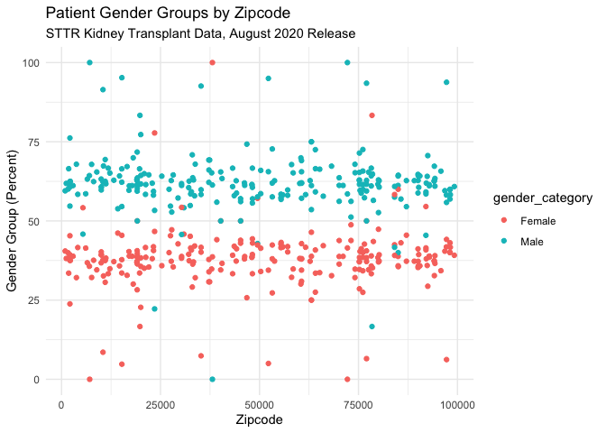<!-- -->

    ## tibble [123 × 60] (S3: tbl_df/tbl/data.frame)
    ##  $ entire_name                  : chr [1:123] "University of Alabama Hospital (ALUA)" "Banner-University Medical Center Phoenix (AZGS)" "Mayo Clinic Hospital (AZMC)" "Banner University Medical Center-Tucson (AZUA)" ...
    ##  $ ctr_cd                       : chr [1:123] "ALUA" "AZGS" "AZMC" "AZUA" ...
    ##  $ ctr_ty                       : chr [1:123] "TX1" "TX1" "TX1" "TX1" ...
    ##  $ release_date                 : num [1:123] 44047 44047 44047 44047 44047 ...
    ##  $ org                          : chr [1:123] "KP" "KP" "KP" "KP" ...
    ##  $ newlistings_center_time1     : num [1:123] 14 5 26 4 8 7 5 12 25 4 ...
    ##  $ newlistings_center_time2     : num [1:123] 10 5 20 2 7 7 6 8 20 0 ...
    ##  $ newlistings_center_all       : num [1:123] 111.1 83.3 111.1 100 77.8 ...
    ##  $ newlistings_regional         : num [1:123] 102.7 60.9 60.9 60.9 60.9 ...
    ##  $ newlistings_usa              : num [1:123] 89 89 89 89 89 ...
    ##  $ endlistings_center_time1     : num [1:123] 9 6 18 2 9 10 9 21 25 9 ...
    ##  $ endlistings_center_time2     : num [1:123] 6 4 13 1 7 11 9 16 25 4 ...
    ##  $ endlistings_center_all       : num [1:123] 66.7 66.7 72.2 50 77.8 ...
    ##  $ endlistings_regional         : num [1:123] 95.1 95.3 95.3 95.3 95.3 ...
    ##  $ endlistings_usa              : num [1:123] 105 105 105 105 105 ...
    ##  $ deteriorated_center_time1    : num [1:123] 1 0 0 0 0 1 0 0 1 0 ...
    ##  $ deteriorated_center_time2    : num [1:123] 0 1 0 0 0 1 1 0 3 1 ...
    ##  $ deteriorated_center_all      : num [1:123] 0 16.7 0 0 0 ...
    ##  $ deteriorated_regional        : num [1:123] 8.2 5.47 5.47 5.47 5.47 ...
    ##  $ deteriorated_usa             : num [1:123] 5.34 5.34 5.34 5.34 5.34 ...
    ##  $ died_center_time1            : num [1:123] 1 0 0 0 0 0 0 0 1 0 ...
    ##  $ died_center_time2            : num [1:123] 1 1 1 0 0 0 0 0 2 0 ...
    ##  $ died_center_all              : num [1:123] 11.11 16.67 5.56 0 0 ...
    ##  $ died_regional                : num [1:123] 7.1 4.74 4.74 4.74 4.74 ...
    ##  $ died_usa                     : num [1:123] 4.62 4.62 4.62 4.62 4.62 ...
    ##  $ other_center_time1           : num [1:123] 2 1 2 0 0 0 0 0 2 2 ...
    ##  $ other_center_time2           : num [1:123] 3 1 5 0 1 1 1 4 2 1 ...
    ##  $ other_center_all             : num [1:123] 33.3 16.7 27.8 0 11.1 ...
    ##  $ other_regional               : num [1:123] 11.48 9.85 9.85 9.85 9.85 ...
    ##  $ other_usa                    : num [1:123] 9.18 9.18 9.18 9.18 9.18 ...
    ##  $ recovered_center_time1       : num [1:123] 0 0 0 0 0 0 0 0 0 0 ...
    ##  $ recovered_center_time2       : num [1:123] 0 0 0 0 0 0 0 0 0 0 ...
    ##  $ recovered_center_all         : num [1:123] 0 0 0 0 0 0 0 0 0 0 ...
    ##  $ recovered_regional           : num [1:123] 0 0.365 0.365 0.365 0.365 ...
    ##  $ recovered_usa                : num [1:123] 0.54 0.54 0.54 0.54 0.54 ...
    ##  $ transfer_center_time1        : num [1:123] 0 1 0 0 0 0 0 0 0 0 ...
    ##  $ transfer_center_time2        : num [1:123] 0 0 0 0 0 0 0 0 0 1 ...
    ##  $ transfer_center_all          : num [1:123] 0 0 0 0 0 ...
    ##  $ transfer_regional            : num [1:123] 2.19 1.46 1.46 1.46 1.46 ...
    ##  $ transfer_usa                 : num [1:123] 1.2 1.2 1.2 1.2 1.2 ...
    ##  $ deceased_donor_center_time1  : num [1:123] 6 7 21 4 2 3 4 8 16 1 ...
    ##  $ deceased_donor_center_time2  : num [1:123] 8 4 19 3 8 4 4 8 13 0 ...
    ##  $ deceased_donor_center_all    : num [1:123] 88.9 66.7 105.6 150 88.9 ...
    ##  $ deceased_donor_regional      : num [1:123] 74.3 41.6 41.6 41.6 41.6 ...
    ##  $ deceased_donor_usa           : num [1:123] 54.8 54.8 54.8 54.8 54.8 ...
    ##  $ living_donor_center_time1    : num [1:123] 2 1 0 0 1 0 0 2 1 0 ...
    ##  $ living_donor_center_time2    : num [1:123] 0 0 0 0 0 0 0 1 0 0 ...
    ##  $ living_donor_center_all      : num [1:123] 0 0 0 0 0 ...
    ##  $ living_donor_regional        : num [1:123] 0.546 0.365 0.365 0.365 0.365 ...
    ##  $ living_donor_usa             : num [1:123] 3.6 3.6 3.6 3.6 3.6 ...
    ##  $ transplant_other_center_time1: num [1:123] 0 0 0 0 0 1 0 2 0 1 ...
    ##  $ transplant_other_center_time2: num [1:123] 1 0 0 0 0 0 0 0 0 2 ...
    ##  $ transplant_other_center_all  : num [1:123] 11.1 0 0 0 0 ...
    ##  $ transplant_other_regional    : num [1:123] 3.83 1.82 1.82 1.82 1.82 ...
    ##  $ transplant_other_center_usa  : num [1:123] 4.8 4.8 4.8 4.8 4.8 ...
    ##  $ start_waitlist_center_time1  : num [1:123] 7 11 15 2 4 8 8 21 21 9 ...
    ##  $ start_waitlist_center_time2  : num [1:123] 9 6 18 2 9 10 9 21 25 9 ...
    ##  $ start_waitlist_center_all    : num [1:123] 100 100 100 100 100 100 100 100 100 100 ...
    ##  $ start_waitlist_regional      : num [1:123] 100 100 100 100 100 100 100 100 100 100 ...
    ##  $ start_waitlist_usa           : num [1:123] 100 100 100 100 100 100 100 100 100 100 ...

    ## Warning: Removed 1725 rows containing non-finite values (stat_bin).

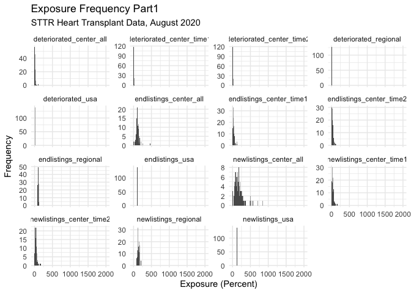<!-- -->

    ## Warning: Removed 1725 rows containing non-finite values (stat_bin).

<!-- -->

    ## Warning: Removed 920 rows containing non-finite values (stat_bin).

<!-- -->

    ## Warning: Removed 920 rows containing non-finite values (stat_bin).

<!-- -->

    ## Warning: Removed 1035 rows containing non-finite values (stat_bin).

<!-- -->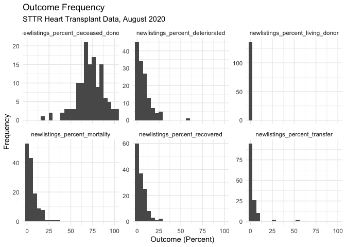<!-- -->

    ## tibble [127 × 191] (S3: tbl_df/tbl/data.frame)
    ##  $ entire_name    : chr [1:127] "Center Name" "Yale New Haven Hospital (CTYN)" "Beth Israel Deaconess Medical Center (MABI)" "Massachusetts General Hospital (MAMG)" ...
    ##  $ ctr_cd         : chr [1:127] "Center Code" "CTYN" "MABI" "MAMG" ...
    ##  $ ctr_ty         : chr [1:127] "Center Type" "TX1" "TX1" "TX1" ...
    ##  $ release_date   : chr [1:127] "Release Date" "44046.791666666664" "44046.791666666664" "44046.791666666664" ...
    ##  $ org            : chr [1:127] "Organ" "KP" "KP" "KP" ...
    ##  $ wlc_a10_allc2  : chr [1:127] "Age 2-11" "0" "0" "0" ...
    ##  $ wlc_a10_newc2  : chr [1:127] "Age 2-11" "-" "0" "0" ...
    ##  $ wlc_a17_allc2  : chr [1:127] "Age 12-17" "0" "0" "0" ...
    ##  $ wlc_a17_newc2  : chr [1:127] "Age 12-17" "-" "0" "0" ...
    ##  $ wlc_a2_allc2   : chr [1:127] "Age < 2" "0" "0" "0" ...
    ##  $ wlc_a2_newc2   : chr [1:127] "Age < 2" "-" "0" "0" ...
    ##  $ wlc_a34_allc2  : chr [1:127] "Age 18-34" "100" "20.689655172" "50" ...
    ##  $ wlc_a34_newc2  : chr [1:127] "Age 18-34" "-" "13.333333333" "14.285714286" ...
    ##  $ wlc_a49_allc2  : chr [1:127] "Age 35-49" "0" "68.965517241" "50" ...
    ##  $ wlc_a49_newc2  : chr [1:127] "Age 35-49" "-" "73.333333333" "85.714285714" ...
    ##  $ wlc_a64_allc2  : chr [1:127] "Age 50-64" "0" "10.344827586" "0" ...
    ##  $ wlc_a64_newc2  : chr [1:127] "Age 50-64" "-" "13.333333333" "0" ...
    ##  $ wlc_a69_allc2  : chr [1:127] "Age 65-69" "0" "0" "0" ...
    ##  $ wlc_a69_newc2  : chr [1:127] "Age 65-69" "-" "0" "0" ...
    ##  $ wlc_a70p_allc2 : chr [1:127] "Age 70+" "0" "0" "0" ...
    ##  $ wlc_a70p_newc2 : chr [1:127] "Age 70+" "-" "0" "0" ...
    ##  $ wlc_all_allc2  : chr [1:127] "All" "100" "100" "100" ...
    ##  $ wlc_all_newc2  : chr [1:127] "All" "-" "100" "100" ...
    ##  $ wlc_bab_allc2  : chr [1:127] "Blood Type AB" "0" "6.8965517241" "0" ...
    ##  $ wlc_bab_newc2  : chr [1:127] "Blood Type AB" "-" "6.6666666667" "0" ...
    ##  $ wlc_ba_allc2   : chr [1:127] "Blood Type A" "0" "31.034482759" "33.333333333" ...
    ##  $ wlc_ba_newc2   : chr [1:127] "Blood Type A" "-" "33.333333333" "57.142857143" ...
    ##  $ wlc_bb_allc2   : chr [1:127] "Blood Type B" "100" "17.24137931" "0" ...
    ##  $ wlc_bb_newc2   : chr [1:127] "Blood Type B" "-" "6.6666666667" "0" ...
    ##  $ wlc_bo_allc2   : chr [1:127] "Blood Type O" "0" "44.827586207" "66.666666667" ...
    ##  $ wlc_bo_newc2   : chr [1:127] "Blood Type O" "-" "53.333333333" "42.857142857" ...
    ##  $ wlc_bu_allc2   : chr [1:127] "Blood Type Unknown" "0" "0" "0" ...
    ##  $ wlc_bu_newc2   : chr [1:127] "Blood Type Unknown" "-" "0" "0" ...
    ##  $ wlc_gf_allc2   : chr [1:127] "Female" "100" "48.275862069" "33.333333333" ...
    ##  $ wlc_gf_newc2   : chr [1:127] "Female" "-" "26.666666667" "28.571428571" ...
    ##  $ wlc_gm_allc2   : chr [1:127] "Male" "0" "51.724137931" "66.666666667" ...
    ##  $ wlc_gm_newc2   : chr [1:127] "Male" "-" "73.333333333" "71.428571429" ...
    ##  $ wlc_gu_allc2   : chr [1:127] "Gender Unknown" "0" "0" "0" ...
    ##  $ wlc_gu_newc2   : chr [1:127] "Gender Unknown" "-" "0" "0" ...
    ##  $ wlc_hrcar_allc2: chr [1:127] "Cardiomyopathy" "-" "-" "-" ...
    ##  $ wlc_hrcar_newc2: chr [1:127] "Cardiomyopathy" "-" "-" "-" ...
    ##  $ wlc_hrcon_allc2: chr [1:127] "Congenital Heart Disease" "-" "-" "-" ...
    ##  $ wlc_hrcon_newc2: chr [1:127] "Congenital Heart Disease" "-" "-" "-" ...
    ##  $ wlc_hrcor_allc2: chr [1:127] "Coronary Artery Disease" "-" "-" "-" ...
    ##  $ wlc_hrcor_newc2: chr [1:127] "Coronary Artery Disease" "-" "-" "-" ...
    ##  $ wlc_hrmis_allc2: chr [1:127] "Primary Disease Missing" "-" "-" "-" ...
    ##  $ wlc_hrmis_newc2: chr [1:127] "Primary Disease Missing" "-" "-" "-" ...
    ##  $ wlc_hroth_allc2: chr [1:127] "Primary Disease Other" "-" "-" "-" ...
    ##  $ wlc_hroth_newc2: chr [1:127] "Primary Disease Other" "-" "-" "-" ...
    ##  $ wlc_hrrtr_allc2: chr [1:127] "Retransplant/Graft Failure" "-" "-" "-" ...
    ##  $ wlc_hrrtr_newc2: chr [1:127] "Retransplant/Graft Failure" "-" "-" "-" ...
    ##  $ wlc_hrvlv_allc2: chr [1:127] "Valvular Heart Disease" "-" "-" "-" ...
    ##  $ wlc_hrvlv_newc2: chr [1:127] "Valvular Heart Disease" "-" "-" "-" ...
    ##  $ wlc_infbp_allc2: chr [1:127] "Functional Bowel Problem" "-" "-" "-" ...
    ##  $ wlc_infbp_newc2: chr [1:127] "Functional Bowel Problem" "-" "-" "-" ...
    ##  $ wlc_inmis_allc2: chr [1:127] "Primary Disease Missing" "-" "-" "-" ...
    ##  $ wlc_inmis_newc2: chr [1:127] "Primary Disease Missing" "-" "-" "-" ...
    ##  $ wlc_inoth_allc2: chr [1:127] "Primary Disease Other" "-" "-" "-" ...
    ##  $ wlc_inoth_newc2: chr [1:127] "Primary Disease Other" "-" "-" "-" ...
    ##  $ wlc_inrtr_allc2: chr [1:127] "Retransplant/Graft Failure" "-" "-" "-" ...
    ##  $ wlc_inrtr_newc2: chr [1:127] "Retransplant/Graft Failure" "-" "-" "-" ...
    ##  $ wlc_insgs_allc2: chr [1:127] "Short Gut Syndrome" "-" "-" "-" ...
    ##  $ wlc_insgs_newc2: chr [1:127] "Short Gut Syndrome" "-" "-" "-" ...
    ##  $ wlc_kidia_allc2: chr [1:127] "Diabetes" "-" "-" "-" ...
    ##  $ wlc_kidia_newc2: chr [1:127] "Diabetes" "-" "-" "-" ...
    ##  $ wlc_kiglo_allc2: chr [1:127] "Glomerular Diseases" "-" "-" "-" ...
    ##  $ wlc_kiglo_newc2: chr [1:127] "Glomerular Diseases" "-" "-" "-" ...
    ##  $ wlc_kihyp_allc2: chr [1:127] "Hypertensive Nephrosclerosis" "-" "-" "-" ...
    ##  $ wlc_kihyp_newc2: chr [1:127] "Hypertensive Nephrosclerosis" "-" "-" "-" ...
    ##  $ wlc_kimis_allc2: chr [1:127] "Primary Disease Missing" "-" "-" "-" ...
    ##  $ wlc_kimis_newc2: chr [1:127] "Primary Disease Missing" "-" "-" "-" ...
    ##  $ wlc_kineo_allc2: chr [1:127] "Neoplasms" "-" "-" "-" ...
    ##  $ wlc_kineo_newc2: chr [1:127] "Neoplasms" "-" "-" "-" ...
    ##  $ wlc_kioth_allc2: chr [1:127] "Primary Disease Other" "-" "-" "-" ...
    ##  $ wlc_kioth_newc2: chr [1:127] "Primary Disease Other" "-" "-" "-" ...
    ##  $ wlc_kipol_allc2: chr [1:127] "Polycystic Kidneys" "-" "-" "-" ...
    ##  $ wlc_kipol_newc2: chr [1:127] "Polycystic Kidneys" "-" "-" "-" ...
    ##  $ wlc_kiren_allc2: chr [1:127] "Renovascular & Vascular Diseases" "-" "-" "-" ...
    ##  $ wlc_kiren_newc2: chr [1:127] "Renovascular & Vascular Diseases" "-" "-" "-" ...
    ##  $ wlc_kirtr_allc2: chr [1:127] "Retransplant/Graft Failure" "-" "-" "-" ...
    ##  $ wlc_kirtr_newc2: chr [1:127] "Retransplant/Graft Failure" "-" "-" "-" ...
    ##  $ wlc_kitub_allc2: chr [1:127] "Tubular and Interstitial Diseases" "-" "-" "-" ...
    ##  $ wlc_kitub_newc2: chr [1:127] "Tubular and Interstitial Diseases" "-" "-" "-" ...
    ##  $ wlc_liacu_allc2: chr [1:127] "Acute Hepatic Necrosis" "-" "-" "-" ...
    ##  $ wlc_liacu_newc2: chr [1:127] "Acute Hepatic Necrosis" "-" "-" "-" ...
    ##  $ wlc_libil_allc2: chr [1:127] "Biliary Atresia" "-" "-" "-" ...
    ##  $ wlc_libil_newc2: chr [1:127] "Biliary Atresia" "-" "-" "-" ...
    ##  $ wlc_licho_allc2: chr [1:127] "Cholestatic Liver Disease/Cirrhosis" "-" "-" "-" ...
    ##  $ wlc_licho_newc2: chr [1:127] "Cholestatic Liver Disease/Cirrhosis" "-" "-" "-" ...
    ##  $ wlc_limal_allc2: chr [1:127] "Malignant Neoplasms" "-" "-" "-" ...
    ##  $ wlc_limal_newc2: chr [1:127] "Malignant Neoplasms" "-" "-" "-" ...
    ##  $ wlc_limet_allc2: chr [1:127] "Metabolic Diseases" "-" "-" "-" ...
    ##  $ wlc_limet_newc2: chr [1:127] "Metabolic Diseases" "-" "-" "-" ...
    ##  $ wlc_limis_allc2: chr [1:127] "Primary Disease Missing" "-" "-" "-" ...
    ##  $ wlc_limis_newc2: chr [1:127] "Primary Disease Missing" "-" "-" "-" ...
    ##  $ wlc_linch_allc2: chr [1:127] "Non-Cholestatic Cirrhosis" "-" "-" "-" ...
    ##  $ wlc_linch_newc2: chr [1:127] "Non-Cholestatic Cirrhosis" "-" "-" "-" ...
    ##  $ wlc_lioth_allc2: chr [1:127] "Primary Disease Other" "-" "-" "-" ...
    ##  $ wlc_lioth_newc2: chr [1:127] "Primary Disease Other" "-" "-" "-" ...
    ##   [list output truncated]

    ## Warning in mask$eval_all_mutate(quo): NAs introduced by coercion

<!-- -->

    ## Warning: Removed 12 rows containing missing values (geom_point).

    ## Warning in mask$eval_all_mutate(quo): NAs introduced by coercion

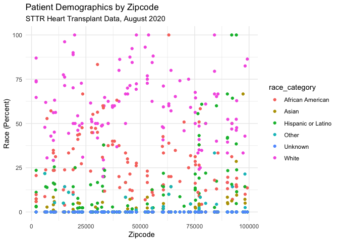<!-- -->

    ## Warning in mask$eval_all_mutate(quo): NAs introduced by coercion

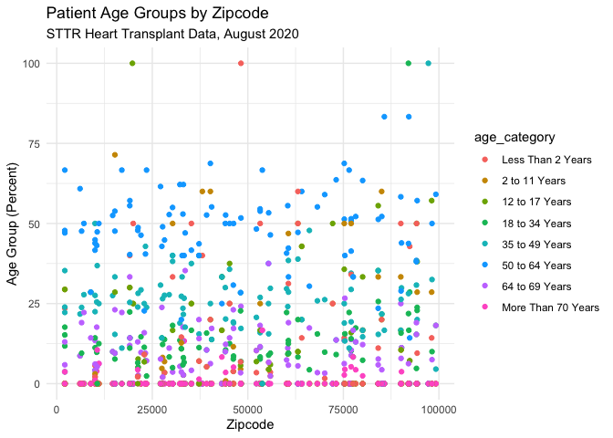<!-- -->

    ## Warning: Removed 4 rows containing missing values (geom_point).

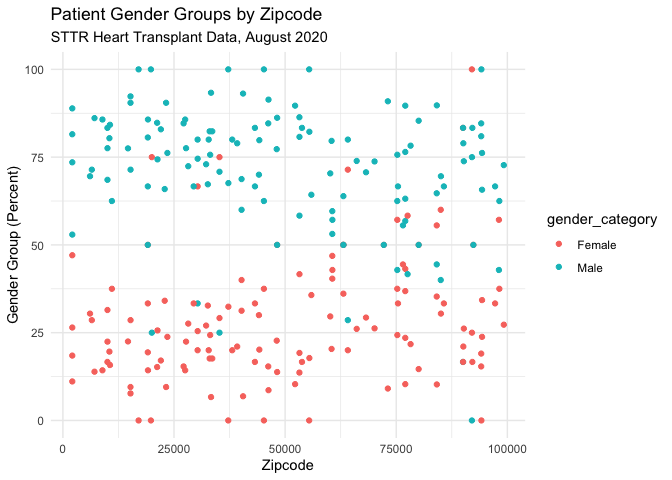<!-- -->
