KidneyDataMS
================
Matthew Spotnitz
10/26/2021

\#Import and view.

I will import the kidney data set, clean its column names, and examine
the structure, head, and tail of the data set. Then, I will view the
data set.

``` r
df_one = read_excel("../data/csrs_final_tables_2006_KI.xls", sheet = "Table B1")
df_one = janitor::clean_names(df_one)
str(df_one)
```

    ## tibble [240 × 60] (S3: tbl_df/tbl/data.frame)
    ##  $ entire_name    : chr [1:240] "Center Name" "Children's of Alabama (ALCH)" "University of Alabama Hospital (ALUA)" "Birmingham VA Medical Center (ALVA)" ...
    ##  $ ctr_cd         : chr [1:240] "Center Code" "ALCH" "ALUA" "ALVA" ...
    ##  $ ctr_ty         : chr [1:240] "Center Type" "TX1" "TX1" "TX1" ...
    ##  $ release_date   : chr [1:240] "Release Date" "44046.791666666664" "44046.791666666664" "44046.791666666664" ...
    ##  $ org            : chr [1:240] "Organ" "KI" "KI" "KI" ...
    ##  $ wla_addcen_nc1 : chr [1:240] "New Listings" "13" "426" "36" ...
    ##  $ wla_addcen_nc2 : chr [1:240] "New Listings" "7" "447" "35" ...
    ##  $ wla_addcen_pcz : chr [1:240] "New Listings" "35" "26.766467066" "52.23880597" ...
    ##  $ wla_addcen_prz : chr [1:240] "New Listings" "41.814623235" "41.814623235" "41.814623235" ...
    ##  $ wla_addcen_puz : chr [1:240] "New Listings" "42.165757431999999" "42.165757431999999" "42.165757431999999" ...
    ##  $ wla_end_nc1    : chr [1:240] "On waitlist at end" "20" "1670" "67" ...
    ##  $ wla_end_nc2    : chr [1:240] "On waitlist at end" "12" "1166" "81" ...
    ##  $ wla_end_pcz    : chr [1:240] "On waitlist at end" "60" "69.820359281" "120.89552239" ...
    ##  $ wla_end_prz    : chr [1:240] "On waitlist at end" "95.994687544" "95.994687544" "95.994687544" ...
    ##  $ wla_end_puz    : chr [1:240] "On waitlist at end" "100.24608634000001" "100.24608634000001" "100.24608634000001" ...
    ##  $ wla_remdet_nc1 : chr [1:240] "Deteriorated" "0" "42" "3" ...
    ##  $ wla_remdet_nc2 : chr [1:240] "Deteriorated" "0" "50" "2" ...
    ##  $ wla_remdet_pcz : chr [1:240] "Deteriorated" "0" "2.994011976" "2.9850746269" ...
    ##  $ wla_remdet_prz : chr [1:240] "Deteriorated" "4.0682231232" "4.0682231232" "4.0682231232" ...
    ##  $ wla_remdet_puz : chr [1:240] "Deteriorated" "4.1735847565000004" "4.1735847565000004" "4.1735847565000004" ...
    ##  $ wla_remdied_nc1: chr [1:240] "Died" "2" "162" "3" ...
    ##  $ wla_remdied_nc2: chr [1:240] "Died" "0" "63" "3" ...
    ##  $ wla_remdied_pcz: chr [1:240] "Died" "0" "3.7724550898" "4.4776119403" ...
    ##  $ wla_remdied_prz: chr [1:240] "Died" "3.8235705298" "3.8235705298" "3.8235705298" ...
    ##  $ wla_remdied_puz: chr [1:240] "Died" "3.8316334597999999" "3.8316334597999999" "3.8316334597999999" ...
    ##  $ wla_remoth_nc1 : chr [1:240] "Other Reasons" "0" "379" "1" ...
    ##  $ wla_remoth_nc2 : chr [1:240] "Other Reasons" "2" "491" "0" ...
    ##  $ wla_remoth_pcz : chr [1:240] "Other Reasons" "10" "29.401197605" "0" ...
    ##  $ wla_remoth_prz : chr [1:240] "Other Reasons" "9.5344610653" "9.5344610653" "9.5344610653" ...
    ##  $ wla_remoth_puz : chr [1:240] "Other Reasons" "5.3723908918000003" "5.3723908918000003" "5.3723908918000003" ...
    ##  $ wla_remrec_nc1 : chr [1:240] "Recovered" "0" "0" "0" ...
    ##  $ wla_remrec_nc2 : chr [1:240] "Recovered" "0" "6" "0" ...
    ##  $ wla_remrec_pcz : chr [1:240] "Recovered" "0" "0.3592814371" "0" ...
    ##  $ wla_remrec_prz : chr [1:240] "Recovered" "0.1188312596" "0.1188312596" "0.1188312596" ...
    ##  $ wla_remrec_puz : chr [1:240] "Recovered" "0.19963630609999999" "0.19963630609999999" "0.19963630609999999" ...
    ##  $ wla_remtfer_nc1: chr [1:240] "Transferred to another center" "1" "3" "1" ...
    ##  $ wla_remtfer_nc2: chr [1:240] "Transferred to another center" "2" "1" "0" ...
    ##  $ wla_remtfer_pcz: chr [1:240] "Transferred to another center" "10" "0.0598802395" "0" ...
    ##  $ wla_remtfer_prz: chr [1:240] "Transferred to another center" "0.6221165944" "0.6221165944" "0.6221165944" ...
    ##  $ wla_remtfer_puz: chr [1:240] "Transferred to another center" "1.4409392789" "1.4409392789" "1.4409392789" ...
    ##  $ wla_remtxc_nc1 : chr [1:240] "Received deceased donor tx" "11" "170" "5" ...
    ##  $ wla_remtxc_nc2 : chr [1:240] "Received deceased donor tx" "7" "203" "7" ...
    ##  $ wla_remtxc_pcz : chr [1:240] "Received deceased donor tx" "35" "12.155688623" "10.447761194" ...
    ##  $ wla_remtxc_prz : chr [1:240] "Received deceased donor tx" "17.398294422" "17.398294422" "17.398294422" ...
    ##  $ wla_remtxc_puz : chr [1:240] "Received deceased donor tx" "16.302972801999999" "16.302972801999999" "16.302972801999999" ...
    ##  $ wla_remtxl_nc1 : chr [1:240] "Received living donor tx" "3" "84" "0" ...
    ##  $ wla_remtxl_nc2 : chr [1:240] "Received living donor tx" "4" "75" "0" ...
    ##  $ wla_remtxl_pcz : chr [1:240] "Received living donor tx" "20" "4.4910179641" "0" ...
    ##  $ wla_remtxl_prz : chr [1:240] "Received living donor tx" "5.5431287572" "5.5431287572" "5.5431287572" ...
    ##  $ wla_remtxl_puz : chr [1:240] "Received living donor tx" "6.7273481973000004" "6.7273481973000004" "6.7273481973000004" ...
    ##  $ wla_remtxoc_nc1: chr [1:240] "Transplanted at another center" "0" "68" "6" ...
    ##  $ wla_remtxoc_nc2: chr [1:240] "Transplanted at another center" "0" "62" "9" ...
    ##  $ wla_remtxoc_pcz: chr [1:240] "Transplanted at another center" "0" "3.7125748503" "13.432835821" ...
    ##  $ wla_remtxoc_prz: chr [1:240] "Transplanted at another center" "4.7113099399" "4.7113099399" "4.7113099399" ...
    ##  $ wla_remtxoc_puz: chr [1:240] "Transplanted at another center" "3.8711654015999999" "3.8711654015999999" "3.8711654015999999" ...
    ##  $ wla_st_nc1     : chr [1:240] "On waitlist at start" "24" "2152" "50" ...
    ##  $ wla_st_nc2     : chr [1:240] "On waitlist at start" "20" "1670" "67" ...
    ##  $ wla_st_pcz     : chr [1:240] "On waitlist at start" "100" "100" "100" ...
    ##  $ wla_st_prz     : chr [1:240] "On waitlist at start" "100" "100" "100" ...
    ##  $ wla_st_puz     : chr [1:240] "On waitlist at start" "100" "100" "100" ...

``` r
head(df_one)
```

    ## # A tibble: 6 × 60
    ##   entire_name    ctr_cd  ctr_ty release_date org   wla_addcen_nc1 wla_addcen_nc2
    ##   <chr>          <chr>   <chr>  <chr>        <chr> <chr>          <chr>         
    ## 1 Center Name    Center… Cente… Release Date Organ New Listings   New Listings  
    ## 2 Children's of… ALCH    TX1    44046.79166… KI    13             7             
    ## 3 University of… ALUA    TX1    44046.79166… KI    426            447           
    ## 4 Birmingham VA… ALVA    TX1    44046.79166… KI    36             35            
    ## 5 Arkansas Chil… ARCH    TX1    44046.79166… KI    14             5             
    ## 6 UAMS Medical … ARUA    TX1    44046.79166… KI    145            188           
    ## # … with 53 more variables: wla_addcen_pcz <chr>, wla_addcen_prz <chr>,
    ## #   wla_addcen_puz <chr>, wla_end_nc1 <chr>, wla_end_nc2 <chr>,
    ## #   wla_end_pcz <chr>, wla_end_prz <chr>, wla_end_puz <chr>,
    ## #   wla_remdet_nc1 <chr>, wla_remdet_nc2 <chr>, wla_remdet_pcz <chr>,
    ## #   wla_remdet_prz <chr>, wla_remdet_puz <chr>, wla_remdied_nc1 <chr>,
    ## #   wla_remdied_nc2 <chr>, wla_remdied_pcz <chr>, wla_remdied_prz <chr>,
    ## #   wla_remdied_puz <chr>, wla_remoth_nc1 <chr>, wla_remoth_nc2 <chr>, …

``` r
tail(df_one)
```

    ## # A tibble: 6 × 60
    ##   entire_name     ctr_cd ctr_ty release_date org   wla_addcen_nc1 wla_addcen_nc2
    ##   <chr>           <chr>  <chr>  <chr>        <chr> <chr>          <chr>         
    ## 1 Virginia Mason… WAVM   TX1    44046.79166… KI    105            150           
    ## 2 Children's Hos… WICH   TX1    44046.79166… KI    10             10            
    ## 3 Froedtert Memo… WISE   TX1    44046.79166… KI    190            106           
    ## 4 Aurora St. Luk… WISL   TX1    44046.79166… KI    82             79            
    ## 5 University of … WIUW   TX1    44046.79166… KI    407            451           
    ## 6 Charleston Are… WVCA   TX1    44046.79166… KI    65             83            
    ## # … with 53 more variables: wla_addcen_pcz <chr>, wla_addcen_prz <chr>,
    ## #   wla_addcen_puz <chr>, wla_end_nc1 <chr>, wla_end_nc2 <chr>,
    ## #   wla_end_pcz <chr>, wla_end_prz <chr>, wla_end_puz <chr>,
    ## #   wla_remdet_nc1 <chr>, wla_remdet_nc2 <chr>, wla_remdet_pcz <chr>,
    ## #   wla_remdet_prz <chr>, wla_remdet_puz <chr>, wla_remdied_nc1 <chr>,
    ## #   wla_remdied_nc2 <chr>, wla_remdied_pcz <chr>, wla_remdied_prz <chr>,
    ## #   wla_remdied_puz <chr>, wla_remoth_nc1 <chr>, wla_remoth_nc2 <chr>, …

``` r
view(df_one)
```

\#Change column names I will change the column names to more intuitive
ones

``` r
df_one_names = df_one %>% rename(newlistings_center_time1 = wla_addcen_nc1, newlistings_center_time2 = wla_addcen_nc2, newlistings_center_all = wla_addcen_pcz,newlistings_regional = wla_addcen_prz, newlistings_usa = wla_addcen_puz)  %>% rename( endlistings_center_time1 = wla_end_nc1, endlistings_center_time2 = wla_end_nc2, endlistings_center_all = wla_end_pcz, endlistings_regional = wla_end_prz, endlistings_usa = wla_end_puz) %>% rename(deteriorated_center_time1 = wla_remdet_nc1, deteriorated_center_time2 = wla_remdet_nc2, deteriorated_center_all = wla_remdet_pcz, deteriorated_regional = wla_remdet_prz, deteriorated_usa = wla_remdet_puz) %>% rename( died_center_time1 = wla_remdied_nc1, died_center_time2 = wla_remdied_nc2, died_center_all = wla_remdied_pcz, died_regional = wla_remdied_prz, died_usa = wla_remdied_puz) %>% rename(other_center_time1 = wla_remoth_nc1, other_center_time2 = wla_remoth_nc2, other_center_all = wla_remoth_pcz, other_regional = wla_remoth_prz, other_usa = wla_remoth_puz) %>% rename( recovered_center_time1 = wla_remrec_nc1, recovered_center_time2 = wla_remrec_nc2, recovered_center_all = wla_remrec_pcz, recovered_regional = wla_remrec_prz, recovered_usa = wla_remrec_puz) %>% rename(transfer_center_time1 = wla_remtfer_nc1, transfer_center_time2 = wla_remtfer_nc2, transfer_center_all = wla_remtfer_pcz, transfer_regional = wla_remtfer_prz, transfer_usa = wla_remtfer_puz) %>% rename(deceased_donor_center_time1 = wla_remtxc_nc1, deceased_donor_center_time2 = wla_remtxc_nc2, deceased_donor_center_all = wla_remtxc_pcz, deceased_donor_regional = wla_remtxc_prz, deceased_donor_usa = wla_remtxc_puz) %>% rename(living_donor_center_time1 = wla_remtxl_nc1, living_donor_center_time2 = wla_remtxl_nc2, living_donor_center_all = wla_remtxl_pcz, living_donor_regional = wla_remtxl_prz, living_donor_usa = wla_remtxl_puz) %>% rename(transplant_other_center_time1 = wla_remtxoc_nc1, transplant_other_center_time2 = wla_remtxoc_nc2, transplant_other_center_all = wla_remtxoc_pcz, transplant_other_regional = wla_remtxoc_prz, transplant_other_center_usa = wla_remtxoc_puz) %>% rename(start_waitlist_center_time1 = wla_st_nc1, start_waitlist_center_time2 = wla_st_nc2, start_waitlist_center_all = wla_st_pcz, start_waitlist_regional = wla_st_prz, start_waitlist_usa = wla_st_puz) %>% view() 
```

I will delete an extraneous row and drop missing values

``` r
df_one_names = df_one_names[-c(1), ]
str(df_one_names)
```

    ## tibble [239 × 60] (S3: tbl_df/tbl/data.frame)
    ##  $ entire_name                  : chr [1:239] "Children's of Alabama (ALCH)" "University of Alabama Hospital (ALUA)" "Birmingham VA Medical Center (ALVA)" "Arkansas Children's Hospital (ARCH)" ...
    ##  $ ctr_cd                       : chr [1:239] "ALCH" "ALUA" "ALVA" "ARCH" ...
    ##  $ ctr_ty                       : chr [1:239] "TX1" "TX1" "TX1" "TX1" ...
    ##  $ release_date                 : chr [1:239] "44046.791666666664" "44046.791666666664" "44046.791666666664" "44046.791666666664" ...
    ##  $ org                          : chr [1:239] "KI" "KI" "KI" "KI" ...
    ##  $ newlistings_center_time1     : chr [1:239] "13" "426" "36" "14" ...
    ##  $ newlistings_center_time2     : chr [1:239] "7" "447" "35" "5" ...
    ##  $ newlistings_center_all       : chr [1:239] "35" "26.766467066" "52.23880597" "125" ...
    ##  $ newlistings_regional         : chr [1:239] "41.814623235" "41.814623235" "41.814623235" "41.814623235" ...
    ##  $ newlistings_usa              : chr [1:239] "42.165757431999999" "42.165757431999999" "42.165757431999999" "42.165757431999999" ...
    ##  $ endlistings_center_time1     : chr [1:239] "20" "1670" "67" "4" ...
    ##  $ endlistings_center_time2     : chr [1:239] "12" "1166" "81" "4" ...
    ##  $ endlistings_center_all       : chr [1:239] "60" "69.820359281" "120.89552239" "100" ...
    ##  $ endlistings_regional         : chr [1:239] "95.994687544" "95.994687544" "95.994687544" "95.994687544" ...
    ##  $ endlistings_usa              : chr [1:239] "100.24608634000001" "100.24608634000001" "100.24608634000001" "100.24608634000001" ...
    ##  $ deteriorated_center_time1    : chr [1:239] "0" "42" "3" "0" ...
    ##  $ deteriorated_center_time2    : chr [1:239] "0" "50" "2" "0" ...
    ##  $ deteriorated_center_all      : chr [1:239] "0" "2.994011976" "2.9850746269" "0" ...
    ##  $ deteriorated_regional        : chr [1:239] "4.0682231232" "4.0682231232" "4.0682231232" "4.0682231232" ...
    ##  $ deteriorated_usa             : chr [1:239] "4.1735847565000004" "4.1735847565000004" "4.1735847565000004" "4.1735847565000004" ...
    ##  $ died_center_time1            : chr [1:239] "2" "162" "3" "0" ...
    ##  $ died_center_time2            : chr [1:239] "0" "63" "3" "0" ...
    ##  $ died_center_all              : chr [1:239] "0" "3.7724550898" "4.4776119403" "0" ...
    ##  $ died_regional                : chr [1:239] "3.8235705298" "3.8235705298" "3.8235705298" "3.8235705298" ...
    ##  $ died_usa                     : chr [1:239] "3.8316334597999999" "3.8316334597999999" "3.8316334597999999" "3.8316334597999999" ...
    ##  $ other_center_time1           : chr [1:239] "0" "379" "1" "1" ...
    ##  $ other_center_time2           : chr [1:239] "2" "491" "0" "0" ...
    ##  $ other_center_all             : chr [1:239] "10" "29.401197605" "0" "0" ...
    ##  $ other_regional               : chr [1:239] "9.5344610653" "9.5344610653" "9.5344610653" "9.5344610653" ...
    ##  $ other_usa                    : chr [1:239] "5.3723908918000003" "5.3723908918000003" "5.3723908918000003" "5.3723908918000003" ...
    ##  $ recovered_center_time1       : chr [1:239] "0" "0" "0" "0" ...
    ##  $ recovered_center_time2       : chr [1:239] "0" "6" "0" "0" ...
    ##  $ recovered_center_all         : chr [1:239] "0" "0.3592814371" "0" "0" ...
    ##  $ recovered_regional           : chr [1:239] "0.1188312596" "0.1188312596" "0.1188312596" "0.1188312596" ...
    ##  $ recovered_usa                : chr [1:239] "0.19963630609999999" "0.19963630609999999" "0.19963630609999999" "0.19963630609999999" ...
    ##  $ transfer_center_time1        : chr [1:239] "1" "3" "1" "1" ...
    ##  $ transfer_center_time2        : chr [1:239] "2" "1" "0" "0" ...
    ##  $ transfer_center_all          : chr [1:239] "10" "0.0598802395" "0" "0" ...
    ##  $ transfer_regional            : chr [1:239] "0.6221165944" "0.6221165944" "0.6221165944" "0.6221165944" ...
    ##  $ transfer_usa                 : chr [1:239] "1.4409392789" "1.4409392789" "1.4409392789" "1.4409392789" ...
    ##  $ deceased_donor_center_time1  : chr [1:239] "11" "170" "5" "12" ...
    ##  $ deceased_donor_center_time2  : chr [1:239] "7" "203" "7" "5" ...
    ##  $ deceased_donor_center_all    : chr [1:239] "35" "12.155688623" "10.447761194" "125" ...
    ##  $ deceased_donor_regional      : chr [1:239] "17.398294422" "17.398294422" "17.398294422" "17.398294422" ...
    ##  $ deceased_donor_usa           : chr [1:239] "16.302972801999999" "16.302972801999999" "16.302972801999999" "16.302972801999999" ...
    ##  $ living_donor_center_time1    : chr [1:239] "3" "84" "0" "1" ...
    ##  $ living_donor_center_time2    : chr [1:239] "4" "75" "0" "0" ...
    ##  $ living_donor_center_all      : chr [1:239] "20" "4.4910179641" "0" "0" ...
    ##  $ living_donor_regional        : chr [1:239] "5.5431287572" "5.5431287572" "5.5431287572" "5.5431287572" ...
    ##  $ living_donor_usa             : chr [1:239] "6.7273481973000004" "6.7273481973000004" "6.7273481973000004" "6.7273481973000004" ...
    ##  $ transplant_other_center_time1: chr [1:239] "0" "68" "6" "0" ...
    ##  $ transplant_other_center_time2: chr [1:239] "0" "62" "9" "0" ...
    ##  $ transplant_other_center_all  : chr [1:239] "0" "3.7125748503" "13.432835821" "0" ...
    ##  $ transplant_other_regional    : chr [1:239] "4.7113099399" "4.7113099399" "4.7113099399" "4.7113099399" ...
    ##  $ transplant_other_center_usa  : chr [1:239] "3.8711654015999999" "3.8711654015999999" "3.8711654015999999" "3.8711654015999999" ...
    ##  $ start_waitlist_center_time1  : chr [1:239] "24" "2152" "50" "5" ...
    ##  $ start_waitlist_center_time2  : chr [1:239] "20" "1670" "67" "4" ...
    ##  $ start_waitlist_center_all    : chr [1:239] "100" "100" "100" "100" ...
    ##  $ start_waitlist_regional      : chr [1:239] "100" "100" "100" "100" ...
    ##  $ start_waitlist_usa           : chr [1:239] "100" "100" "100" "100" ...

``` r
df_one_names[, c(4,6:60)] <- sapply(df_one_names[, c(4,6:60)], as.numeric)
```

    ## Warning in lapply(X = X, FUN = FUN, ...): NAs introduced by coercion

    ## Warning in lapply(X = X, FUN = FUN, ...): NAs introduced by coercion

    ## Warning in lapply(X = X, FUN = FUN, ...): NAs introduced by coercion

    ## Warning in lapply(X = X, FUN = FUN, ...): NAs introduced by coercion

    ## Warning in lapply(X = X, FUN = FUN, ...): NAs introduced by coercion

    ## Warning in lapply(X = X, FUN = FUN, ...): NAs introduced by coercion

    ## Warning in lapply(X = X, FUN = FUN, ...): NAs introduced by coercion

    ## Warning in lapply(X = X, FUN = FUN, ...): NAs introduced by coercion

    ## Warning in lapply(X = X, FUN = FUN, ...): NAs introduced by coercion

    ## Warning in lapply(X = X, FUN = FUN, ...): NAs introduced by coercion

    ## Warning in lapply(X = X, FUN = FUN, ...): NAs introduced by coercion

``` r
df_one_dropna = drop_na(df_one_names) #3 rows were dropped
str(df_one_dropna)
```

    ## tibble [236 × 60] (S3: tbl_df/tbl/data.frame)
    ##  $ entire_name                  : chr [1:236] "Children's of Alabama (ALCH)" "University of Alabama Hospital (ALUA)" "Birmingham VA Medical Center (ALVA)" "Arkansas Children's Hospital (ARCH)" ...
    ##  $ ctr_cd                       : chr [1:236] "ALCH" "ALUA" "ALVA" "ARCH" ...
    ##  $ ctr_ty                       : chr [1:236] "TX1" "TX1" "TX1" "TX1" ...
    ##  $ release_date                 : num [1:236] 44047 44047 44047 44047 44047 ...
    ##  $ org                          : chr [1:236] "KI" "KI" "KI" "KI" ...
    ##  $ newlistings_center_time1     : num [1:236] 13 426 36 14 145 19 193 478 76 116 ...
    ##  $ newlistings_center_time2     : num [1:236] 7 447 35 5 188 27 124 486 56 126 ...
    ##  $ newlistings_center_all       : num [1:236] 35 26.8 52.2 125 93.5 ...
    ##  $ newlistings_regional         : num [1:236] 41.8 41.8 41.8 41.8 41.8 ...
    ##  $ newlistings_usa              : num [1:236] 42.2 42.2 42.2 42.2 42.2 ...
    ##  $ endlistings_center_time1     : num [1:236] 20 1670 67 4 201 19 705 910 108 129 ...
    ##  $ endlistings_center_time2     : num [1:236] 12 1166 81 4 176 ...
    ##  $ endlistings_center_all       : num [1:236] 60 69.8 120.9 100 87.6 ...
    ##  $ endlistings_regional         : num [1:236] 96 96 96 96 96 ...
    ##  $ endlistings_usa              : num [1:236] 100 100 100 100 100 ...
    ##  $ deteriorated_center_time1    : num [1:236] 0 42 3 0 15 0 19 23 4 3 ...
    ##  $ deteriorated_center_time2    : num [1:236] 0 50 2 0 21 0 90 11 3 5 ...
    ##  $ deteriorated_center_all      : num [1:236] 0 2.99 2.99 0 10.45 ...
    ##  $ deteriorated_regional        : num [1:236] 4.07 4.07 4.07 4.07 4.07 ...
    ##  $ deteriorated_usa             : num [1:236] 4.17 4.17 4.17 4.17 4.17 ...
    ##  $ died_center_time1            : num [1:236] 2 162 3 0 4 1 45 29 3 3 ...
    ##  $ died_center_time2            : num [1:236] 0 63 3 0 8 0 22 44 6 4 ...
    ##  $ died_center_all              : num [1:236] 0 3.77 4.48 0 3.98 ...
    ##  $ died_regional                : num [1:236] 3.82 3.82 3.82 3.82 3.82 ...
    ##  $ died_usa                     : num [1:236] 3.83 3.83 3.83 3.83 3.83 ...
    ##  $ other_center_time1           : num [1:236] 0 379 1 1 10 1 7 44 3 6 ...
    ##  $ other_center_time2           : num [1:236] 2 491 0 0 8 0 50 66 2 11 ...
    ##  $ other_center_all             : num [1:236] 10 29.4 0 0 3.98 ...
    ##  $ other_regional               : num [1:236] 9.53 9.53 9.53 9.53 9.53 ...
    ##  $ other_usa                    : num [1:236] 5.37 5.37 5.37 5.37 5.37 ...
    ##  $ recovered_center_time1       : num [1:236] 0 0 0 0 0 0 0 4 0 0 ...
    ##  $ recovered_center_time2       : num [1:236] 0 6 0 0 0 0 7 1 1 2 ...
    ##  $ recovered_center_all         : num [1:236] 0 0.359 0 0 0 ...
    ##  $ recovered_regional           : num [1:236] 0.119 0.119 0.119 0.119 0.119 ...
    ##  $ recovered_usa                : num [1:236] 0.2 0.2 0.2 0.2 0.2 ...
    ##  $ transfer_center_time1        : num [1:236] 1 3 1 1 1 1 8 7 0 1 ...
    ##  $ transfer_center_time2        : num [1:236] 2 1 0 0 1 1 4 3 3 3 ...
    ##  $ transfer_center_all          : num [1:236] 10 0.0599 0 0 0.4975 ...
    ##  $ transfer_regional            : num [1:236] 0.622 0.622 0.622 0.622 0.622 ...
    ##  $ transfer_usa                 : num [1:236] 1.44 1.44 1.44 1.44 1.44 ...
    ##  $ deceased_donor_center_time1  : num [1:236] 11 170 5 12 102 11 131 258 14 78 ...
    ##  $ deceased_donor_center_time2  : num [1:236] 7 203 7 5 160 18 106 344 20 95 ...
    ##  $ deceased_donor_center_all    : num [1:236] 35 12.2 10.4 125 79.6 ...
    ##  $ deceased_donor_regional      : num [1:236] 17.4 17.4 17.4 17.4 17.4 ...
    ##  $ deceased_donor_usa           : num [1:236] 16.3 16.3 16.3 16.3 16.3 ...
    ##  $ living_donor_center_time1    : num [1:236] 3 84 0 1 7 0 38 82 12 11 ...
    ##  $ living_donor_center_time2    : num [1:236] 4 75 0 0 7 12 45 70 6 10 ...
    ##  $ living_donor_center_all      : num [1:236] 20 4.49 0 0 3.48 ...
    ##  $ living_donor_regional        : num [1:236] 5.54 5.54 5.54 5.54 5.54 ...
    ##  $ living_donor_usa             : num [1:236] 6.73 6.73 6.73 6.73 6.73 ...
    ##  $ transplant_other_center_time1: num [1:236] 0 68 6 0 5 1 8 36 1 3 ...
    ##  $ transplant_other_center_time2: num [1:236] 0 62 9 0 8 0 5 36 3 2 ...
    ##  $ transplant_other_center_all  : num [1:236] 0 3.71 13.43 0 3.98 ...
    ##  $ transplant_other_regional    : num [1:236] 4.71 4.71 4.71 4.71 4.71 ...
    ##  $ transplant_other_center_usa  : num [1:236] 3.87 3.87 3.87 3.87 3.87 ...
    ##  $ start_waitlist_center_time1  : num [1:236] 24 2152 50 5 200 ...
    ##  $ start_waitlist_center_time2  : num [1:236] 20 1670 67 4 201 19 705 910 108 129 ...
    ##  $ start_waitlist_center_all    : num [1:236] 100 100 100 100 100 100 100 100 100 100 ...
    ##  $ start_waitlist_regional      : num [1:236] 100 100 100 100 100 100 100 100 100 100 ...
    ##  $ start_waitlist_usa           : num [1:236] 100 100 100 100 100 100 100 100 100 100 ...

I will drop missing values and create dervived values.

``` r
df_one_plot = df_one_dropna %>% mutate(newlistings_percent_mortality = 100*died_center_all/newlistings_center_all, newlistings_percent_deteriorated = 100*deteriorated_center_all/newlistings_center_all, newlistings_percent_transfer = 100* transfer_center_all/newlistings_center_all, newlistings_percent_living_donor = 100* living_donor_center_all/newlistings_center_all, newlistings_percent_deceased_donor = 100*deceased_donor_center_all/newlistings_center_all, newlistings_percent_recovered = 100* recovered_center_all/newlistings_center_all, living_deceased_graft_ratio = living_donor_center_all/deceased_donor_center_all)
#view(df_one_plot)
df_one_plot %>% group_by(ctr_cd) %>% ggplot(aes(newlistings_percent_deteriorated)) + geom_histogram()
```

    ## `stat_bin()` using `bins = 30`. Pick better value with `binwidth`.

    ## Warning: Removed 3 rows containing non-finite values (stat_bin).

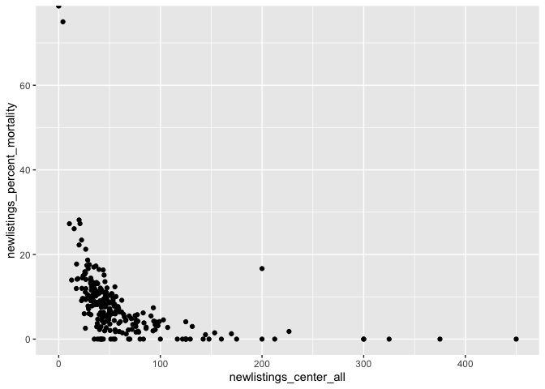<!-- --> Now, I
will read in, tidy, and merge with the zipcode file.

``` r
df_zipcodes = read_excel("../data/zipcodes.xlsx")
df_zipcodes = df_zipcodes[-c(1), ]
df_zipcodes[, c(2)] = sapply(df_zipcodes[, c(2)], as.numeric)
df_zipcodes = janitor::clean_names(df_zipcodes)
str(df_zipcodes)
```

    ## tibble [238 × 2] (S3: tbl_df/tbl/data.frame)
    ##  $ entire_name: chr [1:238] "Children's of Alabama (ALCH)" "University of Alabama Hospital (ALUA)" "Birmingham VA Medical Center (ALVA)" "Arkansas Children's Hospital (ARCH)" ...
    ##  $ zipcode    : num [1:238] 35233 35233 35233 72202 72205 ...

``` r
head(df_zipcodes)
```

    ## # A tibble: 6 × 2
    ##   entire_name                           zipcode
    ##   <chr>                                   <dbl>
    ## 1 Children's of Alabama (ALCH)            35233
    ## 2 University of Alabama Hospital (ALUA)   35233
    ## 3 Birmingham VA Medical Center (ALVA)     35233
    ## 4 Arkansas Children's Hospital (ARCH)     72202
    ## 5 UAMS Medical Center (ARUA)              72205
    ## 6 Phoenix Children's Hospital (AZCH)      85016

``` r
tail(df_zipcodes)
```

    ## # A tibble: 6 × 2
    ##   entire_name                                         zipcode
    ##   <chr>                                                 <dbl>
    ## 1 Virginia Mason Medical Center (WAVM)                  98111
    ## 2 Children's Hospital of Wisconsin (WICH)               53226
    ## 3 Froedtert Memorial Lutheran Hospital (WISE)           53226
    ## 4 Aurora St. Luke's Medical Center (WISL)               53215
    ## 5 University of Wisconsin Hospital and Clinics (WIUW)   53792
    ## 6 Charleston Area Medical Center (WVCA)                 25325

``` r
view(df_zipcodes)
```

Now I will cross reference the coordinates that correspond with each
zipcode.

``` r
for (zipcode in df_zipcodes["zipcode"]){
    df_zip_geo = tibble(geocode_zip(zipcode))
}
#view(df_zip_geo)
df_geo_merge = merge(df_zipcodes, df_zip_geo, all = TRUE)
view(df_geo_merge)
df_one_merge = merge(df_one_plot, df_geo_merge, all = TRUE)
view(df_one_merge)
```

``` r
df_outcomes = df_one_merge[, c(61:67)]
view(df_outcomes)
df_continuous = sapply(df_outcomes, as.numeric)
str(df_outcomes)
```

    ## 'data.frame':    238 obs. of  7 variables:
    ##  $ newlistings_percent_mortality     : num  11.54 9.52 5.15 17.28 0 ...
    ##  $ newlistings_percent_deteriorated  : num  5.77 7.62 8.25 8.38 0 ...
    ##  $ newlistings_percent_transfer      : num  15.38 4.76 7.22 1.05 0 ...
    ##  $ newlistings_percent_living_donor  : num  17.31 8.57 7.22 2.62 16.67 ...
    ##  $ newlistings_percent_deceased_donor: num  36.5 20 67 29.3 66.7 ...
    ##  $ newlistings_percent_recovered     : num  0 0 0 0 0 ...
    ##  $ living_deceased_graft_ratio       : num  0.4737 0.4286 0.1077 0.0893 0.25 ...

``` r
ggplot(gather(df_outcomes), aes(value)) + geom_histogram(bins = 30) + facet_wrap(~key, scales = 'free_x')
```

    ## Warning: Removed 35 rows containing non-finite values (stat_bin).

<!-- --> The
percent deteriorated is the clinical outcome with the most variability.
The percentages of living and deceased donors have some variability as
well.

Now I will map by zipcode

``` r
df_one_merge %>% ggplot(aes(x = zipcode, y =living_deceased_graft_ratio )) + geom_point()
```

    ## Warning: Removed 5 rows containing missing values (geom_point).

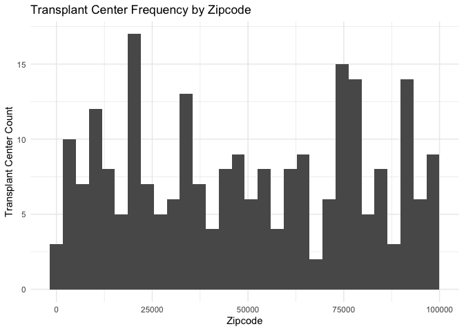<!-- --> Now I
will plot zipcode histogram

``` r
df_one_merge %>% ggplot(aes(zipcode)) + geom_histogram() + 
  labs(
    title = "Transplant Center Frequency by Zipcode",
    x = "Zipcode",
    y = "Transplant Center Count"
  ) + theme_minimal()
```

    ## `stat_bin()` using `bins = 30`. Pick better value with `binwidth`.

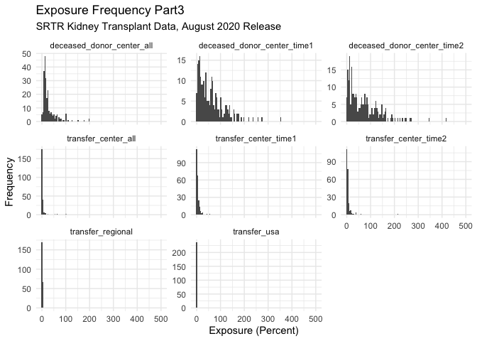<!-- -->

``` r
png('txp_frequency.png')
```

Now I will make a leaflet plot of transplant centers in the United
States

``` r
library(leaflet)

leaflet(options = leafletOptions(minZoom = 0, maxZoom = 18))
#df = data.frame(Lat = 1:10, Long = rnorm(10))
#leaflet(df) %>% addCircles()
#view(df_one_merge)
m = df_one_merge %>% leaflet() %>% addTiles() %>% addCircleMarkers(lat = ~lat, lng = ~lng)
m
```

Now I will make another leaflet plot of transplant centers in the United
States

``` r
library(leaflet)

leaflet(options = leafletOptions(minZoom = 0, maxZoom = 18))
#df = data.frame(Lat = 1:10, Long = rnorm(10))
#leaflet(df) %>% addCircles()
#view(df_one_merge)
m = df_one_merge %>% leaflet() %>% addTiles() %>% addCircleMarkers(lat = ~lat, lng = ~lng, color = ~newlistings_center_all)
m
```

I will now import the data frame from another sheet

``` r
df_two = read_excel("../data/csrs_final_tables_2006_KI.xls", sheet = "Tables B2-B3 Center")
df_two = janitor::clean_names(df_two)
str(df_two)
```

    ## tibble [239 × 191] (S3: tbl_df/tbl/data.frame)
    ##  $ entire_name    : chr [1:239] "Center Name" "Hartford Hospital (CTHH)" "Yale New Haven Hospital (CTYN)" "Beth Israel Deaconess Medical Center (MABI)" ...
    ##  $ ctr_cd         : chr [1:239] "Center Code" "CTHH" "CTYN" "MABI" ...
    ##  $ ctr_ty         : chr [1:239] "Center Type" "TX1" "TX1" "TX1" ...
    ##  $ release_date   : chr [1:239] "Release Date" "44046.791666666664" "44046.791666666664" "44046.791666666664" ...
    ##  $ org            : chr [1:239] "Organ" "KI" "KI" "KI" ...
    ##  $ wlc_a10_allc2  : chr [1:239] "Age 2-11" "0.2857142857" "0.3053435115" "0" ...
    ##  $ wlc_a10_newc2  : chr [1:239] "Age 2-11" "0" "0.4255319149" "0" ...
    ##  $ wlc_a17_allc2  : chr [1:239] "Age 12-17" "1.7142857143" "0.9160305344" "0" ...
    ##  $ wlc_a17_newc2  : chr [1:239] "Age 12-17" "0.5494505495" "0.4255319149" "0" ...
    ##  $ wlc_a2_allc2   : chr [1:239] "Age < 2" "0" "0.1526717557" "0" ...
    ##  $ wlc_a2_newc2   : chr [1:239] "Age < 2" "0" "0" "0" ...
    ##  $ wlc_a34_allc2  : chr [1:239] "Age 18-34" "9.7142857143" "10.381679389" "7.0652173913" ...
    ##  $ wlc_a34_newc2  : chr [1:239] "Age 18-34" "7.1428571429" "12.765957447" "11.214953271" ...
    ##  $ wlc_a49_allc2  : chr [1:239] "Age 35-49" "23.714285714" "27.480916031" "26.358695652" ...
    ##  $ wlc_a49_newc2  : chr [1:239] "Age 35-49" "26.373626374" "26.808510638" "20.560747664" ...
    ##  $ wlc_a64_allc2  : chr [1:239] "Age 50-64" "43.428571429" "47.022900763" "52.717391304" ...
    ##  $ wlc_a64_newc2  : chr [1:239] "Age 50-64" "41.758241758" "40" "52.336448598" ...
    ##  $ wlc_a69_allc2  : chr [1:239] "Age 65-69" "14.857142857" "10.229007634" "13.315217391" ...
    ##  $ wlc_a69_newc2  : chr [1:239] "Age 65-69" "17.582417582" "13.191489362" "14.953271028" ...
    ##  $ wlc_a70p_allc2 : chr [1:239] "Age 70+" "6.2857142857" "3.5114503817" "0.5434782609" ...
    ##  $ wlc_a70p_newc2 : chr [1:239] "Age 70+" "6.5934065934" "6.3829787234" "0.9345794393" ...
    ##  $ wlc_all_allc2  : chr [1:239] "All" "100" "100" "100" ...
    ##  $ wlc_all_newc2  : chr [1:239] "All" "100" "100" "100" ...
    ##  $ wlc_bab_allc2  : chr [1:239] "Blood Type AB" "1.4285714286" "2.5954198473" "4.0760869565" ...
    ##  $ wlc_bab_newc2  : chr [1:239] "Blood Type AB" "3.8461538462" "2.1276595745" "6.5420560748" ...
    ##  $ wlc_ba_allc2   : chr [1:239] "Blood Type A" "29.714285714" "26.717557252" "29.619565217" ...
    ##  $ wlc_ba_newc2   : chr [1:239] "Blood Type A" "31.868131868" "33.191489362" "37.38317757" ...
    ##  $ wlc_bb_allc2   : chr [1:239] "Blood Type B" "18" "19.694656489" "16.847826087" ...
    ##  $ wlc_bb_newc2   : chr [1:239] "Blood Type B" "16.483516484" "15.319148936" "13.08411215" ...
    ##  $ wlc_bo_allc2   : chr [1:239] "Blood Type O" "50.857142857" "50.992366412" "49.456521739" ...
    ##  $ wlc_bo_newc2   : chr [1:239] "Blood Type O" "47.802197802" "49.361702128" "42.990654206" ...
    ##  $ wlc_bu_allc2   : chr [1:239] "Blood Type Unknown" "0" "0" "0" ...
    ##  $ wlc_bu_newc2   : chr [1:239] "Blood Type Unknown" "0" "0" "0" ...
    ##  $ wlc_gf_allc2   : chr [1:239] "Female" "41.428571429" "36.79389313" "37.5" ...
    ##  $ wlc_gf_newc2   : chr [1:239] "Female" "32.417582418" "39.574468085" "33.644859813" ...
    ##  $ wlc_gm_allc2   : chr [1:239] "Male" "58.571428571" "63.20610687" "62.5" ...
    ##  $ wlc_gm_newc2   : chr [1:239] "Male" "67.582417582" "60.425531915" "66.355140187" ...
    ##  $ wlc_gu_allc2   : chr [1:239] "Gender Unknown" "0" "0" "0" ...
    ##  $ wlc_gu_newc2   : chr [1:239] "Gender Unknown" "0" "0" "0" ...
    ##  $ wlc_hrcar_allc2: chr [1:239] "Cardiomyopathy" "-" "-" "-" ...
    ##  $ wlc_hrcar_newc2: chr [1:239] "Cardiomyopathy" "-" "-" "-" ...
    ##  $ wlc_hrcon_allc2: chr [1:239] "Congenital Heart Disease" "-" "-" "-" ...
    ##  $ wlc_hrcon_newc2: chr [1:239] "Congenital Heart Disease" "-" "-" "-" ...
    ##  $ wlc_hrcor_allc2: chr [1:239] "Coronary Artery Disease" "-" "-" "-" ...
    ##  $ wlc_hrcor_newc2: chr [1:239] "Coronary Artery Disease" "-" "-" "-" ...
    ##  $ wlc_hrmis_allc2: chr [1:239] "Primary Disease Missing" "-" "-" "-" ...
    ##  $ wlc_hrmis_newc2: chr [1:239] "Primary Disease Missing" "-" "-" "-" ...
    ##  $ wlc_hroth_allc2: chr [1:239] "Primary Disease Other" "-" "-" "-" ...
    ##  $ wlc_hroth_newc2: chr [1:239] "Primary Disease Other" "-" "-" "-" ...
    ##  $ wlc_hrrtr_allc2: chr [1:239] "Retransplant/Graft Failure" "-" "-" "-" ...
    ##  $ wlc_hrrtr_newc2: chr [1:239] "Retransplant/Graft Failure" "-" "-" "-" ...
    ##  $ wlc_hrvlv_allc2: chr [1:239] "Valvular Heart Disease" "-" "-" "-" ...
    ##  $ wlc_hrvlv_newc2: chr [1:239] "Valvular Heart Disease" "-" "-" "-" ...
    ##  $ wlc_infbp_allc2: chr [1:239] "Functional Bowel Problem" "-" "-" "-" ...
    ##  $ wlc_infbp_newc2: chr [1:239] "Functional Bowel Problem" "-" "-" "-" ...
    ##  $ wlc_inmis_allc2: chr [1:239] "Primary Disease Missing" "-" "-" "-" ...
    ##  $ wlc_inmis_newc2: chr [1:239] "Primary Disease Missing" "-" "-" "-" ...
    ##  $ wlc_inoth_allc2: chr [1:239] "Primary Disease Other" "-" "-" "-" ...
    ##  $ wlc_inoth_newc2: chr [1:239] "Primary Disease Other" "-" "-" "-" ...
    ##  $ wlc_inrtr_allc2: chr [1:239] "Retransplant/Graft Failure" "-" "-" "-" ...
    ##  $ wlc_inrtr_newc2: chr [1:239] "Retransplant/Graft Failure" "-" "-" "-" ...
    ##  $ wlc_insgs_allc2: chr [1:239] "Short Gut Syndrome" "-" "-" "-" ...
    ##  $ wlc_insgs_newc2: chr [1:239] "Short Gut Syndrome" "-" "-" "-" ...
    ##  $ wlc_kidia_allc2: chr [1:239] "Diabetes" "40.571428571" "36.183206107" "36.141304348" ...
    ##  $ wlc_kidia_newc2: chr [1:239] "Diabetes" "40.10989011" "28.510638298" "31.775700935" ...
    ##  $ wlc_kiglo_allc2: chr [1:239] "Glomerular Diseases" "19.428571429" "23.20610687" "19.836956522" ...
    ##  $ wlc_kiglo_newc2: chr [1:239] "Glomerular Diseases" "18.681318681" "26.808510638" "21.495327103" ...
    ##  $ wlc_kihyp_allc2: chr [1:239] "Hypertensive Nephrosclerosis" "18.571428571" "17.251908397" "20.923913043" ...
    ##  $ wlc_kihyp_newc2: chr [1:239] "Hypertensive Nephrosclerosis" "20.879120879" "17.872340426" "18.691588785" ...
    ##  $ wlc_kimis_allc2: chr [1:239] "Primary Disease Missing" "1.1428571429" "0.1526717557" "0.8152173913" ...
    ##  $ wlc_kimis_newc2: chr [1:239] "Primary Disease Missing" "0" "0" "0.9345794393" ...
    ##  $ wlc_kineo_allc2: chr [1:239] "Neoplasms" "0.5714285714" "0.7633587786" "0" ...
    ##  $ wlc_kineo_newc2: chr [1:239] "Neoplasms" "0" "1.7021276596" "0" ...
    ##  $ wlc_kioth_allc2: chr [1:239] "Primary Disease Other" "7.1428571429" "7.9389312977" "7.8804347826" ...
    ##  $ wlc_kioth_newc2: chr [1:239] "Primary Disease Other" "7.6923076923" "7.6595744681" "10.280373832" ...
    ##  $ wlc_kipol_allc2: chr [1:239] "Polycystic Kidneys" "8.8571428571" "6.8702290076" "8.6956521739" ...
    ##  $ wlc_kipol_newc2: chr [1:239] "Polycystic Kidneys" "8.2417582418" "8.9361702128" "6.5420560748" ...
    ##  $ wlc_kiren_allc2: chr [1:239] "Renovascular & Vascular Diseases" "0" "0.1526717557" "0.2717391304" ...
    ##  $ wlc_kiren_newc2: chr [1:239] "Renovascular & Vascular Diseases" "0" "0" "0.9345794393" ...
    ##  $ wlc_kirtr_allc2: chr [1:239] "Retransplant/Graft Failure" "0" "0" "0" ...
    ##  $ wlc_kirtr_newc2: chr [1:239] "Retransplant/Graft Failure" "0" "0" "0" ...
    ##  $ wlc_kitub_allc2: chr [1:239] "Tubular and Interstitial Diseases" "2.5714285714" "4.7328244275" "4.347826087" ...
    ##  $ wlc_kitub_newc2: chr [1:239] "Tubular and Interstitial Diseases" "2.7472527473" "5.5319148936" "5.6074766355" ...
    ##  $ wlc_liacu_allc2: chr [1:239] "Acute Hepatic Necrosis" "-" "-" "-" ...
    ##  $ wlc_liacu_newc2: chr [1:239] "Acute Hepatic Necrosis" "-" "-" "-" ...
    ##  $ wlc_libil_allc2: chr [1:239] "Biliary Atresia" "-" "-" "-" ...
    ##  $ wlc_libil_newc2: chr [1:239] "Biliary Atresia" "-" "-" "-" ...
    ##  $ wlc_licho_allc2: chr [1:239] "Cholestatic Liver Disease/Cirrhosis" "-" "-" "-" ...
    ##  $ wlc_licho_newc2: chr [1:239] "Cholestatic Liver Disease/Cirrhosis" "-" "-" "-" ...
    ##  $ wlc_limal_allc2: chr [1:239] "Malignant Neoplasms" "-" "-" "-" ...
    ##  $ wlc_limal_newc2: chr [1:239] "Malignant Neoplasms" "-" "-" "-" ...
    ##  $ wlc_limet_allc2: chr [1:239] "Metabolic Diseases" "-" "-" "-" ...
    ##  $ wlc_limet_newc2: chr [1:239] "Metabolic Diseases" "-" "-" "-" ...
    ##  $ wlc_limis_allc2: chr [1:239] "Primary Disease Missing" "-" "-" "-" ...
    ##  $ wlc_limis_newc2: chr [1:239] "Primary Disease Missing" "-" "-" "-" ...
    ##  $ wlc_linch_allc2: chr [1:239] "Non-Cholestatic Cirrhosis" "-" "-" "-" ...
    ##  $ wlc_linch_newc2: chr [1:239] "Non-Cholestatic Cirrhosis" "-" "-" "-" ...
    ##  $ wlc_lioth_allc2: chr [1:239] "Primary Disease Other" "-" "-" "-" ...
    ##  $ wlc_lioth_newc2: chr [1:239] "Primary Disease Other" "-" "-" "-" ...
    ##   [list output truncated]

``` r
head(df_two)
```

    ## # A tibble: 6 × 191
    ##   entire_name     ctr_cd  ctr_ty  release_date org   wlc_a10_allc2 wlc_a10_newc2
    ##   <chr>           <chr>   <chr>   <chr>        <chr> <chr>         <chr>        
    ## 1 Center Name     Center… Center… Release Date Organ Age 2-11      Age 2-11     
    ## 2 Hartford Hospi… CTHH    TX1     44046.79166… KI    0.2857142857  0            
    ## 3 Yale New Haven… CTYN    TX1     44046.79166… KI    0.3053435115  0.4255319149 
    ## 4 Beth Israel De… MABI    TX1     44046.79166… KI    0             0            
    ## 5 Baystate Medic… MABS    TX1     44046.79166… KI    0             0            
    ## 6 Boston Medical… MABU    TX1     44046.79166… KI    0             0            
    ## # … with 184 more variables: wlc_a17_allc2 <chr>, wlc_a17_newc2 <chr>,
    ## #   wlc_a2_allc2 <chr>, wlc_a2_newc2 <chr>, wlc_a34_allc2 <chr>,
    ## #   wlc_a34_newc2 <chr>, wlc_a49_allc2 <chr>, wlc_a49_newc2 <chr>,
    ## #   wlc_a64_allc2 <chr>, wlc_a64_newc2 <chr>, wlc_a69_allc2 <chr>,
    ## #   wlc_a69_newc2 <chr>, wlc_a70p_allc2 <chr>, wlc_a70p_newc2 <chr>,
    ## #   wlc_all_allc2 <chr>, wlc_all_newc2 <chr>, wlc_bab_allc2 <chr>,
    ## #   wlc_bab_newc2 <chr>, wlc_ba_allc2 <chr>, wlc_ba_newc2 <chr>, …

``` r
tail(df_two)
```

    ## # A tibble: 6 × 191
    ##   entire_name       ctr_cd ctr_ty release_date org   wlc_a10_allc2 wlc_a10_newc2
    ##   <chr>             <chr>  <chr>  <chr>        <chr> <chr>         <chr>        
    ## 1 Children's Hospi… VACH   TX1    44046.79166… KI    22.222222222  46.153846154 
    ## 2 Henrico Doctors'… VAHD   TX1    44046.79166… KI    0             0            
    ## 3 Medical College … VAMC   TX1    44046.79166… KI    1.8556701031  0.7299270073 
    ## 4 Sentara Norfolk … VANG   TX1    44046.79166… KI    0             0            
    ## 5 University of Vi… VAUV   TX1    44046.79166… KI    1.6245487365  3.9285714286 
    ## 6 <NA>              TNVA   TX1    44046.79166… KI    0             0            
    ## # … with 184 more variables: wlc_a17_allc2 <chr>, wlc_a17_newc2 <chr>,
    ## #   wlc_a2_allc2 <chr>, wlc_a2_newc2 <chr>, wlc_a34_allc2 <chr>,
    ## #   wlc_a34_newc2 <chr>, wlc_a49_allc2 <chr>, wlc_a49_newc2 <chr>,
    ## #   wlc_a64_allc2 <chr>, wlc_a64_newc2 <chr>, wlc_a69_allc2 <chr>,
    ## #   wlc_a69_newc2 <chr>, wlc_a70p_allc2 <chr>, wlc_a70p_newc2 <chr>,
    ## #   wlc_all_allc2 <chr>, wlc_all_newc2 <chr>, wlc_bab_allc2 <chr>,
    ## #   wlc_bab_newc2 <chr>, wlc_ba_allc2 <chr>, wlc_ba_newc2 <chr>, …

``` r
view(df_two)
colnames = colnames(df_two)
print(colnames)
```

    ##   [1] "entire_name"     "ctr_cd"          "ctr_ty"          "release_date"   
    ##   [5] "org"             "wlc_a10_allc2"   "wlc_a10_newc2"   "wlc_a17_allc2"  
    ##   [9] "wlc_a17_newc2"   "wlc_a2_allc2"    "wlc_a2_newc2"    "wlc_a34_allc2"  
    ##  [13] "wlc_a34_newc2"   "wlc_a49_allc2"   "wlc_a49_newc2"   "wlc_a64_allc2"  
    ##  [17] "wlc_a64_newc2"   "wlc_a69_allc2"   "wlc_a69_newc2"   "wlc_a70p_allc2" 
    ##  [21] "wlc_a70p_newc2"  "wlc_all_allc2"   "wlc_all_newc2"   "wlc_bab_allc2"  
    ##  [25] "wlc_bab_newc2"   "wlc_ba_allc2"    "wlc_ba_newc2"    "wlc_bb_allc2"   
    ##  [29] "wlc_bb_newc2"    "wlc_bo_allc2"    "wlc_bo_newc2"    "wlc_bu_allc2"   
    ##  [33] "wlc_bu_newc2"    "wlc_gf_allc2"    "wlc_gf_newc2"    "wlc_gm_allc2"   
    ##  [37] "wlc_gm_newc2"    "wlc_gu_allc2"    "wlc_gu_newc2"    "wlc_hrcar_allc2"
    ##  [41] "wlc_hrcar_newc2" "wlc_hrcon_allc2" "wlc_hrcon_newc2" "wlc_hrcor_allc2"
    ##  [45] "wlc_hrcor_newc2" "wlc_hrmis_allc2" "wlc_hrmis_newc2" "wlc_hroth_allc2"
    ##  [49] "wlc_hroth_newc2" "wlc_hrrtr_allc2" "wlc_hrrtr_newc2" "wlc_hrvlv_allc2"
    ##  [53] "wlc_hrvlv_newc2" "wlc_infbp_allc2" "wlc_infbp_newc2" "wlc_inmis_allc2"
    ##  [57] "wlc_inmis_newc2" "wlc_inoth_allc2" "wlc_inoth_newc2" "wlc_inrtr_allc2"
    ##  [61] "wlc_inrtr_newc2" "wlc_insgs_allc2" "wlc_insgs_newc2" "wlc_kidia_allc2"
    ##  [65] "wlc_kidia_newc2" "wlc_kiglo_allc2" "wlc_kiglo_newc2" "wlc_kihyp_allc2"
    ##  [69] "wlc_kihyp_newc2" "wlc_kimis_allc2" "wlc_kimis_newc2" "wlc_kineo_allc2"
    ##  [73] "wlc_kineo_newc2" "wlc_kioth_allc2" "wlc_kioth_newc2" "wlc_kipol_allc2"
    ##  [77] "wlc_kipol_newc2" "wlc_kiren_allc2" "wlc_kiren_newc2" "wlc_kirtr_allc2"
    ##  [81] "wlc_kirtr_newc2" "wlc_kitub_allc2" "wlc_kitub_newc2" "wlc_liacu_allc2"
    ##  [85] "wlc_liacu_newc2" "wlc_libil_allc2" "wlc_libil_newc2" "wlc_licho_allc2"
    ##  [89] "wlc_licho_newc2" "wlc_limal_allc2" "wlc_limal_newc2" "wlc_limet_allc2"
    ##  [93] "wlc_limet_newc2" "wlc_limis_allc2" "wlc_limis_newc2" "wlc_linch_allc2"
    ##  [97] "wlc_linch_newc2" "wlc_lioth_allc2" "wlc_lioth_newc2" "wlc_lucon_allc2"
    ## [101] "wlc_lucon_newc2" "wlc_lucys_allc2" "wlc_lucys_newc2" "wlc_luemp_allc2"
    ## [105] "wlc_luemp_newc2" "wlc_luidi_allc2" "wlc_luidi_newc2" "wlc_lumis_allc2"
    ## [109] "wlc_lumis_newc2" "wlc_luoth_allc2" "wlc_luoth_newc2" "wlc_lupri_allc2"
    ## [113] "wlc_lupri_newc2" "wlc_luret_allc2" "wlc_luret_newc2" "wlc_me11_allc2" 
    ## [117] "wlc_me11_newc2"  "wlc_me15_allc2"  "wlc_me15_newc2"  "wlc_me21_allc2" 
    ## [121] "wlc_me21_newc2"  "wlc_me31_allc2"  "wlc_me31_newc2"  "wlc_me6_allc2"  
    ## [125] "wlc_me6_newc2"   "wlc_n_allc2"     "wlc_n_newc2"     "wlc_pe11_allc2" 
    ## [129] "wlc_pe11_newc2"  "wlc_pe15_allc2"  "wlc_pe15_newc2"  "wlc_pe21_allc2" 
    ## [133] "wlc_pe21_newc2"  "wlc_pe31_allc2"  "wlc_pe31_newc2"  "wlc_pe6_allc2"  
    ## [137] "wlc_pe6_newc2"   "wlc_pra79_allc2" "wlc_pra79_newc2" "wlc_pra80_allc2"
    ## [141] "wlc_pra80_newc2" "wlc_pra9_allc2"  "wlc_pra9_newc2"  "wlc_prau_allc2" 
    ## [145] "wlc_prau_newc2"  "wlc_ptxn_allc2"  "wlc_ptxn_newc2"  "wlc_ptxu_allc2" 
    ## [149] "wlc_ptxu_newc2"  "wlc_ptxy_allc2"  "wlc_ptxy_newc2"  "wlc_q1_allc2"   
    ## [153] "wlc_q1_newc2"    "wlc_q2_allc2"    "wlc_q2_newc2"    "wlc_q3_allc2"   
    ## [157] "wlc_q3_newc2"    "wlc_q4_allc2"    "wlc_q4_newc2"    "wlc_qu_allc2"   
    ## [161] "wlc_qu_newc2"    "wlc_ra_allc2"    "wlc_ra_newc2"    "wlc_rb_allc2"   
    ## [165] "wlc_rb_newc2"    "wlc_rh_allc2"    "wlc_rh_newc2"    "wlc_ro_allc2"   
    ## [169] "wlc_ro_newc2"    "wlc_ru_allc2"    "wlc_ru_newc2"    "wlc_rw_allc2"   
    ## [173] "wlc_rw_newc2"    "wlc_st1a_allc2"  "wlc_st1a_newc2"  "wlc_st1b_allc2" 
    ## [177] "wlc_st1b_newc2"  "wlc_st1_allc2"   "wlc_st1_newc2"   "wlc_st2a_allc2" 
    ## [181] "wlc_st2a_newc2"  "wlc_st2b_allc2"  "wlc_st2b_newc2"  "wlc_st2_allc2"  
    ## [185] "wlc_st2_newc2"   "wlc_st3_allc2"   "wlc_st3_newc2"   "wlc_sto_allc2"  
    ## [189] "wlc_sto_newc2"   "wlc_kicon_allc2" "wlc_kicon_newc2"

I will rename and clean the columns for dataframe two.

``` r
df_two_names = read_excel("../data/B2 names.xlsx")
df_two_names = janitor::clean_names(df_two_names)
df_two_names = df_two_names %>% mutate(c = paste(a,b))
setnames = df_two_names %>% pull(c)
df_two = setNames(df_two, setnames)
df_two = janitor::clean_names(df_two)
df_two_clean = df_two[-c(1), ]
df_two_clean = df_two_clean %>% rename (entire_name= center_name_na , ctr_cd = center_code_na)
view(df_two_clean)
```

I will select and rearrange values in dataframe two

``` r
df_two_select = df_two_clean %>% select(entire_name, ctr_cd, asian_allc2, african_american_allc2, hispanic_latino_allc2, white_allc2, race_other_allc2, race_unknown_allc2) 
df_social = merge(df_one_merge, df_two_select)
df_demographics = df_social[, c(1,2,3, 68, 71:76)]
view(df_demographics)
df_demographics_pivot =
  pivot_longer(
    df_demographics, 
    asian_allc2:race_unknown_allc2,
    names_to = "race_category", 
    values_to = "race_category_percent") %>% mutate(race_category_percent = as.numeric(race_category_percent)) %>% mutate(race_category = as.factor(race_category))

plot = df_demographics_pivot %>% ggplot(aes(x=zipcode, y =race_category_percent, color = race_category)) + geom_point()
plot
```

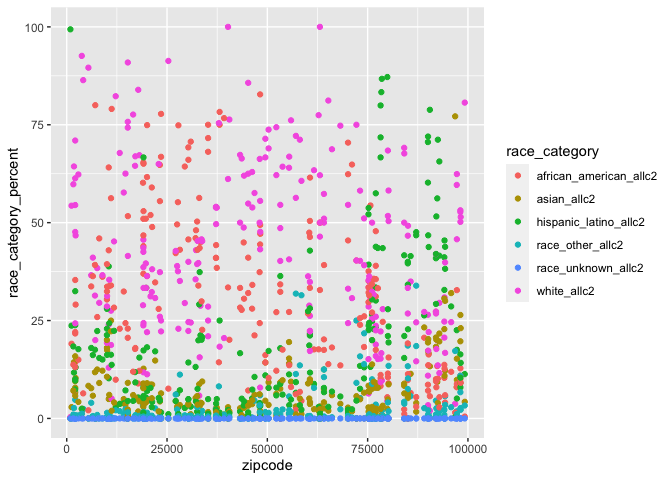<!-- --> Now I
will make an age dataframe

``` r
df_two_age = df_two_clean[, c(1,2,6,8,10,12,14,16,18,20,22)]
df_age = merge(df_one_merge, df_two_age)
df_age = df_age[, c(1,2,3, 68, 71:78)]
view(df_age)
df_age_pivot =
  pivot_longer(
    df_age, 
    age_2_11_allc2:age_70_allc2,
    names_to = "age_category", 
    values_to = "age_category_percent") %>% mutate (age_category_percent = as.numeric(age_category_percent)) %>% mutate(age_category = factor(age_category, levels =c("age_2_allc2","age_2_11_allc2", "age_12_17_allc2", "age_18_34_allc2", "age_35_49_allc2", "age_50_64_allc2", "age_65_79_allc2", "age_70_allc2"))) %>% drop_na()
view(df_age_pivot)
plot = df_age_pivot %>% ggplot(aes(x=zipcode, y =age_category_percent, color = age_category)) + geom_point()
plot
```

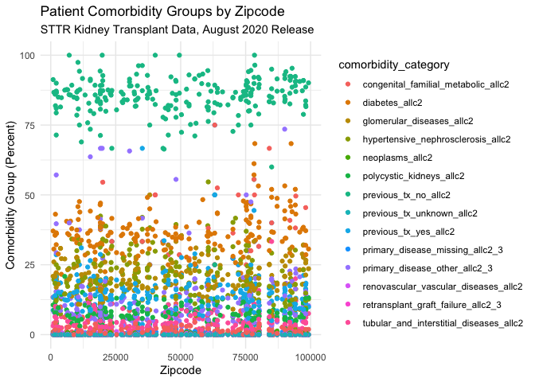<!-- --> Now I
will make a gender dataframe

``` r
df_two_gender = df_two_clean[, c(1,2,34,36)]
df_gender = merge(df_one_merge, df_two_gender)
df_gender = df_gender[, c(1,2,3, 68, 71:72)]
view(df_gender)
df_gender_pivot =
  pivot_longer(
    df_gender, 
    female_allc2:male_allc2,
    names_to = "gender_category", 
    values_to = "gender_category_percent") %>% mutate (gender_category_percent = as.numeric(gender_category_percent)) %>% mutate(gender_category = as.factor(gender_category))
view(df_gender_pivot)
plot = df_gender_pivot %>% ggplot(aes(x=zipcode, y =gender_category_percent, color = gender_category)) + geom_point()
plot
```

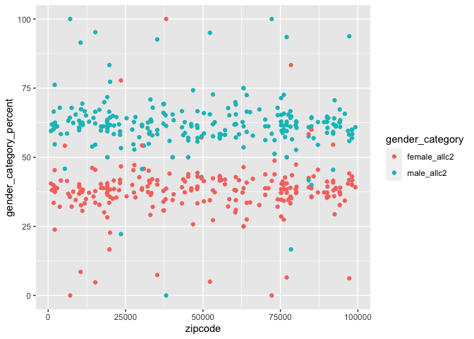<!-- -->

``` r
df_two_comorbidities = df_two_clean[, c(1,2,64,66,68,70,72,74,76,78,80,82,126,128,130,132,138,140,142,144,146,148,150, 162, 164, 166, 168, 170, 172, 190)]
df_comorbidities = merge(df_one_merge, df_two_comorbidities)
df_comorbidities = df_comorbidities[, c(1,2,3, 68, 71:81, 87:98)]
df_comorbidities = df_comorbidities[, c(1:14, 18:20, 27)]
view(df_comorbidities)
df_comorbidities_pivot =
  pivot_longer(
    df_comorbidities, 
    diabetes_allc2:congenital_familial_metabolic_allc2,
    names_to = "comorbidity_category", 
    values_to = "comorbidity_category_percent") %>% mutate (comorbidity_category_percent = as.numeric(comorbidity_category_percent)) %>% mutate(comorbidity_category = as.factor(comorbidity_category))
view(df_comorbidities_pivot)
plot = df_comorbidities_pivot %>% ggplot(aes(x=zipcode, y =comorbidity_category_percent, color = comorbidity_category)) + geom_point()
plot
```

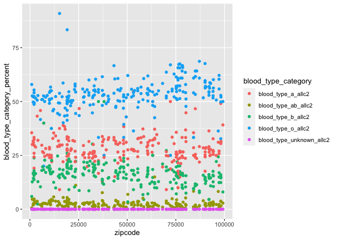<!-- --> Blood
type dataframe

``` r
df_two_blood_type = df_two_clean[, c(1,2,24, 26, 28, 30, 32)]
df_blood_type = merge(df_one_merge, df_two_blood_type)
df_blood_type = df_blood_type[, c(1,2,3, 68, 71:75)]
view(df_blood_type)
df_blood_type_pivot =
  pivot_longer(
    df_blood_type, 
    blood_type_ab_allc2:blood_type_unknown_allc2,
    names_to = "blood_type_category", 
    values_to = "blood_type_category_percent") %>% mutate (blood_type_category_percent = as.numeric(blood_type_category_percent)) %>% mutate(blood_type_category = as.factor(blood_type_category))
view(df_blood_type_pivot)
plot = df_blood_type_pivot %>% ggplot(aes(x=zipcode, y =blood_type_category_percent, color = blood_type_category)) + geom_point()
plot
```

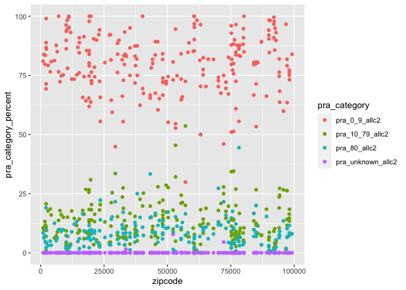<!-- -->

``` r
view(df_two_clean)
df_two_pra = df_two_clean[, c(1,2, 138, 140, 142, 144)]
view(df_two_pra)
df_pra = merge(df_one_merge, df_two_pra)
df_pra = df_pra[, c(1,2,3, 68, 71:74)]
view(df_pra)
df_pra_pivot =
  pivot_longer(
    df_pra, 
    pra_10_79_allc2:pra_unknown_allc2,
    names_to = "pra_category", 
    values_to = "pra_category_percent") %>% mutate (pra_category_percent = as.numeric(pra_category_percent)) %>% mutate(pra_category = factor(pra_category, c("pra_0_9_allc2", "pra_10_79_allc2", "pra_80_allc2", "pra_unknown_allc2")))
view(df_pra_pivot)
plot = df_pra_pivot %>% ggplot(aes(x=zipcode, y =pra_category_percent, color = pra_category)) + geom_point()
plot
```

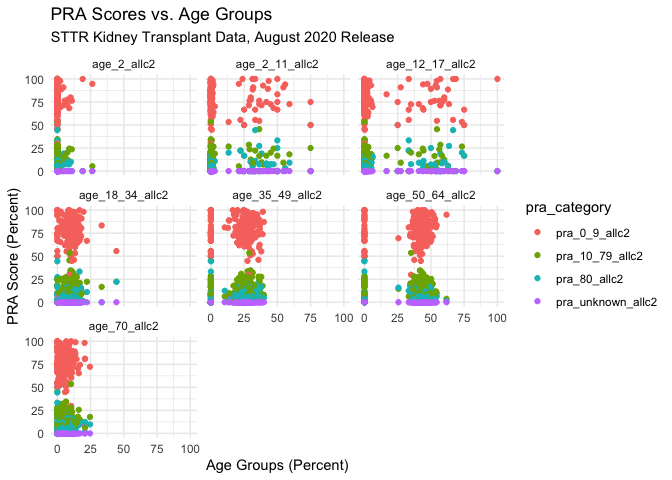<!-- --> Now I
will merge the pra and comorbidities dataframes and examine for
correlations.

``` r
df_pra_comorbid = merge(df_pra_pivot, df_comorbidities_pivot)
view(df_pra_comorbid)
plot = df_pra_comorbid %>% ggplot(aes(x=comorbidity_category_percent, y =pra_category_percent, color =pra_category)) + geom_point() + facet_wrap(~comorbidity_category)
plot
```

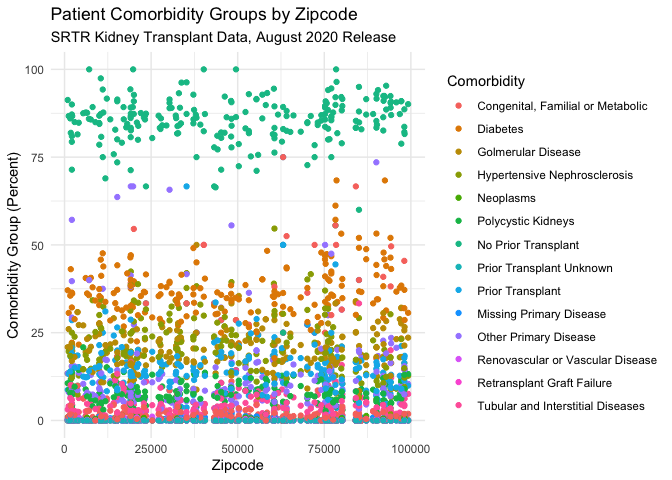<!-- -->

``` r
#png('pra_comorbidity.png')
```

Overall, there is no correlation with pra score and comorbidities.

Now I will merge the pra and age dataframes and examine for
correlations.

``` r
df_pra_age = merge(df_pra_pivot, df_age_pivot)
view(df_pra_age)
plot = df_pra_age %>% ggplot(aes(x=age_category_percent, y =pra_category_percent, color =pra_category)) + geom_point() + facet_wrap(~age_category)
plot
```

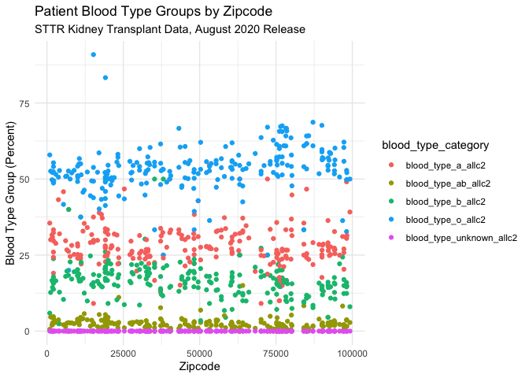<!-- -->

``` r
#png('pra_comorbidity.png')
```

Overall, there is no correlation with pra score and age.

Now I will merge the pra and gender dataframes and examine for
correlations.

``` r
df_pra_gender = merge(df_pra_pivot, df_gender_pivot)
view(df_pra_gender)
plot = df_pra_gender %>% ggplot(aes(x=gender_category_percent, y =pra_category_percent, color =pra_category)) + geom_point() + facet_wrap(~gender_category)
plot
```

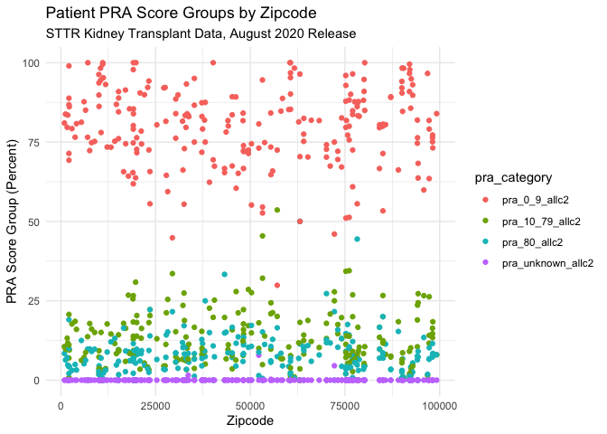<!-- -->

``` r
#png('pra_comorbidity.png')
```

Overall, there is no correlation with pra score and gender.

Now I will merge the pra and demographics dataframes and examine for
correlations.

``` r
df_pra_demographics = merge(df_pra_pivot, df_demographics_pivot)
view(df_pra_demographics)
plot = df_pra_demographics %>% ggplot(aes(x=race_category_percent, y =pra_category_percent, color =pra_category)) + geom_point() + facet_wrap(~race_category)
plot
```

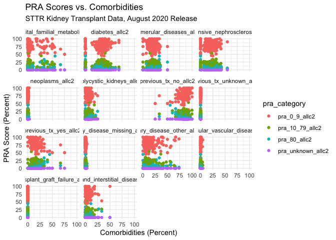<!-- -->

``` r
#png('pra_comorbidity.png')
```

Overall, there is no correlation with pra score and race.

Now I will merge the pra and blood type dataframes and examine for
correlations.

``` r
df_pra_blood_type = merge(df_pra_pivot, df_blood_type_pivot)
view(df_pra_blood_type)
plot = df_pra_blood_type %>% ggplot(aes(x=blood_type_category_percent, y =pra_category_percent, color =pra_category)) + geom_point() + facet_wrap(~blood_type_category)
plot
```

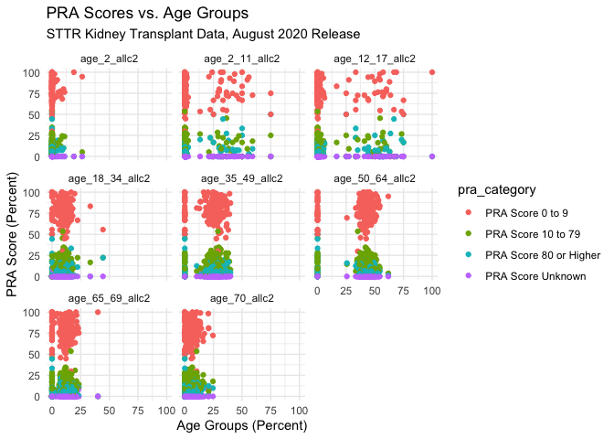<!-- -->

``` r
#png('pra_comorbidity.png')
```

Now I will make tables

``` r
#view(df_two_clean)
#view(df_comorbidities)
#view(df_one_merge)
#view(df_gender)
#view(df_two_gender)
#view(df_social)
#view(df_demographics)
#view(df_age)
#knitr::kable(df_demographics) %>% save_kable("draft_demographics.pdf")
#knitr::kable(df_age) %>% save_kable("draft_age.pdf") 
#knitr::kable(df_gender) %>% save_kable("draft_gender.pdf") 
#knitr::kable(df_comorbidities) %>% save_kable("draft_comorbidities.pdf") 
```
