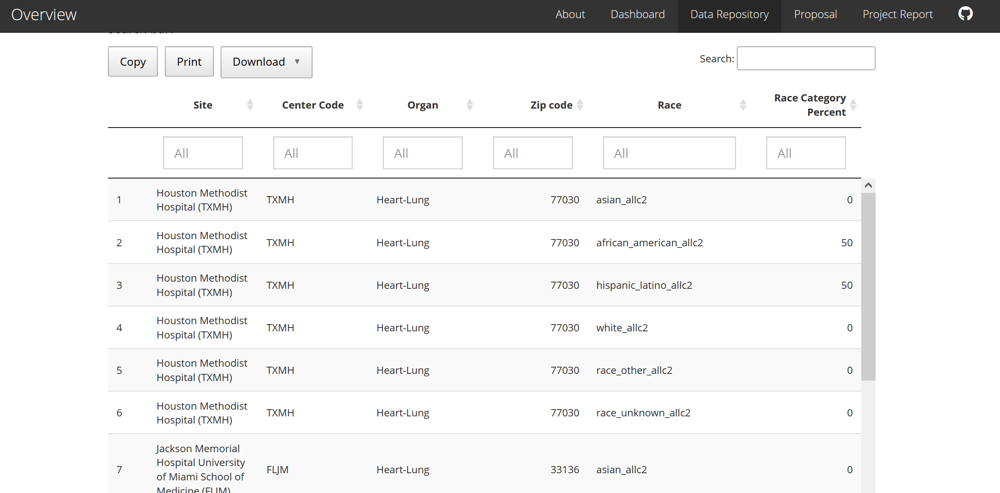

```{r setup, include=FALSE}
knitr::opts_chunk$set(echo = FALSE)
library(tidyverse)
library(readxl)
library(haven)
library(ggplot2)
library(zipcodeR)
library(ggmap)
library(leaflet)
library(lubridate)
#library(kableExtra)

phrase = "SRTR Multiorgan Transplant Data, August 2020 Release"

suffix = list("age","gender","demographics","blood_type")

for (i in suffix){
  data_path = "./data/old_data/"   # path to the data
  files = dir(data_path, 
              pattern = paste0("csrs_final_tables_2006_[A-Z][A-Z]_", i,".csv"))
  assign(paste0("df_all_", i),
         files %>%
           map(~ read_csv(file.path(data_path, .))%>%
                 mutate(org = str_replace(org, "HR", "Heart"),
                        org = str_replace(org, "HL", "Heart-Lung"),
                        org = str_replace(org, "IN", "Intestine"),
                        org = str_replace(org, "KI", "Kidney"),
                        org = str_replace(org, "KP", "Kidney-Pancreas"),
                        org = str_replace(org, "LI", "Liver"),
                        org = str_replace(org, "LU", "Lung"),
                        org = str_replace(org, "PA", "Pancreas"))) %>%
           reduce(rbind))
  }
```

## Variation in kidney transplantation center practices and patient characteristics

## Group members:  
Kristen King (*kk3154*), Harry Reyes (*hr2479*), Lauren Richter (*lr2854*), Matthew Spotnitz (*mes2165*)

## Motivation

  The Scientific Registry of Transplant Recipients [(SRTR)](https://www.srtr.org/) analyzes data on transplant centers, candidates, and recipients from multiple sources.^1^ Its [mission](https://www.srtr.org/about-srtr/mission-vision-and-values/) is "to provide advanced statistical and epidemiological analyses related to solid organ allocation and transplantation in support of the Department of Health and Human Services and its agents in their oversight of the national organ transplantation system."^2^ The SRTR produces [annual summary reports](https://onlinelibrary.wiley.com/toc/16006143/2021/21/S2) on patients who are either recipients of a solid organ transplant or on a waitlist to receive one across all transplant centers in the United States.^3^ They also produce biannual center-level reports that focus on benchmarking individual center performance relative to other centers within administrative boundaries or nationwide. The administrative boundaries used for grouping centers divide the country into 57 different Donation Service Areas (DSAs), which are then aggregated into 11 regions.

  With over 200 different kidney transplant centers across the United States, most patients live within driving distance of at least 2 centers and have some choice in where to seek waitlisting for transplantation.^4,5^ Patients can even be listed simultaneously at multiple centers. The current [reports](https://www.srtr.org/document/pdf?fileName=\062021_release\pdfPSR\NYCPTX1KI202105PNEW.pdf) produced by the SRTR compare data from one given center to aggregate data within one DSA and one region; however, these administrative boundaries don’t always represent which centers are geographically proximal to each other. For example, individual transplant centers within New York City are compared to summary data from a group of NYC centers, but not other nearby centers in New Jersey or Connecticut, as they belong to three separate DSAs and three separate regions.

  There is a dramatic shortage of organs for transplant relative to end-stage kidney disease patients in need,^3^ and transplant centers are selective in who to accept onto their waitlist as a candidate for a transplant in order to maximize the benefits from donated organs and ensure patients will not be put at risk from major surgery and lifelong immunosuppression medications if the risks outweigh the potential benefits of receiving a transplant. There is also large variation between centers in which donor organs they will accept for transplant that can influence patients’ likelihood of receiving a transplant, and how quickly.^6,7^ Patients may be interested in comparing demographic and outcomes data at all of the centers geographically closest to them to understand where they might have the best chance at receiving a successful transplant, regardless of the administrative boundaries currently used.   

  From a research perspective, there is also great value in being able to look at data across all centers nationwide and over time in order to explore differences in practice patterns across centers and how it may correlate to patient outcomes. The extensive data that is compiled by the SRTR to produce their reports is all publicly available on their website, but not in a particularly user-friendly format. The full reports can be downloaded in PDF format for one center and time period at a time, and limited pieces of the most current information are displayed within web pages, one center at a time. The underlying data can also be downloaded in very large excel files with rows for all centers, for one organ and one given time period at a time, across many different sheets of data. The aims of this project were to (1) automate the retrieval and compilation of the archived data across all time periods to create a repository that could be used for future research, (2) explore the data available to select and tidy the most relevant data elements, and (3) create a dashboard with some exploratory data visualizations of these key data elements that may be of interest to patients looking to compare between different transplant centers and across time rather than looking at one center's report at a time.


## Related Work


The SRTR website currently has a [search function](https://www.srtr.org/transplant-centers/?organ=kidney&recipientType=adult&query=10032) that allows a user to type in a zip code and see a list of transplant centers within a given number of miles, and to rank them by distance, number of transplants performed, or a 5-level rating of likelihood of getting a transplant faster or 1-year kidney survival.^8^ While these are important high-level summary data, the user must click to download and scroll through multiple long PDF files in order to perform any other more detailed comparisons between centers. Additionally, while there has historically been intense regulatory scrutiny on 1-year post-transplant outcomes, prior work has shown that patients are actually more interested in waitlist outcomes.^9,10^
  
Prior research by one team member involved working with Offer Acceptance Ratio data from the SRTR reports and was limited to data from one time period only due to the logistical difficulty in downloading and wrangling these data. While geographic variation in access to transplantation has historically been attributed to variability in local organ supply relative to waitlist demand,^11,12^ this work found that there is significant variation in the probability of transplantation across centers within a DSA, which share a local organ supply. Offer Acceptance Ratios, which measure how frequently transplant centers accept the organ offers they receive relative to other centers nationwide, stratified by donor risk level, were found to be correlated with the likelihood of transplantation.^13^ Prior work also demonstrates that many patients die on the waitlist after having multiple organ offers that were declined on their behalf, with organ quality the most frequent reason for decline rather than a patient-specific reason.^14^ Together, these findings suggest that centers’ organ offer acceptance behavior, especially for higher-risk kidneys which frequently end up discarded after too many declines, has important impact on patient outcomes and need to be studied further. Understanding variability in practice between centers may help identify opportunities to share best practices and ultimately improve access to transplantation for patients.
 

## Initial questions

  We first wanted to use the SRTR report data to understand how patient demographics varied at centers across the country, for both waitlisted candidates and transplant recipients. Variables considered in initial analyses included age, race, sex, and blood type. We later expanded our analysis dataset to include additional clinical characteristics such as underlying cause of kidney disease (diabetes, hypertension, glomerulonephritis, polycystic kidney disease, or other/unknown), Body Mass Index (BMI), high Panel Reactive Antibodies (PRA) sensitization, and history of prior transplant for use in future studies. We compared across numeric zip codes as an initial consideration of geographic proximity. While we started with all solid organ transplants (kidney, liver, heart, lung, intestine, and pancreas, plus combinations of multi-organ transplants), we later narrowed the scope of our project to only kidney, which is the most frequently transplanted organ in the United States. 

  We next aimed to assess variation in waitlist outcomes (transplant from a living donor, transplant from a deceased donor, death, or waitlist removal for deteriorating condition) across centers. We also visually examined differences between transplant centers in offer acceptance ratios, across different donor risk levels (low-risk, medium-risk, high-risk, and hard-to-place kidneys that required >100 offers before acceptance). We were also interested in exploring trends over time in centers’ offer acceptance ratios.


## Data

  While the SRTR Program-Specific Reports (PSR) are designed to be accessed primarily as center-specific snapshot [PDF](https://www.srtr.org/document/pdf?fileName=\062021_release\pdfPSR\NYCPTX1KI202105PNEW.pdf) files, the data that were used to create these reports are also publicly available from the SRTR [website](https://www.srtr.org/reports/program-specific-reports/).^15,16^ Data for each biannual reporting period can be downloaded as zip files of excel workbooks for each organ type. Within each organ-specific excel workbook, there is one row for each transplant center, with 28-34 sheets of data corresponding to the various tables and figures in the PDF reports, and tens to hundreds of columns of data within each sheet. Data from 18 reporting time periods were available for download, dated from July 2012 through May 2021. 

  We developed an automated pipeline to download, unzip, filter, compile, and tidy all of the archived data from the URLs, as found in the [downloading_data.Rmd file](https://github.com/harryreyesnieva/p8105_final_project/blob/main/code/downloading_data.md). 
  
  To access this data, we inspected the [SRTR webpage](https://www.srtr.org/reports/program-specific-reports/) where the data can be downloaded to file names/dates and URLs that are associated with the drop-down menu options and ‘download’ buttons. We then wrote a function to download both the current data files (accessed as a separate URL format) and each of the archived data releases, unzip the folders of all organs, select only the kidney files, and compile all years of data into one nested list with list columns. We wrote additional functions to select only the variables of interest for analysis from the various sheets to reduce the working file size. The number of sheets of data, the sheet names, and the variable names changed over time and required extensive tidying and reconciling for merging. For example, data on age group changed from using a “65+” category to further breaking it down to “65-69” and “70+”, and the name of the sheet where these data were found changed from “Table 1” to “Table B1” over time. 
  
  The compiled data is available in our [PSR Data Repository](http://www.harryreyesnieva.com/p8105_final_project/data_repository.html), where it can be searched, filtered, copied, and downloaded.

#### Screenshot of Data Repository



```{r load_data}

all_data = read_csv("data/all_KI_data.csv", col_names = TRUE) %>%
  nest(WITHIN_RADIUS = matches("_WR$")) %>%
  mutate(REPORT_DATE = ymd_hms(REPORT_DATE, truncated = 3),
         REGION = as.factor(REGION),
         REGION = addNA(REGION))

name_pairs = with(all_data, setNames(ENTIRE_NAME, CTR_ID))
```

## Exploratory Analyses

Our initial exploratory analyses began using data from one recent report (August 2020 release). First, we mapped the distribution of transplant centers across the United States along with the volume of kidney transplants they had performed in the last year.

#### Geographic distribution of transplant centers across the United States.

```{r, warning = FALSE}
df_one_names = 
  read_excel("./data/csrs_final_tables_2006_KI.xls", sheet = "Table B1") %>%
  janitor::clean_names()%>%
  rename(
    newlistings_center_time1 = wla_addcen_nc1, 
    newlistings_center_time2 = wla_addcen_nc2, 
    newlistings_center_all = wla_addcen_pcz,
    newlistings_regional = wla_addcen_prz, 
    newlistings_usa = wla_addcen_puz,
    endlistings_center_time1 = wla_end_nc1, 
    endlistings_center_time2 = wla_end_nc2, 
    endlistings_center_all = wla_end_pcz, 
    endlistings_regional = wla_end_prz, 
    endlistings_usa = wla_end_puz,
    deteriorated_center_time1 = wla_remdet_nc1, 
    deteriorated_center_time2 = wla_remdet_nc2, 
    deteriorated_center_all = wla_remdet_pcz, 
    deteriorated_regional = wla_remdet_prz, 
    deteriorated_usa = wla_remdet_puz,
    died_center_time1 = wla_remdied_nc1, 
    died_center_time2 = wla_remdied_nc2, 
    died_center_all = wla_remdied_pcz, 
    died_regional = wla_remdied_prz, 
    died_usa = wla_remdied_puz,
    other_center_time1 = wla_remoth_nc1, 
    other_center_time2 = wla_remoth_nc2, 
    other_center_all = wla_remoth_pcz, 
    other_regional = wla_remoth_prz, 
    other_usa = wla_remoth_puz,
    recovered_center_time1 = wla_remrec_nc1, 
    recovered_center_time2 = wla_remrec_nc2, 
    recovered_center_all = wla_remrec_pcz, 
    recovered_regional = wla_remrec_prz, 
    recovered_usa = wla_remrec_puz,
    transfer_center_time1 = wla_remtfer_nc1, 
    transfer_center_time2 = wla_remtfer_nc2, 
    transfer_center_all = wla_remtfer_pcz, 
    transfer_regional = wla_remtfer_prz, 
    transfer_usa = wla_remtfer_puz,
    deceased_donor_center_time1 = wla_remtxc_nc1, 
    deceased_donor_center_time2 = wla_remtxc_nc2, 
    deceased_donor_center_all = wla_remtxc_pcz, 
    deceased_donor_regional = wla_remtxc_prz, 
    deceased_donor_usa = wla_remtxc_puz,
    living_donor_center_time1 = wla_remtxl_nc1, 
    living_donor_center_time2 = wla_remtxl_nc2, 
    living_donor_center_all = wla_remtxl_pcz, 
    living_donor_regional = wla_remtxl_prz, 
    living_donor_usa = wla_remtxl_puz,
    transplant_other_center_time1 = wla_remtxoc_nc1, 
    transplant_other_center_time2 = wla_remtxoc_nc2, 
    transplant_other_center_all = wla_remtxoc_pcz, 
    transplant_other_regional = wla_remtxoc_prz, 
    transplant_other_center_usa = wla_remtxoc_puz,
    start_waitlist_center_time1 = wla_st_nc1, 
    start_waitlist_center_time2 = wla_st_nc2, 
    start_waitlist_center_all = wla_st_pcz, 
    start_waitlist_regional = wla_st_prz, 
    start_waitlist_usa = wla_st_puz)

# Tidy data
# Here we delete an extraneous row, drop missing values, and 
# convert the appropriate columns from character to numeric.

df_one_names = 
  df_one_names[-c(1), ]
df_one_names[, c(4,6:60)] <- sapply(df_one_names[, c(4,6:60)], as.numeric)
df_one_dropna = drop_na(df_one_names) #3 rows were dropped

df_one_plot = 
  df_one_dropna %>%  # Here we drop missing values and create derived values.
  mutate(
    newlistings_percent_mortality = 100*died_center_all/newlistings_center_all, 
    newlistings_percent_deteriorated = 100*deteriorated_center_all/newlistings_center_all,
    newlistings_percent_transfer = 100* transfer_center_all/newlistings_center_all,
    newlistings_percent_living_donor = 100* living_donor_center_all/newlistings_center_all,
    newlistings_percent_deceased_donor = 100*deceased_donor_center_all/newlistings_center_all,
    newlistings_percent_recovered = 100* recovered_center_all/newlistings_center_all, 
    living_deceased_graft_ratio = living_donor_center_all/deceased_donor_center_all)

# Here we read in, tidy, and merge with the zipcode file.
df_zipcodes = 
  read_excel("./data/old_data/zipcodes.xlsx", col_types = c("text", "numeric"), skip = 1) %>%
  janitor::clean_names()

# Now we cross reference the coordinates that correspond with each zipcode. 
for (zipcode in df_zipcodes["zipcode"]){
    df_zip_geo = tibble(geocode_zip(zipcode))
}

df_one_merge = 
  merge(df_zipcodes, df_zip_geo, all = TRUE) %>%
  merge(., df_one_plot, all = TRUE)

# leaflet(options = leafletOptions(minZoom = 0, maxZoom = 18))
df_one_merge %>%
  distinct(center_name, lat, lng) %>% 
  leaflet() %>% 
  addTiles() %>% 
  addCircleMarkers(lat = ~lat, lng = ~lng, fillOpacity = 0.5, clusterOptions = markerClusterOptions(), popup = ~center_name)

#df = data.frame(Lat = 1:10, Long = rnorm(10))
#leaflet(df) %>% addCircles()
```

Next, we wanted to look at the distribution of key demographic characteristics of patients on the waiting list, organized by zip code, to get an idea of the demographic variability of transplant patients across the country. We used recent data on patients waiting for a transplant from any solid organ. Initial characteristics of interest included age group, sex, race, and blood type.

#### Scatter plots of age by zipcode, with a facet wrap by organ type.

```{r age_by_zip, warning=FALSE}
plot = 
  df_all_age %>% 
  ggplot(aes(x = zipcode, y = age_category_percent, color = age_category)) + 
  geom_point() + 
  labs(title = "Patient Age Groups by Zipcode",
       subtitle = phrase,
       x = "Zipcode",
       y = "Age Group (Percent)",
       color = "Age Group") + 
  theme_minimal() + 
  theme(axis.text.x=element_text(angle=90, hjust=1)) + 
  scale_color_hue(labels = c("Less Than 2 Years", "2 to 11 Years", 
                             "12 to 17 Years", "18 to 34 Years", 
                             "35 to 49 Years", "50 to 64 Years", 
                             "65 to 69 Years", "More Than 70 Years")) + 
  facet_wrap(~org)

plot
```

#### Scatter plots of gender by zipcode, with a facet wrap by organ type.

```{r gender_by_zip, warning=FALSE}
plot = 
  df_all_gender %>% 
  ggplot(aes(x=zipcode, y =gender_category_percent, color = gender_category)) + 
  geom_point()+ 
  labs(title = "Patient Gender by Zipcode", 
       subtitle = phrase,
       x = "Zipcode",
       y = "Gender (Percent)", color = "Gender"
  ) + 
  theme_minimal() + 
  theme(axis.text.x=element_text(angle=90, hjust=1)) + 
  scale_color_hue(labels = c("Female", "Male")) + 
  facet_wrap(~org)

plot
```

#### Scatter plots of race by zipcode, with a facet wrap by organ type.

```{r race_by_zip, warning=FALSE}
plot = 
  df_all_demographics %>% 
  ggplot(aes(x=zipcode, y =race_category_percent, color = race_category)) + 
  geom_point() + 
  theme_minimal() + 
  labs(
    title = "Patient Demographics by Zipcode", subtitle = phrase,
    x = "Zipcode",
    y = "Race (Percent)", 
    color = "Race") + 
  scale_color_hue(labels = c("African American", "Asian", "Hispanic or Latino", 
                             "Other", "Unknown", "White")) + 
  theme(axis.text.x=element_text(angle=90, hjust=1)) + 
  facet_wrap(~org)

plot
```

#### Scatter plots of blood type by zipcode, with a facet wrap by organ type.

```{r bloodtype_by_zip, warning=FALSE}
plot = 
  df_all_blood_type %>%
  ggplot(aes(x = zipcode, y = blood_type_category_percent, color = blood_type_category)) + 
  geom_point() + 
  labs(title = "Patient Blood Types by Zipcode", 
       subtitle = "SRTR Kidney Transplant Data, August 2020 Release",
       x = "Zipcode",
       y = "Blood Type (Percent)", color = "Blood Type") + 
  theme_minimal() + 
  scale_color_hue(labels = c("A", "AB", "B", "O", "Unknown")) + 
  theme(axis.text.x=element_text(angle=90, hjust=1)) + 
  facet_wrap(~org)

plot
```

## Additional Analyses

After our exploratory analysis to better understand where transplant centers were located and how much demographic variability to expect, we were ready to create plots comparing different transplant centers. 

For further analyses, we focused on NY transplant centers for visualizations. Their center abbreviations and names are below:
```{r NY_ctrs}
NY_ctrs = c(all_data %>% filter(PRIMARY_STATE == "NY") %>% select(CTR_ID) %>% distinct())
knitr::kable(map(NY_ctrs, ~ name_pairs[.]), col.names = c("Name"))
```

### Offer Acceptance Ratios Over Time

We plotted offer/acceptance ratios (O/A) over time at all centers, organized by the 11 OPTN regions. This data was not available prior to 2017. The offer/acceptance ratio is calculated based on offer/acceptance ratios for all centers in the country. A value > 1 indicates that a center is more likely to accept an organ compared to other centers in the country.

Transplant centers missing O/A information were excluded from the plots below. Generally speaking, O/A ratios have remained stable over time across regions, although the large amount of data makes it difficult to compare in this context.

#### Change in offer acceptance hazard ratios over time, by region

```{r OA_over_time, warning = FALSE}

oa_v_time = all_data %>%
  filter(!is.na(OA_OVERALL_HR_MN_CENTER)) %>%
  select(CTR_ID, REGION, REPORT_DATE, OA_OVERALL_HR_MN_CENTER)  %>%
  group_by(REGION) %>%
  mutate(CTR_COLOR_TYPE = dense_rank(x = CTR_ID)) %>%
  ggplot(aes(x = REPORT_DATE, y = OA_OVERALL_HR_MN_CENTER, color = factor(CTR_COLOR_TYPE))) +
  geom_point(show.legend = FALSE, alpha = 0.5) +
  geom_path(show.legend = FALSE, alpha = 0.5) +
  facet_wrap(~REGION,) + 
  labs(y = "Offer Acceptance Ratios \n(compared to National O/A)", 
       x = "Year",
       title = "Offer Acceptance Ratios over Time, by OPTN Region")

oa_v_time
```

For NY specific transplant centers, we can see that only 4 transplant centers had O/As < 1. NYU Medical Center (NYUCTX1) had a large increase in its O/A in the last year, while SUNY Upstate (NYUMTX1) has had a gradual decline in its O/A since 2017. 

```{r NY_OA_over_time, warning = FALSE}

ny_oa_v_time = all_data %>%
  filter(!is.na(OA_OVERALL_HR_MN_CENTER) & PRIMARY_STATE == "NY") %>%
  select(CTR_ID, REGION, REPORT_DATE, OA_OVERALL_HR_MN_CENTER)  %>%
  ggplot(aes(x = REPORT_DATE, y = OA_OVERALL_HR_MN_CENTER, color = CTR_ID)) +
  geom_point(show.legend = TRUE) +
  geom_path() + 
  labs(y = "Offer Acceptance Ratios \n(compared to National O/A)", 
       x = "Year",
       title = "Offer Acceptance Ratios over Time, by OPTN Region",
       colors = "Center ID")

ny_oa_v_time
```

### Waitlist Demographics

### Transplant Recipient Demographics


#### Median Time to Transplant

The median time to transplant for patients on NY transplant center kidney wait lists has generally decreased since 2017, although this is not consistent across all centers.

``` {r ttt_v_time}

ttt_cols = c("TTT_25_C", "TTT_50_C", "TTT_75_C")
ttt_v_time = all_data %>%
  filter(!is.na(TTT_50_C) & !is.na(OA_OVERALL_HR_MN_CENTER) & PRIMARY_STATE == "NY") %>%
  select(CTR_ID, REGION, REPORT_DATE, OA_OVERALL_HR_MN_CENTER, TTT_50_C)%>%
  group_by(REPORT_DATE) %>%
  ggplot(aes(x = REPORT_DATE, y = TTT_50_C, color = CTR_ID)) +
  geom_point() +
  geom_line() + 
  labs(y = "Median Time to Transplant (months)", 
       x = "Year",
       title = "Median Time to Transplant (months) in NY State",
       colors = "Center ID") +
  theme(legend.position = "right") + 
  guides(color = guide_legend(ncol = 1))
  #facet_wrap( ~ as.Date(REPORT_DATE), scales = 'free')

ttt_v_time

```

### Transplant Rate vs. O/A Ratios over time for NY Transplant Centers

When looked at as a whole over time, we might infer that since 2019, the transplant rate has increased with decreasing O/As over time, indicated by the relatively increasing slope of a best-fit line across centers. However, this inference is not well supported-- this method is very sensitive to outliers given the small sample size.


``` {r txrate_v_oa_v_time}
txrate_v_oa_v_time = all_data %>%
  filter(!is.na(OA_OVERALL_HR_MN_CENTER) & PRIMARY_STATE == "NY") %>%
  select(CTR_ID, REPORT_DATE, OA_OVERALL_HR_MN_CENTER, TMR_TXR_C2) %>%
  arrange(REPORT_DATE) %>%
  ggplot(aes(x = OA_OVERALL_HR_MN_CENTER, y = TMR_TXR_C2)) +
  geom_point(aes(color = CTR_ID)) +
  geom_smooth(method = lm, se = FALSE, show.legend = FALSE,  linetype = "dashed", size = 0.5, alpha = 0.5) +
  facet_wrap( ~ as.Date(REPORT_DATE), scales = 'free') +
  labs(
    x = "Offer/Acceptance Ratio",
    y = "Transplant Rate (per person years)",
    colors = "Center ID"
  )

txrate_v_oa_v_time
```

#### Screenshot of dashboard


## Discussion

  In our initial exploratory analyses across all organs, we observed variation in waitlist patient characteristics by zipcode, consistent with expected variations in demographics across US regions. The proportion of Hispanic or Latino patients was greatest in the southwest zipcodes for all organ types. Within nearly all zip codes, there were more men than women on the waitlist, and blood type O was the most common across all organs. For the kidney transplant waiting list, there were notably a few centers with much higher proportions of their candidates aged 65-69 years or 70+.

  The compilation of the important SRTR PSR data elements for all centers, across all archived dates will be a valuable resource for future research in kidney transplantation. With an automated data download and cleaning pipeline, adding new data from subsequent report releases will be possible by modifying only a few lines of code. Although there is a wealth of data already collected and publicly reported by the SRTR, having an easy way to compare data between transplant centers directly and to look at trends over time will enable future research into the impact of variation in center practice on patient outcomes, especially for waitlist outcomes of interest to patients. 
  
	
## References:
1.	Leppke S, Leighton T, Zaun D et al. Scientific Registry of Transplant Recipients: Collecting, analyzing, and reporting data on transplantation in the United States. Transplantation Reviews, (2013) 27(2):50-56
2.	https://www.srtr.org/about-the-data/the-srtr-database/
3.	Hart A, Lentine KL, Smith JM et al. OPTN/SRTR 2019 Annual Data Report: Kidney. American Journal of Transplantation, (2021) 21(S2):21-137. doi: 10.1111/ajt.16502
4.	Sonnenberg EM, Cohen JB, Hsu JY et al. Association of Kidney Transplant Center Volume With 3-Year Clinical Outcomes. American Journal of Kidney Diseases, (2019) 74(4):441-451. doi: 10.1053/j.ajkd.2019.02.019
5.	Schaffhausen CR, Bruin MJ, McKinney WT et. al. How patients choose kidney transplant centers: A qualitative study of patient experiences. Clinical Transplantation, (2019) 33(5):e13523. doi: 10.1111/ctr.13523
6.	Brennan C, Husain SA, King KL et al. A Donor Utilization Index to Assess the Utilization and Discard of Deceased Donor Kidneys Perceived as High Risk. Clinical Journal of the American Society of Nephrology, (2019) 14(11):1634-1641. doi: 10.2215/CJN.02770319
7.	Garonzik-Wang JM, James NT, Weatherspoon KC et al. The Aggressive Phenotype: Center-Level Patterns in the Utilization of Suboptimal Kidneys. American Journal of Transplantation, (2012) 12(2): 400-408. doi: 10.1111/j.1600-6143.2011.03789.x
8.	https://www.srtr.org/transplant-centers/?organ=kidney&recipientType=adult&query=10032
9.	Schold J, Patzer RE, Pruett TL et al. Quality Metrics in Kidney Transplantation: Current Landscape, Trials and Tribulations, Lessons Learned, and a Call for Reform. American Journal of Kidney Diseases, (2019) 74(3):382-389. doi: 10.1053/j.ajkd.2019.02.020
10.	Husain SA, Brennan C, Michelson A et al. Patients Prioritize Waitlist Over Posttransplant Outcomes When Evaluating Kidney Transplant Centers. American Journal of Transplantation, (2018) 18(11): 2781-2790. doi: 10.1111/ajt.14985
11.	Zhou S, Massie AB, Luo X et al. Geographic Disparity in Kidney Transplantation Under KAS. American Journal of Transplantation, (2018) 18(6): 1415-1423. doi: 10.1111/ajt.14622
12.	Mathur AK, Ashby VB, Sands RL et al. Geographic Variation in End-Stage Renal Disease Incidence and Access to Deceased Donor Kidney Transplantation. American Journal of Transplantation, (2010) 10(4 Pt 2):1069-80. doi: 10.1111/j.1600-6143.2010.03043.x
13.	King KL, Husain SA, Schold JD et al. Major Variation across Local Transplant Centers in Probability of Kidney Transplant for Wait-Listed Patients. Journal of the American Society of Nephrology, (2020) 13(12): 2900-2911. doi: 10.1681/ASN.2020030335
14.	Husain SA, King KL, Pastan S et al. Association Between Declined Offers of Deceased Donor Kidney Allograft and Outcomes in Kidney Transplant Candidates. JAMA Network Open, (2019) 2(8):e1910312. doi: 10.1001/jamanetworkopen.2019.10312
15.	https://www.srtr.org/transplant-centers/ny-presbyterian-hospitalcolumbia-univ-medical-center-nycp/?organ=kidney&recipientType=adult
16.	https://www.srtr.org/reports/program-specific-reports/


