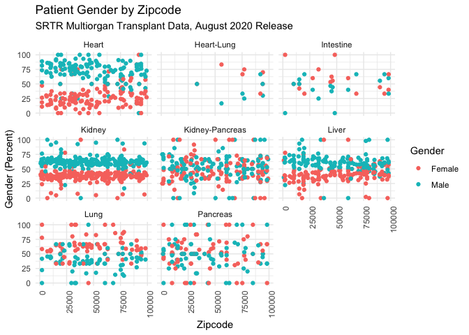
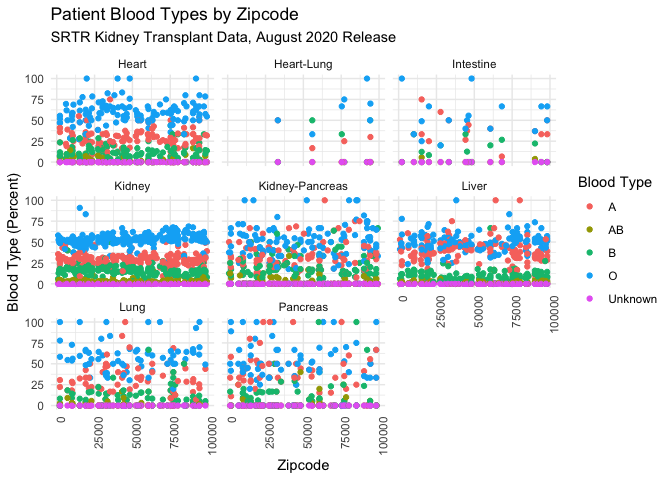

Final Report
================

# Geographic Variance in Solid Organ Transplant Patient Characteristics

**Group members:** Kristen King (*kk3154*), Harry Reyes (*hr2479*),
Lauren Richter (*lr2854*), Matthew Spotnitz (*mes2165*)

## Motivation

-   The Scientific Registry of Transplant Recipients (SRTR) analyzes
    data on transplant patients that are collected from multiple
    sources.1 Its mission is to provide advanced statistical
    and epidemiological analyses related to solid organ allocation and
    transplantation in support of the Department of Health and Human
    Services and its agents in their oversight of the national organ
    transplantation system.2

## Related Work

-   Periodically, the SRTR produces annual reports on patients who are
    either recipients of a solid organ transplant or on a waitlist to
    receive one.3 However, those reports focus more on
    national statistics than variation by region.

## Initial questions

-   To what extend do patient characteristics vary by zipcode?
-   To what extent do patient outcomes vary by zipcode?

## Data

-   We downloaded the SRTR transplant data that was publicly available
    and current through August 2020, for multiple organs.4,5
    We then did the appropriate data tidying and characterization.

## Exploratory Analyses

-   Histogram of kidney transplant center frequency by zipcode.
-   Leaflet plot of kidney transplant centers by zipcode.
-   Histogram of kidney transplant waitlist patient outcomes by zipcode
    (i.e. mortality, transfer, etc.).
-   Automated exploratory data analysis that was iterated over other
    organ types.

## Additional Analyses

-   Scatter plots of demographics, age, gender, blood type, and
    comorbidities for kidney transplant waitlist patients by zipcode.
-   Scatter plots of PRA score with comorbidities yielded no major
    correlations.
-   Scatter plots of patient characteristics with facet wrap by organ
    type.

#### Figure X: Scatter plots of age by zipcode, with a facet wrap by organ type.

<!-- -->

#### Figure X: Scatter plots of gender by zipcode, with a facet wrap by organ type.

<!-- -->

#### Figure X: Scatter plots of race by zipcode, with a facet wrap by organ type.

<!-- -->

#### Figure X: Scatter plots of blood type by zipcode, with a facet wrap by organ type.

<!-- -->

#### Figure X: Screenshot of interactive dashboard for patient characteristics by organ.

-   The proportion of Hispanic or Latino patients was greatest in the
    southwest zipcodes for all organ types

-   Preponderance of men in waitlist population, especially for heart,
    kidney and liver transplants

-   Kidney had the highest proportion of children under the age of 2.

-   Kidney-pancreas and intestine had the lowest proportion of patients
    over the age of 50.

-   Type O was the most common blood type for all kinds of organ
    transplants

-   Dashboard of waitlist patient characteristics for different organ
    type.

## Discussion

-   Some variation in waitlist patient characteristics by zipcode,
    consistent with the demographics of the region.
-   Minimal variance in waitlist patient outcomes by zipcode is
    reflective of a highly regulated practice.
-   Variation in patient characteristics by organ is consistent with
    practice guidelines.

## References:

1.  Leppke S, Leighton T, Zaun D et. al. Scientific Registry of
    Transplant Recipients: Collecting, analyzing, and reporting data on
    transplantation in the United States. *Transplantation Reviews*,
    27(2):50-56  
2.  <https://www.srtr.org/about-the-data/the-srtr-database/>  
3.  <https://onlinelibrary.wiley.com/toc/16006143/2021/21/S2>  
4.  <https://www.srtr.org/transplant-centers/ny-presbyterian-hospitalcolumbia-univ-medical-center-nycp/?organ=kidney&recipientType=adult>  
5.  <https://www.srtr.org/reports/program-specific-reports/>
