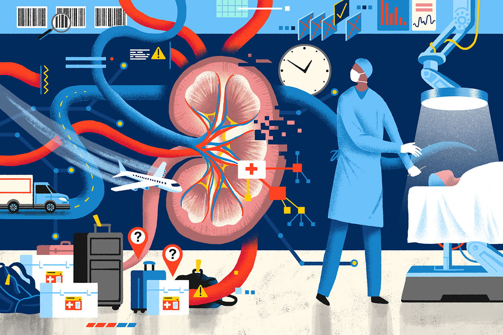

<!--  *(Image Credit: Matt Chinworth for Kaiser Health News)* -->
<!-- Image taken from https://khn.org/news/how-lifesaving-organs-for-transplant-go-missing-in-transit/ -->

<iframe src="https://player.vimeo.com/video/655775973?h=56de577fc3&amp;badge=0&amp;autopause=0&amp;player_id=0&amp;app_id=58479" frameborder="0" allow="autoplay; fullscreen; picture-in-picture" allowfullscreen style="position:absolute;top:0;left:0;width:100%;height:100%;" title="p8105 - final project"></iframe>

Welcome to the Kidney Transplant Center (KTC) Comparison Dashboard and Repository. Our site compiles and presents data on all organ donors, transplant candidates, and transplant recipients in the United States based on biannual [Program-Specific Reports](https://www.srtr.org/reports/program-specific-reports/) from the [Scientific Registry of Transplant Recipients](https://www.srtr.org/) (SRTR). Our site utilizes center-level data on waitlisted patients and patients in receipt of transplants, aggregated demographics, transplant outcomes, and organ offer acceptance practices.

The [**KTC Comparison Dashboard**](dashboard.html) presents data visualizations comparing kidney transplantation centers and examining organ offer practices over time. Typically this data is only presented at the site level in PSR. We combined reports for each site and present them in an aggregated format to allow for direct comparison.   

The [**PSR Data Repository**](data_repository.html) provides users with the ability to search and copy, print, or download raw SRTR PSR data for further study. Users may filter by a single column or query all columns simultaneously using the search bar.

This site was created as part of a final project for the [P8105 Data Science](https://www.p8105.com/) course taught in the [Department of Biostatistics](http://www.publichealth.columbia.edu/academics/departments/biostatistics) at the [Columbia University Mailman School of Public Health](http://www.publichealth.columbia.edu/).
