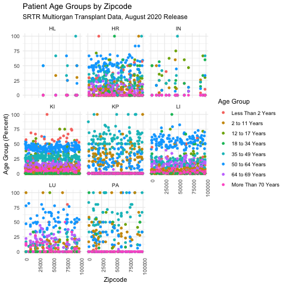

**[To be replaced by screencast]**

 

Welcome to the Scientific Registry of Transplant Recipients (SRTR) Dashboard and Repository. Our site compiles and presents national registry data on all organ donors, transplant candidates, and transplant recipients in the US based on biannual [Program-Specific Reports](https://www.srtr.org/reports/program-specific-reports/) (PSR). Our site utilize center-level data on waitlisted patients and patients in receipt of transplants, aggregated demographics, transplant outcomes, and organ offer acceptance practices. 
